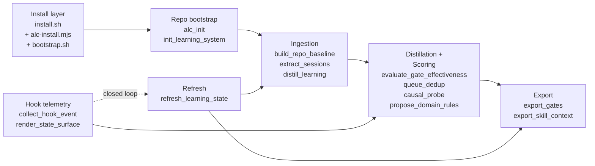
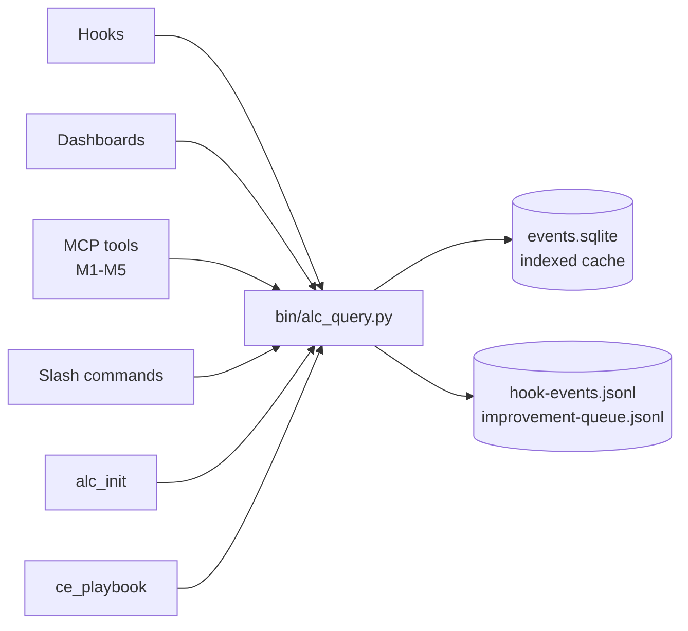

# ARCHITECTURE

> Five-minute mental model of the moving parts. For deeper dives, jump to
> `agent-learning-compounder/reference-lib/` — this file is the index, not
> the index entries.

This is a **portable skill package**, not an app. The source tree builds and
ships `agent-learning-compounder/` (the inner skill dir) as a self-contained
Codex / Claude Code skill that other repos install via one of three paths.

If you've never edited this repo before, also read `CONTEXT.md` — it covers
the conventions (dual-name layout, state topology, named catalogs) that trip
up grep-based exploration.

---

## 1. The pipeline

Six layers, each owns one job. The arrow direction is "what flows next."



Layer responsibilities:

| Layer | Owns | Reference |
|---|---|---|
| Install | Three install paths land identical artifacts. Refuses symlink writes; backs up existing installs to `.bak-<ts>`. | `install.sh`, `scripts/alc-install.mjs`, `bootstrap.sh` |
| Bootstrap | Per-repo init. Writes `<repo>/.agent-learning.json`, state under `<repo>/.agent-learning/repos/<repo-id>/`, optionally smokes the MCP server and writes the per-repo session-context file. | `bin/init_learning_system`, `bin/alc_init`, `reference-lib/architecture` § 4 |
| Ingestion | Turn ambient signals into bounded JSON. Raw transcripts never persist. | `reference-lib/source-adapters`, `reference-lib/distill-sessions` |
| Distillation + scoring | Mine the corpus for proposals; score gates by effectiveness; dedupe near-duplicates; run causal A/B probes. | `reference-lib/gate-effectiveness`, `reference-lib/queue-dedup`, `reference-lib/domain-rules-learning` |
| Export | Produce the two durable compact surfaces (`latest-approved-gates.md`, `latest-skill-context.md`). The only things future agents are supposed to load. | `reference-lib/output-schema`, `reference-lib/gate-registry` |
| Hook telemetry | Bounded, allowlisted event collection. Two-phase runtime wiring (manifest-only by default; `--apply` required). | `reference-lib/hook-telemetry`, `reference-lib/event-schema-evolution` |
| Refresh | Re-derive exports from the current corpus. Declarative only — never registers itself with cron/systemd. | `bin/refresh_learning_state` |

## 2. Major modules and their seams

ALC has gone through enough rounds of review that the seams have hardened
into a small number of named contracts. Respect these; don't reimplement
inline.

### 2.1 The read seam: `alc_query` (KTD-21)

`bin/alc_query.py` is the **only** read API. Everything that needs to read
ALC state goes through it: hooks, dashboards, MCP tools, slash commands,
`alc_init`, `ce_playbook`.



Why this matters: SQLite is an indexed view over JSONL primary storage.
If you reach into JSONL or SQLite directly from a new consumer, you break
the invariant that `alc_query` controls schema evolution.

### 2.2 The propose / write seam: `alc_propose` (KTD-21, symmetric)

`bin/alc_propose.py` is the symmetric propose / write seam. Same rule:
new propose-style tools register here.

Backs the propose surface of the MCP catalog (M6–M9, see § 2.5):

- `propose_apply` — returns an apply CLI command with a one-shot token.
  **Does not mutate.** Keeps the human in the loop on every apply.
- `propose_gate` — appends operator-proposed gate to improvement queue.
- `report_outcome` — records recommendation/gate outcome.
- `report_agent_event` — records bounded agent-dispatch telemetry.
- `mark_patch_status` — updates patch status (deferred/rejected).

### 2.3 The apply path: Hermes-DSL via `alc_apply`

Mutating changes — patching a SKILL.md, swapping a model, spawning a new
agent file — are expressed as **Hermes-DSL ops** and applied through
`bin/alc_apply`. The op shape is in `reference-lib/hermes-dsl-spec`. Key
properties:

- `target` is repo-relative, not absolute.
- `preflight` carries `allowed_roots`, `expected_target_sha256`, and
  `max_target_size` — the apply refuses if the target changed under us.
- `revert_op` is the exact inverse. Every applied op is reversible.

`DSL_TARGETS` (skill / agent / command / hook) constrains where ops can
land. New target types require updating the apply-path allowlist.

### 2.4 The exec seam: `exec_sandbox` tiers

`bin/exec_sandbox` is the single primitive for "run a bounded command on
behalf of the agent." Three tiers:

| Tier | Purpose | Timeout (default / max) | Network |
|---|---|---|---|
| `read` | Safe inspection. Allowed prefixes only (git log/show/diff/blame, ls, find, cat, head, tail, wc, grep, stat, python -m unittest, pytest, diff). | 30s / 120s | blocked |
| `worktree` | Mutation in isolation. Execution path is `<state>/sandbox-worktrees/<exec-id>/`. Worktree removed on completion (success, timeout, error). | 60s / 300s | blocked |
| `eval` | Same as worktree, used for agent/recorder evidence collection. Powers `alc_invoke`-style dispatch. | 300s / 900s | blocked |

Recursion is capped at `--depth >= 2`. Boot-time recovery sweeps stale
worktrees without a `running` row in `events.sqlite`.

Full reference: `reference-lib/sandbox-tiers`.

### 2.5 Named catalogs (KTD-15 family)

ALC uses **stable IDs over cute names**. Five catalogs:

| Catalog | IDs | What | Source of truth |
|---|---|---|---|
| Analyst queries | Q1–Q10 | What questions the analyst suite answers | `reference-lib/analyst-queries-catalog` |
| Generators | G1–G5 | Patch-emitting recommenders | `reference-lib/generator-catalog` (`bin.recommender_generators.GENERATORS`) |
| MCP tools | M1–M10 | Stdio MCP catalog | `reference-lib/mcp-catalog` (`alc_mcp.catalog.MCP_TOOLS`) |
| Propose ops | UP1–UP5 | Write-side propose surface | `reference-lib/propose-catalog` |
| Hermes-DSL targets | `skill` / `agent` / `command` / `hook` | What `alc_apply` is allowed to write | `reference-lib/hermes-dsl-spec` |

If you're adding a new analyst query, generator, or MCP tool, add it to
the catalog first, then implement against the ID.

### 2.6 The hook entry: `render_state_surface`

`bin/render_state_surface` is the unified hook entry point. Session-start,
stop-hook, and `/alc-report` all route through it so the synthesis
discipline (allowlist in, markdown out — never raw rows) is enforced in
one place.

This is the rule that keeps `latest-session-context.md` honest: if a hook
wants to surface state, it goes through `render_state_surface`, not its
own ad-hoc renderer.

## 3. Trust boundaries

The trust model is **load-bearing design**, not a footnote. Four boundaries,
matching `reference-lib/architecture` § 2:

| Boundary | What's inside | Enforcement |
|---|---|---|
| A — Runtime package | Installed scripts and references under `<skill-root>/agent-learning-compounder/`. | Trusted via source provenance + local readback checks. |
| B — Repo-local integration | `.agent-learning.json`, `.agents/skills/`, `.claude/` configs. | Installer refuses to write tracked-path files; auto-`.gitignore` when `.git/` present. |
| C — Runtime state | Telemetry + refresh artifacts. The write sinks. | Reject symlinks and non-regular files; bounded schema; secret-safe normalization. |
| D — Operator | Scheduler registration, hook runtime apply, durable automation. | Explicit operator action required; `--apply` after `--dry-run` for hook install. |

**Non-negotiables enforced in code:**

- Never persist raw prompts, raw tool output, transcript chunks, or
  secret markers. Telemetry rows have a bounded allowlisted field set
  (`ts`, `event`, `runtime`, `repo`, `skill`, `tool`, `outcome`, `path`,
  `command_class`, plus short tags). `bin/scrub_secrets` runs before
  anything reaches durable storage.
- `bin/validate_outputs` rejects psychological/ability claims about the
  operator. Personal-name variants via `AGENT_LEARNING_SUBJECT_NAMES`
  (comma-separated, regex-escaped).
- `distill_learning` mutates durable memory only with `--write` plus an
  explicit `--personal` root or `AGENT_LEARNING_PERSONAL`.
- Hook event log files created with `os.open(..., 0o600)` — no
  group/world-readable window between create and chmod.
- Runtime hook install is **manifest-only by default.**
  `install_runtime_hooks --apply` is the only path that writes a real
  `.codex/hooks.json` or `.claude/settings.local.json`.

## 4. State topology

```
<repo>/
├── .agent-learning.json              # integration manifest (auto-gitignored)
└── .agent-learning/
    └── repos/<repo-id>/
        ├── config.json               # state_version, retention, runtime
        ├── baseline.json
        ├── domain-rules.active.json
        ├── skill-map.json
        ├── hook-events.jsonl         # PRIMARY storage (append-only)
        ├── improvement-queue.jsonl
        ├── events.sqlite             # INDEXED CACHE over the JSONL
        ├── reports/
        │   ├── latest-approved-gates.md
        │   ├── latest-skill-context.md
        │   └── latest-session-context.md
        ├── hooks/
        │   ├── collect-agent-learning-event.sh
        │   └── agent-learning-hooks.manifest.json
        ├── automation/
        │   └── agent-learning-refresh.manifest.json
        └── sandbox-worktrees/<exec-id>/
```

**State root precedence** (first match wins):

1. `--state-dir` flag
2. `AGENT_LEARNING_STATE_DIR` env var
3. `--personal` flag
4. `<repo>/.agent-learning` ← **production default**
5. `$XDG_STATE_HOME/agent-learning`
6. `~/.local/state/agent-learning`

Repo-local (rule 4) is the recommended default — keeps all per-repo state
colocated and avoids cross-repo root-leak ambiguity.

## 5. Runtime adapter matrix

| Runtime | Hook config target | Installer flag |
|---|---|---|
| Codex | `.codex/hooks.json` | `--runtime codex` |
| Claude | `.claude/settings.local.json` | `--runtime claude` |

Both share the same wrapper command and manifest. Adding a new runtime
means updating:

1. Path handling in `install_runtime_hooks.py`
2. Event mapping
3. Command-integrity validation
4. Regression coverage for both dry-run and apply flows

## 6. Where to read next

Pick the reference that matches what you're touching:

| Touching | Read first |
|---|---|
| Hook events / schema migration | `reference-lib/hook-telemetry`, `reference-lib/event-schema-evolution` |
| Distillation, source adapters | `reference-lib/source-adapters`, `reference-lib/distill-sessions` |
| Gate scoring or causal probes | `reference-lib/gate-effectiveness`, `reference-lib/gate-registry` |
| Cross-repo federation | `reference-lib/cross-repo-gates` |
| MCP tools | `reference-lib/mcp-catalog`, `agent-learning-compounder/.mcp.json` |
| Sandbox tiers | `reference-lib/sandbox-tiers` |
| Output / scrubbing / threat model | `reference-lib/output-schema`, `reference-lib/threat-model` |
| Apply path (Hermes-DSL) | `reference-lib/hermes-dsl-spec` |
| Anything performance-affecting | `reference-lib/pressure-tests` — durable-write gate |

For the layered runbook (install → bootstrap → confirm health contract →
review hook plan → register refresh), see `reference-lib/architecture` § 10.

---

**Inferences in this doc.** The mermaid diagrams and the catalog table are
synthesized from the codebase + reference-lib; the prose follows
`reference-lib/architecture` closely. Where this doc and `reference-lib/`
disagree, `reference-lib/` is the source of truth — file an update here.
