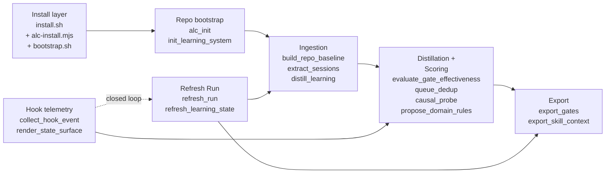
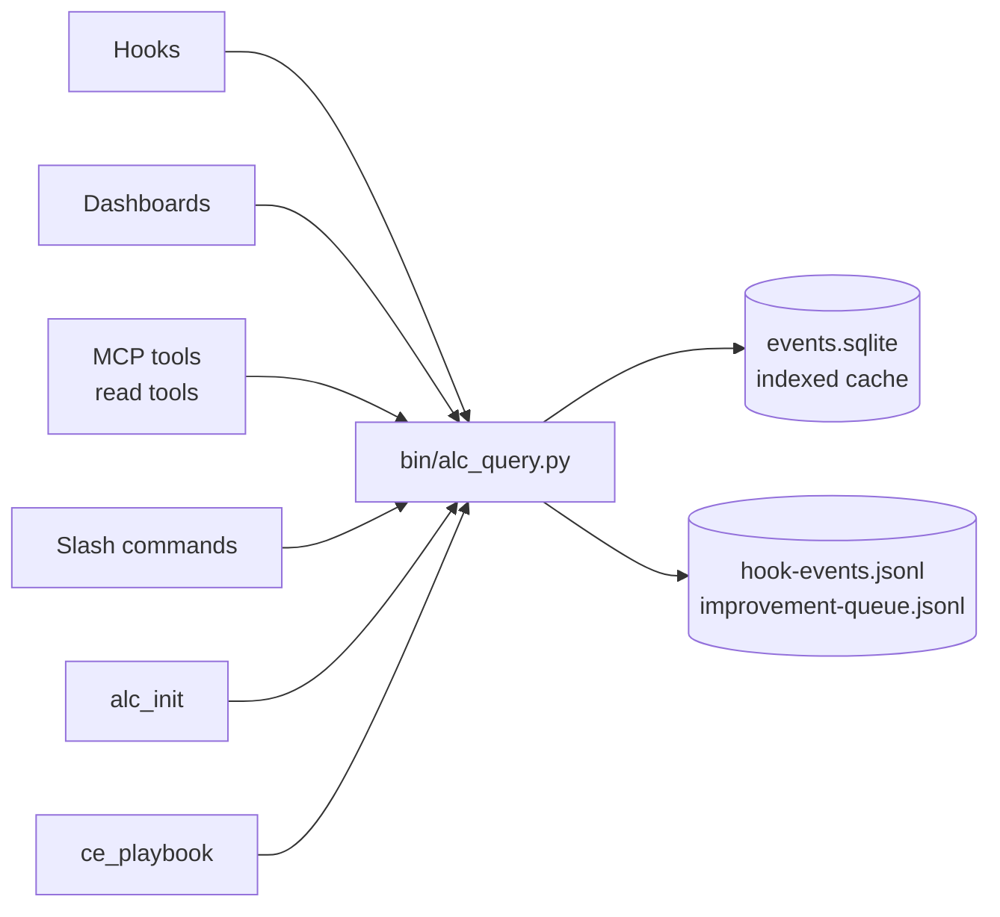

# ARCHITECTURE

> Five-minute mental model of the moving parts. For deeper dives, jump to
> `agent-learning-compounder/reference-lib/` — this file is the index, not
> the index entries.

This is a **portable skill package**, not an app. The source tree builds and
ships `agent-learning-compounder/` (the inner skill dir) as a self-contained
Codex / Claude Code skill that other repos install via one of three paths.

If you've never edited this repo before, also read `CONTEXT.md` — it covers
the conventions (dual-name layout, state topology, named catalogs) that trip
up grep-based exploration.

---

## 1. The pipeline

Six layers, each owns one job. The arrow direction is "what flows next."



Layer responsibilities:

| Layer | Owns | Reference |
|---|---|---|
| Install | Three install paths land identical artifacts. Refuses symlink writes; backs up existing installs to `.bak-<ts>`. | `install.sh`, `scripts/alc-install.mjs`, `bootstrap.sh` |
| Bootstrap | Per-repo init. Writes `<repo>/.agent-learning.json`, state under `<repo>/.agent-learning/repos/<repo-id>/`, optionally smokes the MCP server and writes the per-repo session-context file. | `bin/init_learning_system`, `bin/alc_init`, `reference-lib/architecture` § 4 |
| Ingestion | Turn ambient signals into bounded JSON. Raw transcripts never persist. | `reference-lib/source-adapters`, `reference-lib/distill-sessions` |
| Distillation + scoring | Mine the corpus for proposals; score gates by effectiveness; dedupe near-duplicates; run causal A/B probes. | `reference-lib/gate-effectiveness`, `reference-lib/queue-dedup`, `reference-lib/domain-rules-learning` |
| Export | Produce the two durable compact surfaces (`latest-approved-gates.md`, `latest-skill-context.md`). The only things future agents are supposed to load. | `reference-lib/output-schema`, `reference-lib/gate-registry` |
| Hook telemetry | Bounded, allowlisted event collection. Two-phase runtime wiring (manifest-only by default; `--apply` required). Mode semantics for dev, release install, and drift audit now live in `bin/runtime_topology.py`. | `reference-lib/hook-telemetry`, `reference-lib/event-schema-evolution` |
| Refresh Run | Own warm/full refresh profiles, hook-event replay into project `events.jsonl`, event indexing, refresh locking, stage ordering, and result reporting. Declarative only — never registers itself with cron/systemd. | `bin/refresh_run.py`, `bin/refresh_learning_state` |

## 2. Major modules and their seams

ALC has gone through enough rounds of review that the seams have hardened
into a small number of named contracts. Respect these; don't reimplement
inline.

### 2.1 The read seam: `alc_query` (KTD-21)

`bin/alc_query.py` is the **only** read API. Everything that needs to read
ALC state goes through it: hooks, dashboards, MCP tools, slash commands,
`alc_init`, `ce_playbook`.



Why this matters: SQLite is an indexed view over JSONL primary storage.
If you reach into JSONL or SQLite directly from a new consumer, you break
the invariant that `alc_query` controls schema evolution.

### 2.2 The propose / write seam: `alc_propose` (KTD-21, symmetric)

`bin/alc_propose.py` is the symmetric propose / write seam. Same rule:
new propose-style tools register here.

Backs the propose surface of the MCP catalog (M6–M9, M18; see § 2.5):

- `propose_apply` — returns an apply CLI command.
  **Does not mutate.** Keeps the human in the loop on every apply.
- `propose_gate` — appends operator-proposed gate to improvement queue.
- `report_outcome` — records recommendation/gate outcome.
- `report_agent_event` — records bounded agent-dispatch telemetry.
- `mark_patch_status` — updates patch status (deferred/rejected).

`bin/proposal_lifecycle.py` is the shared Proposal Lifecycle module behind
the proposal seam. It owns lifecycle record construction, proposal identity,
proposal event payloads, and normalized read mirrors for proposal queue, patch,
and suggestion artifacts. `alc_propose` remains the adapter surface for CLI/MCP
callers, while `alc_query` exposes read mirrors for queue/lifecycle state.

Project-state writers should prefer an explicit `StateHandle` when routing events
rather than mutating `AGENT_LEARNING_STATE_DIR`. State target selection lives in
`bin/state_handle.py` (State Scope); `event_writer` asks it for the event
directory and `_write_scope` label, then keeps JSONL serialization, locking,
rotation, and boundary checks local to the writer. Each row carries
`_write_scope` so project writes (`project_state_handle`, `project_repo`) and
background/legacy writes remain distinguishable.

### 2.3 The apply path: Hermes-DSL via `alc_apply`

Mutating changes — patching a SKILL.md, swapping a model, spawning a new
agent file — are expressed as **Hermes-DSL ops** and applied through
`bin/alc_apply`. The op shape is in `reference-lib/hermes-dsl-spec`. Key
properties:

- `target` is repo-relative, not absolute.
- `preflight` carries `allowed_roots`, `expected_target_sha256`, and
  `max_target_size` — the apply refuses if the target changed under us.
- `revert_op` is the exact inverse. Every applied op is reversible.

`DSL_TARGETS` (skill / agent / command / hook) constrains where ops can
land. New target types require updating the apply-path allowlist.

### 2.4 The exec seam: `exec_sandbox` tiers

`bin/exec_sandbox` is the single primitive for "run a bounded command on
behalf of the agent." Three tiers:

| Tier | Purpose | Timeout (default / max) | Network |
|---|---|---|---|
| `read` | Safe inspection. Allowed prefixes only (git log/show/diff/blame, ls, find, cat, head, tail, wc, grep, stat, python -m unittest, pytest, diff). | 30s / 120s | blocked |
| `worktree` | Mutation in isolation. Execution path is `<state>/sandbox-worktrees/<exec-id>/`. Worktree removed on completion (success, timeout, error). | 60s / 300s | blocked |
| `eval` | Same as worktree, used for agent/recorder evidence collection. Powers `alc_invoke`-style dispatch. | 300s / 900s | blocked |

Recursion is capped at `--depth >= 2`. Boot-time recovery sweeps stale
worktrees without a `running` row in `events.sqlite`.

Full reference: `reference-lib/sandbox-tiers`.

### 2.5 Named catalogs (KTD-15 family)

ALC uses **stable IDs over cute names**. Five catalogs:

| Catalog | IDs | What | Source of truth |
|---|---|---|---|
| Analyst queries | Q1–Qn | What questions the analyst suite answers | `bin/analyst_queries.py::QUERY_SPECS`; mirror: `reference-lib/analyst-queries-catalog` |
| Generators | G1–G5 | Patch-emitting recommenders | `reference-lib/generator-catalog` (`bin.recommender_generators.GENERATORS`) |
| MCP tools | M1–M20 | Stdio MCP catalog | `reference-lib/mcp-catalog` (`alc_mcp.catalog.MCP_TOOLS`) |
| Propose ops | UP1–UP5 | Write-side propose surface | `reference-lib/propose-catalog` |
| Hermes-DSL targets | `skill` / `agent` / `command` / `hook` | What `alc_apply` is allowed to write | `reference-lib/hermes-dsl-spec` |

If you're adding a new analyst query, generator, or MCP tool, add it to
the catalog first, then implement against the ID. Analyst queries use
`bin/analyst_queries.py::QuerySpec`; dispatch and the public reference
mirror are derived from that catalog.

### 2.6 The hook entry: `render_state_surface`

`bin/render_state_surface` is the unified hook entry point. Session-start,
stop-hook, and `/alc-report` all route through it so the synthesis
discipline (allowlist in, markdown out — never raw rows) is enforced in
one place.

This is the rule that keeps `latest-session-context.md` honest: if a hook
wants to surface state, it goes through `render_state_surface`, not its
own ad-hoc renderer.

## 3. Trust boundaries

The trust model is **load-bearing design**, not a footnote. Four boundaries,
matching `reference-lib/architecture` § 2:

| Boundary | What's inside | Enforcement |
|---|---|---|
| A — Runtime package | Installed scripts and references under `<skill-root>/agent-learning-compounder/`. | Trusted via source provenance + local readback checks. |
| B — Repo-local integration | `.agent-learning.json`, `.agents/skills/`, `.claude/` configs. | Installer refuses to write tracked-path files; auto-`.gitignore` when `.git/` present. |
| C — Runtime state | Telemetry + refresh artifacts. The write sinks. | Reject symlinks and non-regular files; bounded schema; secret-safe normalization. |
| D — Operator | Scheduler registration, hook runtime apply, durable automation. | Explicit operator action required; `--apply` after `--dry-run` for hook install. |

**Non-negotiables enforced in code:**

- Never persist raw prompts, raw tool output, transcript chunks, or
  secret markers. Telemetry rows have a bounded allowlisted field set
  (`ts`, `event`, `runtime`, `repo`, `skill`, `tool`, `outcome`, `path`,
  `command_class`, plus short tags). `bin/scrub_secrets` runs before
  anything reaches durable storage.
- `bin/validate_outputs` rejects psychological/ability claims about the
  operator. Personal-name variants via `AGENT_LEARNING_SUBJECT_NAMES`
  (comma-separated, regex-escaped).
- `distill_learning` mutates durable memory only with `--write` plus an
  explicit user-scope root: `--user <path>` (alias: `--personal`,
  deprecated) or `AGENT_LEARNING_USER` (compat: `AGENT_LEARNING_PERSONAL`).
- Hook event log files created with `os.open(..., 0o600)` — no
  group/world-readable window between create and chmod.
- Runtime hook install is **manifest-only by default.**
  `install_runtime_hooks --apply` is the only path that writes a real
  `.codex/hooks.json` or `.claude/settings.local.json`.

## 4. Scope model: user vs project

ALC has two scopes, named to mirror the runtime convention used for the
skill executor itself.

| Scope | What lives here | Default path | Env override |
|---|---|---|---|
| **User** | Cross-repo learning. Gates that apply regardless of project. Skill-impact and session-lifecycle that follows *you* across all your work. The executor is itself user-scoped (`~/.claude/skills/`, `~/.codex/skills/`, `~/.agents/skills/`) — its persistent learning lives next to it. | `~/.agent-learning/` | `AGENT_LEARNING_USER` |
| **Project** | Per-repo events. That repo's baseline, improvement queue, hook telemetry, and dashboard view for "this codebase." Created by `init_learning_system` on bootstrap. | `<repo>/.agent-learning/` | `AGENT_LEARNING_STATE_DIR` |

`auto_distill_session` (the Stop-hook distiller) writes user-scope —
gates and insights belong to *you*, not to any one repo. Runtime wiring,
drift checks, and release installer pathing consume mode-aware behavior from
`bin/runtime_topology.py`.
`collect_hook_event` (the per-tool-use hook) writes project-scope —
events belong to the repo where they happened. Runtime path resolution for
repo-local setup is centralized in `bin/runtime_topology.py` so hook install and
dev drift checks can compute the same expected command roots.

Dashboards and `next_action` synthesise from **both** scopes so the
operator sees "this project" and "across all your work" as two views of
the same surface.

`bin/state_handle.py` is the State Scope module. It owns project handle
construction, user-root and user-report resolution, background write targets,
read-scope validation (`user`, `project`, `both`), and event write-target
classification. It must not absorb query parsing, event serialization, refresh
orchestration, dashboard view-model construction, or proposal ranking.

`bin/refresh_run.py` is the Refresh Run module. It owns the top-level refresh
lock, warm vs full profile selection, incremental hook replay into project
`events.jsonl`, indexing, stage ordering, and structured run results.
`bin/refresh_learning_state` remains the public CLI adapter. Dashboard read
models and proposal lifecycle ranking stay outside this seam.

`bin/dashboard_read_model.py` is the Dashboard Read Model module. It builds
the shared read payload for FastAPI `/api/data`, `bin/render_dashboard`, and
the stdlib fallback dashboard. It may call `alc_query` and `StateHandle`, and
it may shape archive metrics/history for compatibility, but it must not import
dashboard actions, event writers, proposal writers, patch mutation, or distill
job orchestration. Those mutable operations remain in the FastAPI action layer
for dashboard-specific behavior. Proposal-specific queue, patch, suggestion,
eval, and outcome state belongs to `bin/proposal_lifecycle.py` and read mirrors
exposed through `alc_query`.

`bin/dashboard_url_publisher.py` is the Dashboard URL Publisher module. It owns
project-scoped live `dashboard/server.json` markers, loopback URL validation,
owner-token cleanup, and static fallback order (`dashboard.html`, then legacy
`index.html`, then the dashboard directory). FastAPI and stdlib launchers are
publication adapters; `state_handle.dashboard_url` is a compatibility wrapper.

> **Naming history.** The env var was `AGENT_LEARNING_PERSONAL` before
> `2026.05.27+review7-plus3`. The old name still works for one minor
> release as a compatibility shim. New code and docs should use
> `AGENT_LEARNING_USER`.

### 4.1 State topology

```
<user-state-root>/                       # AGENT_LEARNING_USER, default ~/.agent-learning/
├── learning.md                          # dated gate accumulation (auto_distill writes here)
├── insights.md                          # summary insights across all repos
├── reports/agent-learning/              # historical distillations + metrics
├── actions/muted-domains.json
└── alc-agents/personal/                 # operator's pinned agents (cross-repo)

<repo>/
├── .agent-learning.json                 # integration manifest (auto-gitignored)
└── .agent-learning/                     # PROJECT state-root
    └── repos/<repo-id>/
        ├── config.json                  # state_version, retention, runtime
        ├── baseline.json
        ├── domain-rules.active.json
        ├── skill-map.json
        ├── hook-events.jsonl            # PRIMARY storage (append-only)
        ├── improvement-queue.jsonl
        ├── events.sqlite                # INDEXED CACHE over the JSONL
        ├── reports/
        │   ├── latest-approved-gates.md
        │   ├── latest-skill-context.md
        │   └── latest-session-context.md
        ├── hooks/
        │   ├── collect-agent-learning-event.sh
        │   └── agent-learning-hooks.manifest.json
        ├── automation/
        │   └── agent-learning-refresh.manifest.json
        └── sandbox-worktrees/<exec-id>/
```

**State root precedence** (first match wins):

1. `--state-dir` flag
2. `AGENT_LEARNING_STATE_DIR` env var
3. `--user` flag (alias: `--personal`, deprecated)
4. `AGENT_LEARNING_USER` env var (compat: `AGENT_LEARNING_PERSONAL`)
5. `<repo>/.agent-learning` ← **production default for project-scope**
6. `$XDG_STATE_HOME/agent-learning`
7. `~/.local/state/agent-learning`

Repo-local (rule 5) is the recommended default for project-scope. The
user-scope root only resolves through rule 3 or 4 — code that asks for
user-scope state must do so explicitly via `StateHandle.for_user()`.

## 5. Runtime adapter matrix

| Runtime | Hook config target | Installer flag |
|---|---|---|
| Codex | `.codex/hooks.json` | `--runtime codex` |
| Claude | `.claude/settings.local.json` | `--runtime claude` |

`bin/runtime_topology.py` owns the runtime path policy behind this matrix:
hook config targets, dev hook specs, drift candidates, install runtime
resolution, user-global install roots, Codex-home roots, Claude plugin roots,
explicit target roots, and repo bootstrap target expansion. `install.sh`
parses flags and executes the selected install plan; it does not own a
separate target-root policy.

Both runtimes share the same wrapper command and manifest. Adding a new runtime
means updating:

1. Runtime path handling in `runtime_topology.py`
2. Event mapping
3. Command-integrity validation
4. Regression coverage for both dry-run and apply flows

## 6. Where to read next

Pick the reference that matches what you're touching:

| Touching | Read first |
|---|---|
| Hook events / schema migration | `reference-lib/hook-telemetry`, `reference-lib/event-schema-evolution` |
| Distillation, source adapters | `reference-lib/source-adapters`, `reference-lib/distill-sessions` |
| Gate scoring or causal probes | `reference-lib/gate-effectiveness`, `reference-lib/gate-registry` |
| Cross-repo federation | `reference-lib/cross-repo-gates` |
| MCP tools | `reference-lib/mcp-catalog`, `agent-learning-compounder/.mcp.json` |
| Sandbox tiers | `reference-lib/sandbox-tiers` |
| Output / scrubbing / threat model | `reference-lib/output-schema`, `reference-lib/threat-model` |
| Apply path (Hermes-DSL) | `reference-lib/hermes-dsl-spec` |
| Anything performance-affecting | `reference-lib/pressure-tests` — durable-write gate |

For the layered runbook (install → bootstrap → confirm health contract →
review hook plan → register refresh), see `reference-lib/architecture` § 10.

---

**Inferences in this doc.** The mermaid diagrams and the catalog table are
synthesized from the codebase + reference-lib; the prose follows
`reference-lib/architecture` closely. Where this doc and `reference-lib/`
disagree, `reference-lib/` is the source of truth — file an update here.
