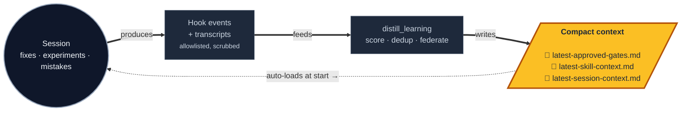

<div align="center">

# Agent Learning Compounder

### **Compound agent memory. Sessions feed it. Sessions read it.**

*Your repo gets sharper every time an agent works in it.*

<br/>

[](CHANGES.md)
[](https://www.npmjs.com/package/agent-learning-compounder)
[](agent-learning-compounder/.mcp.json)
[](LICENSE)
[](#verify)

<br/>

```bash
npx agent-learning-compounder --bootstrap-repo "$PWD" --verify
```

</div>

<br/>

## The loop



Three small files carry institutional memory between sessions. Nothing
leaves your machine. The loop tightens every cycle.

<br/>

## Install — three first-class paths

<table>
<tr>
<td width="33%" valign="top">

**📦 npm / npx**

```bash
npx agent-learning-compounder \
  --bootstrap-repo "$PWD" --verify
```

Anyone with Node 18+. Repo bootstrap uses env/repo runtime hints and defaults
to Codex; pass `--runtime claude` or `--runtime all` when you need that target.

</td>
<td width="33%" valign="top">

**🌐 curl one-liner**

```bash
curl -fsSL https://raw.githubusercontent.com\
/beeard/agent-learning-compounder\
/master/bootstrap.sh \
  | sh -s -- --bootstrap-repo "$PWD" --verify
```

No Node. Just `curl` + `tar`.

</td>
<td width="33%" valign="top">

**🔌 Claude Code marketplace**

```text
/plugin marketplace add \
  beeard/agent-learning-compounder

/plugin install \
  agent-learning-compounder@\
  agent-learning-compounder
```

Hooks + MCP + slash commands wired automatically.

</td>
</tr>
</table>

All three pass the same end-to-end validation suite. See [`docs/QUICKSTART.md`](docs/QUICKSTART.md) for the walk-through.

Install modes are deliberately separate:

```bash
./install.sh
# zero-argument global runtime install; detects ~/.claude/ vs ~/.agents/,
# verifies, and prints repo-init commands. It does not bootstrap the current repo
# or apply repo runtime hooks.

./install.sh --bootstrap-repo "$PWD" --runtime codex --verify
./install.sh --bootstrap-repo "$PWD" --runtime claude --verify
./install.sh --bootstrap-repo "$PWD" --runtime all --verify
# repo bootstrap; `--runtime auto` uses env/repo hints, not filesystem detection.
# Add --apply-runtime-hooks only after reviewing the dry-run hook plan.
```

<br/>

## What an agent sees on session start

```text
## Repo profile
- Languages: typescript (1247), python (305), shell (28)
- Frameworks: nextjs, react, fastapi
- Tests: yes · Frontend: yes · Monorepo: no

## Runtime summary (last 7 days)
- Activity: 47 events from 4 actors (3 agents, 1 hook source)
- Patches: 3 applied, 1 reverted
- Judge verdicts: 5 approved, 1 rejected
- Awaiting review: 2 pending patches — triage via /alc-report

## Documentation contract
✓ STRATEGY.md  ✓ ARCHITECTURE.md  ✓ CONTEXT.md  ✓ docs/adr
✗ docs/brainstorms — generate via /ce-brainstorm

## Compound-engineering playbook
### /ce-plan — multi-step work (4× tracked)
Pair with `ce-kieran-typescript-reviewer` for the review pass.
### /ce-simplify-code — post-change cleanup (12× tracked)
Great for hook extraction and component decomposition.
…
```

That single injection — synthesised on demand by [`alc_init`](agent-learning-compounder/bin/alc_init) and refreshed by hook telemetry — is the difference between an agent starting from scratch and an agent that knows what failed last week, which skills are stale, and which patches are pending review.

<br/>

## Ask it what's next

The newest MCP tool, **`next_action`** (M11), computes the single best move
from current state. Same synthesiser handles "what's next?", "where did I
leave off?", "session end recap" — one source of truth, never drift.

```text
You:    What's next?

Agent:  → mcp__alc__next_action(repo)
        ← "2 pending patches, last apply 6h ago, /ce-plan stale —
            suggest /ce-doc-review docs/plans/refactor-api.md"
```

20 MCP tools total — read surface (`get_gates`, `get_recommendations`,
`get_skill_context`, …), propose surface (`propose_gate`, `report_outcome`),
sandbox (`exec_sandbox`), and the new synthesiser. All auto-registered
from the [`MCP_TOOLS`](agent-learning-compounder/alc_mcp/catalog.py) catalog.

<br/>

## Trust model — load-bearing

| Rule | Why it matters |
|---|---|
| **No raw prompts, tool output, or transcript chunks ever land on disk** | The validator rejects psychological/ability claims about the operator. Telemetry has a bounded allowlist. Secrets get scrubbed. |
| **Default to read-only** | Durable writes require explicit `--write --personal`. Hook install is manifest-only until `install_runtime_hooks --apply`. |
| **The installer never touches tracked files** | `.agent-learning.json` and runtime hook configs auto-`.gitignore` themselves. Backups are timestamped. |

<br/>

## Documentation

| | |
|---|---|
| [`STRATEGY.md`](STRATEGY.md) | Target problem · users · success signals · active tracks |
| [`ARCHITECTURE.md`](ARCHITECTURE.md) | Five-minute mental model with diagrams |
| [`CONTEXT.md`](CONTEXT.md) | For LLM agents landing in this repo |
| [`CHANGES.md`](CHANGES.md) | Release notes (latest: `0.1.0`) |
| [`docs/QUICKSTART.md`](docs/QUICKSTART.md) | First-time install walk-through |
| [`agent-learning-compounder/reference-lib/`](agent-learning-compounder/reference-lib/) | Per-subsystem deep dives (architecture, threat-model, output-schema, gate-registry, hook-telemetry, …) |

<br/>

## Verify

```bash
cd agent-learning-compounder
python3 -m unittest discover -s fixtures/tests   # 290 unit + integration
python3 -m unittest discover -s tests            # 532 post-install smoke
python3 scripts/run_pressure_tests.py            # 4 durable-write gates
```

## License

[MIT](LICENSE) — © 2026 Tom.
