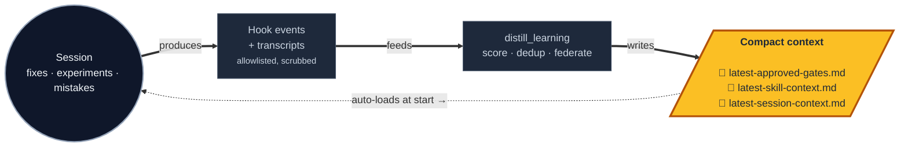

<div align="center">

# Agent Learning Compounder

### **Compound agent memory. Sessions feed it. Sessions read it.**

*Your repo gets sharper every time an agent works in it.*

<br/>

[](CHANGES.md)
[](https://www.npmjs.com/package/agent-learning-compounder)
[](agent-learning-compounder/.mcp.json)
[](LICENSE)
[](#verify)

<br/>

```bash
npx agent-learning-compounder
```

Pre-release live check from a source checkout:

```bash
python3 agent-learning-compounder/bin/alc_live_check --repo /path/to/repo
```

</div>

<br/>

## The loop



Three small files carry institutional memory between sessions. Nothing
leaves your machine. The loop tightens every cycle.

<br/>

## Install

Run the installer from the repository you want to wire up:

```bash
npx agent-learning-compounder
```

That command is the recommended path for most users. It installs the skill into
the current repo, detects Codex and/or Claude, runs the packaged verification
suite, initializes `.agent-learning`, and writes repo-local runtime hooks.

### What the Commands Do

| Command | Scope | What it does |
|---|---:|---|
| `npx agent-learning-compounder` | Project | Installs into the current repo, auto-detects runtime, verifies, initializes state, and applies repo-local hooks. |
| `npx agent-learning-compounder --runtime codex` | Project | Same install, but only writes the Codex repo-local runtime root: `.agents/skills/agent-learning-compounder`. |
| `npx agent-learning-compounder --runtime claude` | Project | Same install, but only writes the Claude repo-local runtime root: `.claude/skills/agent-learning-compounder`. |
| `npx agent-learning-compounder --runtime all` | Project | Installs both Codex and Claude repo-local runtime roots. |
| `npx agent-learning-compounder --install-deps` | Project | Also installs optional Python dependencies into `.agent-learning/venv`. |
| `npx agent-learning-compounder --no-apply-runtime-hooks` | Project | Installs and initializes, but leaves runtime hook writes disabled. |
| `npx agent-learning-compounder --no-verify` | Project | Skips the packaged verification suite. Use only for fast local iteration. |

The npm command is a thin wrapper around `install.sh`. From a source checkout,
the equivalent command is:

```bash
/path/to/agent-learning-compounder/install.sh
```

For machines without Node:

```bash
curl -fsSL https://raw.githubusercontent.com/beeard/agent-learning-compounder/master/bootstrap.sh | sh
```

### Scope Control

The default installer is project-local. It should not write to `HOME`,
`AGENTS_HOME`, `CLAUDE_HOME`, `CODEX_HOME`, or Python user site-packages.

User/global installs require explicit target flags:

| Command | Scope | Use when |
|---|---:|---|
| `./install.sh --codex` | User | Install into `${AGENTS_HOME:-$HOME/.agents}/skills`. |
| `./install.sh --claude` | User | Install into `${CLAUDE_HOME:-$HOME/.claude}/skills`. |
| `./install.sh --codex-home` | User | Install into `${CODEX_HOME:-$HOME/.codex}/skills`. |
| `./install.sh --plugin` | User | Package for Claude Code plugin discovery. |
| `./install.sh --target DIR` | Explicit | Install into a caller-supplied skill root. |

Optional Python dependencies are also controlled:

| Command | Scope | What it does |
|---|---:|---|
| `--install-deps` | Project | Installs `requirements-optional.txt` into `.agent-learning/venv`. |
| `alc_init --deps-scope user --install-deps` | User | Explicitly allows `pip install --user`. |
| `alc_init --user-deps --install-deps` | User | Shorthand for the same user-site opt-in. |

### Claude Code Marketplace

Claude Code marketplace installation is for Claude's plugin mechanism:

```text
/plugin marketplace add beeard/agent-learning-compounder
/plugin install agent-learning-compounder@agent-learning-compounder
```

Use the repo-local installer above when you want `.agent-learning` state,
repo-local hooks, and Codex/Claude project roots created for a specific
repository.

See [`docs/QUICKSTART.md`](docs/QUICKSTART.md) for the step-by-step install
walk-through.

<br/>

## What an agent sees on session start

```text
## Repo profile
- Languages: typescript (1247), python (305), shell (28)
- Frameworks: nextjs, react, fastapi
- Tests: yes · Frontend: yes · Monorepo: no

## Runtime summary (last 7 days)
- Activity: 47 events from 4 actors (3 agents, 1 hook source)
- Patches: 3 applied, 1 reverted
- Judge verdicts: 5 approved, 1 rejected
- Awaiting review: 2 pending patches — triage via /alc-report

## Documentation contract
✓ STRATEGY.md  ✓ ARCHITECTURE.md  ✓ CONTEXT.md  ✓ docs/adr
✗ docs/brainstorms — generate via /ce-brainstorm

## Compound-engineering playbook
### /ce-plan — multi-step work (4× tracked)
Pair with `ce-kieran-typescript-reviewer` for the review pass.
### /ce-simplify-code — post-change cleanup (12× tracked)
Great for hook extraction and component decomposition.
…
```

That single injection — synthesised on demand by [`alc_init`](agent-learning-compounder/bin/alc_init) and refreshed by hook telemetry — is the difference between an agent starting from scratch and an agent that knows what failed last week, which skills are stale, and which patches are pending review.

<br/>

## Ask it what's next

The lifecycle MCP tools split raw facts from compatibility prose:
**`get_session_signals`** (M30) returns compact facts for prompt-owned ranking,
while **`next_action`** (M11) preserves the existing synthesized cache wrapper.

```text
You:    What's next?

Agent:  → mcp__alc__get_session_signals(repo)
        ← "2 pending patches, last apply 6h ago"
        → rank in prompt space and pick one next move
```

34 MCP tools total — read surface (`get_gates`, `get_recommendations`,
`get_skill_context`, …), propose surface (`propose_gate`, `report_outcome`),
sandbox (`exec_sandbox`), dashboard actions, lifecycle contracts, and session
signals. All auto-registered
from the [`MCP_TOOLS`](agent-learning-compounder/alc_mcp/catalog.py) catalog.

<br/>

## Trust Model

| Rule | Why it matters |
|---|---|
| **No raw prompts, tool output, or transcript chunks ever land on disk** | The validator rejects psychological/ability claims about the operator. Telemetry has a bounded allowlist. Secrets get scrubbed. |
| **Default install is project-local** | Runtime files, state, hooks, and optional Python deps stay under the target repo unless a user/global flag is passed. |
| **User scope is explicit** | Writes to `HOME`, user runtime roots, or `pip --user` require explicit flags such as `--codex`, `--claude`, `--plugin`, `--target`, `--deps-scope user`, or `--user-deps`. |
| **Repo integration files are isolated** | State lives under `.agent-learning`, runtime roots live under `.agents` and/or `.claude`, and existing installs are moved to timestamped backups. |

<br/>

## Documentation

| | |
|---|---|
| [`STRATEGY.md`](STRATEGY.md) | Target problem · users · success signals · active tracks |
| [`ARCHITECTURE.md`](ARCHITECTURE.md) | Five-minute mental model with diagrams |
| [`CONTEXT.md`](CONTEXT.md) | For LLM agents landing in this repo |
| [`CHANGES.md`](CHANGES.md) | Release notes (latest: `0.1.0`) |
| [`docs/QUICKSTART.md`](docs/QUICKSTART.md) | First-time install walk-through |
| [`agent-learning-compounder/reference-lib/`](agent-learning-compounder/reference-lib/) | Per-subsystem deep dives (architecture, threat-model, output-schema, gate-registry, hook-telemetry, …) |

<br/>

## Verify

```bash
cd agent-learning-compounder
python3 -m unittest discover -s fixtures/tests   # 290 fixture tests
python3 -m unittest discover -s tests            # 557 source + post-install tests
python3 scripts/run_pressure_tests.py            # 4 durable-write gates
```

## License

[MIT](LICENSE) — © 2026 Tom.
