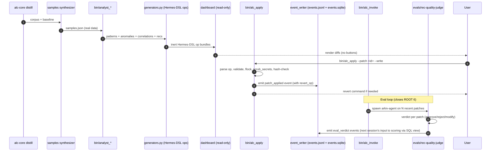

# Refactor: ALC Plugin Rewrite — Plan (Executive View)

> **Plan structure (post pass-7 split):** This file is the EXECUTIVE VIEW (overview, decisions, roadmap, verification strategy). Companion: `2026-05-25-001-refactor-alc-plugin-rewrite-plan-units.md` has the 22 implementation units in detail.

## Summary


This plan supersedes `docs/plans/2026-05-25-alc-plugin-refactor.md` (the V1 plan, which was reviewed by 5 independent passes and found to be unimplementable as-written). It integrates all 16 ROOT findings from `docs/plans/2026-05-25-alc-plugin-refactor-CONSOLIDATED-REVIEW.md`.

The work refactors `agent-learning-compounder` into a 2-sub-skill cross-runtime plugin (alc-core + alc-dashboard) with a Hermes-DSL-based apply executor that handles both **skills** and **agents** (matching agent-creator's quality bar) through one mechanism, an **agent archive** under `<state>/alc-agents/{dev,test,evals}/`, and a closed feedback loop where `evals/rec-quality-judge` grades recommendation outcomes that feed back into scoring — making the project name "Compounder" actually true for the first time.

The first phase is three **validation gates** (premise / cross-runtime / data-schema). If any gate fails, scope collapses radically (drop Phase D-F, ship only synthesizer + nudges). This is the V1 plan's biggest miss: it built sophisticated infrastructure on top of an unvalidated premise and empty data substrate.

---


## Problem Frame


The current `agent-learning-compounder` (ALC) skill compiles repo evidence + session transcripts into durable procedural memory via `bin/distill_learning`. It works. The V1 plan proposed expanding this with a 4-sub-skill plugin structure, statistical analyst pipeline, recommender that proposes config patches, and an HTML dashboard with inline Apply buttons.

5 independent review passes (architecture review, ce-doc-review's 7 reviewers, agent-native audit from a parallel session, adversarial deep-review, and workflow-engines/Hermes salvage review) converged on three uavviselige (un-disputable) root issues:

1. **Empty data substrate** (ROOT 1): orchestrator hardcodes `samples.json = "[]"` and defers the synthesizer to "Phase 13". Result: anomaly/correlation/recommendation pipelines run on no data in 100% of real runs. E2E tests seed `recommendations.json` directly, hiding the empty-pipeline reality. The "ONE unified dashboard with inline Apply" ships behind 12 phases of work for a UI with nothing to apply.

2. **Apply mechanism is over-empowered and concretely buggy** (ROOT 2): zero auth on POST endpoints, path traversal on `patch_id`, arbitrary file write via `apply_params["file"]`, secret leak in `apply-log.jsonl`, no `fcntl.flock` (single double-click corrupts the JSONL → dashboard goes 500), and `yaml_field_replace` breaks silently on 5 documented patterns (quoting, multiple matches, prefix-match, trailing comments, indentation).

3. **Over-structuring** (ROOT 7): 4 sub-skills, 4 separate `propose_*_patch.py` files with `KIND_DISPATCH` auto-import (silent `except ImportError: pass`), 3 personas of which 2 are pass-through, 4 slash commands of which 3 are subsets of the fourth. Triangulated by 12 reviewer perspectives.

The premise itself ("specialist analyst surfaces patterns/anomalies/correlations the default distill misses") has no empirical evidence — no concrete miss-example, no baseline-vs-analyst comparison, no incident report. 6 reviewers converge here.

This rewrite addresses all 16 root issues, with explicit validation gates first so scope can collapse honestly if the premise doesn't hold.

---


## Requirements


Every requirement maps back to a ROOT in the consolidated review. ROOTs with confidence ≥ 75 are mandatory; others are advisory.

| R-ID | Requirement | ROOT(s) | Triangulation |
|---|---|---|---|
| R1 | Premise must be empirically validated before infrastructure is built | ROOT 1, ROOT 9 | 7 reviewers |
| R2 | Session-metrics data substrate must exist before analyst runs against it | ROOT 1 | 7 reviewers |
| R3 | Apply mechanism must not allow arbitrary file write, path traversal, or secret leakage | ROOT 2 (SE#1-4) | 8 reviewers |
| R4 | Apply mechanism must be concurrency-safe (no double-click corruption) | ROOT 2 (AD#4) | 1 reviewer (HIGH severity) |
| R5 | Existing `dashboard/` package's `muted-domains.json` behavior must be preserved or explicitly migrated | ROOT 3 (FE#1) | 1 reviewer (implementer blocker) |
| R6 | `bin/validate_outputs.py`'s existing positional-arg behavior must not break | ROOT 4 (FE#2) | 1 reviewer (implementer blocker) |
| R7 | Cross-runtime claim (Claude + Codex) must be verified, not asserted | ROOT 5 (FE#3, AD#8) | 2 reviewers |
| R8 | "Feedback loop closes" must be implemented in code, not only in diagrams | ROOT 6 (PR#F6, AD#11) | 2 reviewers |
| R9 | Plugin structure: 2 sub-skills (not 4), 1 generators.py (not 4 propose_*), 1 persona (not 3), 1 slash command (not 4) | ROOT 7 | 12 reviewers |
| R10 | `copy_to_clipboard` must not be part of the apply pipeline | ROOT 8 | 2 reviewers |
| R11 | All state-resolving surfaces must converge on a canonical `StateHandle` | ROOT 10 (AN#4, FE#8) | 2 reviewers |
| R12 | `data-contracts.json` must be enforced pre-write or replaced with in-code registry | ROOT 11 | 4 reviewers |
| R13 | Dashboard must be read-only (no Apply buttons); mutation goes through CLI | ROOT 2 Valg B, ROOT 12 | 2 reviewers + AN#3 |
| R14 | Cross-process apply uses fcntl.flock; malformed JSONL doesn't crash dashboard | ROOT 2 (AD#4) | 1 reviewer (CONCRETE BUG) |
| R15 | Context-boundary tests block raw prompts, transcript chunks, absolute paths, secrets from loadable surfaces | ROOT 14 (AN#6) | 1 reviewer (AGENT-NATIVE) |
| R16 | Capability map binds every user-action to an agent-callable tool (parity) | ROOT 15 (AN#7) | 1 reviewer (AGENT-NATIVE) |
| R17 | Apply executor handles **both** skills AND agents through one Hermes-DSL mechanism | ROOT 16, ROOT 16b | 1 reviewer (E salvage) + user-directed |
| R18 | Generated agents pass agent-creator quality bar (name, examples, body word-count, sections, semantic color) | ROOT 16b | user-directed (this session) |
| R19 | Agent archive (`<state>/alc-agents/{dev,test,evals}/`) supports dev / testing / evals invocation | ROOT 16c | user-directed (this session) |
| R20 | Eval-loop closes the compounder loop (R8) by feeding judge-verdicts back into score_recommendations | ROOT 6 + ROOT 16c | derived |
| R21 | All event emitters from all sources (Claude hooks, Codex hooks, MCP tool calls, subagent dispatches, background agents) emit to one unified normalized event stream | NEW (this session) | user-directed |
| R22 | Events carry actor (kind/name/model), correlation_chain (DAG linkage), and full telemetry (duration_ms, tokens_in, tokens_out, cost_usd, cache_*, interrupted) — schema_version 4 | NEW | user-directed |
| R23 | Transcripts (Claude `~/.claude/projects/*.jsonl`, Codex `~/.codex/sessions/*`) parse to same normalized events; backfill on demand | NEW | user-directed |
| R24 | Events.jsonl indexed to events.sqlite for query-layer; analyst joins on actor/correlation, not only session aggregates | NEW | user-directed |
| R25 | Background agents (cron, ScheduleWakeup-fired, MCP-spawned long-runners) call `bin/event_emit` to be visible in the stream | NEW | user-directed |
| R26 | Exec-sandbox primitive (`bin/exec_sandbox`) lets judge agents, recommender, dev-explorer, and arkiv-agents run bounded test scenarios in fresh git worktrees to confirm/refute recommendations with evidence (not only LLM-judgment) | NEW | user-directed (this session) |
| R27 | Opt-in cross-repo memory via Cloudflare D1 + Vectorize (post-MVP, `alc-cloudflare-sync` sub-skill); local-first behavior must remain fully functional with sync disabled (default) | NEW | user-directed (this session) |

Requirements R1-R2 are gating: if Phase A's validation gates fail, requirements R8-R27 may be dropped entirely.

---


## Scope Boundaries


### In scope (active plan)
- All 16 ROOT findings, addressed in the unit-level work below
- Cross-runtime support for Claude Code + Codex (conditional on gate G0.5.2)
- Read-only dashboard with diff preview, route-out to CLI for any mutation
- Agent archive supporting dev/test/evals invocation
- Eval-loop scaffold closing ROOT 6

### In scope (optional, opt-in, post-MVP)
- U20 `alc-cloudflare-sync` sub-skill (W12): cross-repo / cross-machine memory via Cloudflare D1 + Vectorize. Disabled by default; operator opts in per repo via `.agent-learning.json`. Local-first behavior must remain fully functional with sync disabled. Dropped entirely if G0.5.1 returns RED.

### Deferred to Follow-Up Work
- Real-time dashboard via WebSocket — refresh-on-hook is sufficient for MVP
- Authentication on dashboard server — N/A because dashboard becomes read-only
- Pre-commit hook for cross-runtime manifest parity (AR#8) — the parity test catches drift reactively; pre-commit is speculative
- In-process artifact-writer (replacing data-contracts.json with `@ARTIFACTS.register` decorator per AR#5) — useful but the JSON-file approach with pre-write enforcement is enough for MVP
- Auto-trigger ce-* chains from high-impact recs — explicitly rejected earlier in this thread
- Bash hook wrappers → Python direct (AR#9) — micro-optimization, defer

### Outside this product's identity
- Hermes runtime as dependency — ALC remains a Claude Code plugin, never imports `hermes-agent`
- Cursor / OpenCode / Gemini cross-runtime manifests — Claude + Codex only
- Dashboard as a shareable / multi-user tool — single-user, single-machine
- Replacing `distill_learning` as the core memory pipeline — additive, never replaces

---


## Key Technical Decisions


| KTD | Decision | Rationale |
|---|---|---|
| KTD-1 | Phase A (validation gates) blocks all subsequent work | V1 plan's biggest failure was committing 15-20 hours of work on an empirically unvalidated premise. Gates cost 6 hours; potential savings: 13+ hours if premise fails. |
| KTD-2 | 2 sub-skills (alc-core + alc-dashboard), not 4 | 12 reviewers converged. Analyst + recommender are bin/-scripts forkledd som sub-skills. SKILL.md per sub-skill adds ceremony without leverage. |
| KTD-3 | Hermes-DSL replaces 4 ad-hoc apply_strategies | The Hermes pattern (action, target, old_string/new_string, content, preflight, revert_op) is proven, kompakt, eliminates AD#6's 5 yaml-replace breaks (DSL uses exact-match with multi-match-fail). |
| KTD-4 | DSL handles both `target_type: skill` and `target_type: agent` | User-directed (this session). Same executor, different validator per target_type. Reuses agent-creator's quality bar. |
| KTD-5 | Agent archive split into dev/test/evals roots | Different lifecycle expectations per use: dev = ephemeral (auto-cleanup), test = repo-scoped, evals = retained for feedback loop. |
| KTD-6 | Dashboard becomes read-only; apply moves to `bin/alc_apply` CLI | ROOT 2 Valg B (agent-native audit recommendation). Eliminates auth, path-traversal, file-write attack surface in one move. CLI is operator-only by nature. |
| KTD-7 | `score_recommendations` reads the outcomes view over `events.sqlite` (rows where `event_type='eval_verdict'`) written by `bin/alc_eval` | Closes R8/ROOT 6. First time the "compounder" name corresponds to behavior. Stateless ranker becomes outcome-aware. |
| KTD-8 | `bin/validate_artifacts.py` is NEW, not an overload of existing `validate_outputs.py` | Eliminates ROOT 4's fixtures-breakage risk. Existing positional-arg surface unchanged. |
| KTD-9 | Phase B (foundation) builds new infrastructure side-by-side with existing `dashboard/` package; migration happens at Phase E | Avoids ROOT 3's "silently destructive" migration. Old + new coexist until explicit decision point. |
| KTD-10 | `${ALC_PLUGIN_ROOT}` (set by wrapper script that detects runtime) replaces direct `${CLAUDE_PLUGIN_ROOT}` references | Resolves ROOT 5's Claude-only assumption. Wrapper detects Claude vs Codex vs neither, sets correct variable. |
| KTD-11 | `data-contracts.json` retained with lifecycle fields + pre-write enforcement via `bin/artifact_writer.py` helper module | Compromise between full in-code registry (AR#5) and current ad-hoc approach. Single module that all writers import; enforcement at write-time, not post-hoc. |
| KTD-12 | Apply-log uses `fcntl.flock` + try/except on JSONL parse + bounded-size compaction policy | Solves ROOT 2 AD#4 (concurrency bug). Apply-log won't corrupt dashboard. |
| KTD-13 | **Unified observability:** all event emitters (hooks, MCP tools, subagents, background agents, transcripts, AND apply/eval CLIs) write to ONE stream (events.jsonl) via event_writer; SQLite-indexed mirror for query; no separate apply-log.jsonl or outcomes.json — those are SQL views over events.sqlite. | Without this, analyst sees only external-session activity, not ALC's own runtime cost/behavior. Three parallel log systems (events/apply-log/outcomes) were designed before event_writer existed; consolidation makes apply and eval first-class event types so ALC kompounderer faktisk læring om seg selv. |
| KTD-14 | Schema_version bumps from 3 → 4 with backward-compat: old hook-events.jsonl rows still parseable; new fields (correlation_chain, actor, telemetry) optional on read | Doesn't break existing tooling; new analyst queries skip rows where required fields absent. |
| KTD-15 | "Named catalog with explicit ownership" mønster brukes på 5 steder: analyst_queries (Q1-Q10), recommender generators (G1-G5), apply executor strategies (DSL_TARGETS), alc_query read API (catalog), MCP tools (M1-M10) | Hver ALC-pipeline-stage blir selv-dokumenterende: en leser kan lese katalogen og vite hva pipelinen kan svare på / produsere / utføre / eksponerer agent-side. MCP-katalogen er også capability-discovery-surface (R16): en agent som kobler seg på alc_mcp kan liste M1-M10 + vite hva hver tool gjør uten å lese server.py-kildekode. |
| KTD-16 | Context-boundary enforcement flyttet fra per-artifact-tester til write-path-invariant i event_writer.py + artifact_writer.py | Én write-path = ett sted å håndheve boundary. Fail-fast ved skrivning, ikke post-hoc-scan. Nye event-emittere arvelig safe. U19's boundary-test forenkles fra N artifact-scans til 1 writer-enforcement-test. |
| KTD-17 | **Graceful degradation for reads, fail-fast for writes.** Read-paths fall back hvis preferred source mangler (events.sqlite → samples.json; .agent-learning.json → env var → default chain) and log degradation tier reached. Write-paths fail-fast on preflight invariant violation (allowed-roots, hash-match, boundary). | Consistent semantics across all units. Reads = "best effort with visible degradation"; writes = "all-or-nothing with safe-by-construction invariants". Implementer doesn't have to invent error-policy per unit. |
| KTD-18 | **Interface-first publication for parallel subagent dispatch.** Units whose downstream consumers want parallel design publish contract modules early (e.g., `bin/alc_apply_contracts.py` before U11 implementation), validator-shapes early, and per-unit data-contracts manifests. Hot files (`data-contracts.json`) are split per-unit to eliminate merge conflicts. | Wall-clock time drops ~30-40% when subagent-dispatcher can fan out wider per wave. Pre-published contracts let U12+U17 design against U11 in parallel; per-unit data-contracts manifests let U8+U9+U10.5+U11+U12+U13 each register artifacts without fighting over one file. |
| KTD-19 | **Tiered exec-sandbox: read / worktree / eval.** Each tier has explicit security profile (allowlist commands, writable scope, network policy, timeout caps). All exec calls emit `exec_sandbox_run` events via event_writer (KTD-13). Read = no write/network, command allowlist; worktree = fresh git worktree, command-unrestricted, no network; eval = worktree + alc_invoke spawn-allowed. Recursion guard via explicit `--depth N` CLI flag (NOT env var — survives env strip). | Recommender + judge agents need evidence-based validation, not only LLM-judgment. But ALC's identity is "tracker + recommender, not direct mutator" (R3, AN#3). Tiered sandbox squares the circle: mutation IS allowed, but ALWAYS in throwaway worktree with bounded scope + full observability via events. The "read" tier preserves zero-risk default for casual exploration. |
| KTD-20 | **Catalog-docs auto-generated from Python registry.** Every named catalog (Q1-Q10, G1-G5, DSL_TARGETS, alc_query, MCP M1-M10, alc_propose, sandbox-tiers) has its `.md` reference auto-rendered by `bin/render_catalogs.py` from the Python source-of-truth. Pre-commit hook + U19 test asserts no drift. | Same drift-prevention rationale as KTD-18 (data-contracts split per-unit). Hand-maintained catalog docs would diverge from code; auto-generation makes Python the single source of truth. |
| KTD-21 | **Symmetric read/propose seams.** `bin/alc_query.py` is the single read API; `bin/alc_propose.py` is the single propose/write API. MCP, dashboard, CLI subcommands all import from these two — never reimplement queue-write/event-emit/scrub patterns inline. | Pre-pass-7 design had read-side consolidated (alc_query) but propose-side scattered (propose_gate, propose_apply, report_outcome each reinvented queue-write). KTD-21 makes write-side symmetric. Future propose-tools register in one place. |

---


## High-Level Technical Design


This section communicates the *shape* of the solution — directional guidance for review, not implementation specification. The implementing agent should treat it as context, not code to reproduce.

### Hermes-DSL apply operation (the core abstraction)

The DSL is the single seam between recommendation generators (alc-core) and the apply executor (`bin/alc_apply`). One vocabulary covers all four target-types.

```text
{
 "skill_manage_op": {
 "action": "create" | "patch" | "edit" | "write_file",
 "target_type": "skill" | "agent" | "command" | "hook",
 "target": "<repo-relative path>",
 "old_string": "<exact match>", // for patch
 "new_string": "<replacement>", // for patch
 "content": "<full file body>" // for create/edit/write_file
 },
 "preflight": {
 "allowed_roots": [...], // dispatch-table per target_type
 "expected_target_sha256": "<hash>", // optimistic concurrency check
 "max_target_size": <bytes>
 },
 "revert_op": { /* mirror-image op */ }
}
```

### Dispatch table per target_type

| target_type | allowed_roots | validator | max_size |
|---|---|---|---|
| skill | `skills/`, `~/.hermes/skills/` | frontmatter shape, ≤1024 char desc, body present | 100k |
| agent | `agents/`, `<state>/alc-agents/{dev,test,evals}/`, `<personal>/alc-agents/` | agent-creator-quality (see below) | 30k |
| command | `commands/` | frontmatter shape, exec-block present | 10k |
| hook | `hooks/` | executable bit, shebang | 10k |

### Agent-validator (matches plugin-dev's agent-creator quality bar)

| Check | Rule |
|---|---|
| `name` | 3-50 chars, lowercase + hyphens, no "helper"/"assistant"/"agent-" prefix |
| `description` | Starts with "Use this agent when", contains 2-4 `<example>` blocks |
| body | 500-3000 words, contains Role + Responsibilities + Process + Output sections |
| `color` | One of: blue, cyan (analysis); green (create); yellow (validate); red (security); magenta (transform) |
| `model` | One of: inherit, sonnet, haiku, opus |
| `tools` | Optional list; if present, must be valid tool names |

### Flow (apply, archive, eval)



### State handle (one canonical resolver)

All surfaces (MCP, dashboard, hooks, distill, recommender, apply, invoke) resolve state through `bin/state_handle.py`:

```text
StateHandle:
 repo -> absolute path
 state_root -> resolved per priority chain
 repo_state_dir -> <state_root>/repos/<repo_id> OR <repo>/.agent-learning
 reports_dir -> personal archive
 dashboard_dir -> <repo_state>/dashboard/
 alc_agents_dirs -> {dev, test, evals, personal}
 events_jsonl -> <repo_state>/events.jsonl       # KTD-13: unified stream
 events_sqlite -> <repo_state>/events.sqlite     # KTD-13: indexed mirror; SQL views replace apply-log.jsonl + outcomes.json
```

`bin/init_learning_system.py` writes `state_dir` to `.agent-learning.json` so MCP/dashboard/orchestrator converge on the same path.

---


## Build Roadmap


One consolidated map of phases × units × files × gates. Replaces previously-separate Output Structure and Phased Delivery sections.

### Phase A — Validate (~6h, blocks all subsequent phases)

| Unit | Goal | Files (created) |
|------|------|----|
| U1 | Worktree + baseline test snapshot | `../alc-plugin-v2/` (worktree, not in main checkout) |
| U2 | 3 validation gates (premise, runtime, schema) | `scripts/spike/{premise,runtime,schema}.sh` + `scripts/spike/RESULTS.md` |

**Gate to Phase B:** all 3 gates ≥ green-ish, or explicit scope-collapse decision documented in RESULTS.md.

### Phase B — Foundation (~6h)

| Unit | Goal | Files (created) |
|------|------|----|
| U3  | Plugin shell + cross-runtime manifests | `.claude-plugin/plugin.json`, `CLAUDE.md`, (conditional G0.5.2) `.codex-plugin/plugin.json`, `AGENTS.md`, `scripts/maintenance/sync-to-codex-plugin.sh` |
| U4  | Refactor existing SKILL.md → sub-skill | `skills/alc-core/SKILL.md` + `skills/alc-core/{scripts→../../bin/, references/}` |
| U5  | Session-metrics synthesizer | `bin/synthesize_samples` |
| U5.5 | Comprehensive event ingestion (foundation + 5 thin adapters) | `bin/{event_schema.py, event_writer.py, transcript_parser.py, backfill_transcripts, ingest_new_transcripts, correlate_events, event_emit, index_events}` + `skills/alc-core/references/{event-taxonomy.md, event-sources.json}` |
| U6  | data-contracts.json + validate_artifacts + artifact_writer | `data-contracts.json`, `bin/{validate_artifacts, artifact_writer.py}` |
| U7  | StateHandle module | `bin/state_handle.py` (modifies existing `bin/state_paths.py` as compat shim; modifies `bin/init_learning_system.py`) |

**Gate to Phase C:** Phase B tests pass; events.sqlite indexable from real `~/.claude/projects`; existing tests still green.

### Phase C — Core pipeline (~4h)

| Unit | Goal | Files (created) |
|------|------|----|
| U8 | Analyst scripts backed by events.sqlite | `bin/{analyst_queries.py, analyst_patterns, analyst_anomalies, analyst_correlations, analyst_score}` + `skills/alc-core/references/{analyst-methods.md, analyst-queries-catalog.md}` |
| U9 | Recommender + generators (Hermes-DSL ops) | `bin/{recommender_generators.py, recommender_render}` + `skills/alc-core/references/{hermes-dsl-spec.md, generator-catalog.md}` |

**Gate to Phase D:** pipeline runs on real data (not seeded); ≥3 of catalog Q1-Q10 produce non-empty output; recommender produces inert patches.

### Phase D — Apply + invocation (~5h)

| Unit | Goal | Files (created) |
|------|------|----|
| U10.5 | Shared read-only query module (used by MCP, dashboard, CLI) | `bin/alc_query.py` |
| U10   | Read-only dashboard sub-skill | `skills/alc-dashboard/{SKILL.md, server.py, templates/dashboard.html, static/{app.js, style.css, alpine.min.js}}` + `scripts/ops/render_unified_report.py` |
| U11   | Hermes-DSL executor CLI + event emission | `bin/{alc_apply, alc_apply_dispatch.py}` |
| U12   | Agent archive dispatcher | `bin/alc_invoke` |
| U13   | Eval-loop (closes ROOT 6); verdicts as events | `bin/alc_eval` + seeded `<state>/alc-agents/evals/rec-quality-judge.md` |
| U13.5 | Exec-sandbox primitive (tiered: read/worktree/eval) — KTD-19 | `bin/{exec_sandbox, exec_sandbox_profiles.py}` + 4 test files + `skills/alc-core/references/sandbox-tiers.md` |

**Gate to Phase E1+E2:** apply roundtrip works; revert restores bytes; eval-loop writes verdicts as events; ALC's own runtime activity visible in events.sqlite.

### Phase E1 — Independent surfaces (can run parallel with D)

| Unit | Goal | Files (created) |
|------|------|----|
| U14 | Single committed persona | `agents/alc-reviewer.md` (modifies existing `agents/{claude,openai}.yaml`) |
| U18 | Codex sync (pedagogically present, may no-op on G0.5.2 red) | `scripts/maintenance/sync-to-codex-plugin.sh` test coverage |

### Phase E2 — Apply-dependent surfaces

| Unit | Goal | Files (created) |
|------|------|----|
| U15 | Single slash command with flags | `commands/alc-report.md` |
| U16 | Hooks (expanded DEFAULT_EVENTS, dashboard refresh) | `hooks/{hooks.json, session-start, refresh_dashboard.py}` |
| U17 | MCP extensions + capability catalog (M1-M10, KTD-15) | modifies `alc_mcp/server.py` + creates `alc_mcp/catalog.py` + `alc_mcp/tests/{test_mcp_catalog,test_recommender_tools}.py` + `skills/alc-core/references/mcp-catalog.md` |

**Gate to Phase F:** all surfaces operational; legacy `dashboard/` migration decision committed.

### Phase F — Validation

| Unit | Goal | Files (created) |
|------|------|----|
| U19 | Boundary regression + capability map + e2e smoke with real data | `tests/{test_boundary_enforcement.py, test_capability_map.py, test_e2e_pipeline_real_data.py}` + `skills/alc-core/references/capability-map.md` + `<state>/dashboard-migration-decision.md` |

**Final gate:** full suite green; e2e smoke succeeds without seeded data; events.sqlite contains rows from all 5 actor_kinds + patch_applied + eval_verdict.

### Plugin-root file tree (after Phase F)

```
agent-learning-compounder/
├── .claude-plugin/, .codex-plugin/   ← U3
├── CLAUDE.md, AGENTS.md              ← U3
├── data-contracts.json               ← U6
├── skills/{alc-core, alc-dashboard}/ ← U4, U10
├── agents/alc-reviewer.md + yamls    ← U14
├── commands/alc-report.md            ← U15
├── hooks/{hooks.json, session-start, refresh_dashboard.py}  ← U16
├── scripts/{ops, maintenance, spike}/  ← U2, U3, U10
├── bin/                              ← 28 existing + 17 new (across U5, U5.5, U6, U7, U8, U9, U10.5, U11, U12, U13)
├── alc_mcp/server.py                 ← U17 extension
├── dashboard/                        ← LEGACY (fate decided at U19)
└── tests/                            ← grows across all phases
```

### Runtime state layout (not committed, resolved via StateHandle U7)

```
<repo>/.agent-learning/
├── samples.json                       (U5)
├── events.jsonl + events.sqlite       (U5.5; replaces apply-log.jsonl + outcomes.json per KTD-13)
├── recommendations.json
├── analyst/{patterns,anomalies,correlations}.json
├── patches/<patch_id>.json            (Hermes-DSL op bundles)
├── alc-agents/{dev, test, evals}/*.md
└── dashboard/{dashboard.html, data.json}

<personal>/alc-agents/*.md             (cross-repo agent archive)
```

Notes on intentionally-dropped artifacts (from earlier arch passes):
- `event-graph.json` dropped — dashboard queries events.sqlite with recursive CTE
- `transcripts-archive/` dropped from default — re-parse from original; opt-in via `--archive-transcripts`
- `outcomes.json`, `apply-log.jsonl` dropped — SQL views over events.sqlite (KTD-13)

---


## Parallel Execution Plan (subagent waves)


Per KTD-18, the unit dependency graph supports parallel subagent dispatch in waves. Critical path = ~12 wall-clock steps vs 21 units total (~40% reduction). Each wave is dispatched as N parallel subagents working in own git worktrees; integration happens at end-of-wave gate-check.

| Wave | Subagents (parallel) | Pre-req | Wall-clock |
|------|---------------------|---------|-----------|
| **W1** | U1 (worktree + baseline) | — | 5 min |
| **W2** | U2 (3 validation gates — operator drives) | W1 | 6 h |
| **W3** | U3 + U5 | W2 green | ~1 h |
| **W4** | U4 + U6 + U14 + U18 (**4 parallel**) | U3 done | ~1 h |
| **W5** | U7 + U5.5.0a + U5.5.0b | U6 done (+ U5 if not parallel from W3) | ~1 h |
| **W6** | U5.5.1 + U5.5.2 + U5.5.3 + U5.5.4 + U5.5.5 (**5 parallel**) | U5.5.0b done | ~45 min |
| **W7** | U8 + U10.5 + U13.5 (**3 parallel**) | U5.5 + U6 + U7 done | ~1 h |
| **W8** | U9 (sequential) | U8 done | ~30 min |
| **W9a** | U11 contract publication only (`bin/alc_apply_contracts.py`) | U9 done | ~15 min |
| **W9b** | U10 + U11 implementation + U12 + U17 (**4 parallel** — all design against U11 contract) | W9a done | ~1.5 h |
| **W10** | U15 + U16 + U13 (**3 parallel**) | U10 done (U15+U16); U12 + U13.5 done (U13) | ~1 h |
| **W11** | U19 (integration validation — sequential) | all done | ~1 h |
| **W12** (opt-in, post-MVP) | U20 (`alc-cloudflare-sync`) | W11 green + operator opt-in | ~1.5 h |

**Critical-path units (cannot parallelize past their wave):** U1, U2, U3, U6, U7, U5.5.0a/0b, U8, U9, U11-contract, U19.

**W12 is NOT auto-dispatched by LFG.** Operator runs separately after Phase F merge if they want cross-repo memory. Scope-collapse from G0.5.1 RED drops W12 entirely.

**Max parallel fan-out per wave:** 5 subagents (W6 — U5.5 thin adapters).

**Coordination via shared interfaces (KTD-18):**
- `data-contracts/manifests/<unit-id>.json` per unit → no merge conflict on artifact registration
- `bin/alc_apply_contracts.py` published at W9a → U12 + U17 can design without waiting for full U11
- `bin/event_writer.py` from U5.5.0b → all event-emitting units (U5.5.1-5, U11, U12, U13) share write-path
- `bin/event_schema.py` from U5.5.0a → all schema-consuming units (U5.5.2-5, U8) share dataclass

**Gate-check between waves:** parent orchestrator runs `python3 -m unittest discover` + `bin/validate_artifacts --check-manifest-merge` (pre-merge: cross-unit manifest consistency, C5) + `bin/validate_artifacts --check-contracts` (post-merge: artifact registration) between waves. Failures at either layer block next wave dispatch.

---


## Risks & Dependencies


### Major risks (with mitigation)

| Risk | Likelihood | Impact | Mitigation |
|---|---|---|---|
| Phase A gate G0.5.1 (premise) returns RED | medium | scope collapse to U3+U4+U5 | Already part of plan; saves 13+ hours rather than wasting them |
| Phase A gate G0.5.2 returns full RED for Codex | medium | drop Codex from U3, U15, U16, U18 | Plan explicitly conditional on this gate |
| Existing `dashboard/`'s `muted-domains.json` chain breaks during refactor | medium | distill_learning behavior changes | U19 mandates explicit decision document; U10 builds new dashboard side-by-side without touching legacy until E.1 |
| `fcntl.flock` blocking under heavy concurrent use (multiple Claude+Codex sessions) | low | apply latency or timeout | Timeout 5s + idempotency check at U11; user can re-run safely |
| Agent-validator too strict, rejects valid generated agents | medium | recommender output unusable | U9 validates agent content at generation-time (before write); U11 validates at apply-time; both use identical rules so no double-checking divergence |
| Hermes-DSL doesn't expressively cover all needed mutations | low | fallback to V1's ad-hoc strategies | Phase D first; if a new mutation needed, extend DSL with new `action` (e.g., `delete`, `append`) rather than reverting to ad-hoc |
| Eval-loop's judge agent produces noise (low-quality verdicts) | medium | outcome weights make scoring worse | judge agent itself goes through agent-validator (U11); manual review of first 20 verdicts before enabling outcome_weight in U8 |
| `${ALC_PLUGIN_ROOT}` wrapper script breaks on edge runtimes | low | command + hook invocation fails | Wrapper has explicit fallback chain (Claude → Codex → manual); test covers all three branches |
| Worktree at `../alc-plugin-v2` accidentally symlinked into `~/.claude/skills/` during dev | low | live session corruption | U4 explicitly notes worktree ≠ live skill; merge only at very end |

### Dependencies (external, can't be planned around)

- Claude Code's plugin loader behavior unchanged (assumed stable)
- Codex's plugin discovery (verified at G0.5.2)
- Hermes installed at `~/.hermes/` (for reference reading only; not a runtime dep)
- The other session's `alc-agent-native-audit-export-2026-05-25T17-16-05/scripts/alc-session-metrics-adapter.mjs` remains accessible (for U2 + possibly U5)
- Python 3.11+ stdlib (`statistics`, `fcntl`, `hashlib`, `http.server`, `json`, `pathlib`, `base64`)

---


## System-Wide Impact


| Surface | Impact | Action |
|---|---|---|
| `bin/distill_learning` | No change (additive plan; distill remains primary memory pipeline) | none |
| `dashboard/` (FastAPI + React/Vite) | Decision required at U19 (keep / port / coexist) | explicit decision document |
| `~/.claude/skills/agent-learning-compounder/` symlink | Updated when worktree merges (end of U19) | merge ceremony |
| `.agent-learning.json` (per-repo state pointer) | New field `state_dir` written by `init_learning_system` | U7 + migration of existing `.agent-learning.json` files |
| Existing `bin/state_paths.py` | Becomes thin wrapper around StateHandle | U7, with deprecation warning |
| Existing `bin/validate_outputs.py` | Unchanged | (R6 mandates this) |
| Existing fixtures under `fixtures/tests/` | Must continue to pass | smoke-tested at every U-completion |
| Tom's other Claude Code projects (makent, tm-unimem, openhuman-cf, quick3-kb) | None — ALC is an installed plugin, doesn't affect their codebases | n/a |
| Hermes installation (`~/.hermes/`) | None — ALC reads patterns, never writes to Hermes-private state | n/a |

---


## Alternative Approaches Considered


### A1: Patch the V1 plan in-place rather than rewrite
**Rejected:** V1 plan has 16 ROOT issues triangulated by 5 independent review passes. Patching would re-introduce structure that 12 reviewers said to collapse. A clean supersede is faster than per-issue ammend.

### A2: Drop everything, ship only `bin/synthesize_samples` + better SessionStart nudges
**Rejected for now, kept as Phase A failure-mode:** If gate G0.5.1 (premise validation) returns RED, this becomes the actual plan. The current plan structures Phase A to commit early to one of: "proceed with full rewrite" or "drop to synthesizer-only". This isn't really an alternative — it's the planned response to a specific gate outcome.

### A3: Keep V1's apply mechanism but harden it (auth + allowed-roots + scrub + flock)
**Rejected (ROOT 2 Valg B):** Agent-native audit's recommendation prevailed: "ALC should observe + recommend; mutation is operator's job". Hardening the dashboard's apply mechanism still leaves the surface; moving mutation to CLI eliminates the surface entirely. Lower risk, less code, more agent-native.

### A4: Use Hermes runtime directly instead of copying patterns
**Rejected:** Hermes is a heavy dependency. ALC is a Claude Code plugin shipped as standalone code. Salvaging the DSL pattern and agent-creator quality bar gives 90% of the value at 5% of the integration cost. The DSL is compatible with Hermes if user wants to invoke same ops there.

### A5: In-code artifact registry (`@ARTIFACTS.register` decorator per AR#5) instead of `data-contracts.json`
**Deferred (Out of scope):** Useful refactor, but the JSON-file approach with pre-write enforcement via `bin/artifact_writer.py` (U6) is sufficient for MVP. Drift risk is real but caught by U19's tests. Can migrate in a follow-up if drift becomes painful.

### A6: Stream live updates to dashboard via WebSocket instead of refresh-on-hook
**Deferred (Out of scope):** Refresh-on-hook (hook fires after each session) is adequate for human-paced workflow. WebSocket adds complexity for marginal benefit.

---


## Documentation Plan


| Doc | Purpose | When written |
|---|---|---|
| `CLAUDE.md` | Plugin entry for Claude Code | U3 |
| `AGENTS.md` (conditional) | Plugin entry for Codex | U3 conditional |
| `skills/alc-core/SKILL.md` | Sub-skill description (refactor of root SKILL.md) | U4 |
| `skills/alc-core/references/analyst-methods.md` | Statistical methods used by analyst scripts | U8 |
| `skills/alc-core/references/hermes-dsl-spec.md` | Full DSL grammar + examples | U9 |
| `skills/alc-core/references/capability-map.md` | User-action × command × MCP × CLI matrix | U19 |
| `skills/alc-dashboard/SKILL.md` | Sub-skill: read-only sink description | U10 |
| `<state>/dashboard-migration-decision.md` | Decision record for legacy dashboard fate | U19 |
| `scripts/spike/RESULTS.md` | Phase A gate outcomes | U2 |
| Updated `README.md` | Top-level plugin overview | U3 |
| Updated `bin/state_paths.py` docstring | Deprecation note pointing to StateHandle | U7 |

---


## Operational / Rollout Notes


- **No live deploy:** ALC is a personal/team Claude Code plugin. "Rollout" = merging worktree branch into main, then `~/.claude/skills/agent-learning-compounder/` symlink picks up changes on next session start.
- **Reversibility:** if rewrite causes problems, revert merge commit; existing distill pipeline continues to work because we never touched `bin/distill_learning` or its consumers.
- **Migration of existing `.agent-learning.json` files:** U7's `init_learning_system` writes the new `state_dir` field on first invocation after update. Existing pointers (`latest_approved_gates`, `latest_skill_context`) preserved unchanged.
- **Legacy dashboard/ disposition:** committed at U19. If decision = port-and-delete, follow-up unit (not in this plan) ports `muted-domains.json` behavior into the new stdlib server and removes the FastAPI app + React bundle.
- **Cross-runtime activation:** if G0.5.2 was red, ALC remains Claude-only post-merge. AGENTS.md may still be present but Codex sessions will use direct `python3 bin/X` invocations.
- **Agent-archive cleanup:** dev/ agents auto-delete after 30 days (per U6 lifecycle field). Test/ and evals/ retained. Personal archive retained indefinitely.

---


## Out of Scope


Two categories, semantically distinct.

### Explicitly rejected (will not happen with ALC in this identity)

These are principled exclusions — building them would change what ALC is.

1. **Dashboard as shareable / multi-user tool** — ALC is single-user, single-machine; multi-user surface is a different product.
2. **Hermes runtime as dependency** — patterns lifted, runtime never imported.
3. **Cursor / OpenCode / Gemini cross-runtime** — Claude + Codex only (Codex conditional on G0.5.2).
4. **Replacing `bin/distill_learning`** — ALC is additive; distill stays the core memory pipeline.
5. **Unified `agents/{committed,dev,test,evals}/` tree** — current split (committed `agents/` vs ephemeral `<state>/alc-agents/`) is visually clearer than .gitignore-trick.
6. **`copy_to_clipboard` as a Hermes-DSL action** — workflow_chain suggestions live in separate `<state>/suggestions.json`, not the apply pipeline.
7. **Auto-trigger ce-* chains from high-impact recs** — operator-discretion principle precludes auto-execution.
8. **Authentication on dashboard server** — N/A; dashboard is read-only by design (R13).

### Deferred until MVP validates

These could be worth doing later, after Phase F proves the MVP. Each has a stated reason for not-now.

9. **Real-time dashboard updates via WebSocket** — refresh-on-hook is sufficient for human-paced workflow; revisit if interaction tempo demands it.
10. **Pre-commit hook for cross-runtime manifest parity** — parity test catches drift reactively; pre-commit is speculative until manifest churn becomes painful.
11. **In-code `@ARTIFACTS.register` decorator** (AR#5) — JSON-file with pre-write enforcement is sufficient for 10-15 artifact count; migrate when registry grows.
12. **Bash hook wrappers → Python direct** (AR#9) — bash is correct tool for file-cat operations in `session-start`; only `refresh_dashboard.py` warrants Python-direct.
13. **AI-grading layer on top of `rec-quality-judge`** (judge-of-judges) — first verify single-judge eval-loop produces useful outcomes before adding meta-layer.

---


---

## Verification Strategy


Each unit has its own verification step. System-wide verification at U19:

```
1. All existing tests pass (baseline from U1 + new tests from U2-U18)
2. python3 -m unittest discover -s tests -v
3. python3 -m unittest discover -s fixtures/tests -v
4. python3 -m unittest discover -s alc_mcp/tests -v
5. python3 bin/run_pressure_tests
6. python3 bin/validate_artifacts --check-contracts --state-dir <test-fixture-state>
7. Manual: bash scripts/spike/spike_validate_premise.sh # confirm premise still holds
8. Manual: /alc-report --eval # confirm eval loop emits eval_verdict events to events.sqlite
9. Manual: bin/alc_apply --patch <real-patch-id> --write # apply one real patch
10. Manual: bin/alc_apply --patch <same-patch-id> --revert # verify revert restores bytes
11. Manual: open dashboard, attempt POST /apply via curl # expect 405 Method Not Allowed
```

When all pass, merge worktree branch into main.

---

---

## Origin Document Reference


This plan derives from `docs/plans/2026-05-25-alc-plugin-refactor-CONSOLIDATED-REVIEW.md`. Every requirement R1-R25 traces to a triangulated ROOT issue in that document. Every Key Technical Decision aligns with the consolidated review's recommendations.

See origin: `docs/plans/2026-05-25-alc-plugin-refactor-CONSOLIDATED-REVIEW.md` for the full 5-review-pass triangulation and the 1018-line consolidated analysis that produced the original 16 ROOT issues (later extended to 20 across pass-2 + pass-3 reviews).

---


## Appendix A — Reference Sources


Per-unit "Patterns to follow" entries reference these sources by ID rather than re-listing the path.

| ID | Source | Used for |
|----|--------|----------|
| S1 | `~/.hermes/skills/software-development/hermes-agent-skill-authoring/SKILL.md` | `skill_manage` DSL action vocabulary; `_validate_frontmatter` pre-write enforcement pattern |
| S2 | `~/.claude/plugins/cache/claude-plugins-official/plugin-dev/unknown/agents/agent-creator.md` | Agent quality bar (name, description, examples, body sections, color, model) |
| S3 | `~/.claude/plugins/cache/claude-plugins-official/superpowers/5.1.0/hooks/hooks.json` | Cross-runtime hook config shape |
| S4 | `~/.claude/plugins/cache/claude-plugins-official/superpowers/5.1.0/.claude-plugin/plugin.json` + `.codex-plugin/plugin.json` | Cross-runtime manifest parity pattern |
| S5 | `~/.claude/plugins/cache/claude-plugins-official/session-report/unknown/skills/session-report/analyze-sessions.mjs` | Single-template-with-embedded-data dashboard pattern; Claude transcript JSONL parsing |
| S6 | `bin/collect_hook_event:normalize_event()` (existing) | Bounded telemetry normalization; scrub_secrets integration |
| S7 | `bin/distill_learning` (existing) | Evidence-attachment convention |
| S8 | `dashboard/actions.py` (existing) | Atomic-write semantics (temp + rename); muted-domains.json behavior preserved by R5 |
| S9 | `bin/state_paths.py` (existing) | State resolution chain — wrapped by U7's StateHandle |
| S10 | Python stdlib `statistics` module | z-score, IQR, mean/stdev for analyst |
| S11 | Python stdlib `sqlite3` (read-only URI mode) | events.sqlite query layer; recursive CTE for DAG-walk |
| S12 | Python stdlib `fcntl.flock` | Cross-process concurrency safety for event_writer + alc_apply |
| S13 | `alc_mcp/server.py` (existing) | MCP tool registration patterns; bounded JSONL helpers |
| S14 | `bin/init_learning_system.py` (existing) | `.agent-learning.json` initialization conventions — extended by U7 |
| S15 | `bin/auto_distill_session` (existing) | Background process lifecycle pattern; non-blocking fork |

Per-unit references take the form: `Patterns: S1, S6` (or with brief context: `Patterns: S2 for agent-validator rules, S7 for evidence shape`).
