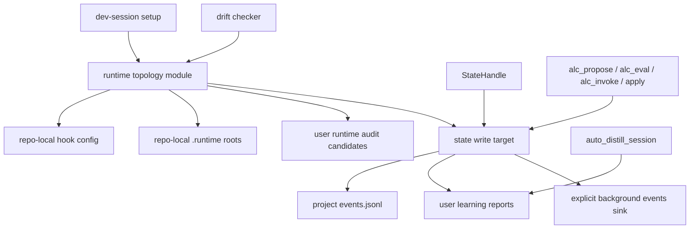

# refactor: Tighten runtime and state boundaries

## Summary

Consolidate the current runtime-wiring and state-scope safety work into one narrow refactor: development runs stay repo-local, user runtimes stay read-only evidence, and background telemetry writes route through explicit project or user scope instead of implicit environment fallbacks.

This plan intentionally implements only the two strong findings from `.runtime/reports/architecture-review-20260527-183248.html`: Runtime Wiring and State Scope. Refresh Run, Dashboard Read Model, and Proposal Lifecycle are deferred until these safety surfaces are stable.

---

## Problem Frame

ALC is a portable skill package. The source tree builds runtime artifacts that other repos install, so development must prove behavior from source without patching installed runtime copies. Recent architecture review found the same locality problem in two places: dev hook setup and auto-distill wiring spread root decisions across shell/Python scripts, while telemetry writers still rely on `AGENT_LEARNING_STATE_DIR` injection in several callers.

The first useful refactor is not a broad architecture rewrite. It is a tight containment pass that gives one place ownership of runtime topology and one place ownership of state-scope write intent.

---

## Requirements

**Runtime boundary**

- R1. Dev-session setup must keep auto-distill and background write outputs inside repo-local `.runtime/` paths.
- R2. Runtime drift checks must remain read-only and must not mutate user-scope installs.
- R3. Hook config generation must keep source-first development separate from release/runtime install behavior.

**State scope**

- R4. Project-scope telemetry writers must be able to write through an explicit `StateHandle` or repo path without caller-side environment injection.
- R5. Background or user-scope writes must be visibly scoped; ambiguous no-repo writes must not silently look like project telemetry.
- R6. Existing public compatibility paths that already pass `repo=` or explicit state roots must keep working during the transition.

**Verification**

- R7. Tests must prove the repo-local dev boundary, explicit project writes, and legacy compatibility behavior.
- R8. The plan must not restructure `refresh_learning_state`, dashboards, or proposal lifecycle in the active slice.

---

## Key Technical Decisions

- **KTD1. Build a small runtime topology module, not a general platform layer.** The active need is selecting source, repo-local runtime, repo-local dev user/state roots, and user-runtime audit candidates. A narrow module gives locality without turning install logic into a framework.
- **KTD2. Keep release install as an adapter, not part of dev setup.** `install_runtime_hooks --apply` can continue to own real runtime hook config writes; dev setup should ask a source-local module for paths and commands, then write only repo-local config.
- **KTD3. Prefer explicit state write targets over env mutation.** Callers that already hold `StateHandle` should pass it, or pass `repo=state.repo`, so `event_writer` chooses the project sink without temporary `AGENT_LEARNING_STATE_DIR` edits.
- **KTD4. Preserve legacy no-arg `event_writer` behavior as compatibility only.** Removing it outright would risk hidden breakage. The first slice should make ambiguity detectable and reduce call sites, then leave hard deprecation to a follow-up once callers are migrated.
- **KTD5. Defer refresh orchestration.** `docs/dev/architecture-backlog-2026-05.md` already says `refresh_learning_state` is not past the abstraction threshold. This plan should not override that without a concrete trigger.

---

## High-Level Technical Design

The planned shape keeps two seams separate:

- Runtime topology answers "where should this runtime command read or write in this mode?"
- State write target answers "which durable sink is this event allowed to append to?"

That split prevents the common failure mode where a runtime mode decision leaks into state writes as an environment variable that later callers have to remember.

---

## Scope Boundaries

### In Scope

- Repo-local dev hook setup and verification.
- Auto-distill root selection for development and installed runtime use.
- State write routing for project telemetry writers that currently mutate `AGENT_LEARNING_STATE_DIR`.
- Regression tests covering repo-local writes and explicit project event sinks.
- Documentation updates to `docs/dev/runtime-boundary.md` and related architecture notes.

### Deferred to Follow-Up Work

- Refresh Run Module or `refresh_learning_state` pipeline protocol.
- Dashboard Read Model consolidation.
- Proposal Lifecycle Module.
- Hard removal of legacy `AGENT_LEARNING_PERSONAL` and no-arg `event_writer` compatibility.
- Any release/install promotion into user runtime trees.

---

## Implementation Units

### U1. Centralize Runtime Topology

- **Goal:** Introduce one source-owned module for repo-local dev roots, source skill root, repo-local hook config paths, and read-only runtime audit candidates.
- **Requirements:** R1, R2, R3.
- **Dependencies:** None.
- **Files:** `agent-learning-compounder/bin/runtime_topology.py`, `agent-learning-compounder/tests/test_runtime_topology.py`, `agent-learning-compounder/tests/test_runtime_boundary.py`, `docs/dev/runtime-boundary.md`.
- **Approach:** Move path construction now duplicated across `scripts/dev-session-setup.sh`, `scripts/merge_dev_hooks.py`, and `agent-learning-compounder/bin/check_runtime_drift` into a small Python module. Keep the module value-like and boring: repo root in, source root and scoped runtime paths out. Do not make it responsible for writing files.
- **Patterns to follow:** `agent-learning-compounder/bin/state_handle.py` for canonical path resolution; `agent-learning-compounder/bin/check_runtime_drift` for read-only audit behavior.
- **Test scenarios:**
  - Given a temp repo path, resolving dev topology returns `.runtime/agent-learning-user`, `.runtime/agent-learning-state`, and source skill root under that repo.
  - Given no repo-local runtime artifacts, drift checking still reports no artifacts without failing in non-strict mode.
  - Given `--include-user-runtimes`, runtime audit candidates are included for comparison but no write path is opened.
- **Verification:** Runtime topology tests pass and existing runtime-boundary tests continue to prove no home-directory output root is embedded in dev hook commands.

### U2. Route Dev Hook Setup Through Runtime Topology

- **Goal:** Make dev hook setup consume the runtime topology module instead of reconstructing roots inline.
- **Requirements:** R1, R3, R7.
- **Dependencies:** U1.
- **Files:** `scripts/merge_dev_hooks.py`, `scripts/dev-session-setup.sh`, `agent-learning-compounder/tests/test_runtime_boundary.py`.
- **Approach:** Keep `scripts/dev-session-setup.sh` as the user-facing shell wrapper, but move all path-sensitive command construction into Python. `scripts/merge_dev_hooks.py` should ask runtime topology for dev roots and source paths before rendering the auto-distill hook command.
- **Execution note:** Add characterization coverage for the current hook command before changing the rendering path.
- **Patterns to follow:** Existing idempotent merge behavior in `scripts/merge_dev_hooks.py`; existing stale-hook replacement and user-scope prune tests in `agent-learning-compounder/tests/test_runtime_boundary.py`.
- **Test scenarios:**
  - Given a fresh temp repo, applying dev hooks writes one auto-distill Stop hook with repo-local `AGENT_LEARNING_USER`, compatibility `AGENT_LEARNING_PERSONAL`, repo-local `AGENT_LEARNING_STATE_DIR`, and source `AGENT_LEARNING_SKILL_DIR`.
  - Given stale auto-distill command text, applying dev hooks replaces it rather than adding a duplicate.
  - Given user-scope plugin-cache hooks in repo-local settings, applying dev hooks prunes them and leaves source-owned hooks intact.
  - Given verify mode, missing expected hooks are reported without modifying settings.
- **Verification:** The dev setup wrapper remains idempotent; verify mode distinguishes missing hooks from present hooks; no command string contains `~/.agent-learning` for dev auto-distill output.

### U3. Add Explicit State Write Target Support

- **Goal:** Let event writers receive explicit project state intent without caller-side environment mutation.
- **Requirements:** R4, R5, R6.
- **Dependencies:** None.
- **Files:** `agent-learning-compounder/bin/event_writer.py`, `agent-learning-compounder/bin/state_handle.py`, `agent-learning-compounder/tests/test_event_writer.py`, `agent-learning-compounder/tests/test_state_handle.py`.
- **Approach:** Extend the write path so project callers can pass an explicit `StateHandle` or equivalent project target, while preserving `repo=` and existing compatibility fallback. Ambiguous writes should be marked or surfaced as background/legacy scope so they are not confused with repo-state writes.
- **Patterns to follow:** `StateHandle.for_repo` for project topology; existing secret/path boundary checks in `event_writer`; existing no-follow and lock behavior in the writer.
- **Test scenarios:**
  - Given `StateHandle.for_repo(temp_repo)`, writing an event lands in that handle's `events_jsonl`.
  - Given `repo=temp_repo`, writing an event preserves current behavior and lands in the same project event log.
  - Given no repo or handle but an explicit background state root, writing an event lands in the explicit background sink and remains distinguishable from project telemetry.
  - Given no explicit scope, legacy behavior still works but emits a detectable legacy/background classification.
  - Given a symlink at the target event log path, the write is refused.
- **Verification:** Event writer tests prove explicit project writes, compatibility writes, and ambiguous/background writes separately.

### U4. Migrate Project Writers Off Env Injection

- **Goal:** Remove the most fragile `AGENT_LEARNING_STATE_DIR` context managers from project telemetry writers by passing explicit state intent.
- **Requirements:** R4, R6, R7.
- **Dependencies:** U3.
- **Files:** `agent-learning-compounder/bin/alc_propose.py`, `agent-learning-compounder/bin/alc_eval`, `agent-learning-compounder/bin/alc_invoke`, `agent-learning-compounder/bin/alc_apply_dispatch.py`, `agent-learning-compounder/bin/recommender_render`, `agent-learning-compounder/bin/render_state_surface`, `agent-learning-compounder/tests/test_alc_propose.py`, `agent-learning-compounder/tests/test_alc_eval.py`, `agent-learning-compounder/tests/test_alc_invoke.py`, `agent-learning-compounder/tests/test_alc_apply_contracts.py`, `agent-learning-compounder/tests/test_recommender_render.py`, `agent-learning-compounder/tests/test_render_state_surface.py`.
- **Approach:** Update project-scope callers that already resolve `StateHandle` to pass explicit state intent into `event_writer` or downstream helpers. Leave readers that use `AGENT_LEARNING_STATE_DIR` only to honor `--state-dir` overrides unless they also perform writes.
- **Execution note:** Work caller-by-caller with focused regression tests; do not combine this with unrelated dashboard or refresh cleanup.
- **Patterns to follow:** `agent-learning-compounder/bin/event_emit` and `agent-learning-compounder/bin/exec_sandbox`, which already pass `repo=` into `event_writer`.
- **Test scenarios:**
  - Given a proposal write, the event lands in the project event log without requiring an `AGENT_LEARNING_STATE_DIR` env mutation.
  - Given an eval outcome write, the event preserves its required event id and lands in the project event log.
  - Given an apply dispatch success or failure event, the write keeps existing boundary checks and project routing.
  - Given `render_state_surface --state-dir`, read behavior continues to honor the override.
- **Verification:** Focused writer tests pass and a search for project writer-side `AGENT_LEARNING_STATE_DIR` context managers shows only intentional read/override compatibility remains.

### U5. Update Boundary Documentation and Closeout Gates

- **Goal:** Make the new runtime/state boundary easy for future agents to follow and verify.
- **Requirements:** R2, R7, R8.
- **Dependencies:** U1, U2, U3, U4.
- **Files:** `ARCHITECTURE.md`, `CONTEXT.md`, `CLAUDE.md`, `docs/dev/runtime-boundary.md`, `docs/dev/architecture-backlog-2026-05.md`.
- **Approach:** Update docs only where the implementation changes the contract. Keep the docs short: runtime topology owns dev/root decisions; state write target owns event sinks; refresh/dashboard/proposal work remains deferred.
- **Patterns to follow:** Existing source-first language in `CLAUDE.md`; state topology and seam wording in `ARCHITECTURE.md` and `CONTEXT.md`.
- **Test scenarios:** Test expectation: none -- documentation unit only. Verification comes from parser/readability review and the implementation tests in U1-U4.
- **Verification:** Documentation mentions repo-relative paths only, preserves the source-first runtime rule, and does not imply user runtime promotion happens during development.

---

## Risks & Dependencies

- **Compatibility drift:** Some callers may depend on `AGENT_LEARNING_STATE_DIR` side effects. Mitigation: preserve legacy fallback in U3 and migrate only callers that already hold project state.
- **Over-abstraction:** A runtime topology module could grow into a generic platform layer. Mitigation: keep it path-only and write-free.
- **Hidden runtime consumers:** Installed scripts may import canonical files differently from the source tree. Mitigation: keep edits in canonical `bin/` files and preserve dual-name layout.
- **False confidence from narrow tests:** Runtime config is consumed by Claude and Codex outside unit tests. Mitigation: keep the existing smoke and pressure-test gates in the final verification set.

---

## Sources & Research

- `.runtime/reports/architecture-review-20260527-183248.html` identified Runtime Wiring and State Scope as the two strong recommendations.
- `STRATEGY.md` frames ALC as compact, evidence-backed memory surfaces with read-only defaults and explicit durable writes.
- `ARCHITECTURE.md` defines the read/propose seams, trust boundaries, user/project scope model, and runtime adapter matrix.
- `CONTEXT.md` defines the portable skill package layout, dual-name file convention, test directories, and source-first editing expectations.
- `CLAUDE.md` and `docs/dev/runtime-boundary.md` define the current dev-session setup and read-only user-runtime rule.
- `docs/dev/architecture-backlog-2026-05.md` explicitly defers refresh pipeline abstraction until a concrete trigger appears.
