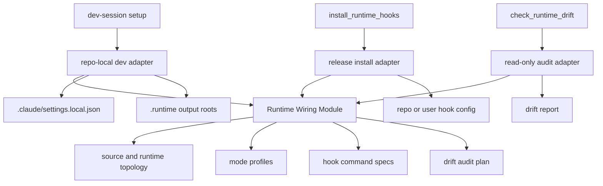

# refactor: Complete runtime wiring module

## Summary

Complete the first recommendation from `.runtime/reports/architecture-review-20260527-183248.html`: Runtime Wiring should own topology, hook rendering, drift checks, and source/runtime mode selection from one coherent module boundary. The existing `runtime_topology.py` work is the starting point, not the finish line.

This plan intentionally stops at the report's first step. State Scope, Refresh Run, Dashboard Read Model, and Proposal Lifecycle remain planned sequential follow-ups.

---

## Problem Frame

The first runtime/state boundary pass successfully made dev dogfood paths repo-local and made project event writes explicit. It did not fully align with the architecture review's Runtime Wiring recommendation. The current code still splits runtime behavior across `runtime_topology.py`, `scripts/merge_dev_hooks.py`, `agent-learning-compounder/bin/install_runtime_hooks`, and `agent-learning-compounder/bin/check_runtime_drift`.

That leaves the original locality risk partly open: developers and agents still need to know which script owns dev setup, which script owns release install, which command strings are source-first, and which runtime locations are read-only audit targets. The report calls for one Runtime Wiring Module that makes those choices local and testable, with release install as a separate adapter.

---

## Requirements

**Runtime module authority**

- R1. Runtime wiring must provide one module-level API for source root, repo-local dev roots, hook config targets, runtime artifact candidates, and user-runtime audit candidates.
- R2. Hook command rendering for repo-local dogfood must be owned by the runtime wiring module, not reconstructed in `scripts/merge_dev_hooks.py`.
- R3. Runtime drift selection and comparison behavior must be driven by runtime wiring mode, including repo-local-only default and explicit user-runtime audit mode.
- R4. Release hook installation must consume runtime wiring for config paths, event command rendering, and source/runtime mode selection, while preserving manifest-only-by-default behavior.

**Mode separation**

- R5. Development mode must write only repo-local hook config and repo-local `.runtime/` dogfood outputs.
- R6. Audit mode must read user runtime installs as evidence only and must not create or mutate user-scope files.
- R7. Release install mode must remain an explicit operator action and must not be reachable through dev-session setup.
- R8. Runtime wiring must keep source-first development distinct from installed runtime artifacts in names, docs, and test assertions.

**Sequential architecture plan**

- R9. This plan must not deepen State Scope beyond compatibility notes for existing `state_root` naming.
- R10. This plan must not restructure `refresh_learning_state`, dashboard read models, or proposal lifecycle.
- R11. Documentation must make the report sequence clear: Runtime Wiring first, then State Scope, then Refresh Run, Dashboard Read Model, and Proposal Lifecycle.

---

## Key Technical Decisions

- KTD1. Evolve `runtime_topology.py` into the Runtime Wiring module instead of introducing a parallel module. The file already carries the repo/source/runtime path vocabulary, and preserving its import path avoids churn for current callers.
- KTD2. Keep CLI scripts as adapters. `scripts/merge_dev_hooks.py`, `install_runtime_hooks`, and `check_runtime_drift` should parse arguments, call runtime wiring, and perform file IO. They should not independently decide path topology, command strings, or mode semantics.
- KTD3. Model modes explicitly. Runtime wiring should distinguish dev dogfood, release install, repo-runtime drift check, and user-runtime audit. Boolean flags such as `--include-user-runtimes` can stay at CLI level, but the module should translate them into a named mode/profile before resolving targets.
- KTD4. Preserve release installer safety gates. Existing protections around `--apply`, tracked repo hook config refusal, backups, gitignore updates, event-source taxonomy, and adapter command validation are behavioral contracts. Runtime wiring centralization must not weaken them.
- KTD5. Treat State Scope as already started but not part of this active build. The existing explicit `state`, `repo`, and `_write_scope` behavior stays in place; any renaming from `legacy_state_root` to more precise background/user labels belongs to the next State Scope plan.

---

## High-Level Technical Design

Runtime wiring becomes the source of truth for "what targets exist in this mode?" and "what commands should represent this runtime behavior?" The CLI adapters remain responsible for writing files, refusing unsafe targets, and reporting results.

---

## Scope Boundaries

### In Scope

- Runtime wiring module expansion from path-only topology to mode-aware runtime wiring.
- Dev hook command rendering moved behind runtime wiring.
- Drift checker target selection and read-only audit planning moved behind runtime wiring.
- Release installer config-path and command-rendering decisions moved behind runtime wiring while preserving existing safety behavior.
- Tests proving dev, audit, and release modes stay separate.
- Documentation updates that make Runtime Wiring the completed first step in the report sequence.

### Deferred to Follow-Up Work

- Full State Scope Module naming and user/background adapter cleanup.
- Hard removal of legacy no-arg `event_writer` fallback.
- Refresh Run Module and `refresh_learning_state` decomposition.
- Dashboard Read Model consolidation.
- Proposal Lifecycle Module.
- Any promotion or copy operation into user runtime trees outside existing explicit release/install flows.

---

## Implementation Units

### U1. Expand Runtime Wiring Model

- **Goal:** Turn `runtime_topology.py` from a path-only helper into the canonical runtime wiring module for topology, modes, config targets, command specs, and drift targets.
- **Requirements:** R1, R3, R5, R6, R7, R8.
- **Dependencies:** None.
- **Files:** `agent-learning-compounder/bin/runtime_topology.py`, `agent-learning-compounder/tests/test_runtime_topology.py`.
- **Approach:** Preserve `build_runtime_topology(repo)` for compatibility, then add mode-aware value objects around it. The module should be able to answer four questions without any CLI script rebuilding them: source skill root, repo-local dev roots, hook config target for runtime/scope, and drift target set for repo-only vs user-audit mode.
- **Patterns to follow:** Existing `StateHandle` value-object style in `agent-learning-compounder/bin/state_handle.py`; current immutable `RuntimeTopology` dataclass; event-source naming from `agent-learning-compounder/skills/alc-core/references/event-sources.json`.
- **Test scenarios:**
  - Given a temp repo, dev mode returns source skill root plus `.runtime/agent-learning-user` and `.runtime/agent-learning-state` under that repo.
  - Given runtime `claude` and scope `repo`, hook config target resolves to `.claude/settings.local.json`.
  - Given runtime `codex` and scope `repo`, hook config target resolves to `.codex/hooks.json`.
  - Given user-audit mode, user runtime candidates are included as read targets but no write target is returned.
  - Given repo-only drift mode, user runtime candidates are absent.
- **Verification:** Runtime topology tests prove all mode target sets and preserve the existing `build_runtime_topology` behavior.

### U2. Move Dev Hook Rendering Into Runtime Wiring

- **Goal:** Make repo-local dev hook command rendering a runtime wiring responsibility instead of inline construction in `scripts/merge_dev_hooks.py`.
- **Requirements:** R2, R5, R8.
- **Dependencies:** U1.
- **Files:** `agent-learning-compounder/bin/runtime_topology.py`, `scripts/merge_dev_hooks.py`, `agent-learning-compounder/tests/test_runtime_boundary.py`, `agent-learning-compounder/tests/test_runtime_topology.py`.
- **Approach:** Runtime wiring should produce dev hook specs carrying event, label, matcher, match token, and command. `merge_dev_hooks.py` should keep JSON merge, stale replacement, pruning, no-follow writes, and verify output. It should stop knowing how to render the auto-distill command or warm-loop command.
- **Execution note:** Characterization-first. Preserve current `test_merge_dev_hooks_keeps_auto_distill_outputs_repo_local` and stale replacement behavior before moving command construction.
- **Patterns to follow:** Current `expected_hooks(topology)` shape in `scripts/merge_dev_hooks.py`; `shell_env_command` quoting behavior; stale hook replacement tests in `agent-learning-compounder/tests/test_runtime_boundary.py`.
- **Test scenarios:**
  - Given a temp repo, runtime wiring renders one auto-distill hook command with repo-local `AGENT_LEARNING_USER`, compatibility `AGENT_LEARNING_PERSONAL`, repo-local `AGENT_LEARNING_STATE_DIR`, and source `AGENT_LEARNING_SKILL_DIR`.
  - Given `merge_dev_hooks.py --repo`, the written Stop hooks match the runtime wiring specs without duplicating stale command construction.
  - Given stale auto-distill command text, merge updates the existing command rather than appending a second hook.
  - Given verify mode, missing runtime wiring specs are reported without writing settings.
- **Verification:** Runtime boundary tests pass and `scripts/merge_dev_hooks.py` has no independent auto-distill path/env construction logic.

### U3. Route Drift Checks Through Runtime Wiring

- **Goal:** Make `check_runtime_drift` consume a drift audit plan from runtime wiring instead of assembling candidates and audit modes itself.
- **Requirements:** R3, R6, R8.
- **Dependencies:** U1.
- **Files:** `agent-learning-compounder/bin/runtime_topology.py`, `agent-learning-compounder/bin/check_runtime_drift`, `agent-learning-compounder/tests/test_runtime_boundary.py`, `agent-learning-compounder/tests/test_runtime_topology.py`.
- **Approach:** Runtime wiring should provide a drift plan that includes source root, candidate runtime roots, audit mode, and whether missing artifacts are acceptable. `check_runtime_drift` can keep snapshotting, hashing, diff formatting, and exit-code handling, but candidate selection and user-runtime inclusion should come from the plan.
- **Patterns to follow:** Current read-only messaging and non-strict missing behavior in `check_runtime_drift`; existing no-runtime regression in `test_runtime_boundary.py`.
- **Test scenarios:**
  - Given no repo-local runtime artifact, repo-only drift mode reports "none found" and exits successfully unless strict missing is requested.
  - Given an explicit runtime path, drift checker compares only that path and reports changed files.
  - Given user-audit mode, runtime wiring includes user runtime candidates and the drift checker opens them for reading only.
  - Given user-audit mode with no user runtime candidates present, the command still performs no writes and handles absence consistently with non-strict mode.
- **Verification:** Drift tests prove repo-only default, explicit runtime override, and user-audit inclusion without touching user-scope files.

### U4. Route Release Install Through Runtime Wiring

- **Goal:** Make `install_runtime_hooks` consume runtime wiring for hook config targets and adapter/warm-loop command specs while preserving installer safety behavior.
- **Requirements:** R4, R7, R8.
- **Dependencies:** U1.
- **Files:** `agent-learning-compounder/bin/runtime_topology.py`, `agent-learning-compounder/bin/install_runtime_hooks`, `agent-learning-compounder/tests/test_install_runtime_hooks_taxonomy.py`, `agent-learning-compounder/tests/test_pr5_install_warm_loop.py`.
- **Approach:** Keep `install_runtime_hooks` as the release adapter and CLI. Move runtime config path selection and adapter/warm-loop command construction into runtime wiring. Leave JSON loading, event-source validation, idempotent merge, `--apply`, gitignore/tracked-file guards, backups, and adapter execution in the installer.
- **Execution note:** Characterization-first around install output JSON and idempotency before moving command/path rendering.
- **Patterns to follow:** Existing `runtime_config_path`, `adapter_command`, `warm_loop_command`, `events_for_runtime`, and PR5 warm-loop tests.
- **Test scenarios:**
  - Given dry-run install, installer reports runtime config paths from runtime wiring and writes no files.
  - Given repo-scope apply for Codex and Claude, hook configs are written at the same repo-local paths as before.
  - Given user-scope apply, hook config target selection remains explicit and does not leak into dev setup.
  - Given repeated apply, command comparison remains idempotent.
  - Given Stop event mapping, warm-loop command is still installed once.
  - Given malformed event-sources data, no hook config is written.
- **Verification:** Install taxonomy and warm-loop tests pass, and installer no longer owns config path or command rendering decisions.

### U5. Add Runtime Wiring Integration Tests

- **Goal:** Prove the report's runtime first-step invariant from the outside: dev setup, release install, and drift audit select different modes through one shared runtime wiring module.
- **Requirements:** R1, R5, R6, R7, R8.
- **Dependencies:** U2, U3, U4.
- **Files:** `agent-learning-compounder/tests/test_runtime_boundary.py`, `agent-learning-compounder/tests/test_runtime_topology.py`, `agent-learning-compounder/tests/test_install_runtime_hooks_taxonomy.py`.
- **Approach:** Add narrow integration assertions instead of broad end-to-end filesystem sweeps. Tests should verify the resulting commands and targets, not private helper names.
- **Test scenarios:**
  - Dev hook setup produces source-root commands and `.runtime` output roots only.
  - Release installer uses adapter commands and configured hook manifests, not dev auto-distill commands.
  - Drift audit default excludes user runtime candidates.
  - Drift audit with user inclusion still has no write target.
  - Runtime wiring rejects or surfaces unsupported runtime names consistently through adapters.
- **Verification:** A focused runtime suite can be run independently and demonstrates the mode boundary without requiring installed user runtimes.

### U6. Update Architecture and Sequential Roadmap Docs

- **Goal:** Make the completed first-step target explicit for future agents: Runtime Wiring is the module boundary; the rest of the architecture review remains sequential follow-up work.
- **Requirements:** R8, R9, R10, R11.
- **Dependencies:** U1, U2, U3, U4, U5.
- **Files:** `ARCHITECTURE.md`, `CONTEXT.md`, `CLAUDE.md`, `agent-learning-compounder/CLAUDE.md`, `docs/dev/runtime-boundary.md`, `docs/dev/architecture-backlog-2026-05.md`, `.runtime/reports/architecture-review-20260527-183248.html`.
- **Approach:** Update durable docs to say runtime wiring owns topology, hook rendering, drift planning, and mode selection. Do not rewrite the report itself unless adding a small "follow-up plan exists" pointer is already an accepted repo convention; prefer backlog/docs updates over mutating the review artifact.
- **Patterns to follow:** Existing source-first language in `CLAUDE.md`; current architecture-backlog note format; runtime-boundary doc's explicit read-only user-runtime rule.
- **Test scenarios:** Test expectation: none -- documentation-only unit. Verification comes from review against this plan and the implementation tests in U1-U5.
- **Verification:** Docs describe the report sequence accurately and do not imply State Scope, Refresh Run, Dashboard Read Model, or Proposal Lifecycle are part of this plan.

---

## System-Wide Impact

This work affects developer setup, release hook installation, and runtime audit behavior. The main user-facing behavior should not change: dev setup remains idempotent, release install remains explicit, and drift checks remain read-only. The desired change is architectural locality: future additions to runtime support should update one runtime wiring module and thin adapters, not repeat path and command decisions across shell and Python entrypoints.

---

## Risks & Dependencies

- **Installer regression:** Moving config path and command rendering out of `install_runtime_hooks` could accidentally weaken `--apply` safety or idempotency. Mitigation: keep write guards in the installer and add characterization tests before migration.
- **Over-centralization:** Moving hashing/diff formatting entirely into runtime wiring would make the module too broad. Mitigation: runtime wiring owns drift planning and target selection; `check_runtime_drift` can keep file snapshot and report formatting unless implementation shows a cleaner split.
- **Name churn:** Renaming `runtime_topology.py` would create unnecessary import churn. Mitigation: evolve the existing module and document its broader responsibility.
- **Hidden runtime consumers:** Installed artifacts may lag source behavior. Mitigation: keep user runtime audit read-only and rely on explicit release/install flows for promotion.

---

## Sources & Research

- `.runtime/reports/architecture-review-20260527-183248.html` is the authority for this plan. It identifies Runtime Wiring as the first recommended step and says it should own topology, hook rendering, drift checks, and source/runtime mode selection.
- `docs/plans/2026-05-27-001-refactor-runtime-state-boundary-plan.md` implemented the first safety slice but intentionally narrowed runtime wiring to a path-only topology helper.
- `agent-learning-compounder/bin/runtime_topology.py` currently owns repo/source/dev-root/user-candidate paths only.
- `scripts/merge_dev_hooks.py` currently owns dev hook command rendering and JSON merge behavior.
- `agent-learning-compounder/bin/check_runtime_drift` currently owns drift target selection plus snapshot/diff/reporting.
- `agent-learning-compounder/bin/install_runtime_hooks` currently owns release config target selection, adapter command rendering, warm-loop command rendering, and release safety checks.
- `STRATEGY.md` frames ALC as source-first, evidence-backed, read-only by default, and explicit for durable writes; runtime wiring must preserve that trust model.
