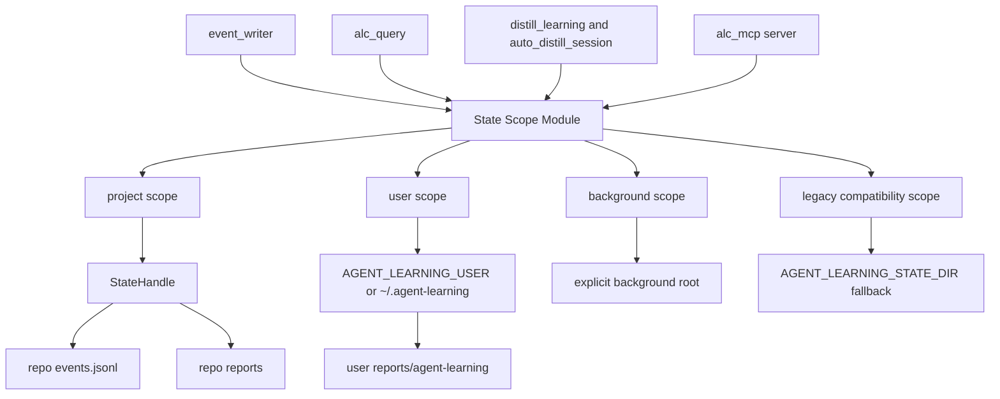

# refactor: Complete state scope module

## Summary

Complete the second strong recommendation from `.runtime/reports/architecture-review-20260527-183248.html`: State Scope should own user scope, project scope, background writes, and read/write target selection from one coherent module boundary.

Runtime Wiring is now complete in `docs/plans/2026-05-27-002-refactor-runtime-wiring-module-plan.md`. This plan intentionally builds the next sequential step only. Refresh Run, Dashboard Read Model, and Proposal Lifecycle remain follow-up work.

---

## Problem Frame

The current code has already moved in the right direction. `StateHandle` resolves repo state, `event_writer` accepts explicit `state=`, `repo=`, and `state_root=`, and event rows carry `_write_scope` so legacy/background writes are distinguishable from project writes.

The boundary is still incomplete because scope decisions remain split across several modules. `event_writer.py` owns `_state_scope`; `alc_query.py` owns a separate `Scope` literal and user report resolver; `distill_learning` and `auto_distill_session` resolve user roots separately; MCP and renderer surfaces construct `StateHandle` directly. This keeps the original report risk partly open: future writers and readers still need to know which helper owns user state, project state, background state, and ambiguous fallback behavior.

---

## Requirements

**State scope authority**

- R1. State scope must provide one module-level API for project state, user state, background write roots, and read-scope selection.
- R2. Event write target selection must be owned by state scope, not reconstructed inside `event_writer.py`.
- R3. Read surfaces must consume the same user/project/both scope vocabulary as write surfaces, so `alc_query`, MCP, and renderers do not drift.
- R4. User-scope resolution for auto-distill and durable learning writes must use the shared state-scope API while preserving `AGENT_LEARNING_USER` and `AGENT_LEARNING_PERSONAL` compatibility.

**Write intent and compatibility**

- R5. Project writes must remain explicit through `StateHandle` or `repo=` and must not depend on caller-side `AGENT_LEARNING_STATE_DIR` mutation.
- R6. Background writes must require an explicit background root or carry a visible legacy/background classification when compatibility fallback is used.
- R7. Existing compatibility paths that use `state_root=`, `AGENT_LEARNING_STATE_DIR`, `--state-dir`, or `repo=` must continue to work during this transition.
- R8. Unsupported or ambiguous scope combinations must fail clearly, especially combinations such as `state` plus `repo` or `state` plus `state_root`.

**Sequential architecture plan**

- R9. This plan must not restructure `refresh_learning_state`, dashboard read-model construction, or proposal lifecycle ranking.
- R10. Documentation must keep the architecture sequence explicit: Runtime Wiring is complete; State Scope is next; Refresh Run, Dashboard Read Model, and Proposal Lifecycle remain later steps.

---

## Key Technical Decisions

- KTD1. Evolve `state_handle.py` into the State Scope module instead of adding a parallel `state_scope.py` on this pass. `StateHandle` is already the canonical repo-state resolver, and preserving the import path avoids churn across CLI, MCP, dashboard, and tests.
- KTD2. Move write-target classification behind state scope. `event_writer.py` should keep JSONL serialization, locking, rotation, schema coercion, and boundary checks, but it should ask state scope which directory and `_write_scope` label to use.
- KTD3. Share read-scope vocabulary with query consumers. `alc_query.py` can keep query and parsing logic, but scope validation and user-report directory resolution should come from state scope so reads and writes speak the same language.
- KTD4. Keep compatibility visible, not invisible. Legacy env fallback stays for one transition slice, but the returned classification should remain explicit (`legacy_env_state_dir`, `legacy_state_root`, or equivalent) so audits can separate compatibility writes from project writes.
- KTD5. Leave event-log truncation and refresh pipeline changes out of scope. `docs/dev/architecture-backlog-2026-05.md` already records the `events.jsonl` replay/truncate risk; fixing it belongs to Refresh Run or a separate event-log plan, not this State Scope boundary pass.

---

## High-Level Technical Design

State Scope becomes the shared vocabulary for durable ALC state. It does not write files, parse event rows, or run refresh logic. It answers questions about scope and targets: project handle, user root, user report directory, background sink, read scope, and write-scope classification.

---

## Scope Boundaries

### In Scope

- State-scope API expansion in `agent-learning-compounder/bin/state_handle.py`.
- Moving event write target resolution out of `agent-learning-compounder/bin/event_writer.py` and into state scope.
- Unifying read-scope validation and user report path resolution for `agent-learning-compounder/bin/alc_query.py`.
- Routing auto-distill and durable user writes through state scope while keeping compatibility env names.
- Narrow tests proving project, user, background, and legacy scopes remain distinct.
- Documentation updates that mark State Scope as the active second step after Runtime Wiring.

### Deferred to Follow-Up Work

- Refresh Run Module and `refresh_learning_state` decomposition.
- Fixing the `events.jsonl` replay/truncate risk recorded in `docs/dev/architecture-backlog-2026-05.md`.
- Dashboard Read Model consolidation across dashboard implementations.
- Proposal Lifecycle Module.
- Hard removal of `AGENT_LEARNING_PERSONAL`, no-arg `event_writer`, or `AGENT_LEARNING_STATE_DIR` compatibility.
- Any promotion or copy operation into user runtime trees outside explicit release/install flows.

---

## Implementation Units

### U1. Expand State Scope API

- **Goal:** Turn `state_handle.py` from repo-state topology plus legacy helpers into the canonical state-scope module for project, user, background, and compatibility targets.
- **Requirements:** R1, R4, R6, R7, R8.
- **Dependencies:** None.
- **Files:** `agent-learning-compounder/bin/state_handle.py`, `agent-learning-compounder/tests/test_state_handle.py`, `agent-learning-compounder/fixtures/tests/test_state_paths_precedence.py`.
- **Approach:** Preserve `StateHandle.for_repo`, `StateHandle.for_project`, `StateHandle.for_user`, `resolve_state_dir`, and `repo_state_dir` for compatibility. Add value-oriented helpers that return scope decisions with both target path and classification label for project, user, background, and legacy fallback. Keep file writes out of this module.
- **Execution note:** Characterization-first around existing precedence behavior before moving callers.
- **Patterns to follow:** Existing immutable `StateHandle` dataclass; tier labels returned by `_resolve_state_root`; `RuntimeTopology` mode/value-object style from `agent-learning-compounder/bin/runtime_topology.py`.
- **Test scenarios:**
  - Given `StateHandle.for_repo(temp_repo, state_dir=state_root)`, project scope returns the same repo-state directory and `events.jsonl` path as before.
  - Given `AGENT_LEARNING_USER`, user scope resolves to that root and user reports resolve to `reports/agent-learning` under that root.
  - Given only `AGENT_LEARNING_PERSONAL`, user scope resolves through the compatibility alias and records a compatibility tier.
  - Given an explicit background root, background write scope resolves to that root and does not create a repo subdirectory.
  - Given conflicting project inputs such as `state` plus `repo`, state scope rejects the combination with a clear error.
- **Verification:** State-handle tests prove all existing precedence behavior plus the new explicit scope classifications.

### U2. Route Event Writer Through State Scope

- **Goal:** Make `event_writer.py` consume state-scope target selection instead of owning `_state_scope` locally.
- **Requirements:** R2, R5, R6, R7, R8.
- **Dependencies:** U1.
- **Files:** `agent-learning-compounder/bin/event_writer.py`, `agent-learning-compounder/tests/test_event_writer.py`, `agent-learning-compounder/tests/test_context_boundary.py`, `agent-learning-compounder/tests/test_pipeline_b1_b3_b12.py`.
- **Approach:** Move only target resolution and `_write_scope` label selection out of `event_writer.py`. Keep event schema coercion, boundary checks, secret/path enforcement, locking, append behavior, and rotation in the writer. Preserve the existing write API shape (`state=`, `repo=`, `state_root=`) so downstream callers do not need a broad migration in this unit.
- **Patterns to follow:** Current `event_writer.write_event` and `write_events_batch` contracts; existing `_write_scope` assertions in `agent-learning-compounder/tests/test_event_writer.py`; no-follow file safety behavior.
- **Test scenarios:**
  - Given `state=StateHandle.for_repo(repo)`, an event lands in the project event log and payload `_write_scope` remains project-specific.
  - Given `repo=repo`, an event resolves through project scope even when `AGENT_LEARNING_STATE_DIR` points elsewhere.
  - Given `state_root=background_root`, an event lands in the explicit background root and is not labeled as project telemetry.
  - Given legacy env fallback only, behavior remains compatible and payload `_write_scope` identifies legacy fallback.
  - Given a symlink at the event log path, write refusal still happens after the state-scope migration.
- **Verification:** Existing event-writer tests pass with target resolution delegated, and no event boundary checks move into state scope.

### U3. Unify Query Read Scope

- **Goal:** Make `alc_query.py` consume state-scope read helpers for user/project/both scope validation and user report paths.
- **Requirements:** R1, R3, R4, R7.
- **Dependencies:** U1.
- **Files:** `agent-learning-compounder/bin/alc_query.py`, `agent-learning-compounder/tests/test_alc_query.py`, `agent-learning-compounder/tests/test_read_surface.py`, `agent-learning-compounder/alc_mcp/server.py`.
- **Approach:** Keep query parsing and SQLite access in `alc_query.py`, but move duplicated scope vocabulary and `_user_reports_dir` path logic into state scope. MCP handlers should continue passing `StateHandle` for project reads, but user/both reads should use the same helper path as CLI and dashboard consumers.
- **Patterns to follow:** Current `Scope = Literal["user", "project", "both"]` behavior; existing `get_gates` and `get_skill_context` handling for project-required state; MCP handler factory convention in `agent-learning-compounder/alc_mcp/server.py`.
- **Test scenarios:**
  - Given project scope without a `StateHandle`, `get_gates` and `get_skill_context` still raise `QueryError`.
  - Given user scope with an explicit user root, query functions read user reports from the state-scope-resolved reports directory.
  - Given both scope, project rows still win over user rows when gate IDs collide.
  - Given an invalid scope string, validation fails through the shared state-scope vocabulary.
  - Given an MCP tool call that uses a repo argument, the handler still constructs project state and preserves existing output shape.
- **Verification:** Query tests prove read behavior is unchanged while duplicated path/scope logic leaves `alc_query.py`.

### U4. Route User-Scope Distillation Through State Scope

- **Goal:** Make auto-distill and durable learning writes use the shared user-scope resolver rather than local env parsing.
- **Requirements:** R1, R4, R6, R7.
- **Dependencies:** U1.
- **Files:** `agent-learning-compounder/bin/auto_distill_session`, `agent-learning-compounder/bin/distill_learning`, `agent-learning-compounder/bin/export_gates`, `agent-learning-compounder/bin/export_skill_context`, `agent-learning-compounder/tests/test_auto_distill_session.py`, `agent-learning-compounder/tests/test_distill_learning.py`, `agent-learning-compounder/tests/test_export_gates.py`, `agent-learning-compounder/tests/test_export_skill_context.py`.
- **Approach:** Preserve CLI and environment compatibility, but have Python entrypoints call state scope for user root and report path decisions. For the shell wrapper, keep it thin: resolve the same environment variables it already passes, but align names and comments with State Scope and avoid introducing new routing behavior there.
- **Patterns to follow:** `StateHandle.for_user`; existing `distill_learning` `--user` and `--personal` compatibility; runtime dev hook command env from `agent-learning-compounder/bin/runtime_topology.py`.
- **Test scenarios:**
  - Given `--user user_root --write`, durable learning outputs still land under `user_root/reports/agent-learning`.
  - Given `AGENT_LEARNING_USER`, distillation uses that root without requiring `--user`.
  - Given only `AGENT_LEARNING_PERSONAL`, compatibility behavior remains but is visibly classified as legacy/compat in helper output or testable resolver state.
  - Given dev auto-distill env from runtime wiring, outputs remain under `.runtime/agent-learning-user`.
  - Given no explicit user root and `--write`, the existing refusal behavior remains in place.
- **Verification:** User-scope distillation tests pass without local user-root resolver duplication in durable-write modules.

### U5. Normalize Renderer and MCP State Construction

- **Goal:** Make render and MCP surfaces consume the shared state-scope API instead of each constructing partial state behavior independently.
- **Requirements:** R1, R3, R5, R7.
- **Dependencies:** U1, U3.
- **Files:** `agent-learning-compounder/bin/render_state_surface`, `agent-learning-compounder/alc_mcp/server.py`, `agent-learning-compounder/tests/test_render_state_surface.py`, `agent-learning-compounder/tests/test_mcp_catalog.py`, `agent-learning-compounder/tests/test_mcp_server.py`.
- **Approach:** Keep renderer formatting and MCP protocol handling in their current files, but route repo/state-dir/user-scope construction through state scope. Avoid broad dashboard read-model changes; this unit is only about state-target construction and vocabulary parity.
- **Patterns to follow:** `_setup_state` in `render_state_surface`; MCP `_state(args)` helper; catalog-driven MCP handler factory.
- **Test scenarios:**
  - Given `render_state_surface --repo repo --state-dir state_root`, rendering uses project scope with the explicit state root and preserves output shape.
  - Given `render_state_surface --format json`, the reported `state_root` remains the project state root resolved by state scope.
  - Given an MCP write tool, project state is constructed through state scope and write events keep project `_write_scope`.
  - Given an MCP read tool, project read behavior remains unchanged and user/both scope helpers use the shared vocabulary where applicable.
- **Verification:** Renderer and MCP tests pass without changing dashboard data model internals.

### U6. Remove Caller-Side Env Mutation From Project Writers

- **Goal:** Finish the State Scope transition by removing remaining project writer patterns that mutate `AGENT_LEARNING_STATE_DIR` to route writes.
- **Requirements:** R5, R6, R7, R8.
- **Dependencies:** U1, U2.
- **Files:** `agent-learning-compounder/bin/alc_eval`, `agent-learning-compounder/bin/alc_invoke`, `agent-learning-compounder/bin/alc_apply_dispatch.py`, `agent-learning-compounder/bin/recommender_render`, `agent-learning-compounder/bin/event_emit`, `agent-learning-compounder/bin/exec_sandbox`, `agent-learning-compounder/tests/test_alc_eval.py`, `agent-learning-compounder/tests/test_alc_invoke.py`, `agent-learning-compounder/tests/test_alc_apply_contracts.py`, `agent-learning-compounder/tests/test_recommender_render.py`, `agent-learning-compounder/tests/test_event_emit.py`, `agent-learning-compounder/tests/test_exec_sandbox_eval.py`.
- **Approach:** Audit project writers after U2 lands. For callers that already hold a `StateHandle`, pass `state=`. For callers that only know a repo, pass `repo=`. Keep env reads that model CLI `--state-dir` compatibility, but remove context-manager style env mutation used only to route project writes.
- **Execution note:** Characterization-first per caller. This unit touches multiple writer entrypoints and should preserve event IDs, event source labels, and payload shapes.
- **Patterns to follow:** Current `alc_apply_dispatch.py`, `alc_eval`, and `alc_invoke` direct `write_event(..., state=state)` usage where already present; `event_writer.write_event(..., repo=repo)` in existing event emission helpers.
- **Test scenarios:**
  - Given an eval write, event ID determinism and project `_write_scope` remain unchanged.
  - Given an invoke start/finish write, events land in the project state handle without env mutation.
  - Given an apply dispatch success or failure event, boundary checks and deterministic IDs remain unchanged.
  - Given an exec sandbox event, existing event path and source classification remain unchanged.
  - Given a CLI state-dir override used for reads, the override remains honored without implying global write routing.
- **Verification:** Focused writer tests pass, and a source search shows remaining `AGENT_LEARNING_STATE_DIR` usage is either compatibility resolution, test setup, or documented CLI/env input rather than project-write routing.

### U7. Update Architecture and Sequential Roadmap Docs

- **Goal:** Make the completed second-step target explicit for future agents: State Scope is the module boundary; later report recommendations remain sequential follow-up work.
- **Requirements:** R9, R10.
- **Dependencies:** U1, U2, U3, U4, U5, U6.
- **Files:** `ARCHITECTURE.md`, `CONTEXT.md`, `CLAUDE.md`, `agent-learning-compounder/CLAUDE.md`, `docs/dev/runtime-boundary.md`, `docs/dev/architecture-backlog-2026-05.md`.
- **Approach:** Update durable docs to say state scope owns project/user/background target selection for reads and writes. Keep docs aligned with the source-first runtime rule from the previous plan. Do not mutate the architecture review artifact; use backlog/docs updates as the durable status surface.
- **Patterns to follow:** Current Runtime Wiring note in `docs/dev/architecture-backlog-2026-05.md`; source-first and read-only language in `docs/dev/runtime-boundary.md`; Scope model section in `ARCHITECTURE.md`.
- **Test scenarios:** Test expectation: none -- documentation-only unit. Verification comes from review against this plan and implementation tests in U1-U6.
- **Verification:** Docs describe the report sequence accurately and do not imply Refresh Run, Dashboard Read Model, or Proposal Lifecycle are part of this plan.

---

## System-Wide Impact

This work affects every surface that reads or writes durable ALC state: hook event writing, proposal/eval/apply telemetry, user-scope distillation, query APIs, MCP tools, and state rendering. The intended user-facing behavior is stability, not feature change. Existing CLI flags and env compatibility stay intact, but the ownership of scope decisions becomes local and testable.

The main operational benefit is auditability. A future event row should say whether it was written as project telemetry, explicit background output, user-scope durable learning, or legacy fallback without requiring the reader to infer that from environment variables at runtime.

---

## Risks & Dependencies

- **Compatibility regression:** Some older tests or scripts intentionally rely on `AGENT_LEARNING_STATE_DIR`. Mitigation: keep env compatibility in the resolver and change only ownership of the decision, not the public contract.
- **Over-centralization:** State scope could become a dumping ground for query parsing or event serialization. Mitigation: state scope owns target selection only; query logic stays in `alc_query.py`, writer logic stays in `event_writer.py`.
- **Ambiguous user vs background roots:** User root and background state root can both be paths under `.runtime/` during dogfood. Mitigation: require returned classifications and tests to distinguish user reports from background event logs.
- **Broad writer surface:** U6 spans multiple command entrypoints. Mitigation: land prior units first, then migrate caller-by-caller with characterization tests.
- **Event-log replay risk remains:** The `events.jsonl` truncate/append issue recorded in `docs/dev/architecture-backlog-2026-05.md` is adjacent but not solved here. Mitigation: keep it explicitly deferred to Refresh Run or a dedicated event-log plan.

---

## Sources & Research

- `.runtime/reports/architecture-review-20260527-183248.html` identifies State Scope as the second strong recommendation and calls out `StateHandle`, caller-side `AGENT_LEARNING_STATE_DIR` mutation, and ambiguous background writes.
- `docs/plans/2026-05-27-002-refactor-runtime-wiring-module-plan.md` completed Runtime Wiring and explicitly deferred full State Scope Module naming and user/background adapter cleanup.
- `docs/dev/runtime-boundary.md` currently documents explicit state intent for writer-style callers and `_write_scope` auditing.
- `agent-learning-compounder/bin/state_handle.py` already centralizes repo state and user-root compatibility helpers.
- `agent-learning-compounder/bin/event_writer.py` currently owns local write-target resolution and `_write_scope` labels.
- `agent-learning-compounder/bin/alc_query.py` currently owns read-scope validation and user report path resolution.
- `agent-learning-compounder/bin/auto_distill_session` and `agent-learning-compounder/bin/distill_learning` currently resolve user-scope roots through environment compatibility paths.
- `STRATEGY.md` frames ALC as source-first, evidence-backed, read-only by default, and explicit for durable writes; State Scope must preserve that trust model.
