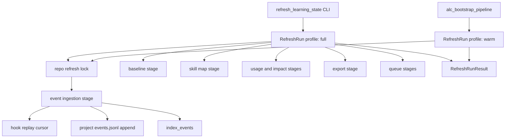

# refactor: Complete refresh run module

## Summary

Complete the third recommendation from `.runtime/reports/architecture-review-20260527-183248.html`: Refresh Run should own refresh ordering, locking, event ingestion, stage execution, and result reporting from one coherent module boundary.

Runtime Wiring and State Scope are now complete in `docs/plans/2026-05-27-002-refactor-runtime-wiring-module-plan.md` and `docs/plans/2026-05-27-003-refactor-state-scope-module-plan.md`. This plan builds the next sequential step only. Dashboard Read Model and Proposal Lifecycle remain follow-up work.

---

## Problem Frame

`agent-learning-compounder/bin/refresh_learning_state` is the current refresh orchestrator. It owns the top-level refresh lock, event indexing, baseline and skill-map writes, skill-impact evaluation, gate-effectiveness evaluation, queue mutation, queue dedup, retirement candidates, and domain-rule candidate mining. Those are all refresh concerns, but the current file mixes stage ordering, stage internals, write policy, and result rendering in one executable.

The warm-loop path is split in a different direction. `agent-learning-compounder/bin/alc_bootstrap_pipeline` runs `replay_hook_events` and `index_events` so Stop hooks and bootstrap can warm `events.sqlite`, while full refresh independently calls `index_events` and reads `hook-events.jsonl` directly. The split leaves the architecture report's Refresh Run recommendation open and preserves the `events.jsonl` correctness risk recorded in `docs/dev/architecture-backlog-2026-05.md`: full hook replay truncates `events.jsonl`, so writer-sourced rows can disappear on the next Stop hook.

---

## Requirements

**Refresh run authority**

- R1. Refresh Run must provide one module-level API for warm refresh, full refresh, stage ordering, lock ownership, and result reporting.
- R2. `refresh_learning_state` must become a thin CLI adapter around Refresh Run rather than owning stage orchestration itself.
- R3. `alc_bootstrap_pipeline` must use the same Refresh Run event-ingestion path as full refresh, while preserving its warm-loop latency profile.
- R4. Refresh Run must return a structured result that identifies indexed event counts, queue mutations, suppressed rows, dedup counts, and touched artifacts.

**Event ingestion correctness**

- R5. Hook replay must not truncate `events.jsonl` or discard rows written by `event_writer`.
- R6. Hook replay must be incremental or otherwise idempotent when Stop hooks run repeatedly.
- R7. `index_events` must continue to read the project-scoped `events.jsonl` path resolved by `StateHandle` / State Scope.
- R8. Malformed hook/event rows must remain quarantined rather than wedging refresh or silently corrupting output.

**Stage boundaries**

- R9. Baseline, skill-map, skill-usage, skill-impact, export, queue, gate-effectiveness, retirement/demote, and domain-rule mining stages must be represented as internal stage adapters or functions with narrow inputs and outputs.
- R10. Stage internals must keep their existing behavior unless a change is required to enforce refresh ordering, locking, or event-log correctness.
- R11. Refresh Run must preserve the existing top-level per-repo refresh lock and crash-safe write primitives.
- R12. Refresh Run must not move query parsing into refresh or bypass the existing `alc_query` read seam.

**Sequential architecture plan**

- R13. This plan must not consolidate dashboard read models or proposal lifecycle ranking.
- R14. Documentation must keep the architecture sequence explicit: Runtime Wiring and State Scope are complete; Refresh Run is next; Dashboard Read Model and Proposal Lifecycle remain later steps.

---

## Key Technical Decisions

- KTD1. Add `agent-learning-compounder/bin/refresh_run.py` as the module boundary and keep `agent-learning-compounder/bin/refresh_learning_state` as the CLI adapter. Unlike Runtime Wiring and State Scope, the current executable is already a large command script; extracting a module lets execution code shrink without renaming the public command.
- KTD2. Model refresh profiles instead of one boolean path. A `warm` profile should run hook replay plus indexing for Stop hooks and bootstrap. A `full` profile should run warm ingestion first, then baseline, skill, queue, scoring, and export stages.
- KTD3. Replace truncating hook replay with an append/cursor strategy. The refresh-owned ingestion stage should append newly normalized hook rows to project `events.jsonl` and advance a cursor only after successful append/index behavior. This preserves writer-sourced EventV4 rows already in `events.jsonl`.
- KTD4. Keep stage logic local until it earns extraction. The first pass should move orchestration and target selection, not scatter every helper into many files. Existing scoring, queue, and domain-rule functions can remain in `refresh_learning_state` temporarily only if the public CLI delegates to Refresh Run and the remaining file is clearly transitional.
- KTD5. Do not make Stop hooks run full refresh by default. Warm-loop latency matters; Stop hook and bootstrap should use the warm profile unless an explicit future operator setting opts into full refresh.
- KTD6. Keep Dashboard Read Model and Proposal Lifecycle out of this pass. Refresh Run may produce cleaner artifacts and result metadata those later modules can consume, but it should not reshape dashboard payloads or recommendation lifecycle semantics.

---

## High-Level Technical Design



```mermaid
sequenceDiagram
  participant Writer as event_writer
  participant HookLog as hook-events.jsonl
  participant Run as Refresh Run
  participant Events as events.jsonl
  participant Index as index_events

  Writer->>Events: append EventV4 row
  HookLog->>Run: new hook rows after replay cursor
  Run->>Events: append normalized hook rows
  Run->>Index: index project events.jsonl
  Index->>Index: advance sqlite cursor
  Note over Events: Existing writer rows remain intact; replay never truncates.
```

Refresh Run becomes the coordinator for the engine that creates and warms ALC's durable learning artifacts. It does not parse dashboard requests, decide proposal lifecycle policy, or change how agents consume `alc_query`; it makes the refresh stages run through one ordered, testable path.

---

## Scope Boundaries

### In Scope

- New Refresh Run module boundary in `agent-learning-compounder/bin/refresh_run.py`.
- Thin CLI adaptation in `agent-learning-compounder/bin/refresh_learning_state`.
- Warm-loop adaptation in `agent-learning-compounder/bin/alc_bootstrap_pipeline`.
- Incremental append/cursor replay for hook events into project `events.jsonl`.
- Stage result objects or dictionaries that make touched artifacts and queue/index counts explicit.
- Focused tests for warm refresh, full refresh, replay non-truncation, result shape, and stage ordering.
- Documentation updates that mark Refresh Run as the active third architecture step.

### Deferred to Follow-Up Work

- Dashboard Read Model consolidation across dashboard implementations.
- Proposal Lifecycle Module.
- Changing dashboard payload shape or MCP read-tool output shape.
- Making full refresh run automatically on every Stop hook.
- Broad redesign of gate-effectiveness, queue-dedup, or domain-rule algorithms beyond the orchestration boundary.
- Hard removal of legacy `replay_hook_events` CLI compatibility if operators still use it manually.

---

## Implementation-Time Unknowns

- Exact cursor filename and recovery semantics for hook replay should be chosen during implementation after inspecting existing cursor conventions in `index_events` and transcript ingest.
- Whether `replay_hook_events` remains the append engine or becomes a compatibility wrapper around a new in-process helper depends on the cleanest testable shape.
- The smallest useful `RefreshRunResult` representation should be settled while migrating callers; it must be structured enough for tests without becoming a public API promise too early.

---

## Implementation Units

### U1. Create Refresh Run Module Skeleton

- **Goal:** Introduce the Refresh Run module boundary with profile, context, lock, and result concepts while preserving existing refresh behavior.
- **Requirements:** R1, R2, R4, R9, R11.
- **Dependencies:** None.
- **Files:** `agent-learning-compounder/bin/refresh_run.py`, `agent-learning-compounder/bin/refresh_learning_state`, `agent-learning-compounder/tests/test_refresh_run.py`, `agent-learning-compounder/fixtures/tests/test_refresh_retirement_filter.py`.
- **Approach:** Add value-oriented types or dictionaries for refresh context, profile (`warm`, `full`), stage result, and full result. Move the top-level repo/state resolution and `.refresh.lock` ownership into `refresh_run.py`. Keep the current `refresh_learning_state.refresh(...)` importable API as a compatibility wrapper that delegates to `refresh_run.run_full(...)`.
- **Execution note:** Characterization-first around current full refresh return keys before moving orchestration.
- **Patterns to follow:** `StateHandle.project_state` and `EventWriteTarget` value-object style in `agent-learning-compounder/bin/state_handle.py`; `RuntimeTopology` profile style in `agent-learning-compounder/bin/runtime_topology.py`; existing `.refresh.lock` comments in `refresh_learning_state`.
- **Test scenarios:**
  - Given a temp repo and explicit state dir, `refresh_learning_state.refresh(...)` returns the same top-level keys for repo, repo state dir, event log, event presence, queue counts, and touched artifacts as before.
  - Given concurrent full refresh calls, the top-level lock still serializes writes and all JSON artifacts parse cleanly after completion.
  - Given a warm profile, the result omits full-only stage outputs while still returning an index result.
  - Given an invalid profile string, Refresh Run rejects it with a clear error.
- **Verification:** Existing refresh retirement/concurrency tests pass, and new refresh-run tests prove the CLI adapter delegates to the module boundary.

### U2. Replace Truncating Hook Replay With Incremental Event Ingestion

- **Goal:** Make Refresh Run's event ingestion append hook-derived rows without truncating writer-sourced `events.jsonl` rows.
- **Requirements:** R3, R5, R6, R7, R8.
- **Dependencies:** U1.
- **Files:** `agent-learning-compounder/bin/refresh_run.py`, `agent-learning-compounder/bin/replay_hook_events`, `agent-learning-compounder/bin/alc_bootstrap_pipeline`, `agent-learning-compounder/fixtures/tests/test_replay_hook_events.py`, `agent-learning-compounder/tests/test_refresh_run.py`, `agent-learning-compounder/tests/test_index_events.py`.
- **Approach:** Add an ingestion stage that reads only unreplayed hook rows, normalizes them through the existing replay rules, appends to project `events.jsonl`, then indexes that file. Keep malformed-row skip behavior. Preserve `replay_hook_events --dry-run` and manual CLI compatibility, but change the production warm path so it no longer opens `events.jsonl` with truncate semantics.
- **Execution note:** Test-first for the non-truncation regression: seed `events.jsonl` with a writer row, run warm replay, and assert both the writer row and hook-derived rows remain.
- **Patterns to follow:** `index_events` byte cursor behavior; `ingest_new_transcripts` cursor placement; `event_writer` append/lock model; existing `replay_hook_events.replay_normalize` allowlist behavior.
- **Test scenarios:**
  - Given an existing EventV4 writer row in project `events.jsonl` and one hook row in `hook-events.jsonl`, warm refresh preserves the writer row and appends the hook-derived row.
  - Given the same hook log replayed twice, the second warm refresh appends no duplicate hook-derived rows.
  - Given a malformed hook row with skip-malformed behavior, ingestion skips it, records a skipped count, and continues with valid rows.
  - Given `events.jsonl` is a symlink, ingestion refuses to write through it.
  - Given hook rows have old schema fields, replay normalization still preserves safe timestamps and supported fields.
- **Verification:** A source search shows production warm paths no longer call `replay_hook_events` in a mode that truncates project `events.jsonl`.

### U3. Move Baseline, Skill, Usage, Impact, and Export Stages Behind Refresh Run

- **Goal:** Make the non-queue full-refresh stages explicit Refresh Run stages with narrow inputs and stage results.
- **Requirements:** R1, R4, R9, R10, R11.
- **Dependencies:** U1, U2.
- **Files:** `agent-learning-compounder/bin/refresh_run.py`, `agent-learning-compounder/bin/refresh_learning_state`, `agent-learning-compounder/tests/test_refresh_run.py`, `agent-learning-compounder/fixtures/tests/test_install_bootstrap.py`.
- **Approach:** Move orchestration for baseline, skill map, skill usage, skill impact, and `latest-skill-context.md` export into stage helpers. Keep the underlying imported helpers (`build_repo_baseline`, `map_active_skills`, `extract_skill_usage`, `evaluate_skill_impact`, `export_skill_context`) unchanged. Each stage should return touched paths and counts/status needed by the final result.
- **Patterns to follow:** Current `touched` list in `refresh_learning_state`; `atomic_write_text` and `write_context` usage; runtime resolution from state-root `config.json`.
- **Test scenarios:**
  - Given a repo with no hook events, full refresh still writes baseline, skill map, empty usage/impact, and skill context while reporting no event rows.
  - Given a repo with hook events, full refresh computes usage and impact from the hook log and reports the written artifact paths.
  - Given state-root `config.json` declares a runtime, baseline and skill map stages use that runtime value.
  - Given a stage raises a non-fatal indexing warning, full refresh continues to later artifact stages when safe to do so.
- **Verification:** Full refresh output remains backward-compatible while `refresh_learning_state` no longer directly sequences these stages.

### U4. Move Queue, Gate Effectiveness, Retirement, and Domain Stages Behind Refresh Run

- **Goal:** Make queue mutation and scoring stages part of the Refresh Run stage model without changing the scoring algorithms.
- **Requirements:** R4, R8, R9, R10, R11.
- **Dependencies:** U1, U3.
- **Files:** `agent-learning-compounder/bin/refresh_run.py`, `agent-learning-compounder/bin/refresh_learning_state`, `agent-learning-compounder/fixtures/tests/test_refresh_retirement_filter.py`, `agent-learning-compounder/fixtures/tests/test_queue_dedup.py`, `agent-learning-compounder/fixtures/tests/test_propose_domain_rules.py`.
- **Approach:** Move orchestration for candidate queueing, dedup, inherited gate handling, retirement/demote candidate appends, and domain-rule candidate mining into stage helpers. Reuse existing queue helpers and preserve locks, stable row IDs, causal-signal gates, and fail-closed inherited-gate behavior.
- **Execution note:** Characterization-first around the existing M1/M2/M4/M5/H2 tests before moving helper ownership.
- **Patterns to follow:** `queue_candidate_adjustments`, `_post_dedup`, `_queue_retirement_candidates`, and `_queue_domain_rule_candidates` behavior in `refresh_learning_state`.
- **Test scenarios:**
  - Given the failure-cohort fixture, full refresh queues exactly one stable gate retirement candidate across repeated runs.
  - Given no causal probe data, full refresh does not queue retirement even when correlation alone looks negative.
  - Given a malformed inherited gate block with `gate_id` but no `derived_from`, full refresh queues a demote candidate with `derived_from=unknown`, not a retirement candidate.
  - Given duplicate queue candidates, full refresh reports dedup removals and preserves the intended keep policy.
  - Given a corpus with correction-correlated terms, full refresh reports domain-rule candidate count.
- **Verification:** Existing refresh retirement, queue dedup, and domain-rule tests pass with queue orchestration delegated to Refresh Run.

### U5. Route Bootstrap and Warm Loop Through Refresh Run

- **Goal:** Make bootstrap and Stop-hook warming use the Refresh Run warm profile instead of reconstructing replay-plus-index sequencing in `alc_bootstrap_pipeline`.
- **Requirements:** R1, R3, R4, R5, R6, R7.
- **Dependencies:** U1, U2.
- **Files:** `agent-learning-compounder/bin/alc_bootstrap_pipeline`, `agent-learning-compounder/bin/runtime_topology.py`, `agent-learning-compounder/tests/test_runtime_topology.py`, `agent-learning-compounder/tests/test_runtime_boundary.py`, `agent-learning-compounder/fixtures/tests/test_install_bootstrap.py`.
- **Approach:** Keep `alc_bootstrap_pipeline` as the thin warm-loop executable used by runtime hooks and install/bootstrap flows. Replace direct subprocess replay and direct `index_events.run(...)` calls with `refresh_run.run_warm(...)`. Preserve quiet output behavior and non-fatal warning semantics when warm ingestion has recoverable skipped rows.
- **Patterns to follow:** Current `alc_bootstrap_pipeline.run(repo, skip_replay=False, quiet=False)` signature; runtime wiring warm-loop command rendering in `runtime_topology.py`.
- **Test scenarios:**
  - Given bootstrap pipeline runs against a repo with hook events, it indexes through Refresh Run and returns success.
  - Given `--skip-replay`, bootstrap pipeline indexes existing `events.jsonl` without reading new hook rows.
  - Given quiet mode and indexed rows, the command suppresses the indexed-count stdout line.
  - Given the runtime topology warm-loop command, it still points at `alc_bootstrap_pipeline` while the implementation delegates to Refresh Run.
  - Given warm ingestion encounters malformed hook rows, bootstrap pipeline surfaces warnings but does not abort indexing of valid rows.
- **Verification:** Runtime topology and bootstrap/install tests pass, and there is one production event-ingestion path for warm and full refresh.

### U6. Add Refresh Run Result and Artifact Audit Coverage

- **Goal:** Make refresh outcomes easy for future callers, tests, and dashboards to inspect without parsing stderr.
- **Requirements:** R4, R8, R9, R11.
- **Dependencies:** U3, U4, U5.
- **Files:** `agent-learning-compounder/bin/refresh_run.py`, `agent-learning-compounder/bin/refresh_learning_state`, `agent-learning-compounder/tests/test_refresh_run.py`, `agent-learning-compounder/tests/test_alc_dashboard_bootstrap.py`.
- **Approach:** Ensure full and warm runs return structured result payloads with stage names, touched paths, indexed counts, skipped counts, queue counts, and profile. The CLI should continue rendering JSON compatible with current keys while allowing richer nested stage data.
- **Patterns to follow:** Current JSON result emitted by `refresh_learning_state`; `render_state_surface --format json` summary style; read-only dashboard bootstrap tests that expect stable artifact locations.
- **Test scenarios:**
  - Given a warm run, result includes profile, repo state dir, events indexed, hook rows appended, hook rows skipped, and touched event/index artifacts.
  - Given a full run, result includes all warm fields plus baseline/export/queue stage summaries.
  - Given an output file path, `refresh_learning_state` writes valid JSON with the compatibility top-level keys still present.
  - Given no queue changes, result reports zero counts rather than omitting fields.
- **Verification:** Result-shape tests prove both backward compatibility and richer stage visibility.

### U7. Update Architecture and Sequential Roadmap Docs

- **Goal:** Make the completed third-step target explicit for future agents: Refresh Run is the module boundary; later report recommendations remain sequential follow-up work.
- **Requirements:** R13, R14.
- **Dependencies:** U1, U2, U3, U4, U5, U6.
- **Files:** `ARCHITECTURE.md`, `CONTEXT.md`, `CLAUDE.md`, `agent-learning-compounder/CLAUDE.md`, `docs/dev/runtime-boundary.md`, `docs/dev/architecture-backlog-2026-05.md`, `docs/dev/pipeline-audit-2026-05-27.md`.
- **Approach:** Update durable docs to say Refresh Run owns warm/full refresh profiles, event ingestion, stage ordering, locking, and result reporting. Mark the `events.jsonl` truncation risk as addressed by append/cursor replay when implemented. Keep the architecture review artifact unchanged; use backlog/docs as the durable status surface.
- **Test scenarios:** Test expectation: none -- documentation-only unit. Verification comes from review against this plan and implementation tests in U1-U6.
- **Verification:** Docs describe the report sequence accurately and do not imply Dashboard Read Model or Proposal Lifecycle are part of this plan.

---

## System-Wide Impact

This work affects the engine that turns ALC's local evidence into durable learning artifacts. Manual refresh, bootstrap warming, Stop-hook warming, event indexing, skill-context export, and improvement-queue mutation will all route through one module boundary. The intended operator-facing behavior is stability: existing commands still work, Stop hooks stay lightweight, and refresh output remains JSON, but event ingestion stops risking data loss and stage results become easier to audit.

---

## Risks & Dependencies

- **Event duplication risk:** Append-based replay can duplicate hook-derived rows if cursor semantics are wrong. Mitigation: write non-duplication tests before replacing truncating replay.
- **Cursor recovery risk:** Hook log rotation, truncation, or manual edits can invalidate a byte cursor. Mitigation: choose cursor metadata that can detect file shrink or identity change and safely re-scan without duplicating already replayed rows.
- **Behavioral regression in scoring stages:** Moving queue and gate-effectiveness orchestration can subtly change when dedup runs. Mitigation: preserve existing M1/M2/M4/M5/H2 tests and add result-shape coverage rather than changing algorithms.
- **Stop-hook latency:** Full refresh is too broad for every Stop hook. Mitigation: keep `warm` and `full` profiles distinct and route runtime hooks to warm only.
- **Module bloat:** Refresh Run could become another large orchestrator if stage internals move wholesale. Mitigation: Refresh Run owns ordering, locking, and result aggregation; domain-specific algorithms remain in their current helpers unless extraction reduces real complexity.

---

## Sources & Research

- `.runtime/reports/architecture-review-20260527-183248.html` identifies Refresh Run as the third architecture recommendation and says it should keep ordering and lock discipline deep while moving stages behind adapters.
- `docs/plans/2026-05-27-002-refactor-runtime-wiring-module-plan.md` completed Runtime Wiring and left Refresh Run as the next sequential step.
- `docs/plans/2026-05-27-003-refactor-state-scope-module-plan.md` completed State Scope and explicitly deferred Refresh Run and the `events.jsonl` replay/truncate risk.
- `docs/dev/architecture-backlog-2026-05.md` records the `events.jsonl` two-writer truncation gap and notes that incremental hook replay is the cleanest likely fix.
- `docs/dev/pipeline-audit-2026-05-27.md` and `docs/dev/bootstrap-wiring-audit-2026-05-27.md` document the earlier replay/index/refresh wiring gaps that led to the current warm-loop and refresh split.
- `agent-learning-compounder/bin/refresh_learning_state` is the current full orchestrator.
- `agent-learning-compounder/bin/alc_bootstrap_pipeline`, `agent-learning-compounder/bin/replay_hook_events`, and `agent-learning-compounder/bin/index_events` are the current warm-loop and indexing surfaces.
- `STRATEGY.md` frames ALC as source-first, evidence-backed, read-only by default, and explicit for durable writes; Refresh Run must preserve that trust model while making the artifact engine more auditable.
