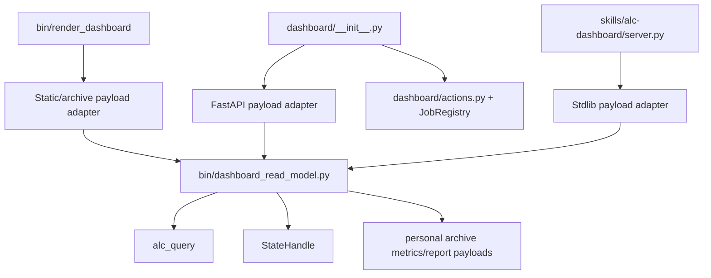
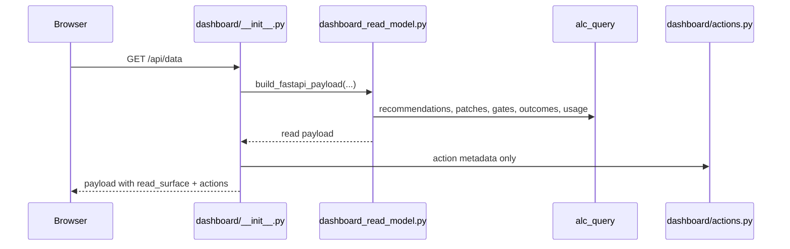
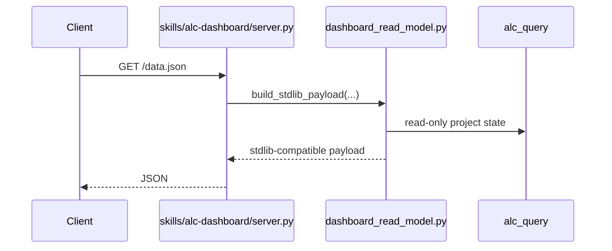

# Refactor: Complete Dashboard Read Model Module

## Context

The architecture sequence has already completed the Runtime State Boundary, Runtime Wiring, State Scope, and Refresh Run refactors. The remaining architecture-review follow-ups are now `dashboard_read_model` and `proposal_lifecycle`; this plan intentionally takes the dashboard read model next and leaves proposal lifecycle for a later plan.

The current tree already contains partial dashboard read-surface work:

- `dashboard/__init__.py` assembles a `read_surface` payload for the FastAPI dashboard.
- `skills/alc-dashboard/server.py` reads most project-scoped data through `alc_query`.
- `dashboard/web/src/lib/data.ts` and `ReadSurfacePanel.tsx` already understand a richer `read_surface` shape.
- Tests already assert `scoped_gates`, `read_surface`, read-only stdlib behavior, and no direct event-store imports in the stdlib dashboard.

The next step is consolidation, not a restart: create one shared dashboard read model module and route both dashboard surfaces through it while preserving existing payload compatibility.

## Problem

The architecture report flags a split-brain dashboard data boundary. The FastAPI/React dashboard, static renderer, and stdlib fallback all assemble dashboard data differently. This keeps legacy and stdlib dashboard surfaces alive, but it also allows their payload shapes, cold-state diagnostics, recommendation buckets, and read/propose boundary behavior to drift.

The audit also shows that the FastAPI shell still owns load-bearing mutation APIs such as promote, mute, distill job status, and latest-report serving. Those actions should remain in the FastAPI action layer until a separate proposal lifecycle refactor exists. The read model must not become a write surface.

## Goals

1. Provide one importable Dashboard Read Model module for dashboard data assembly.
2. Make the FastAPI dashboard, static renderer, and stdlib fallback consume that module.
3. Preserve existing React and stdlib payload compatibility.
4. Keep all mutable action APIs in the FastAPI dashboard action layer.
5. Route project-scoped dashboard reads through `alc_query` or `StateHandle`.
6. Surface enough diagnostics to explain cold or empty dashboard states without exposing raw event rows or transcript chunks.
7. Update the dashboard migration docs so the architecture boundary is explicit.

## Non-Goals

- Do not implement Proposal Lifecycle in this plan.
- Do not delete the FastAPI/React dashboard or the stdlib fallback dashboard.
- Do not port promote, mute, distill jobs, or other mutable action APIs into the stdlib fallback.
- Do not redesign the dashboard UI beyond the minimum needed to consume the canonical read model.
- Do not ship or package a React dist bundle unless a targeted verification command already requires it.
- Do not solve dashboard URL discovery or server marker fallback here unless it is a trivial documentation note.

## Key Technical Decisions

### KTD-1: Put the Boundary in `bin/dashboard_read_model.py`

Add `agent-learning-compounder/bin/dashboard_read_model.py` as the shared read-model module. This matches the existing importable-bin pattern used by `state_handle.py`, `state_scope.py`, and `refresh_run.py`, and it is reachable by both runtime scripts and dashboard skill code after their existing path bootstrap.

### KTD-2: Use a Canonical Model with Compatibility Adapters

The module should build one internal, JSON-safe read model, then expose adapters for:

- FastAPI/React `/api/data`
- `bin/render_dashboard` static injection
- stdlib dashboard `/data.json`

Adapters preserve current keys such as `latest`, `history`, `actions`, `scoped_gates`, `read_surface`, `recommendations`, `pending_patches`, `anomalies`, `patterns`, `correlations`, `apply_log`, `gates`, `insights`, and `suggestions`.

### KTD-3: Keep Writes Out of the Read Model

The read model must not import or call `dashboard/actions.py`, event writers, proposal writers, mutable patch APIs, or distill job mutation paths. FastAPI can compose read-model output with action metadata after the read model returns.

### KTD-4: Close the Suggestions Read Gap Through `alc_query`

The stdlib dashboard currently has an inline `suggestions.json` read. Add a small `alc_query` read helper for suggestions so dashboard code does not grow another direct artifact read path.

### KTD-5: Treat Archive Metrics as Dashboard Inputs

Archive payloads used by `render_dashboard` and the React shell can remain dashboard archive inputs, but the file scanning and history shaping should move behind the read model. Project-scoped event, gate, recommendation, patch, outcome, and skill usage reads should flow through `alc_query` or `StateHandle`.

### KTD-6: Defer Proposal Lifecycle and Server Marker Work

Proposal Lifecycle remains the next architecture item after this plan. Dashboard URL discovery, server marker files, and dist bundle packaging are useful follow-ups, but they are outside this read-model consolidation unless required by a local test.

## Design



FastAPI request flow:



Stdlib fallback request flow:



## Implementation Units

### U1: Add Missing `alc_query` Coverage for Dashboard Reads

Files:

- `agent-learning-compounder/bin/alc_query.py`
- `agent-learning-compounder/tests/test_alc_query.py`

Tasks:

- Add a suggestions read helper, for example `get_suggestions(state_or_root)`, returning a bounded JSON-safe list.
- Handle missing, empty, and malformed suggestions artifacts deterministically.
- Keep the helper read-only and side-effect free.
- Avoid widening MCP/catalog surfaces unless a current caller requires it.

Acceptance:

- Unit tests cover missing suggestions, valid suggestions, malformed suggestions, and return shape stability.
- Dashboard code no longer needs to inline-read `suggestions.json`.

### U2: Create the Shared Dashboard Read Model Module

Files:

- `agent-learning-compounder/bin/dashboard_read_model.py`
- `agent-learning-compounder/tests/test_dashboard_read_model.py`

Tasks:

- Add a canonical read model builder that accepts the state handle/root, optional personal archive root, and history limit.
- Move reusable logic from `dashboard/__init__.py`, `bin/render_dashboard`, and `skills/alc-dashboard/server.py` into the module.
- Include archive data (`latest`, `history`, archive diagnostics) when a personal archive root is supplied.
- Include project read surface data: actor summary, recommendations, pending patches, apply log, outcomes, skill usage, suggestions, scoped gates, and diagnostics.
- Add compatibility adapter functions for FastAPI/React, static render, and stdlib payloads.
- Keep the model JSON-safe and bounded.

Acceptance:

- Characterization tests lock the existing FastAPI and stdlib payload keys before routing callers through the module.
- Tests assert the read model does not import action or writer modules.
- Tests cover cold state, populated state, and partial artifact state.

### U3: Route FastAPI and Static Dashboard Payloads Through the Read Model

Files:

- `agent-learning-compounder/dashboard/__init__.py`
- `agent-learning-compounder/bin/render_dashboard`
- `agent-learning-compounder/fixtures/tests/test_dashboard.py`
- `agent-learning-compounder/tests/test_dashboard_read_model.py`

Tasks:

- Replace local FastAPI `read_surface` and `scoped_gates` assembly with the read-model FastAPI adapter.
- Keep `actions`, promote/mute endpoints, distill job endpoints, and latest-report serving in the FastAPI shell/action layer.
- Route `render_dashboard.build_dashboard_data` through the read model or convert it into a thin compatibility wrapper around the read-model archive adapter.
- Preserve existing CLI behavior and injected payload shape.

Acceptance:

- `/api/data` still includes `latest`, `history`, `actions`, `scoped_gates`, and `read_surface`.
- Static rendering still injects the expected payload for the React bundle.
- Existing action endpoint tests continue to pass without stdlib write support.

### U4: Route the Stdlib Fallback Through the Read Model

Files:

- `agent-learning-compounder/skills/alc-dashboard/server.py`
- `agent-learning-compounder/tests/test_dashboard_readonly.py`
- `agent-learning-compounder/tests/test_capability_parity.py`

Tasks:

- Replace `build_data_blob` local assembly with the stdlib compatibility adapter.
- Remove inline suggestions artifact reading from the stdlib server.
- Preserve GET-only behavior and current stdlib top-level payload keys.
- Keep stdlib fallback free of FastAPI, action-layer, event-writer, sqlite, and direct event-store imports.

Acceptance:

- `POST` and other mutation attempts remain rejected.
- Capability parity tests still prove the stdlib dashboard is read-only.
- Stdlib `/data.json` payload remains compatible with existing dashboard tabs.

### U5: Align React Payload Types with the Canonical Model

Files:

- `agent-learning-compounder/dashboard/web/src/lib/data.ts`
- `agent-learning-compounder/dashboard/web/src/components/ReadSurfacePanel.tsx`
- `agent-learning-compounder/dashboard/web/src/App.tsx`

Tasks:

- Update TypeScript types to match the canonical read-model adapter output.
- Keep the existing visual dashboard intact.
- Ensure cold-state diagnostics and empty-state reasons render from the canonical fields.
- Avoid broad UI redesign.

Acceptance:

- TypeScript build or the project’s available frontend verification command succeeds.
- The React dashboard can consume both rich and cold-state payloads without optional-field crashes.

### U6: Update Architecture and Migration Docs

Files:

- `docs/decisions/dashboard-migration.md`
- `docs/dev/architecture-backlog-2026-05.md`
- `docs/dev/dashboard-audit-2026-05-27.md`
- `ARCHITECTURE.md`
- `CONTEXT.md`
- `CLAUDE.md`
- `agent-learning-compounder/CLAUDE.md`

Tasks:

- Record the shared Dashboard Read Model as the single dashboard read boundary.
- State that FastAPI/React is the canonical rich local UI.
- State that stdlib remains the no-Node, read-only fallback.
- State that mutable dashboard actions remain in the FastAPI action layer until Proposal Lifecycle is implemented.
- Mark `dashboard_read_model` complete in the backlog after code and tests land.
- Leave `proposal_lifecycle` as the next deferred architecture item.

Acceptance:

- Docs no longer imply that deleting the FastAPI dashboard is the near-term migration path.
- Architecture docs describe the read/propose separation consistently.

## Verification Plan

Run the narrow tests first:

```bash
python3 -m unittest tests.test_alc_query tests.test_dashboard_read_model tests.test_dashboard_readonly tests.test_capability_parity
python3 -m unittest fixtures.tests.test_dashboard
```

Then run the broader Python suite:

```bash
python3 -m unittest discover -s tests
```

If frontend tooling is available in the checkout, run the project’s existing dashboard web typecheck or build command. Do not introduce a new frontend toolchain just for this plan.

Finally run hygiene checks:

```bash
python3 -m py_compile bin/dashboard_read_model.py bin/alc_query.py bin/render_dashboard
git diff --check
```

## Risks and Mitigations

- Payload compatibility may break existing UI/tests. Mitigate with characterization tests and adapter-level compatibility keys.
- The read model could accidentally absorb mutation behavior. Mitigate with import tests and keeping action composition in `dashboard/__init__.py`.
- Cold-state diagnostics may regress while data assembly moves. Mitigate with explicit cold-state fixtures.
- Existing dirty work may overlap this refactor. Mitigate by preserving current partial read-surface behavior and moving it behind the shared module instead of replacing it wholesale.
- Suggestions reads may become another special case. Mitigate by adding the missing `alc_query` helper before routing dashboards.

## Done Definition

- `bin/dashboard_read_model.py` is the shared source for dashboard read payload assembly.
- FastAPI/React, static render, and stdlib fallback all consume the shared read model.
- Stdlib fallback remains read-only and GET-only.
- FastAPI mutation APIs remain outside the read model.
- Existing dashboard payload keys remain compatible.
- Docs identify Dashboard Read Model as complete and Proposal Lifecycle as next.
- Targeted and broader verification commands pass, except for any explicitly documented unrelated pre-existing failures.
