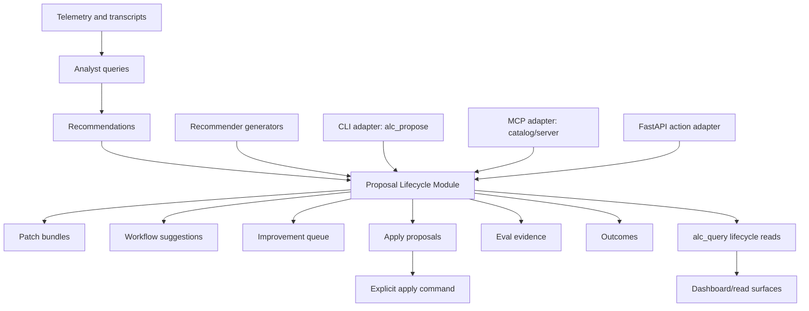

# Refactor: Complete Proposal Lifecycle Module

## Summary

Create a dedicated proposal lifecycle module that owns the shared policy and state transitions between recommendations, rendered proposal artifacts, review queues, apply proposals, eval evidence, and outcomes.

The prior architecture sequence has completed runtime topology, state scoping, refresh run, and dashboard read-model extraction. The remaining architecture-review item is the distributed proposal path: `analyst_queries`, `recommender_generators`, `recommender_render`, `alc_propose`, `alc_eval`, MCP catalog tools, and dashboard action metadata all touch related lifecycle concepts without one canonical boundary.

This plan keeps public CLI and MCP behavior stable. The first implementation should add the lifecycle module as a shared domain boundary, route existing adapters through it, then add read-side mirrors for proposal state where the current system is write-only.

---

## Problem Frame

The current system has several working proposal pieces:

- `agent-learning-compounder/bin/recommender_generators.py` turns recommendation records into patch bundles, workflow suggestions, and investigation payloads.
- `agent-learning-compounder/bin/recommender_render` writes patch JSON under repo-local `patches/` and suggestion state under `suggestions.json`.
- `agent-learning-compounder/bin/alc_propose.py` appends improvement queue rows, emits proposal and outcome events, returns non-mutating apply commands, and updates patch status.
- `agent-learning-compounder/bin/alc_eval` records eval verdict events for recommendation quality.
- `agent-learning-compounder/alc_mcp/catalog.py` exposes proposal-related MCP tools.
- Dashboard action endpoints and `dashboard/actions.py` own promoted and muted action state outside the read-only dashboard read model.

The architecture-review report identifies this as the next deepening area: the lifecycle from analyst query to recommendation, proposal, apply command, eval, and outcome is spread across scripts. That makes proposal state auditable only by knowing every artifact and event location, and it leaves some write paths without matching read mirrors.

---

## Goals

1. Establish `agent-learning-compounder/bin/proposal_lifecycle.py` as the canonical module for proposal lifecycle records, identifiers, status transitions, event payload construction, and artifact references.
2. Preserve existing CLI, MCP, and file-format contracts unless a change is explicitly additive and covered by compatibility tests.
3. Add read-side access for proposal queue and lifecycle state so write-only artifacts can be inspected through the same query surfaces as recommendations.
4. Keep the dashboard read model read-only and keep FastAPI action endpoints as action adapters, not as owners of proposal lifecycle policy.
5. Strengthen correlation between recommendations, generated patch/suggestion artifacts, queue rows, apply proposals, eval verdicts, and outcomes.

## Non-Goals

- No automatic patch application or unattended write mode.
- No dashboard URL or server-marker implementation.
- No React/package distribution bundle work.
- No extraction of the analyst query pipeline beyond the identifiers needed to connect recommendation records to proposal records.
- No product-strategy change to how recommendations are generated.

---

## Key Technical Decisions

### KTD-1: Add a Proposal Lifecycle Module, Keep Adapters Thin

Add `agent-learning-compounder/bin/proposal_lifecycle.py` as the shared lifecycle boundary. Keep `agent-learning-compounder/bin/alc_propose.py` as the CLI/MCP-facing adapter initially so existing imports, tests, and MCP backing paths remain stable.

The lifecycle module should not import MCP server code, FastAPI code, or dashboard rendering code. It may depend on stable local primitives such as `StateHandle`, atomic write helpers, event writer helpers, and JSON-safe validation utilities.

### KTD-2: Define a Canonical Lifecycle Record

Introduce an internal lifecycle envelope that can represent:

- source recommendation identity
- proposal kind, such as `gate`, `apply`, `patch_status`, `workflow_chain`, `agent_event`, or `outcome`
- artifact references, such as `patch_id`, queue entry identity, suggestion identity, event identity, and report identity
- status and status reason
- timestamps and source metadata
- scrubbed evidence references

The first version should preserve existing artifacts and add the envelope only where it reduces duplication or enables read mirrors. If a new manifest is needed, prefer an additive JSONL file such as `proposal-lifecycle.jsonl` over rewriting existing queue or patch files.

### KTD-3: Split Lifecycle Policy From Read Views

The lifecycle module may own state transitions and artifact normalization. Read views should be exposed through `alc_query` or a small read adapter rather than forcing callers to parse queue files directly.

This directly addresses the current gap where `propose_gate` appends to `improvement-queue.jsonl`, but there is no matching query or MCP read mirror for queue contents.

### KTD-4: Keep Human-in-the-Loop Apply Semantics

`propose_apply` must remain non-mutating. It can validate, correlate, and emit audit events, but it should continue returning an apply command for a human or explicit write path to run. The lifecycle module records proposals and outcomes; it does not auto-apply patches.

### KTD-5: Preserve Artifact Compatibility First

Existing consumers already understand:

- `reports/recommendations.json`
- `patches/<patch_id>.json`
- `suggestions.json`
- `improvement-queue.jsonl`
- event stream records written through the event writer
- dashboard action state under the personal actions directory

The refactor should preserve these files and evolve around them. Any new lifecycle index should be additive, reconstructable from existing state where practical, and tested against missing-file and legacy-file cases.

### KTD-6: Treat Dashboard Actions As Adjacent, Not Owned

Dashboard promoted and muted actions are load-bearing for distillation and dashboard workflows. Do not move those actions wholesale into proposal lifecycle in this refactor.

Instead, align naming, identifiers, and read summaries where useful. The dashboard read model remains read-only; FastAPI endpoints remain explicit action adapters.

---

## Target Architecture

The proposal lifecycle module is not a new UI. It is the domain boundary that makes proposal state consistent across existing CLIs, MCP tools, query surfaces, dashboard action summaries, and eval evidence.

---

## Implementation Plan

### Unit 1: Characterize Current Proposal Contracts

Lock the current behavior before moving code:

- `agent-learning-compounder/tests/test_alc_propose.py`
- `agent-learning-compounder/alc_mcp/tests/test_server.py`
- `agent-learning-compounder/alc_mcp/tests/test_recommender_tools.py`
- `agent-learning-compounder/tests/test_recommender_render.py`

Coverage to preserve:

- `propose_gate` appends queue rows and emits proposal events.
- `propose_apply` remains non-mutating and returns the explicit apply command.
- `report_outcome` keeps deterministic event identity.
- `report_agent_event` emits scrubbed dispatch events.
- `mark_patch_status` updates patch JSON atomically and emits status events.
- MCP proposal tools keep their public return shapes.
- Recommender rendering still writes patch bundles and workflow suggestions.

### Unit 2: Add `proposal_lifecycle.py`

Create `agent-learning-compounder/bin/proposal_lifecycle.py` with focused primitives:

- lifecycle record construction and JSON normalization
- proposal and artifact identity helpers
- status transition helpers for queued, proposed, deferred, rejected, evaluated, and outcome-reported states
- event payload builders that centralize lifecycle correlation fields
- read helpers for queue, patch, suggestion, and outcome references

Add `agent-learning-compounder/tests/test_proposal_lifecycle.py` for module-level behavior. Keep this test suite independent of MCP and FastAPI.

### Unit 3: Route `alc_propose.py` Through Lifecycle

Refactor `agent-learning-compounder/bin/alc_propose.py` into a thin adapter:

- parse and preserve existing inputs
- delegate lifecycle record construction and state transition decisions
- keep queue append locking and atomic patch rewrites where they belong operationally
- emit events using lifecycle-built payloads
- preserve current function names and return values

The first pass should avoid changing the MCP catalog. The catalog should continue calling the same public adapter functions until the lifecycle module has proven stable.

### Unit 4: Add Proposal Queue and Lifecycle Read Mirrors

Add read-side helpers so proposal state is inspectable without directly parsing write artifacts:

- lifecycle queue read for `improvement-queue.jsonl`
- pending patch and patch-status read view
- optional lifecycle timeline read that correlates recommendation IDs, queue rows, patch IDs, eval events, and outcome events

Preferred surfaces:

- internal read helpers in `agent-learning-compounder/bin/proposal_lifecycle.py`
- public query helpers in `agent-learning-compounder/bin/alc_query.py`
- MCP exposure only if the query catalog and capability map can describe the read contract cleanly

This unit should explicitly close the write-only queue gap identified in the read-surface audit.

### Unit 5: Correlate Recommender and Eval Artifacts

Update recommender and eval touchpoints to include lifecycle correlation without changing their core jobs:

- `agent-learning-compounder/bin/recommender_render` should attach lifecycle-compatible identifiers or source references to generated patch bundles and workflow suggestions.
- `agent-learning-compounder/bin/recommender_generators.py` should continue owning payload generation, while lifecycle owns proposal identity and status semantics.
- `agent-learning-compounder/bin/alc_eval` should attach lifecycle references to eval verdict events when the recommendation or proposal identity is known.

Compatibility requirement: existing recommendation, patch, and suggestion readers must continue working when lifecycle fields are absent.

### Unit 6: Align Dashboard Action Boundary

Review dashboard action state without absorbing it into lifecycle:

- `agent-learning-compounder/dashboard/actions.py`
- `agent-learning-compounder/dashboard/__init__.py`
- `agent-learning-compounder/bin/dashboard_read_model.py`
- dashboard-related tests and fixtures

Expected outcome:

- dashboard read model remains read-only
- FastAPI endpoints remain the mutation boundary for dashboard-specific actions
- lifecycle read summaries can include related action state when it is useful and read-only
- muted-domain and promoted-action workflows continue to feed distillation behavior

### Unit 7: Update MCP Catalogs and Documentation

Update only after the code boundary is stable:

- `agent-learning-compounder/alc_mcp/catalog.py`
- `agent-learning-compounder/alc_mcp/server.py`
- `agent-learning-compounder/reference-lib/propose-catalog`
- `agent-learning-compounder/reference-lib/capability-map`
- `docs/dev/architecture-backlog-2026-05.md`
- `docs/decisions/dashboard-migration.md`
- `ARCHITECTURE.md`
- `CONTEXT.md`
- `agent-learning-compounder/CLAUDE.md`
- `CLAUDE.md`

Documentation should mark Proposal Lifecycle as complete only after adapters, read mirrors, and compatibility tests pass. Deferred dashboard URL/server-marker/package distribution work should stay deferred, not get folded into this plan.

---

## Verification Plan

Use a narrow-to-wide verification sequence:

1. Proposal lifecycle module tests cover identity generation, status transitions, event payload shape, missing legacy artifacts, and read mirror behavior.
2. `alc_propose` tests prove public behavior is unchanged after delegation.
3. Recommender rendering tests prove patch bundles and suggestions remain compatible while gaining lifecycle correlation where expected.
4. MCP server and recommender-tool tests prove proposal tools keep current return shapes and any new read tool is cataloged consistently.
5. Dashboard read-model and dashboard action tests prove read-only boundaries and muted/promoted action workflows are preserved.
6. Broader repository test discovery passes for the `agent-learning-compounder` package.

Verification is complete when the refactor has both behavior-preservation evidence and at least one read-side assertion for proposal queue or lifecycle state.

---

## Risks And Mitigations

### Risk: Over-centralizing unrelated action behavior

Mitigation: keep lifecycle focused on proposal state, artifact correlation, eval evidence, and outcomes. Dashboard-specific promoted/muted actions remain in dashboard action modules unless a shared read summary is enough.

### Risk: Breaking MCP contracts

Mitigation: route MCP through existing `alc_propose` adapter functions first. Add lifecycle internals behind current return shapes, then update catalog docs after tests prove compatibility.

### Risk: Creating duplicate sources of truth

Mitigation: treat existing artifacts as source data. Any new lifecycle index must be additive and reconstructable where practical. Read mirrors should normalize, not fork state.

### Risk: Expanding into automatic writes

Mitigation: preserve non-mutating `propose_apply` semantics. Lifecycle may prepare proposals and audit records, but explicit apply remains outside this module.

### Risk: Leaking transcript or secret data into proposal records

Mitigation: lifecycle records carry identifiers, summaries, and scrubbed evidence references. Keep raw transcript content and secrets out of lifecycle manifests and MCP responses.

---

## Acceptance Criteria

- `agent-learning-compounder/bin/proposal_lifecycle.py` exists and is the shared implementation point for proposal identity, lifecycle records, status transitions, and proposal event payload construction.
- `agent-learning-compounder/bin/alc_propose.py` remains the stable adapter surface while delegating shared lifecycle logic.
- Existing CLI and MCP proposal behavior remains compatible with current tests.
- Proposal queue or lifecycle state has a read mirror through query-facing code, with test coverage for empty, missing, and populated states.
- Recommender-generated patches or suggestions carry lifecycle-compatible correlation where source data is available.
- Eval and outcome events can be correlated to proposal or recommendation identity when available.
- Dashboard read-model code stays read-only, and dashboard action workflows keep their current mutation boundaries.
- MCP catalogs and reference docs describe the final proposal lifecycle boundary accurately.
- Architecture backlog documentation marks Proposal Lifecycle complete and keeps unrelated deferred items separate.

---

## Source Evidence

- `.runtime/reports/architecture-review-20260527-183248.html`: identifies Proposal Lifecycle as the remaining deepening area after runtime, state scope, refresh run, and dashboard read model.
- `docs/dev/architecture-backlog-2026-05.md`: records completed architecture items and leaves `proposal_lifecycle` as the next sequenced follow-up.
- `docs/plans/2026-05-27-005-refactor-dashboard-read-model-module-plan.md`: confirms dashboard read model was the prior plan and defers unrelated dashboard URL/package items.
- `docs/dev/read-surface-audit-2026-05-27.md`: identifies write-only proposal queue and read-surface gaps.
- `docs/dev/dashboard-audit-2026-05-27.md`: confirms dashboard read-model and action boundaries.
- `agent-learning-compounder/bin/alc_propose.py`: current proposal write, event, outcome, and patch-status adapter.
- `agent-learning-compounder/bin/recommender_render`: current patch and suggestion artifact writer.
- `agent-learning-compounder/bin/recommender_generators.py`: current recommendation-to-payload generator logic.
- `agent-learning-compounder/bin/alc_eval`: current eval verdict event writer.
- `agent-learning-compounder/alc_mcp/catalog.py` and `agent-learning-compounder/alc_mcp/server.py`: current MCP proposal tool exposure.
