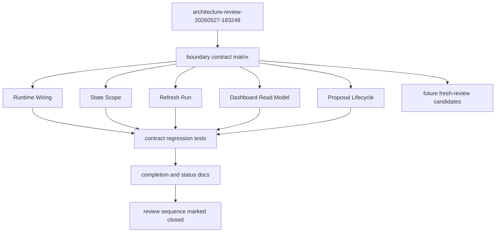

# refactor: Close out architecture review contracts

## Summary

Close out `.runtime/reports/architecture-review-20260527-183248.html` as an executed architecture sequence by verifying all five completed module boundaries against their promised ownership, adding regression tests where ownership can drift, and fixing stale completion/status documentation.

The pass should not mine the old report for another backlog. Any fresh architecture ideas found during verification become input to a future architecture review, not sixth-item carryover from this completed sequence.

---

## Problem Frame

The architecture review proposed five module-boundary deepening passes: Runtime Wiring, State Scope, Refresh Run, Dashboard Read Model, and Proposal Lifecycle. The repo now contains all five boundary modules and most durable docs already describe them as complete.

The remaining risk is contract drift rather than missing implementation. Some completion state is stale or inconsistent, especially `docs/plans/2026-05-27-005-refactor-dashboard-read-model-module-plan.md` still being `active` while downstream docs and `docs/plans/2026-05-27-006-refactor-proposal-lifecycle-module-plan.md` treat Dashboard Read Model as complete. The closeout pass should verify the code contracts first, then update docs/status based on evidence.

---

## Requirements

### Boundary Verification

- R1. Runtime Wiring must own mode-specific runtime selection, hook command/config rendering, release install targets, and drift-plan selection through `agent-learning-compounder/bin/runtime_topology.py`.
- R2. State Scope must own project, user, background, read-scope, and event write-target selection through `agent-learning-compounder/bin/state_handle.py`; project writers must not route by mutating `AGENT_LEARNING_STATE_DIR`.
- R3. Refresh Run must own warm/full refresh profiles, hook replay ingestion, indexing, locking, stage ordering, and structured result reporting through `agent-learning-compounder/bin/refresh_run.py`.
- R4. Dashboard Read Model must own read-only payload assembly for FastAPI, static rendering, and stdlib dashboard surfaces through `agent-learning-compounder/bin/dashboard_read_model.py`, while mutable dashboard actions stay outside it.
- R5. Proposal Lifecycle must own proposal identity, lifecycle record construction, event payloads, and normalized read mirrors through `agent-learning-compounder/bin/proposal_lifecycle.py`, while `agent-learning-compounder/bin/alc_propose.py` remains the CLI/MCP adapter.

### Regression Coverage

- R6. Each boundary must have at least one focused regression test that fails if the main ownership promise is bypassed or absorbed into the wrong module.
- R7. New tests should prefer contract-level assertions over broad snapshot churn: import fences, routing checks, read/write separation, and compatibility shapes.

### Documentation and Scope Control

- R8. Completion/status docs must accurately reflect the verified state of all five completed boundaries, including plan frontmatter status where stale.
- R9. The old architecture review must be documented as closed after verification, with no stale "next from this report" backlog.
- R10. New architecture ideas discovered during closeout must be recorded as candidates for a future fresh review, separate from the completed 20260527 sequence.

---

## Key Technical Decisions

- KTD1. Verify before flipping docs: Docs may already claim completion, but code and test contracts are the evidence. Status updates happen after each boundary has a narrow regression check or a documented existing check that already proves the contract.
- KTD2. Use ownership tests as drift fences: The useful tests here are not large end-to-end replays. They should catch boundary erosion, such as dashboard read-model importing action modules, proposal lifecycle leaking into MCP server code, or runtime drift checks reimplementing path selection outside `runtime_topology`.
- KTD3. Preserve public adapters: The closeout should not rename public commands or move user-facing CLI/MCP surfaces. Runtime, refresh, dashboard, and proposal modules are internal ownership boundaries behind stable adapters.
- KTD4. Treat fresh ideas as fresh review input: Follow-up ideas such as analyst pipeline consolidation, dashboard server-marker hardening, or package bundle work may be worth reviewing, but they should not remain as implied unfinished work from `architecture-review-20260527-183248`.

---

## High-Level Technical Design

The closeout flow is evidence-first: reconstruct the promised contract, verify the current owner and adapters, add the smallest missing regression fence, and only then update completion docs. Future candidates are written as a separate input stream so this review can close cleanly.

---

## Scope Boundaries

### In Scope

- Contract verification for the five module boundaries named in `.runtime/reports/architecture-review-20260527-183248.html`.
- Focused test additions or adjustments when an ownership promise can regress silently.
- Status and documentation fixes that make the five-part sequence complete and internally consistent.
- A separate future-review candidate note for architecture ideas discovered during verification.

### Deferred to Follow-Up Work

- Implementing any new architecture idea discovered during closeout.
- Running a new holistic architecture review.
- Consolidating the analyst quartet, dashboard URL/server marker behavior, packaging/distribution bundles, or other adjacent items unless a closeout regression test reveals they directly violate one of the five completed contracts.

### Out of Scope

- Reopening the five completed plans for broad refactors.
- Changing public CLI, MCP, dashboard, or install contracts beyond compatibility-preserving test and documentation fixes.
- Treating `.runtime/reports/architecture-review-20260527-183248.html` as a live backlog after closeout.

---

## Implementation Units

### U1. Verify Runtime Wiring Ownership

- **Goal:** Prove Runtime Wiring owns source/runtime mode selection, hook config rendering, release-install pathing, and drift-plan selection.
- **Requirements:** R1, R6, R7.
- **Dependencies:** None.
- **Files:** `agent-learning-compounder/bin/runtime_topology.py`, `agent-learning-compounder/bin/install_runtime_hooks`, `agent-learning-compounder/bin/check_runtime_drift`, `scripts/merge_dev_hooks.py`, `agent-learning-compounder/tests/test_runtime_topology.py`, `agent-learning-compounder/tests/test_runtime_boundary.py`, `agent-learning-compounder/tests/test_install_runtime_hooks_taxonomy.py`.
- **Approach:** Audit each runtime-related adapter for direct path/mode decisions that should be delegated to `runtime_topology`. Add or tighten contract tests where an adapter could bypass the module without failing existing tests. Keep adapter public behavior stable.
- **Patterns to follow:** Existing mode-distinct drift plan tests in `agent-learning-compounder/tests/test_runtime_topology.py`; drift checker coverage in `agent-learning-compounder/tests/test_runtime_boundary.py`; source-first language in `docs/dev/runtime-boundary.md`.
- **Test scenarios:**
  - Given a repo-local skill checkout, `dev_hook_specs` returns hook commands rooted in the repo-local source tree, and adapter callers do not reconstruct those commands independently.
  - Given drift audit mode with `include_user_runtimes=True`, the drift plan includes user-runtime candidates as read-only evidence while default drift checks remain repo-local.
  - Given release install through `install_runtime_hooks`, config target selection follows runtime/scope rules from `runtime_topology` and does not duplicate target-path logic.
- **Verification:** Runtime adapters remain thin consumers of `runtime_topology`, and targeted runtime tests fail if mode selection or hook rendering moves back into callers.

### U2. Verify State Scope Ownership

- **Goal:** Prove State Scope owns state target selection across project, user, background, read, and write surfaces.
- **Requirements:** R2, R6, R7.
- **Dependencies:** U1 only for sequencing context; no code dependency.
- **Files:** `agent-learning-compounder/bin/state_handle.py`, `agent-learning-compounder/bin/event_writer.py`, `agent-learning-compounder/bin/alc_query.py`, `agent-learning-compounder/bin/alc_propose.py`, `agent-learning-compounder/bin/auto_distill_session`, `agent-learning-compounder/bin/render_state_surface`, `agent-learning-compounder/alc_mcp/server.py`, `agent-learning-compounder/tests/test_state_handle.py`, `agent-learning-compounder/tests/test_event_writer.py`, `agent-learning-compounder/tests/test_alc_query.py`, `agent-learning-compounder/alc_mcp/tests/test_server.py`.
- **Approach:** Check writer and reader adapters for direct environment mutation or ad hoc state-root derivation. Strengthen tests around `_write_scope`, user root compatibility, project writer routing, and MCP callback paths where gaps exist.
- **Patterns to follow:** `StateHandle.event_write_target(...)` tests in `agent-learning-compounder/tests/test_state_handle.py`; `alc_query` scope tests for user/project/both reads; operating rules in `agent-learning-compounder/AGENTS.md`.
- **Test scenarios:**
  - Given a project `StateHandle`, project event writes land under the repo-scoped event log and carry project `_write_scope`.
  - Given a background write target, the target is visibly classified as background or legacy and does not masquerade as project scope.
  - Given a query caller requesting `user`, `project`, or `both`, validation and report-path resolution come from `StateHandle` rather than duplicated literals in `alc_query` or MCP handlers.
  - Given a project writer such as `alc_propose`, no test fixture requires mutating `AGENT_LEARNING_STATE_DIR` to reach the correct repo state.
- **Verification:** State selection has one vocabulary in `state_handle.py`, and targeted tests fail if callers reintroduce caller-side environment routing.

### U3. Verify Refresh Run Ownership

- **Goal:** Prove Refresh Run owns refresh orchestration, incremental hook replay, lock discipline, stage ordering, and structured results.
- **Requirements:** R3, R6, R7.
- **Dependencies:** U2, because refresh uses project-scoped state paths.
- **Files:** `agent-learning-compounder/bin/refresh_run.py`, `agent-learning-compounder/bin/refresh_learning_state`, `agent-learning-compounder/bin/alc_bootstrap_pipeline`, `agent-learning-compounder/bin/replay_hook_events`, `agent-learning-compounder/tests/test_refresh_run.py`, `agent-learning-compounder/tests/test_pr5_install_warm_loop.py`, `agent-learning-compounder/fixtures/tests/test_install_bootstrap.py`, `agent-learning-compounder/tests/test_index_events.py`.
- **Approach:** Verify public refresh and bootstrap adapters delegate to `refresh_run.run_warm(...)` or `refresh_run.run_full(...)` for production refresh paths. Add or tighten tests that preserve writer rows during warm refresh, enforce cursor-based hook replay, and prove structured result fields are stable.
- **Patterns to follow:** Existing preservation and idempotence cases in `agent-learning-compounder/tests/test_refresh_run.py`; backlog notes for addressed replay truncation in `docs/dev/architecture-backlog-2026-05.md`.
- **Test scenarios:**
  - Given an existing writer row in project `events.jsonl`, warm refresh appends newly replayed hook rows without truncating the writer row.
  - Given repeated warm refresh runs with an unchanged hook log, replay cursor behavior prevents duplicate normalized rows.
  - Given a symlinked or unsafe event log target, refresh refuses or reports the unsafe state through the existing result/error path rather than writing through it.
  - Given bootstrap or Stop-hook warming, the adapter delegates to the warm refresh path and does not call truncating replay directly.
- **Verification:** Refresh entrypoints use `refresh_run` for orchestration, and refresh tests fail if the old truncate-and-replay behavior or stage-order duplication returns.

### U4. Verify Dashboard Read Model Ownership

- **Goal:** Prove Dashboard Read Model owns read-only payload assembly for all dashboard surfaces while mutable dashboard actions stay outside it.
- **Requirements:** R4, R6, R7, R8.
- **Dependencies:** U2 and U3, because dashboard reads depend on scoped state and refreshed indexed data.
- **Files:** `agent-learning-compounder/bin/dashboard_read_model.py`, `agent-learning-compounder/dashboard/__init__.py`, `agent-learning-compounder/bin/render_dashboard`, `agent-learning-compounder/skills/alc-dashboard/server.py`, `agent-learning-compounder/dashboard/web/src/lib/data.ts`, `agent-learning-compounder/tests/test_dashboard_read_model.py`, `agent-learning-compounder/tests/test_dashboard_readonly.py`, `agent-learning-compounder/fixtures/tests/test_dashboard.py`, `docs/plans/2026-05-27-005-refactor-dashboard-read-model-module-plan.md`.
- **Approach:** Verify FastAPI `/api/data`, static render, and stdlib `/data.json` are all read-model consumers. Add tests for adapter compatibility and import fences if the existing coverage does not fail on direct dashboard parsing or action imports. After code evidence passes, mark the dashboard read-model plan completed if it is the only stale status.
- **Patterns to follow:** Existing `test_read_model_does_not_import_action_or_writer_modules`; `docs/decisions/dashboard-migration.md` decision that FastAPI remains the rich UI and stdlib remains read-only fallback.
- **Test scenarios:**
  - Given a populated project state, FastAPI payload, static payload, and stdlib payload derive shared read fields from `dashboard_read_model`.
  - Given cold or partial state, each dashboard adapter returns stable diagnostics and empty collections without optional-field crashes.
  - Given the read model source, AST/import-fence tests reject imports of `dashboard.actions`, `event_writer`, proposal writers, or mutation APIs.
  - Given stdlib dashboard HTTP methods, non-GET requests remain rejected and no write action parity is introduced.
- **Verification:** Dashboard read ownership is enforced by tests, and stale dashboard plan status is corrected only after those tests prove the boundary.

### U5. Verify Proposal Lifecycle Ownership

- **Goal:** Prove Proposal Lifecycle owns proposal identity, lifecycle event payloads, status/read normalization, and artifact correlation while `alc_propose` remains the public adapter.
- **Requirements:** R5, R6, R7, R8.
- **Dependencies:** U2 and U4, because proposal lifecycle reads are exposed through query/dashboard read surfaces.
- **Files:** `agent-learning-compounder/bin/proposal_lifecycle.py`, `agent-learning-compounder/bin/alc_propose.py`, `agent-learning-compounder/bin/alc_query.py`, `agent-learning-compounder/bin/recommender_render`, `agent-learning-compounder/bin/alc_eval`, `agent-learning-compounder/alc_mcp/catalog.py`, `agent-learning-compounder/alc_mcp/server.py`, `agent-learning-compounder/tests/test_proposal_lifecycle.py`, `agent-learning-compounder/tests/test_alc_propose.py`, `agent-learning-compounder/tests/test_alc_query.py`, `agent-learning-compounder/tests/test_recommender_render.py`, `agent-learning-compounder/tests/test_alc_eval.py`, `agent-learning-compounder/alc_mcp/tests/test_server.py`, `agent-learning-compounder/alc_mcp/tests/test_mcp_catalog.py`.
- **Approach:** Audit proposal-related adapters for duplicated identity/status logic. Strengthen lifecycle and adapter tests where current coverage proves behavior but not ownership. Preserve non-mutating apply semantics and existing CLI/MCP return shapes.
- **Patterns to follow:** Lifecycle read tests in `agent-learning-compounder/tests/test_proposal_lifecycle.py`; queue and lifecycle query tests in `agent-learning-compounder/tests/test_alc_query.py`; MCP propose/read catalog entries in `agent-learning-compounder/AGENTS.md`.
- **Test scenarios:**
  - Given `propose_gate`, queue row identity, lifecycle record identity, and proposal event payload are built through `proposal_lifecycle` while `alc_propose` preserves its public return shape.
  - Given `propose_apply`, the result remains non-mutating and returns an explicit apply command while lifecycle correlation fields are available for audit.
  - Given missing, malformed, and populated queue/patch/suggestion artifacts, lifecycle read mirrors return bounded normalized rows through `alc_query`.
  - Given MCP catalog/server proposal tools, write tools keep stable outputs and read tools expose queue/lifecycle state without parsing artifacts outside the canonical query/lifecycle path.
- **Verification:** Proposal state has one lifecycle vocabulary, CLI/MCP adapters stay compatible, and read mirrors prove the write-only queue gap remains closed.

### U6. Close Status Docs and Separate Future Review Candidates

- **Goal:** Make durable docs reflect the verified five-boundary closeout and prevent stale architecture-review backlog from carrying forward.
- **Requirements:** R8, R9, R10.
- **Dependencies:** U1, U2, U3, U4, U5.
- **Files:** `docs/plans/2026-05-27-005-refactor-dashboard-read-model-module-plan.md`, `docs/plans/2026-05-27-006-refactor-proposal-lifecycle-module-plan.md`, `docs/dev/architecture-backlog-2026-05.md`, `docs/dev/runtime-boundary.md`, `docs/dev/dashboard-audit-2026-05-27.md`, `docs/decisions/dashboard-migration.md`, `ARCHITECTURE.md`, `CONTEXT.md`, `CLAUDE.md`, `agent-learning-compounder/CLAUDE.md`, `agent-learning-compounder/AGENTS.md`, `docs/dev/architecture-review-closeout-2026-05-27.md`.
- **Approach:** Update status and summary docs after verification. Add a closeout note that maps each report recommendation to owner module, adapter surfaces, regression tests, and docs. Move any fresh ideas discovered during closeout into a clearly labeled future-review section or document that is not framed as unfinished work from `architecture-review-20260527-183248`.
- **Patterns to follow:** Existing source-first and boundary wording in `ARCHITECTURE.md` and `CONTEXT.md`; dashboard migration decision format in `docs/decisions/dashboard-migration.md`; architecture backlog addressed-item format.
- **Test scenarios:** Test expectation: none -- this unit is documentation/status closeout. Behavioral proof comes from U1-U5.
- **Verification:** The five-part review sequence reads as closed, plan statuses match verified completion, stale "next item" wording is removed or reframed, and future architecture candidates are explicitly separated from the old report.

---

## System-Wide Impact

This closeout touches the repo's architecture contract rather than one runtime feature. The affected readers are future agents, code reviewers, and maintainers deciding where new work belongs. The expected outcome is sharper locality: new runtime work goes through Runtime Wiring, new state targeting goes through State Scope, refresh orchestration goes through Refresh Run, dashboard reads go through Dashboard Read Model, and proposal state goes through Proposal Lifecycle.

---

## Risks & Dependencies

- **Risk: Documentation flips ahead of evidence.** Mitigate by sequencing each status update after the matching contract test or existing evidence check.
- **Risk: Closeout expands into a new architecture review.** Mitigate by routing fresh ideas into a future-review candidate note and leaving implementation out of this plan.
- **Risk: Ownership tests become brittle source snapshots.** Mitigate by testing contracts and forbidden dependency directions, not exact source formatting.
- **Risk: Existing test gaps hide a real incomplete boundary.** Mitigate by treating any missing ownership proof as an implementation-unit finding, not as a docs-only edit.

---

## Sources & Research

- `.runtime/reports/architecture-review-20260527-183248.html`: original five-boundary architecture review and suggested order.
- `docs/plans/2026-05-27-002-refactor-runtime-wiring-module-plan.md`: Runtime Wiring scope and deferred sequence.
- `docs/plans/2026-05-27-003-refactor-state-scope-module-plan.md`: State Scope scope and ownership vocabulary.
- `docs/plans/2026-05-27-004-refactor-refresh-run-module-plan.md`: Refresh Run scope and replay/truncation fix plan.
- `docs/plans/2026-05-27-005-refactor-dashboard-read-model-module-plan.md`: Dashboard Read Model scope; currently stale `active` status.
- `docs/plans/2026-05-27-006-refactor-proposal-lifecycle-module-plan.md`: Proposal Lifecycle scope and acceptance criteria.
- `ARCHITECTURE.md`, `CONTEXT.md`, `agent-learning-compounder/AGENTS.md`: current durable architecture and agent-entrypoint contracts.
- `docs/dev/architecture-backlog-2026-05.md`, `docs/decisions/dashboard-migration.md`, `docs/dev/dashboard-audit-2026-05-27.md`: current status and dashboard boundary decisions.
