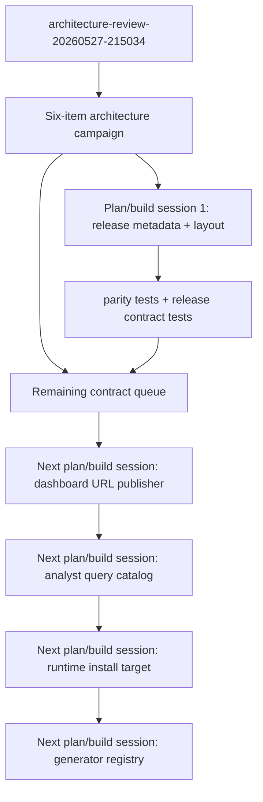

# refactor: Deepen release contract modules

## Summary

Start the six-item architecture-review campaign from `.runtime/reports/architecture-review-20260527-215034.md` with the package-visible release contract slice: Release Metadata Module plus the directly coupled Release Layout Module. This build session should leave the remaining four report recommendations explicitly queued for the next plan/build cycles.

---

## Problem Frame

The post-closeout architecture review is now the contract for the next architecture campaign. It identifies six shallow seams where implementation details still leak across adapters: release metadata, dashboard URL publication, analyst query catalog, release layout, runtime install targets, and recommender generator registry.

The highest drift is package-visible today. `MANIFEST.json` and `README.md` still describe `2026.05.27+review7-plus2.2`, while `package.json` and `agent-learning-compounder/.claude-plugin/plugin.json` use `2026.5.27-review7.plus2.3` / `2026.05.27+review7-plus2.3`, and `.claude-plugin/marketplace.json` uses `2026.5.27`. Release layout policy is similarly split across `scripts/build_release.sh`, `scripts/sanitize_skill_tree.sh`, `package.json`, `MANIFEST.json`, and a test-built archive shape in `agent-learning-compounder/fixtures/tests/test_contracts.py`.

This plan intentionally does not attempt all six modules in one build session. It establishes the campaign order, implements the first coherent slice, and records the remaining report items as the contract for subsequent plan sessions.

---

## Requirements

### Campaign Contract

- R1. The six recommendations from `.runtime/reports/architecture-review-20260527-215034.md` must all remain in the campaign scope until completed or explicitly superseded by a later architecture review.
- R2. Each plan/build cycle must pick the next coherent slice that can be completed, tested, and reviewed in one build session, then leave the remaining report items visible for the next planning session.
- R3. Current-session implementation scope must be limited to Release Metadata Module and directly coupled Release Layout Module work.

### Release Metadata

- R4. Release identity must have one canonical source for package-visible fields consumed by manifest, npm/package metadata, Claude plugin metadata, marketplace metadata, and README-visible release strings.
- R5. Release metadata adapters must stay shallow: existing JSON, markdown, plugin, and marketplace files may keep their surface formats, but they must consume or validate against the same canonical release metadata.
- R6. A parity test must fail when package-visible release identity drifts across release surfaces.

### Release Layout

- R7. Release layout policy must have one canonical source for shipped top-level files, shipped directories, required docs, exclusion rules, and archive-contract expectations.
- R8. `scripts/build_release.sh`, `scripts/sanitize_skill_tree.sh`, `package.json`, `MANIFEST.json`, and release contract tests must consume or validate the same layout policy rather than independently encoding archive shape.
- R9. Release archive contract tests must exercise the actual release layout policy, not a separately invented zip shape that can stay green while the release builder drifts.

### Compatibility and Trust Boundaries

- R10. The public install, npm, plugin, and curl/source release surfaces must remain compatible; this plan must not rename public commands or change runtime install semantics.
- R11. Source-first development rules remain in force: runtime installs under user homes are evidence only, and implementation must update the source tree.

---

## Key Technical Decisions

- KTD1. Start with release metadata and layout as one build slice: The report names Release Metadata as the top recommendation and Release Layout as the immediate adjacent candidate. They share the same package-visible drift risk and validation surface, so splitting them would leave release identity protected by tests while archive inclusion policy remained able to drift.
- KTD2. Use Python modules for canonical policy, keep shell and JSON as adapters: The repo already uses Python modules as deep ownership seams for state, runtime topology, dashboard read models, and proposal lifecycle. Release metadata and layout should follow that pattern, while shell scripts and JSON files remain compatibility surfaces.
- KTD3. Validate generated or mirrored surfaces rather than forcing every file to be generated immediately: Some release surfaces are human-readable docs or npm/plugin metadata. The first build session may introduce a canonical module plus parity validators before fully automating every writer, as long as drift is caught by tests.
- KTD4. Preserve report order for later planning, with dependency-aware batching: The remaining report items should be planned in this order unless implementation evidence changes it: Dashboard URL Publisher, Analyst Query Catalog, Runtime Install Target, Recommender Generator Registry. Each subsequent plan session should re-read the report and current code before choosing its build slice.
- KTD5. Tests prove the contract at adapter boundaries: The useful checks are parity and ownership tests that fail when an adapter re-encodes policy, not broad snapshots of entire generated files.

---

## High-Level Technical Design

### Campaign Flow

The campaign flow is deliberately sequential. Each build session completes a coherent architecture slice, records evidence, then the next plan session picks up the remaining report contract from the current repo state rather than assuming today's code shape is still current.

### Release Contract Ownership

```mermaid
flowchart TB
  Metadata[Release Metadata Module] --> Manifest[MANIFEST.json adapter/parity]
  Metadata --> Package[package.json adapter/parity]
  Metadata --> Plugin[Claude plugin metadata parity]
  Metadata --> Marketplace[Marketplace metadata parity]
  Metadata --> Readme[README release string parity]

  Layout[Release Layout Module] --> Builder[scripts/build_release.sh adapter]
  Layout --> Sanitizer[scripts/sanitize_skill_tree.sh adapter]
  Layout --> NpmFiles[package.json files parity]
  Layout --> ManifestDocs[MANIFEST required_docs parity]
  Layout --> ContractTests[release archive contract tests]

  Metadata --> ContractTests
  Layout --> ContractTests
```

Release Metadata owns identity values and field normalization. Release Layout owns inclusion and exclusion policy. Existing shell, JSON, markdown, npm, and plugin files remain public/package surfaces, but they should no longer be the places where release policy is independently invented.

---

## Scope Boundaries

### In Scope For This Build Session

- Release metadata canonicalization and parity checks across manifest, npm/package metadata, Claude plugin metadata, marketplace metadata, and README-visible release strings.
- Release layout policy canonicalization for top-level release files/directories, sanitizer exclusions, npm `files`, manifest docs/exclusions, and archive contract tests.
- Documentation updates that make the release metadata/layout ownership contract visible to future agents.
- A durable campaign queue that preserves the four remaining report recommendations.

### Deferred to Follow-Up Plan Sessions

- Dashboard URL Publisher Module: own live server marker state and static fallback policy across FastAPI, stdlib serving, static rendering, and MCP exposure.
- Analyst Query Catalog Module: make query id, shape, callable, consumer, and generated reference output one catalog contract.
- Runtime Install Target Module: move release install target selection behind runtime topology depth while keeping `install.sh` as execution adapter.
- Recommender Generator Registry Seam: make the generator registry the execution seam for identity, validation, reference output, and rendering.

### Out of Scope

- Changing public install command names, npm package identity, plugin discovery shape, or runtime hook semantics.
- Patching user-runtime copies under home directories.
- Closing the full six-item report in this build session.
- Re-running a holistic architecture review before the report contract is executed.

---

## Phased Delivery

### Current Plan/Build Session

1. Release Metadata Module.
2. Release Layout Module.
3. Documentation and campaign queue update.

### Subsequent Plan/Build Sessions

1. Dashboard URL Publisher Module, because it is operator-visible through MCP/user URL behavior and has existing `server.json` versus static fallback drift.
2. Analyst Query Catalog Module, because executable Q11/Q12 already drift from public catalog surfaces.
3. Runtime Install Target Module, because it extends the completed runtime topology depth into shell-owned release install target policy.
4. Recommender Generator Registry Seam, because it is worth exploring but less urgent than package-visible and operator-visible drift.

Each later session should create its own focused plan from the remaining queue, current repo state, and the original report contract.

---

## Implementation Units

### U1. Add Release Metadata Contract Module

- **Goal:** Introduce one source of truth for package-visible release identity and expose it in a way tests and release adapters can consume.
- **Requirements:** R4, R5, R6, R10, R11.
- **Dependencies:** None.
- **Files:** `agent-learning-compounder/bin/release_metadata.py`, `agent-learning-compounder/tests/test_release_metadata.py`, `MANIFEST.json`, `package.json`, `README.md`, `agent-learning-compounder/.claude-plugin/plugin.json`, `.claude-plugin/marketplace.json`.
- **Approach:** Define a canonical release metadata module with normalized fields for project name, package version, manifest version, plugin version, marketplace version, description, homepage/repository, author, and keyword/tag sets. Keep file formats intact, but make tests compare their visible metadata against the canonical contract.
- **Execution note:** Start with a failing parity test that captures the current version drift before changing metadata values.
- **Patterns to follow:** Deep module pattern from `agent-learning-compounder/bin/runtime_topology.py`; catalog/parity test style from `agent-learning-compounder/tests/test_capability_parity.py` and `agent-learning-compounder/tests/test_mcp_catalog_doc.py`.
- **Test scenarios:**
  - Given the current release metadata surfaces, the parity test detects version drift between manifest, README, npm/package, plugin, and marketplace metadata.
  - Given canonical metadata, each surface maps its local field format to the canonical identity without requiring identical raw version punctuation where ecosystem formats intentionally differ.
  - Given description, homepage/repository, author, and keyword/tag fields, tests prove package and plugin surfaces do not silently diverge.
  - Given a future version bump in only one metadata file, the parity test fails and names the mismatched surface.
- **Verification:** Release metadata tests fail on current drift, pass after metadata is aligned, and give a future implementer one module to update for release identity.

### U2. Align Release Metadata Surfaces

- **Goal:** Bring the package-visible metadata surfaces back into parity using the release metadata contract.
- **Requirements:** R4, R5, R6, R10.
- **Dependencies:** U1.
- **Files:** `MANIFEST.json`, `package.json`, `README.md`, `agent-learning-compounder/.claude-plugin/plugin.json`, `.claude-plugin/marketplace.json`, `agent-learning-compounder/bin/release_metadata.py`, `agent-learning-compounder/tests/test_release_metadata.py`.
- **Approach:** Update the current release identity values to one intentional version family and ensure each adapter's representation is derived from or validated against the canonical metadata. Preserve ecosystem-specific version spelling only when the canonical module explicitly defines the mapping.
- **Patterns to follow:** `MANIFEST.json` as the existing release manifest; package metadata structure in `package.json`; plugin metadata structure in `agent-learning-compounder/.claude-plugin/plugin.json`; marketplace shell structure in `.claude-plugin/marketplace.json`.
- **Test scenarios:**
  - Given canonical release version `2026.05.27+review7-plus2.3`, manifest and plugin metadata expose the expected plus-style version.
  - Given npm-compatible package metadata, `package.json` exposes the expected npm-safe version representation for the same canonical release.
  - Given marketplace metadata, the marketplace version field follows the canonical marketplace mapping rather than an unrelated date-only value.
  - Given README release references, visible release strings agree with the canonical release version family.
- **Verification:** Metadata parity tests pass and manual inspection of release surfaces shows one intentional release identity instead of mixed `plus2.2`, `plus2.3`, and date-only values.

### U3. Add Release Layout Contract Module

- **Goal:** Move release inclusion/exclusion policy into one testable module that shell, npm metadata, manifest checks, and archive tests can consult.
- **Requirements:** R7, R8, R9, R10, R11.
- **Dependencies:** U1.
- **Files:** `agent-learning-compounder/bin/release_layout.py`, `agent-learning-compounder/tests/test_release_layout.py`, `scripts/build_release.sh`, `scripts/sanitize_skill_tree.sh`, `package.json`, `MANIFEST.json`, `agent-learning-compounder/fixtures/tests/test_contracts.py`.
- **Approach:** Define canonical sets for release top-level files, top-level directories, dev-artifact directory exclusions, file exclusions, required docs, and npm package `files` parity. Keep the shell sanitizer as the executable adapter, but add tests that compare its declared policy against the canonical module.
- **Execution note:** Add characterization coverage for the existing archive contract before changing the builder/sanitizer wiring.
- **Patterns to follow:** Existing `test_package_zip_contract_excludes_cached_artifacts` and `test_install_excludes_cached_artifacts_from_source_tree`; `scripts/build_release.sh` top-files/top-dirs policy; `scripts/sanitize_skill_tree.sh` exclusion policy.
- **Test scenarios:**
  - Given canonical release layout, `scripts/build_release.sh` top-level release contents match the module's shipped files and directories.
  - Given canonical sanitizer exclusions, `scripts/sanitize_skill_tree.sh` removes the same dev artifact directories and file patterns the release layout module declares.
  - Given `package.json` `files`, npm inclusion policy matches the canonical release layout for public release artifacts.
  - Given `MANIFEST.json` `required_docs` and `excluded_from_package`, manifest policy is consistent with canonical layout policy.
  - Given a temporary source tree with cache artifacts, the release layout contract predicts the installed/archive contents and excludes cached artifacts.
- **Verification:** Release layout tests fail if shell, npm metadata, manifest policy, or archive tests reintroduce independent layout rules.

### U4. Route Release Builder and Archive Tests Through Layout Policy

- **Goal:** Make the release builder and release contract tests exercise the same layout policy instead of parallel archive shapes.
- **Requirements:** R7, R8, R9, R10.
- **Dependencies:** U3.
- **Files:** `scripts/build_release.sh`, `scripts/sanitize_skill_tree.sh`, `agent-learning-compounder/bin/release_layout.py`, `agent-learning-compounder/fixtures/tests/test_contracts.py`, `agent-learning-compounder/tests/test_release_layout.py`.
- **Approach:** Keep `scripts/build_release.sh` as the release adapter, but make its layout choices mechanically checkable against `release_layout.py`. Update archive contract tests so they either invoke the builder in a temporary workspace or use the canonical layout module to construct expected entries, eliminating the current hand-built zip shape as a separate source of truth.
- **Patterns to follow:** Existing reproducibility discipline in `scripts/build_release.sh`; install-time sanitizer reuse through `scripts/sanitize_skill_tree.sh`; broad fixture test placement in `agent-learning-compounder/fixtures/tests/test_contracts.py`.
- **Test scenarios:**
  - Given the release builder, a test can identify all shipped top-level files/directories and compare them to canonical layout policy.
  - Given a built release archive or builder-equivalent temporary staging area, entries have one top-level directory and omit cache/runtime artifacts.
  - Given docs/dev exists in the source tree, builder policy continues excluding it from release archives while preserving user-facing docs.
  - Given sanitizer policy changes, install-time and build-time exclusion tests fail unless the canonical layout is updated with the same decision.
- **Verification:** The actual builder adapter and the test contract share the same layout vocabulary, and green tests no longer prove only a test-invented archive.

### U5. Update Release Architecture Documentation and Campaign Queue

- **Goal:** Document the new release contract modules and preserve the remaining report recommendations for future plan/build sessions.
- **Requirements:** R1, R2, R3, R10, R11.
- **Dependencies:** U1, U2, U3, U4.
- **Files:** `STRATEGY.md`, `CLAUDE.md`, `agent-learning-compounder/CLAUDE.md`, `agent-learning-compounder/AGENTS.md`, `docs/dev/architecture-review-closeout-2026-05-27.md`, `docs/dev/architecture-review-campaign-2026-05-28.md`.
- **Approach:** Add a durable campaign note that maps all six report recommendations to status: current session complete for release metadata/layout after tests pass, remaining four queued in report order. Update architecture guidance only where future agents need to know that release metadata/layout are owned by new modules.
- **Patterns to follow:** Closeout-note style in `docs/dev/architecture-review-closeout-2026-05-27.md`; source-first guidance in `CLAUDE.md`; compact durable strategy wording in `STRATEGY.md`.
- **Test scenarios:** Test expectation: none -- documentation/status closeout only; behavioral evidence comes from U1-U4.
- **Verification:** Future agents can determine the next report item without rereading the whole conversation, and no doc claims the full six-item report is complete after only the release slice.

---

## System-Wide Impact

This plan affects release trust rather than runtime feature behavior. Maintainers, future agents, and package consumers benefit because version identity, shipped file policy, required docs, and exclusion rules become explicit contracts instead of scattered release-adapter implementation details. The public install paths remain stable; the change is about ownership and drift detection.

---

## Risks & Dependencies

- **Risk: Canonical metadata over-normalizes ecosystem-specific version formats.** Mitigate by making the metadata module define intentional per-surface mappings instead of forcing every file to use identical punctuation.
- **Risk: Shell adapters become awkward Python callers.** Mitigate by allowing tests to validate shell literals against the Python policy in the first build session; direct shell consumption can be added only if it stays simpler than validation.
- **Risk: Release layout scope expands into full release automation.** Mitigate by limiting this plan to policy ownership, parity checks, and builder/test contract alignment.
- **Risk: Remaining report items get forgotten after the first slice.** Mitigate by writing the campaign queue into a durable docs note and referencing the report path in the plan.
- **Dependency: Current metadata drift should be captured before alignment.** U1 should start with a failing test or explicit characterization assertion so the fix proves the report's concrete drift.

---

## Sources & Research

- `.runtime/reports/architecture-review-20260527-215034.md`: source contract for all six recommendations and current top recommendation.
- `STRATEGY.md`: install-path parity and release trust are active tracks; release metadata/layout work aligns with this strategy.
- `CLAUDE.md` and `agent-learning-compounder/AGENTS.md`: source-first development, inner-directory tests, and public package/install contracts.
- `scripts/build_release.sh`: current release archive top-files/top-dirs policy and reproducibility adapter.
- `scripts/sanitize_skill_tree.sh`: shared install/build exclusion adapter.
- `MANIFEST.json`, `package.json`, `README.md`, `agent-learning-compounder/.claude-plugin/plugin.json`, `.claude-plugin/marketplace.json`: current release metadata drift surfaces.
- `agent-learning-compounder/fixtures/tests/test_contracts.py`: existing release/install contract tests and current test-built zip shape.
- `agent-learning-compounder/bin/state_handle.py`, `agent-learning-compounder/bin/analyst_queries.py`, `agent-learning-compounder/bin/recommender_generators.py`, `agent-learning-compounder/bin/runtime_topology.py`: local evidence for the remaining report items and existing deep-module patterns.
