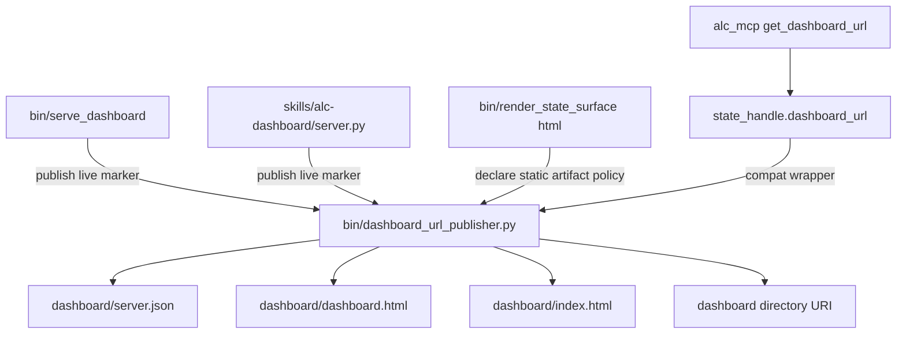
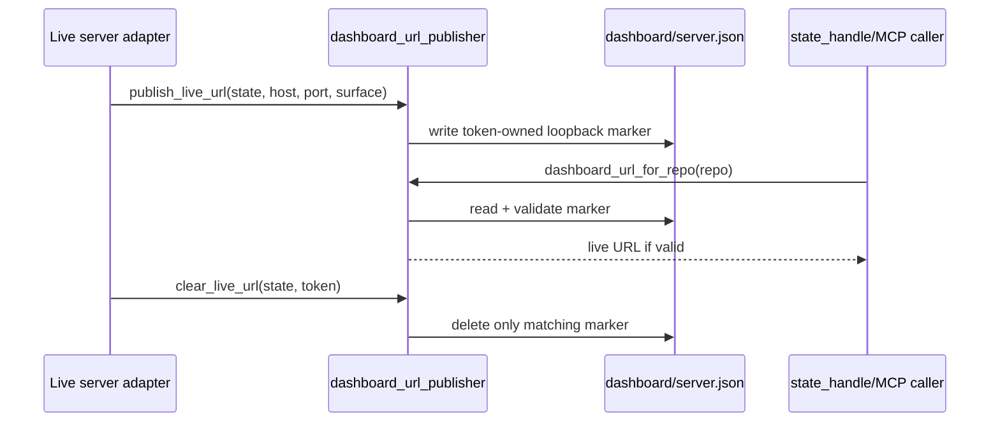

# refactor: Add dashboard URL publisher module

## Summary

Continue the architecture-review campaign with the next queued slice: a Dashboard URL Publisher module that owns live dashboard marker state and static fallback policy for FastAPI serving, stdlib serving, static rendering, and MCP exposure.

---

## Problem Frame

The post-closeout architecture review identifies dashboard URL publication as the next shallow seam after the release metadata/layout work. The drift is concrete: `state_handle.dashboard_url(repo)` already understands a `server.json` live marker, but neither live server writes that marker. Static rendering writes `dashboard.html` and `data.json`, while the fallback URL logic looks for `index.html` and otherwise returns the dashboard directory URI.

This creates an operator-visible split. A user or MCP caller can ask for the dashboard URL and receive a directory/file fallback even when a live server is running, or receive a less useful static fallback even though `dashboard.html` exists. The existing dashboard read model and the FastAPI/stdlib dashboard coexistence decision are already settled; this plan only centralizes URL publication policy.

---

## Requirements

### URL Publication Contract

- R1. Dashboard URL policy must have one canonical module that owns live marker schema, live marker validation, live marker cleanup, and static fallback ordering.
- R2. `get_dashboard_url` through MCP and direct callers must receive the same URL answer for a repo.
- R3. Live URLs must only be accepted when they resolve to loopback dashboard hosts already allowed by the dashboard safety posture.
- R4. Static fallback must prefer generated dashboard HTML artifacts that actually exist, including `dashboard.html`, before falling back to legacy `index.html` or the dashboard directory.

### Adapter Behavior

- R5. FastAPI dashboard launch through `bin/serve_dashboard` must publish a project-scoped live marker when a project repo can be resolved, and must remove only its own marker on shutdown.
- R6. Stdlib dashboard launch through `skills/alc-dashboard/server.py` must publish the same marker shape after the final bound port is known, including auto-selected ports.
- R7. Static dashboard rendering through `bin/render_state_surface --format html` must keep producing `dashboard.html` and `data.json`, while using the shared publisher policy for static fallback decisions.
- R8. `state_handle.dashboard_url(repo)` must become a compatibility wrapper over the publisher module rather than owning URL policy itself.

### Compatibility and Boundaries

- R9. The plan must not change dashboard UI payloads, FastAPI action endpoints, stdlib GET-only behavior, MCP tool names, or public command names.
- R10. The Dashboard URL Publisher must not absorb dashboard read-model assembly, proposal lifecycle state, event writes, or mutable dashboard actions.
- R11. Tests must fail when marker schema, fallback order, MCP exposure, or adapter publication behavior drifts.

---

## Key Technical Decisions

- KTD1. Add `bin/dashboard_url_publisher.py` as the deep ownership seam: The repo already uses `bin/*` modules for importable runtime policy seams such as `state_handle.py`, `runtime_topology.py`, `dashboard_read_model.py`, `release_metadata.py`, and `release_layout.py`. URL publication should follow that pattern and leave live servers as adapters.
- KTD2. Keep the live marker project-scoped: The marker belongs under the repo dashboard state directory so `get_dashboard_url(repo)` can answer without global server discovery. FastAPI only writes a marker when it can resolve a repo; stdlib serving already resolves project state from `--repo`, `--state`, or cwd.
- KTD3. Use marker ownership to prevent stale cleanup: Live adapters should write a marker with a small ownership token, process id, host, port, URL, and surface name, then clear it in `finally` only if the on-disk marker still matches their token. This prevents one dashboard process from deleting another process's newer marker.
- KTD4. Validate, do not trust, live markers: The reader should accept existing compatibility markers that only contain a URL, but all accepted URLs must pass loopback URL validation. Richer markers can also validate process identity when that is available without making old markers unreadable.
- KTD5. Preserve static render output while fixing discovery: `render_state_surface --format html` can keep returning the dashboard directory for CLI/back-compat purposes. URL discovery should improve through `dashboard_url(repo)` by making the static fallback prefer `dashboard.html` when no live marker is valid.

---

## High-Level Technical Design

### URL Ownership

The publisher owns URL policy. Adapters provide facts: selected host/port for live servers and generated artifact paths for static rendering. Existing public callers keep their entry points.

### Live Marker Lifecycle

The lifecycle makes live URL publication explicit without requiring server launchers to reimplement marker JSON, validation, or cleanup rules.

---

## Scope Boundaries

### In Scope For This Build Session

- A new Dashboard URL Publisher module with marker schema, marker validation, marker cleanup, and static fallback ordering.
- FastAPI and stdlib live server adapters that publish and clear live markers around the server lifecycle.
- Static rendering and MCP URL discovery alignment so `dashboard.html` is discoverable when no live marker is valid.
- Tests that cover the module contract and adapter/MCP parity.
- Campaign status documentation that marks the Dashboard URL Publisher slice complete after implementation evidence exists.

### Deferred to Follow-Up Plan Sessions

- Analyst Query Catalog Module: make query id, shape, callable, consumer, and generated reference output one catalog contract.
- Runtime Install Target Module: move release install target selection behind runtime topology depth while keeping `install.sh` as execution adapter.
- Recommender Generator Registry Seam: make the generator registry the execution seam for identity, validation, reference output, and rendering.
- Dashboard UI consolidation or team-grade dashboard expansion, which remains deferred by `STRATEGY.md` and `docs/decisions/dashboard-migration.md`.

### Out of Scope

- Deleting either the FastAPI/React dashboard or the stdlib fallback.
- Changing dashboard payload shapes, React components, action endpoints, promote/mute/distill behavior, or stdlib read-only semantics.
- Renaming MCP tools, CLI commands, hook entry points, or public install behavior.
- Adding authentication, public binding behavior, or non-loopback URL acceptance.

---

## Implementation Units

### U1. Add Dashboard URL Publisher Module

- **Goal:** Introduce one canonical module for dashboard live marker and static fallback policy.
- **Requirements:** R1, R2, R3, R4, R8, R10, R11.
- **Dependencies:** None.
- **Files:** `agent-learning-compounder/bin/dashboard_url_publisher.py`, `agent-learning-compounder/tests/test_dashboard_url_publisher.py`.
- **Approach:** Define a small module that accepts `StateHandle` instances or repo paths, resolves the dashboard directory, reads/writes `server.json`, validates loopback live URLs, produces static fallback URLs, and exposes a single `dashboard_url(repo)` style function. Keep the marker schema minimal and JSON-safe: URL, host, port, surface name, process id, ownership token, and timestamp are enough for diagnostics and safe cleanup.
- **Execution note:** Start with characterization tests for the current drift: valid `server.json` is preferred, `dashboard.html` is ignored today, and directory URI fallback happens when no `index.html` exists.
- **Patterns to follow:** Importable-bin module pattern from `agent-learning-compounder/bin/dashboard_read_model.py`; StateHandle resolution from `agent-learning-compounder/bin/state_handle.py`; parity-style assertions from `agent-learning-compounder/tests/test_mcp_registry.py`.
- **Test scenarios:**
  - Given a dashboard directory with a valid loopback `server.json`, `dashboard_url(repo)` returns the live URL.
  - Given a marker with a non-loopback URL, malformed URL, missing URL, or invalid JSON, the publisher ignores the marker and falls back safely.
  - Given generated `dashboard.html` and `data.json` but no live marker, the publisher returns the `dashboard.html` file URI.
  - Given legacy `index.html` but no `dashboard.html`, the publisher returns the legacy `index.html` file URI.
  - Given no static HTML artifact, the publisher returns the dashboard directory URI.
  - Given two marker writes with different ownership tokens, clearing the first token does not delete the newer marker.
- **Verification:** The new module owns all marker parsing and fallback ordering, and its tests fail if URL policy is reintroduced in callers.

### U2. Route StateHandle and MCP URL Exposure Through the Publisher

- **Goal:** Make direct callers and MCP callers consume the same publisher contract.
- **Requirements:** R2, R3, R4, R8, R11.
- **Dependencies:** U1.
- **Files:** `agent-learning-compounder/bin/state_handle.py`, `agent-learning-compounder/tests/test_state_handle.py`, `agent-learning-compounder/alc_mcp/tests/test_recommender_tools.py`, `agent-learning-compounder/tests/test_mcp_registry.py`, `agent-learning-compounder/alc_mcp/catalog.py`.
- **Approach:** Replace the inline `state_handle.dashboard_url(repo)` marker/fallback logic with a thin wrapper around `dashboard_url_publisher.dashboard_url(repo)`. Keep `alc_mcp.catalog.MCP_TOOLS["get_dashboard_url"]` backed by `state_handle.dashboard_url` unless implementation evidence shows direct publisher backing is cleaner; the public MCP tool contract stays unchanged either way.
- **Patterns to follow:** Current MCP registry auto-handler shape in `agent-learning-compounder/alc_mcp/server.py`; existing `get_dashboard_url` tests in `agent-learning-compounder/alc_mcp/tests/test_recommender_tools.py`.
- **Test scenarios:**
  - Given a valid live marker, MCP `get_dashboard_url` returns the same URL as the publisher.
  - Given `dashboard.html` and no live marker, MCP `get_dashboard_url` returns the generated dashboard file URI rather than the directory URI.
  - Given unsafe or malformed marker content, MCP falls back to static URL policy and does not expose the unsafe value.
  - Given a mocked `state_handle.dashboard_url`, the registry dispatch behavior remains compatible with existing catalog tests.
- **Verification:** There is one URL decision path for direct and MCP callers, and no MCP tool name or schema changes are required.

### U3. Publish Live Markers From the Stdlib Dashboard Server

- **Goal:** Make the no-Node stdlib dashboard publish the canonical live URL after binding its final port.
- **Requirements:** R1, R3, R6, R9, R10, R11.
- **Dependencies:** U1.
- **Files:** `agent-learning-compounder/skills/alc-dashboard/server.py`, `agent-learning-compounder/tests/test_dashboard_readonly.py`, `agent-learning-compounder/tests/test_alc_dashboard_bootstrap.py`, `agent-learning-compounder/tests/test_dashboard_url_publisher.py`.
- **Approach:** Keep the existing `create_server()` return shape for compatibility, but make the resolved `StateHandle` and selected port available to the serving lifecycle without duplicating resolution policy. `run_server()` and `main()` should publish the live marker after `create_server()` returns and clear that marker in `finally` using the ownership token returned by the publisher. Preserve GET-only routes, direct invocation bootstrap, and auto-port fallback from `8765` to `0`.
- **Patterns to follow:** Existing `create_server()` and `run_server()` lifecycle in `agent-learning-compounder/skills/alc-dashboard/server.py`; standalone invocation coverage in `agent-learning-compounder/tests/test_alc_dashboard_bootstrap.py`; read-only behavior coverage in `agent-learning-compounder/tests/test_dashboard_readonly.py`.
- **Test scenarios:**
  - Given stdlib serving enters `run_server()` or `main()` with `port=0`, a marker is written with the selected port and a `http://127.0.0.1:<port>/` URL.
  - Given the server shuts down through the normal `finally` path, its matching marker is removed.
  - Given another process has replaced the marker before shutdown, cleanup leaves the newer marker intact.
  - Given POST, PUT, DELETE, or PATCH requests, stdlib routes still return 405 and no write/action behavior is introduced.
  - Given direct `python3 skills/alc-dashboard/server.py --help` with no `PYTHONPATH`, the entry point still runs without `ModuleNotFoundError`.
- **Verification:** Running the stdlib server makes `get_dashboard_url(repo)` resolve to the live server while it is active, and existing read-only dashboard tests still pass.

### U4. Publish Live Markers From the FastAPI Dashboard Launcher

- **Goal:** Make the rich FastAPI dashboard publish the canonical live URL when launched for a repo.
- **Requirements:** R1, R3, R5, R9, R10, R11.
- **Dependencies:** U1.
- **Files:** `agent-learning-compounder/bin/serve_dashboard`, `agent-learning-compounder/tests/test_serve_dashboard.py`, `agent-learning-compounder/tests/test_dashboard_url_publisher.py`.
- **Approach:** Resolve project state when `--repo` is provided, publish a live marker before `uvicorn.run()`, and clear the matching marker after the server exits. If no repo can be resolved, continue serving the personal/archive dashboard without writing a project marker. Keep host validation unchanged so non-loopback hosts still require `--insecure-public`; the publisher should reject non-loopback markers even if an adapter tries to write them.
- **Patterns to follow:** Existing `validate_host()` safety check in `agent-learning-compounder/bin/serve_dashboard`; FastAPI repo-state resolution in `agent-learning-compounder/dashboard/__init__.py`; loopback-only acceptance in current `state_handle.dashboard_url`.
- **Test scenarios:**
  - Given `--repo` and loopback host/port, the launcher publishes a marker whose URL matches the configured host and port.
  - Given no `--repo`, the launcher does not write a project marker and existing personal dashboard behavior remains available.
  - Given a non-loopback host without `--insecure-public`, validation still fails before marker publication.
  - Given a non-loopback host with `--insecure-public`, serving remains explicitly allowed but URL publication still refuses to expose the non-loopback URL through MCP.
  - Given marker replacement by another owner, FastAPI shutdown cleanup does not delete the newer marker.
- **Verification:** FastAPI dashboard launch and URL publication share the existing safety posture without changing dashboard API routes or action behavior.

### U5. Align Static Rendering, Docs, and Campaign Status

- **Goal:** Make static dashboard artifacts discoverable through the publisher and record campaign progress after the slice is complete.
- **Requirements:** R4, R7, R9, R10, R11.
- **Dependencies:** U1, U2, U3, U4.
- **Files:** `agent-learning-compounder/bin/render_state_surface`, `agent-learning-compounder/tests/test_render_state_surface.py`, `agent-learning-compounder/tests/test_hooks.py`, `docs/dev/architecture-review-campaign-2026-05-28.md`, `ARCHITECTURE.md`, `CONTEXT.md`, `STRATEGY.md`, `agent-learning-compounder/AGENTS.md`.
- **Approach:** Keep `render_state_surface --format html` writing `dashboard.html` and `data.json` and keep its existing directory stdout unless implementation uncovers a documented caller that expects a URL. Use the publisher constants/functions for generated artifact naming and fallback discovery so `dashboard_url(repo)` now points at `dashboard.html` when no live marker is valid. Update architecture guidance only where future agents need to know URL publication has its own module.
- **Patterns to follow:** Static render tests in `agent-learning-compounder/tests/test_render_state_surface.py`; hook wrapper coverage in `agent-learning-compounder/tests/test_hooks.py`; campaign queue style in `docs/dev/architecture-review-campaign-2026-05-28.md`.
- **Test scenarios:**
  - Given `render_state_surface --format html`, static output still includes `data.json` and `dashboard.html`.
  - Given static output was generated and no live marker exists, `dashboard_url(repo)` returns the generated `dashboard.html` file URI.
  - Given hook-based refresh delegates to `render_state_surface --format html`, hook tests still prove dashboard artifacts are written.
  - Given the campaign document is updated after implementation, Dashboard URL Publisher is marked complete and Analyst Query Catalog remains the next queued slice.
- **Verification:** Static dashboard generation remains backward-compatible while MCP/user URL discovery now lands on the useful generated dashboard artifact.

---

## System-Wide Impact

This change affects operator-facing discovery rather than dashboard data semantics. The main beneficiaries are MCP callers, agents invoking `get_dashboard_url`, and humans using local dashboard launchers. The safety boundary remains local-first: loopback dashboard URLs are publishable; non-loopback URLs are not exposed through the automatic repo URL contract.

The change also tightens the architecture campaign discipline. Dashboard read assembly remains owned by `dashboard_read_model.py`; URL publication becomes a separate, smaller module; later campaign slices can focus on query catalogs, install targets, and generator registry behavior without carrying dashboard URL drift forward.

---

## Risks & Dependencies

- **Risk: stale live markers survive abnormal process exit.** Mitigate by validating marker shape and keeping static fallback deterministic. If implementation finds a cheap same-process liveness check that works on this repo's supported platforms, add it without making old markers unreadable.
- **Risk: FastAPI serving without `--repo` cannot publish a project URL.** Mitigate by treating project-scoped marker publication as conditional and preserving personal/archive dashboard behavior for no-repo runs.
- **Risk: cleanup deletes another server's marker.** Mitigate with ownership tokens and clear-only-if-matching semantics.
- **Risk: stdout behavior changes break hooks or scripts.** Mitigate by preserving `render_state_surface --format html` directory stdout and improving URL discovery through `dashboard_url(repo)`.
- **Dependency: loopback host validation stays load-bearing.** The publisher should reuse the same host vocabulary accepted by the launchers (`127.0.0.1`, `localhost`, `::1`) and should not normalize or publish broader network addresses.

---

## Sources & Research

- `.runtime/reports/architecture-review-20260527-215034.md`: source recommendation for Dashboard URL Publisher and the concrete `server.json` versus `dashboard.html` drift.
- `docs/dev/architecture-review-campaign-2026-05-28.md`: campaign queue establishing Dashboard URL Publisher as the next slice after release metadata/layout.
- `docs/plans/2026-05-27-005-refactor-dashboard-read-model-module-plan.md`: prior dashboard plan that explicitly deferred URL discovery out of read-model scope.
- `docs/decisions/dashboard-migration.md`: FastAPI/React remains the canonical rich UI; stdlib dashboard remains the no-Node read-only fallback.
- `STRATEGY.md`: team-grade dashboard consolidation is deferred, so this plan should not delete either dashboard surface.
- `agent-learning-compounder/AGENTS.md`: `alc_query` remains the canonical read API, while dashboard URL publication belongs outside read-model assembly.
- `agent-learning-compounder/bin/state_handle.py`: current inline `dashboard_url(repo)` marker/fallback implementation.
- `agent-learning-compounder/bin/render_state_surface`: static dashboard rendering currently writes `dashboard.html` and `data.json`.
- `agent-learning-compounder/bin/serve_dashboard`: FastAPI dashboard launcher and existing loopback host validation.
- `agent-learning-compounder/skills/alc-dashboard/server.py`: stdlib dashboard server lifecycle and auto-port selection.
- `agent-learning-compounder/alc_mcp/catalog.py` and `agent-learning-compounder/alc_mcp/server.py`: MCP `get_dashboard_url` exposure and auto-handler dispatch.
- `agent-learning-compounder/tests/test_render_state_surface.py`, `agent-learning-compounder/tests/test_dashboard_readonly.py`, `agent-learning-compounder/alc_mcp/tests/test_recommender_tools.py`, `agent-learning-compounder/tests/test_mcp_registry.py`: current test surfaces to extend for URL publication parity.
