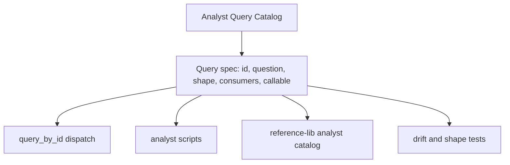
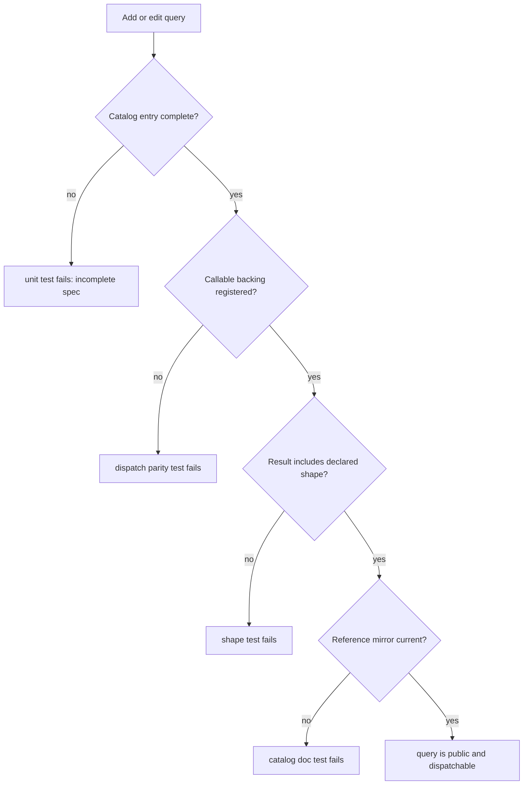

# refactor: Add analyst query catalog module

## Summary

Continue the architecture-review campaign with the Analyst Query Catalog module: query IDs, metadata shape, callable dispatch, consumer references, and generated catalog output become one contract. The plan includes tightly coupled catalog/parity cleanup needed to prevent Q11/Q12-style drift, but leaves runtime install targets and recommender registry work for later campaign slices.

---

## Problem Frame

The campaign queue in `docs/dev/architecture-review-campaign-2026-05-28.md` identifies the Analyst Query Catalog Module as the next slice after the completed release and dashboard URL modules. The source architecture review calls out concrete drift: `agent-learning-compounder/bin/analyst_queries.py` defines metadata and dispatch for Q11 and Q12, but the public `QUERIES` interface and `agent-learning-compounder/reference-lib/analyst-queries-catalog` stop at Q10.

That drift undermines ALC's named-catalog rule. `ARCHITECTURE.md` still describes analyst queries as Q1-Q10, `render_catalogs.py` has a generated-catalog path that currently points at a skill reference mirror that does not exist in this checkout, and the current analyst query shape test only iterates `QUERIES`. A future Q13 can therefore be callable through `query_by_id()` while remaining invisible to public catalog surfaces and parity tests.

---

## Requirements

### Analyst Query Contract

- R1. Analyst query ID, question/name, SQL skeleton, output shape, consumer list, callable backing, and public catalog inclusion must be represented by one canonical contract.
- R2. `query_by_id()` must dispatch only query IDs present in the canonical catalog, and every catalogued query must have a callable backing.
- R3. Q11 and Q12 must become public catalog entries with tested output shapes and consumer references.
- R4. Adding a future query must require one local catalog change, not parallel edits to metadata, dispatch, public `QUERIES`, and reference docs.

### Catalog and Parity Guards

- R5. Drift tests must fail if a query is dispatchable but missing from the public catalog, listed in the public catalog but not dispatchable, or documented with a shape that does not match result rows.
- R6. Generated and checked-in human-readable catalog output must cover all analyst query IDs, including Q11 and Q12.
- R7. Architecture and skill-facing references must describe analyst queries as Q1-Qn or as catalog-driven, not as a fixed Q1-Q10 surface.
- R8. Tightly coupled parity cleanup may cover analyst-query catalog rendering paths and capability parity expectations, but must not broaden into MCP UQ/UP catalog redesign or generator registry work.

### Compatibility and Boundaries

- R9. Existing analyst scripts must keep their current payload keys and fallback behavior unless the implementation proves a behavior is only accidental drift.
- R10. Existing query functions may remain separate implementation functions behind the catalog; the catalog owns identity and registration, not SQL body generation.
- R11. The plan must not change event schema, indexing behavior, recommender scoring semantics, public MCP tool names, runtime install targets, or recommender generator registry semantics.

---

## Key Technical Decisions

- KTD1. Make `analyst_queries.py` the canonical analyst query module: The live query functions, Q metadata, `QUERY_FUNCS`, and `QUERIES` already live together there. The first refactor should deepen that module into a real catalog instead of adding a second registry that would itself drift.
- KTD2. Use typed catalog entries or a small validated spec shape: A query spec should bind stable ID, summary/question text, output shape, consumers, SQL skeleton, and callable backing in one object-like contract. This gives tests one surface to compare instead of reconciling separate dicts and dispatch maps.
- KTD3. Keep analyst scripts as consumers, not catalog owners: `analyst_correlations`, `analyst_patterns`, `analyst_anomalies`, and `analyst_score` may continue calling named helpers where that keeps code clear. The contract test should still prove those helpers are catalogued and that catalog consumer metadata names the scripts that depend on each query.
- KTD4. Treat catalog rendering as part of this slice: The broadened scope is justified because public reference output is one of the drift points. Tests should cover the checked-in `reference-lib/analyst-queries-catalog` mirror, and implementation may realign `render_catalogs.py` output paths if the current skill-reference target is stale.
- KTD5. Preserve the campaign queue: This slice should update campaign evidence after implementation, but runtime install target selection and recommender generator registry work remain separate queued modules.

---

## High-Level Technical Design

### Catalog Ownership

The catalog is the source of truth. Dispatch and reference output consume the same entries; tests fail when either side invents a query surface outside the catalog.

### Drift Guard Flow

This flow is the expected future path for Q13: one catalog registration plus implementation, with tests catching missing backing, shape drift, or stale reference output.

---

## Scope Boundaries

### In Scope For This Build Session

- A canonical analyst query catalog contract inside `agent-learning-compounder/bin/analyst_queries.py`.
- Q11 and Q12 inclusion in `QUERIES` or its replacement public catalog surface.
- Dispatch/catalog parity checks covering `query_by_id()`, `QUERY_FUNCS` or its replacement, and public query entries.
- Shape tests for every public analyst query, including Q11 and Q12.
- Human-readable catalog reference output for all analyst queries.
- Documentation and campaign status updates that make the analyst query catalog ownership visible.

### Deferred to Follow-Up Work

- Runtime Install Target Module: move release install target selection behind runtime topology depth while keeping `install.sh` as execution adapter.
- Recommender Generator Registry Seam: make the generator registry the execution seam for identity, validation, reference output, and rendering.
- Broader MCP/query/propose catalog redesign beyond analyst-query parity. Existing UQ/UP and MCP catalog tests should only change if directly affected by analyst-query capability parity.
- Statistical redesign of analyst query SQL, scoring, or recommendation generation. This plan is about catalog ownership and drift prevention.

### Out of Scope

- Changing event schema, `events.sqlite` indexing, hook event collection, or schema-version migration behavior.
- Renaming analyst scripts or public command entry points.
- Changing MCP tool IDs, MCP handler registration, or `list_capabilities` output.
- Reworking recommender generator identity, generator validation, or `recommender_render` dispatch.
- Moving analyst queries into `alc_query.py`; analyst SQL remains its own read surface unless a later architecture decision explicitly retires it.

---

## Implementation Units

### U1. Define the Canonical Analyst Query Catalog Contract

- **Goal:** Replace parallel query metadata and dispatch maps with one canonical spec surface for analyst queries.
- **Requirements:** R1, R2, R4, R9, R10.
- **Dependencies:** None.
- **Files:** `agent-learning-compounder/bin/analyst_queries.py`, `agent-learning-compounder/tests/test_analyst_queries.py`.
- **Approach:** Introduce a small catalog entry shape that carries query ID, question/name, SQL skeleton, output shape, consumers, and callable backing. Build public catalog entries from that shape and make dispatch resolve through the same catalog rather than a separate `QUERY_FUNCS` map. If compatibility requires keeping `QUERIES` and `QUERY_FUNCS` names, keep them as derived compatibility surfaces.
- **Execution note:** Start with characterization assertions proving the current drift: Q11/Q12 are accepted by `query_by_id()` while absent from `QUERIES`.
- **Patterns to follow:** Named catalog discipline in `ARCHITECTURE.md`; MCP spec/catalog pattern in `agent-learning-compounder/alc_mcp/catalog.py`; existing query shape test in `agent-learning-compounder/tests/test_analyst_queries.py`.
- **Test scenarios:**
  - Given the analyst query module imports, all public query IDs are unique and sequential from Q1 through the highest defined Q-ID.
  - Given each public catalog entry, required fields exist: ID, question/name, SQL skeleton, shape, consumers, and callable backing.
  - Given each catalog entry, `query_by_id(conn, id)` resolves through the catalog and invokes the registered callable.
  - Given a callable registered outside the catalog, a parity test fails and names the orphan backing.
  - Given a catalog entry without a callable backing, a parity test fails before any consumer can dispatch it.
- **Verification:** There is no longer a path for Q13 to be dispatchable while absent from the public analyst query catalog.

### U2. Promote Q11 and Q12 Into the Public Analyst Catalog

- **Goal:** Bring the current dispatchable Q11/Q12 queries into the public catalog contract and test their result shapes.
- **Requirements:** R2, R3, R5, R9, R10.
- **Dependencies:** U1.
- **Files:** `agent-learning-compounder/bin/analyst_queries.py`, `agent-learning-compounder/tests/test_analyst_queries.py`.
- **Approach:** Register Q11 (`query_dag_parent_child_cost`) and Q12 (`query_cache_hit_ratio`) in the canonical catalog with declared shapes and consumers. Extend fixture data or existing assertions only as needed so both queries return rows under the existing shape test. Preserve helper function names that current analyst scripts import directly.
- **Patterns to follow:** Existing Q1-Q10 metadata dictionaries in `agent-learning-compounder/bin/analyst_queries.py`; fixture event rows in `agent-learning-compounder/tests/test_analyst_queries.py`; direct consumer imports in `agent-learning-compounder/bin/analyst_correlations` and `agent-learning-compounder/bin/analyst_score`.
- **Test scenarios:**
  - Given the fixture database, Q11 returns parent/child cost rows with `parent_actor`, `child_actor`, `child_model`, `event_count`, `avg_child_duration_ms`, `total_child_cost_usd`, and `event_ids`.
  - Given the fixture database, Q12 returns cache rows with `session_id`, `actor_model`, `sample_count`, `cache_hit_ratio`, and `total_duration_ms`.
  - Given `query_by_id(conn, "q11")` or `query_by_id(conn, "q12")`, dispatch is case-insensitive and returns the same rows as the direct helper.
  - Given the public query catalog, Q11 and Q12 appear exactly once and carry `analyst_correlations` as a consumer.
  - Given current analyst scripts, direct imports of `query_dag_parent_child_cost` and `query_cache_hit_ratio` continue to work.
- **Verification:** Q11 and Q12 are public, dispatchable, shape-tested, and consumer-documented without changing analyst output payload keys.

### U3. Add Analyst Catalog Drift Guards

- **Goal:** Add tests that fail on query metadata, dispatch, consumer, and reference drift.
- **Requirements:** R1, R2, R4, R5, R6, R8.
- **Dependencies:** U1, U2.
- **Files:** `agent-learning-compounder/tests/test_analyst_queries.py`, `agent-learning-compounder/tests/test_capability_parity.py`, `agent-learning-compounder/reference-lib/capability-parity`.
- **Approach:** Extend analyst-query tests beyond row shapes. Assert catalog IDs are complete, every dispatchable query is catalogued, every catalogued query is dispatchable, and every declared consumer is a known analyst script. Update capability parity only if its current `analyst_queries.QUERIES` partner check becomes too shallow after the catalog contract changes.
- **Patterns to follow:** Drift guard style in `agent-learning-compounder/tests/test_catalog_mcp_parity.py`; MCP/reference parity style in `agent-learning-compounder/tests/test_mcp_catalog_doc.py`; existing M10 capability partner entry in `agent-learning-compounder/tests/test_capability_parity.py`.
- **Test scenarios:**
  - Given the catalog and dispatch registry, their ID sets are identical.
  - Given a query ID gap or duplicate, the catalog test fails and reports the duplicate or missing ID.
  - Given a declared consumer that is not one of the analyst scripts, the consumer metadata test fails.
  - Given capability parity for M10, the test proves the analyst query catalog is non-empty and includes the dispatchable public query set.
  - Given a future query added only to dispatch, the drift guard fails before catalog docs can remain stale.
- **Verification:** Query catalog completeness is enforced independently from the happy-path row-shape test.

### U4. Align Human-Readable Analyst Catalog Output

- **Goal:** Make checked-in analyst query reference output reflect the canonical catalog and fail when stale.
- **Requirements:** R4, R5, R6, R7, R8.
- **Dependencies:** U1, U2, U3.
- **Files:** `agent-learning-compounder/bin/render_catalogs.py`, `agent-learning-compounder/tests/test_render_catalogs.py`, `agent-learning-compounder/reference-lib/analyst-queries-catalog`, `agent-learning-compounder/skills/alc-core/SKILL.md`.
- **Approach:** Decide whether `reference-lib/analyst-queries-catalog` remains the checked-in human-readable mirror or whether `render_catalogs.py` should generate the skill-reference mirror and the release layout should ship it. The first implementation should prefer the least disruptive path: keep `reference-lib/analyst-queries-catalog` as the active mirror if existing docs and architecture point there, and make rendering/tests compare it against the canonical query catalog. If `render_catalogs.py` still points to an absent skill reference file, realign it as part of this unit rather than leaving a dead generation path.
- **Patterns to follow:** Existing hand-readable analyst catalog table in `agent-learning-compounder/reference-lib/analyst-queries-catalog`; deterministic renderer test in `agent-learning-compounder/tests/test_render_catalogs.py`; generated-catalog intent in `agent-learning-compounder/bin/render_catalogs.py`.
- **Test scenarios:**
  - Given the canonical analyst catalog, the checked-in analyst reference file includes one row for each Q-ID through Q12.
  - Given Q11/Q12 are added to the canonical catalog, the reference file includes their question, consumer, SQL skeleton, and output shape fields.
  - Given a stale reference file missing a Q-ID, a doc parity test fails and names the missing row.
  - Given `render_catalogs.render_all()` for the analyst catalog, output is deterministic and uses the same field vocabulary as the checked-in mirror.
  - Given the skill-facing ALC docs refer to analyst query references, they point to an existing shipped file or clearly identify the active `reference-lib` mirror.
- **Verification:** Public analyst query reference output cannot stop at Q10 while code exposes Q12.

### U5. Update Architecture Campaign Documentation

- **Goal:** Record the completed analyst-query ownership contract and keep the campaign queue accurate for later slices.
- **Requirements:** R7, R8, R11.
- **Dependencies:** U1, U2, U3, U4.
- **Files:** `ARCHITECTURE.md`, `STRATEGY.md`, `CONTEXT.md`, `agent-learning-compounder/AGENTS.md`, `docs/dev/architecture-review-campaign-2026-05-28.md`.
- **Approach:** Update durable docs only after implementation evidence exists. `ARCHITECTURE.md` should describe analyst queries as catalog-driven Q1-Qn with the canonical module/reference path. `STRATEGY.md` and `AGENTS.md` should note analyst query catalog ownership only where future agents need it. The campaign document should mark Analyst Query Catalog Module complete and leave Runtime Install Target Module as the next queued slice.
- **Patterns to follow:** Campaign queue style in `docs/dev/architecture-review-campaign-2026-05-28.md`; completed-slice language from release metadata/layout and dashboard URL publisher entries; named catalog section in `ARCHITECTURE.md`.
- **Test scenarios:**
  - Given docs mention analyst query ID range, they no longer hard-code Q1-Q10 when the catalog contains Q12.
  - Given the campaign queue after implementation, Analyst Query Catalog Module is marked complete with evidence paths and Runtime Install Target Module is the next queued item.
  - Given `agent-learning-compounder/AGENTS.md`, future agents can identify the analyst query catalog owner without reading the entire architecture review.
  - Test expectation: none for prose-only docs beyond existing documentation/link checks, because behavior is covered by U1-U4.
- **Verification:** Durable docs and campaign status match the implemented catalog contract, and later planning starts at runtime install target selection unless a later review supersedes the campaign.

---

## System-Wide Impact

This is a developer and agent-facing architecture cleanup, not a user-visible behavior change. It affects analyst scripts, recommendation scoring inputs, catalog references, and future agent understanding of the analyst suite. The most important impact is preventing hidden analytical capability: a query that can influence scoring or reports must also be visible in the named catalog and reference output.

The work also tightens the ALC catalog discipline. MCP tools, query/propose APIs, release contracts, dashboard URLs, and analyst queries should all follow the same pattern: stable ID, canonical ownership, shallow adapters, and drift tests at the public mirrors.

---

## Risks & Dependencies

- **Risk: over-coupling query SQL implementation to catalog metadata.** Mitigate by making the catalog own registration and shape, while leaving SQL bodies as ordinary helper functions.
- **Risk: generated reference paths are stale or split between `reference-lib` and skill references.** Mitigate by choosing one active checked-in mirror for this slice and adding tests so generation paths cannot silently write to an unshipped location.
- **Risk: analyst scripts currently import helpers directly.** Mitigate by preserving helper names and treating scripts as consumers of catalogued functions rather than forcing a broad call-site rewrite.
- **Risk: capability parity around M10 is too shallow.** Mitigate with a narrow update that checks the analyst query catalog contract without changing MCP tool IDs or sandbox behavior.
- **Dependency: fixture data must exercise Q11/Q12.** Existing fixture rows already include parent/child and cache-token data; implementation should extend fixtures only if the catalog tests expose an uncovered shape.

---

## Sources & Research

- `docs/dev/architecture-review-campaign-2026-05-28.md`: active campaign queue naming Analyst Query Catalog Module as order 4 and the next plan/build slice.
- `.runtime/reports/architecture-review-20260527-215034.md`: source architecture review identifying Q11/Q12 drift between metadata, dispatch, `QUERIES`, and reference catalog output.
- `STRATEGY.md`: active track for named catalog consistency and catalog-driven ALC surfaces.
- `ARCHITECTURE.md`: current named-catalog guidance, including the stale Q1-Q10 analyst query range.
- `agent-learning-compounder/AGENTS.md`: local read/write seam instructions and existing deep-module ownership conventions.
- `agent-learning-compounder/bin/analyst_queries.py`: live analyst query implementations, metadata dictionaries, `QUERY_FUNCS`, `query_by_id()`, and Q1-Q10 `QUERIES` public interface.
- `agent-learning-compounder/bin/analyst_correlations`, `agent-learning-compounder/bin/analyst_score`, `agent-learning-compounder/bin/analyst_patterns`, `agent-learning-compounder/bin/analyst_anomalies`: current analyst query consumers.
- `agent-learning-compounder/reference-lib/analyst-queries-catalog`: checked-in human-readable analyst catalog currently ending at Q10.
- `agent-learning-compounder/bin/render_catalogs.py` and `agent-learning-compounder/tests/test_render_catalogs.py`: generated catalog machinery and current deterministic rendering coverage.
- `agent-learning-compounder/tests/test_analyst_queries.py`: fixture database and current shape test that only iterates public `QUERIES`.
- `agent-learning-compounder/tests/test_capability_parity.py` and `agent-learning-compounder/reference-lib/capability-parity`: M10 parity reference to `analyst_queries.QUERIES`.
