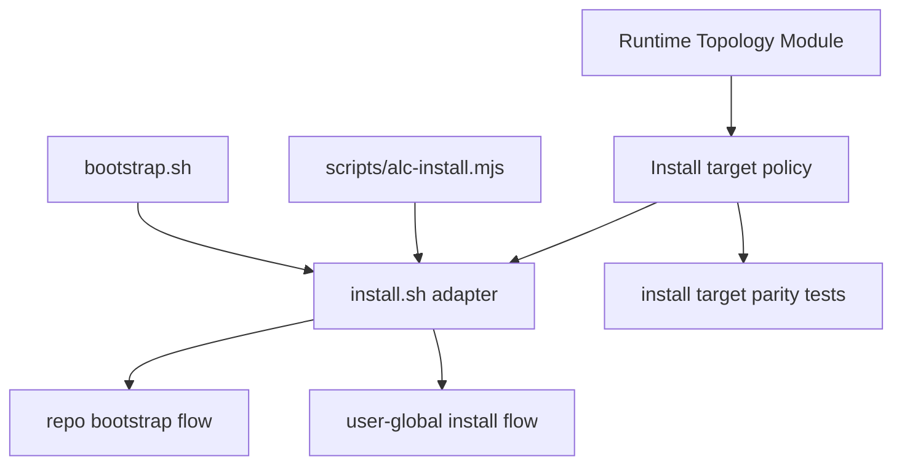
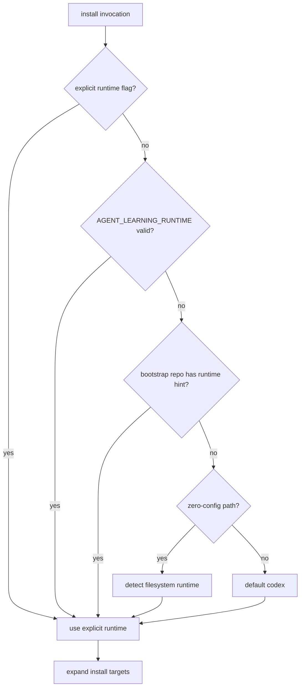

# refactor: Add runtime install target module

## Summary

Continue the architecture-review campaign with the Runtime Install Target module: runtime install target selection, zero-config runtime detection, bootstrap target roots, and user-global target roots move behind the existing runtime topology depth. `install.sh` remains the shell execution adapter that parses flags, copies artifacts, runs verification, builds dashboard assets, and invokes bootstrap hooks.

---

## Problem Frame

`docs/dev/architecture-review-campaign-2026-05-28.md` marks the first four campaign slices complete and names Runtime Install Target Module as the next queued slice. The source architecture review says runtime wiring is now closed for topology and hook/runtime facts, but release install target selection still lives in shell implementation.

The current split leaves policy in two places. `agent-learning-compounder/bin/runtime_topology.py` owns repo/runtime candidates, hook config targets, dev hook specs, and drift target selection. `install.sh` still owns default user install roots, `--codex-home` and `--plugin` root selection, zero-arg runtime detection, repo-local `--bootstrap-repo` runtime roots, `--runtime all` staging loops, and `AGENT_LEARNING_RUNTIME` / repo instruction precedence. That makes install-path parity harder to guard because runtime policy can drift in shell while topology tests stay green.

The plan preserves the operator-facing installer contract. The desired change is locality: target policy becomes importable and testable in the runtime topology module; the shell installer stays the adapter that executes the selected plan.

---

## Requirements

### Runtime Install Target Policy

- R1. Runtime install target selection must be represented by one canonical topology-backed policy, covering user-global skills roots, Claude plugin roots, Codex home skills roots, repo bootstrap roots, runtime mode expansion, and target-root override behavior.
- R2. `install.sh` must remain the execution adapter: it may parse flags and execute copy, backup, sanitization, verification, dashboard build, `alc_init`, runtime hook install, and first-run indexing, but it should not independently own target-root policy.
- R3. Zero-config runtime detection must keep its current behavior: filesystem evidence chooses Claude or Codex, both runtimes prompt with Codex default, neither defaults to Codex, and auto-detect enables verification only when no runtime/target/bootstrap flag or `AGENT_LEARNING_RUNTIME` is supplied.
- R4. Runtime resolution precedence must remain stable: explicit `--runtime` wins, then `AGENT_LEARNING_RUNTIME`, then repo instruction hints for bootstrap, then Codex default.
- R5. `--runtime all` must remain accepted for `--bootstrap-repo` and must remain rejected for user-global installs unless an explicit `--target` is provided.

### Installer Safety and Parity

- R6. Existing safety gates must stay in the adapter: symlink target refusal, existing-install timestamped backups, tracked-file avoidance through downstream hook/bootstrap tools, plugin/bootstrap incompatibility, missing plugin manifest failure, and Python availability checks.
- R7. Install-path parity must remain intact for direct shell, npm wrapper, curl bootstrap, Claude plugin mode, and repo bootstrap usage because `scripts/alc-install.mjs` and `bootstrap.sh` forward into `install.sh`.
- R8. Tests must prove topology and shell behavior agree for target roots and runtime expansion without requiring writes to the real user home.
- R9. Documentation and campaign status must make Runtime Install Target ownership visible after implementation, and must leave the Recommender Generator Registry Seam as the next queued slice.

### Scope Control

- R10. This slice must not redesign runtime hook manifests, dev hook rendering, drift check behavior, release archive layout, dashboard bundle build behavior, first-run indexing, or recommender generator registry semantics.

---

## Key Technical Decisions

- KTD1. Extend `runtime_topology.py` instead of creating a new installer-only module. Runtime path vocabulary already lives there, and the architecture review explicitly asks for install target selection behind runtime topology depth. A second policy module would create another place for drift.
- KTD2. Model install targets as plans, not as shell snippets. The topology layer should return structured values such as selected runtime, target root, destination root, plugin mode constraints, and bootstrap target roots. The shell adapter turns those values into filesystem operations.
- KTD3. Keep shell-specific safety in `install.sh`. Refusing symlinks, moving backups, running `cp -a`, sanitizing, compiling, verifying, and building the dashboard are execution concerns. Moving them into Python would broaden the slice and weaken the "install.sh as adapter" boundary.
- KTD4. Preserve compatibility wrappers and names where practical. Existing shell function names can survive as thin command-substitution calls while implementation migrates; `scripts/alc-install.mjs` and `bootstrap.sh` should not need flag changes.
- KTD5. Add characterization coverage before migration. The installer currently has little direct coverage for target selection. The first implementation step should lock down current behavior in temp-home fixtures before routing decisions through topology.

---

## High-Level Technical Design

### Target Ownership

Runtime topology owns the answer to "where should this runtime install land?" The shell installer owns "perform that install safely."

### Runtime Resolution Flow

The implementation can preserve the current shell prompt for the "both runtimes present" zero-config case, but target expansion and default roots should come from one topology-backed policy.

---

## Scope Boundaries

### In Scope For This Build Session

- A topology-backed runtime install target policy for user-global install, Codex home install, Claude plugin install, explicit target-root install, and repo bootstrap install.
- Characterization tests for current `install.sh` target selection and runtime resolution using temp repos and temp homes.
- Shell adapter changes that call the topology-backed policy instead of reconstructing target roots inline.
- Narrow docs and campaign updates after implementation evidence exists.

### Deferred to Follow-Up Work

- Recommender Generator Registry Seam: make the generator registry the execution seam for identity, validation, reference output, and rendering.
- Rewriting `install.sh` wholesale in Python. The campaign item is target policy ownership, not replacing the installer.
- Broader install UX changes, new installer flags, or altered prompts beyond preserving current behavior.
- Stronger end-to-end release smoke automation across npm/curl/plugin paths, unless existing tests already expose a target-policy regression.

### Out of Scope

- Runtime hook manifest taxonomy and `install_runtime_hooks` merge behavior.
- Dev hook command rendering, drift checker comparison/reporting, and user-runtime audit semantics.
- Release archive inclusion/exclusion policy owned by `bin/release_layout.py`.
- Dashboard bundle build strategy and fallback HTML behavior.
- First-run indexing semantics in `alc_bootstrap_pipeline`.
- MCP catalog, analyst query catalog, and recommender generator registry changes.

---

## Implementation Units

### U1. Characterize Current Installer Target Selection

- **Goal:** Lock down current `install.sh` runtime and target-root behavior before moving policy behind topology.
- **Requirements:** R3, R4, R5, R6, R7, R8.
- **Dependencies:** None.
- **Files:** `agent-learning-compounder/tests/test_install_targets.py`, `install.sh`.
- **Approach:** Add a focused installer-target test file that runs `install.sh` in temp homes and temp repos with minimal assertions around destinations and error cases. Keep the tests narrow: they should inspect installed destination paths, return codes, and key stderr/stdout markers, not duplicate the full post-install verification suite. Use fixture homes to cover `AGENTS_HOME`, `CODEX_HOME`, `CLAUDE_HOME`, `AGENT_LEARNING_RUNTIME`, repo runtime hints, explicit `--target`, `--plugin`, `--codex-home`, and `--bootstrap-repo --runtime all`.
- **Execution note:** Characterization-first. These tests should pass against current shell behavior before any topology migration.
- **Patterns to follow:** Subprocess temp-repo style in `agent-learning-compounder/tests/test_runtime_boundary.py`; temp-home environment isolation in `agent-learning-compounder/tests/test_install_runtime_hooks_taxonomy.py`; installed-root smoke expectations in `CONTEXT.md`.
- **Test scenarios:**
  - Given `--codex` with a temp `AGENTS_HOME`, install lands under `<agents-home>/skills/agent-learning-compounder`.
  - Given `--codex-home` with a temp `CODEX_HOME`, install lands under `<codex-home>/skills/agent-learning-compounder`.
  - Given `--claude` with a temp `CLAUDE_HOME`, install lands under `<claude-home>/skills/agent-learning-compounder`.
  - Given `--plugin` with a temp `CLAUDE_HOME`, install lands under `<claude-home>/plugins/agent-learning-compounder` and refuses combination with `--bootstrap-repo`.
  - Given `--target <dir>`, install uses the explicit root regardless of runtime default.
  - Given `--runtime all` without `--bootstrap-repo` or explicit target root, install exits with the current invalid-combination error.
  - Given `--bootstrap-repo <repo> --runtime all`, installs are staged under both repo-local runtime roots.
  - Given `AGENT_LEARNING_RUNTIME=claude` and no explicit runtime flag, runtime resolution selects Claude without zero-config filesystem detection.
- **Verification:** A focused installer-target suite proves the behavior that topology migration must preserve.

### U2. Add Runtime Install Target Policy to Topology

- **Goal:** Make `runtime_topology.py` the source of truth for install target root selection and runtime target expansion.
- **Requirements:** R1, R3, R4, R5, R8.
- **Dependencies:** U1.
- **Files:** `agent-learning-compounder/bin/runtime_topology.py`, `agent-learning-compounder/tests/test_runtime_topology.py`, `agent-learning-compounder/tests/test_install_targets.py`.
- **Approach:** Add structured install-target helpers to topology. The policy should cover normalized runtime values, runtime expansion for `all`, default user-global target roots, repo bootstrap target roots, plugin target roots, Codex-home target roots, explicit target-root overrides, and invalid combinations. Keep filesystem writes out of this module. If repo instruction hint parsing remains shell-owned at first, expose enough topology API to move it later in U3 without changing semantics.
- **Patterns to follow:** Existing immutable `RuntimeTopology` and `DriftPlan` dataclasses; `config_for_runtime()` compatibility wrapper style; `_normalize_runtime()` validation behavior.
- **Test scenarios:**
  - Given runtime `codex`, user-global install policy resolves to `${AGENTS_SKILLS_DIR:-${AGENTS_HOME:-$HOME/.agents}/skills}` semantics.
  - Given runtime `claude`, user-global install policy resolves to `${CLAUDE_HOME:-$HOME/.claude}/skills`.
  - Given Codex-home mode, install policy resolves to `${CODEX_HOME:-$HOME/.codex}/skills`.
  - Given plugin mode, install policy resolves to `${CLAUDE_HOME:-$HOME/.claude}/plugins` and marks runtime as Claude.
  - Given bootstrap runtime `all`, install policy returns repo-local Codex and Claude skills roots in stable order.
  - Given unsupported runtime or invalid runtime/scope combination, topology raises a clear value error that the shell adapter can translate into the current exit behavior.
- **Verification:** Runtime topology tests can validate target policy without invoking `install.sh` or touching real user directories.

### U3. Route `install.sh` Runtime Resolution Through Topology

- **Goal:** Replace duplicated shell runtime resolution and target expansion with topology-backed decisions while preserving command-line behavior.
- **Requirements:** R1, R2, R3, R4, R5, R6, R7, R8.
- **Dependencies:** U1, U2.
- **Files:** `install.sh`, `agent-learning-compounder/bin/runtime_topology.py`, `agent-learning-compounder/tests/test_install_targets.py`.
- **Approach:** Keep shell flag parsing and the zero-config prompt in `install.sh`, but delegate normalized runtime resolution, runtime target expansion, and target-root selection to topology-backed helpers. The shell adapter should receive resolved target roots and continue using existing `install_once`, `copy_skill`, `build_dashboard_bundle`, verification, bootstrap, hook install, `alc_init`, and first-run indexing logic. Preserve current output text where tests and docs depend on it.
- **Patterns to follow:** Existing `install_runtime_hooks` adapter delegation to `config_for_runtime()`, `adapter_command()`, and `warm_loop_command()`; shell wrapper pattern in `scripts/alc-install.mjs`, which forwards arguments unchanged.
- **Test scenarios:**
  - Given each characterized U1 install mode after migration, destination paths and invalid-combination errors remain unchanged.
  - Given repo instruction hint `runtime: claude` under `--bootstrap-repo`, install resolves Claude when no explicit runtime or valid environment override is supplied.
  - Given explicit `--runtime codex` with `AGENT_LEARNING_RUNTIME=claude`, explicit runtime still wins.
  - Given both Claude and Codex runtime directories exist on zero-arg install, prompt/default behavior remains Codex when no choice is read.
  - Given neither runtime directory exists on zero-arg install, runtime defaults to Codex and verification is enabled.
  - Given an existing destination, backup naming and symlink refusal still happen in shell before copy.
- **Verification:** Shell installer behavior stays stable, but target-root policy no longer lives as independent shell-only logic.

### U4. Guard Install-Path Parity Across Wrappers

- **Goal:** Prove npm, curl, plugin, and direct shell surfaces continue forwarding into the same install target policy.
- **Requirements:** R6, R7, R8.
- **Dependencies:** U3.
- **Files:** `scripts/alc-install.mjs`, `bootstrap.sh`, `agent-learning-compounder/tests/test_install_targets.py`, `agent-learning-compounder/tests/test_release_layout.py`.
- **Approach:** Add narrow parity assertions around wrapper assumptions instead of running network or package-manager flows. `scripts/alc-install.mjs` should still locate and execute `install.sh` with unchanged arguments. `bootstrap.sh` should still exec fetched `install.sh` with forwarded arguments. Release layout tests should continue proving both wrappers are shipped. If existing release layout coverage already proves shipment, link the target-policy parity tests to the shell behavior and avoid duplicating archive tests.
- **Patterns to follow:** Thin-wrapper comments and argument-forwarding logic in `scripts/alc-install.mjs`; release layout ownership in `agent-learning-compounder/bin/release_layout.py`; archive fixture checks in `agent-learning-compounder/fixtures/tests/test_contracts.py`.
- **Test scenarios:**
  - Given `scripts/alc-install.mjs` is inspected as a wrapper, it still resolves package-local `install.sh` and forwards user arguments unchanged.
  - Given `bootstrap.sh` is inspected as a wrapper, it still execs fetched `install.sh` with user arguments unchanged.
  - Given release/package layout checks, `install.sh`, `bootstrap.sh`, and `scripts/alc-install.mjs` remain shipped in the appropriate artifacts.
  - Given plugin mode through the shell adapter, target policy lands under the Claude plugin root without requiring wrapper-specific behavior.
  - Given direct shell and wrapper-forwarded argument shapes, target policy remains a single shell entrypoint contract.
- **Verification:** Install target policy has one executable surface from the wrappers' perspective: forwarded `install.sh` arguments.

### U5. Update Architecture Campaign and Install Documentation

- **Goal:** Record runtime install target ownership after implementation and keep the architecture campaign queue current.
- **Requirements:** R9, R10.
- **Dependencies:** U1, U2, U3, U4.
- **Files:** `ARCHITECTURE.md`, `CONTEXT.md`, `STRATEGY.md`, `agent-learning-compounder/AGENTS.md`, `docs/dev/architecture-review-campaign-2026-05-28.md`.
- **Approach:** Update docs only after tests prove the target policy moved. `ARCHITECTURE.md` and `CONTEXT.md` should say runtime topology owns install target policy in addition to hook command rendering, config targets, and drift checks. `STRATEGY.md` should keep install-path parity as the active track while noting the new ownership if it helps future agents. The campaign document should mark Runtime Install Target Module complete with evidence paths and leave the recommender generator registry as the next queued item.
- **Patterns to follow:** Completed-slice evidence language in `docs/dev/architecture-review-campaign-2026-05-28.md`; local seam list in `agent-learning-compounder/AGENTS.md`; runtime topology language in `ARCHITECTURE.md` and `CONTEXT.md`.
- **Test scenarios:**
  - Given docs mention runtime topology responsibilities, they include install target policy after the implementation lands.
  - Given the campaign queue after implementation, Runtime Install Target Module is marked complete with module and test evidence, and Recommender Generator Registry Seam remains queued.
  - Given `agent-learning-compounder/AGENTS.md`, future agents can identify runtime topology as the owner for install target policy without re-reading the architecture review.
  - Test expectation: none for prose-only docs beyond existing documentation and release-layout guards, because behavior is covered by U1-U4.
- **Verification:** Durable docs and campaign status match the implemented runtime install target ownership boundary.

---

## System-Wide Impact

This is an installer architecture cleanup with direct impact on fresh installs. The desired user-visible behavior is no change: direct shell, npm wrapper, curl bootstrap, Claude plugin mode, and repo bootstrap should land in the same locations as before and keep the same safety behavior. The system-wide value is that future runtime additions or path-policy changes get tested in one module instead of split between shell and Python.

The affected parties are operators installing ALC into user/runtime roots, agents bootstrapping fresh repos, and future maintainers extending runtime support. Because install-path parity is an active strategy track, the plan treats target-policy tests as required before migration rather than optional cleanup.

---

## Risks & Dependencies

- **Risk: shell-to-Python delegation changes quoting or environment semantics.** Mitigate by characterizing current behavior under temp homes and keeping the shell adapter responsible for execution, not moving copy/build commands into Python.
- **Risk: zero-config prompt behavior becomes harder to preserve.** Mitigate by keeping prompt reading in `install.sh` and delegating only the resolved result and target expansion.
- **Risk: tests accidentally write to real user runtime roots.** Mitigate with temp `HOME`, `AGENTS_HOME`, `CODEX_HOME`, and `CLAUDE_HOME` in every installer-target test.
- **Risk: wrapper parity gets over-tested with slow package/network flows.** Mitigate with narrow wrapper-forwarding and release-layout assertions; full package smoke belongs to release validation, not this architecture slice.
- **Dependency: existing runtime topology helpers are importable from installed roots.** Keep compatibility wrappers and avoid renaming `runtime_topology.py`.

---

## Sources & Research

- `docs/dev/architecture-review-campaign-2026-05-28.md`: active campaign queue naming Runtime Install Target Module as order 5 and the next plan/build slice.
- `.runtime/reports/architecture-review-20260527-215034.md`: source architecture review identifying shell-owned install target selection as the next shallow runtime seam.
- `docs/plans/2026-05-27-002-refactor-runtime-wiring-module-plan.md`: prior completed runtime wiring plan establishing `runtime_topology.py` as the existing module boundary.
- `STRATEGY.md`: active install-path parity track and three first-class install paths.
- `agent-learning-compounder/AGENTS.md`: local seam guidance and current deep-module ownership conventions.
- `install.sh`: current owner of runtime hints, zero-config detection, target roots, bootstrap target expansion, explicit target handling, plugin mode, verification, and execution safety.
- `agent-learning-compounder/bin/runtime_topology.py`: current owner of runtime topology, hook config targets, dev hook specs, and drift plan target candidates.
- `agent-learning-compounder/tests/test_runtime_topology.py`: existing topology unit coverage to extend for install target policy.
- `agent-learning-compounder/tests/test_runtime_boundary.py`: subprocess and AST-style tests proving runtime adapters delegate target/command selection to topology.
- `agent-learning-compounder/tests/test_install_runtime_hooks_taxonomy.py`: temp-home pattern for safe runtime install tests.
- `scripts/alc-install.mjs` and `bootstrap.sh`: wrapper surfaces that should remain thin forwarders into `install.sh`.
