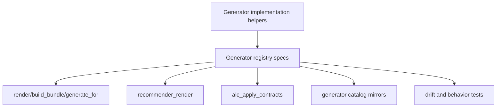
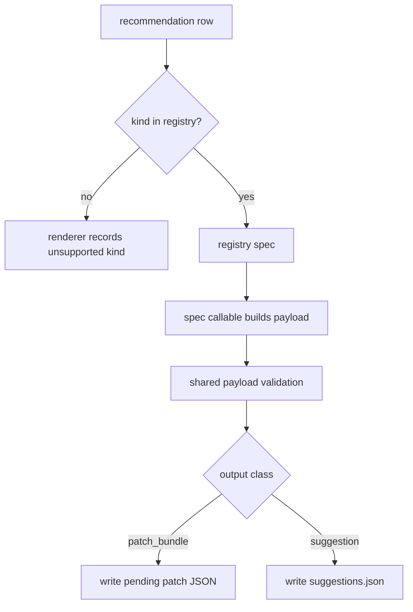

# refactor: Make recommender generator registry the execution seam

## Summary

Complete the next architecture-review campaign slice by making `agent-learning-compounder/bin/recommender_generators.py::GENERATORS` the real execution seam for generator identity, dispatch, output classification, validation metadata, and reference output. Existing recommendation behavior should stay stable: patch-emitting generators still write patch bundles, and `workflow_chain` still writes dashboard suggestions outside the apply pipeline.

---

## Problem Frame

`docs/dev/architecture-review-campaign-2026-05-28.md` marks the first five campaign slices complete and names Recommender Generator Registry Seam as the next queued item. The source review describes the current problem accurately: generator identity is repeated across supported kinds, spec order, dispatcher logic, registry rows, reference output, and rendering behavior.

The current code already has a `GENERATORS` registry, but it is not yet the execution seam. `SUPPORTED_KIND` validates recommendation kinds, `SPEC_ORDER` assigns G-IDs, `_dispatcher()` chooses callables, `render()` bypasses `GENERATORS` for dispatch, `recommender_render` special-cases `workflow_chain`, and `alc_apply_contracts` carries a fallback map of generator target types. That means adding a future G6 could require coordinated edits across parallel policy surfaces before tests detect drift.

This plan preserves the public recommender contract while moving policy ownership into the registry. Individual generator functions remain ordinary implementation helpers behind the registry; adapters such as `recommender_render`, catalog rendering, capability parity, and apply-contract validation consume registry metadata instead of reconstructing it.

---

## Requirements

### Registry Ownership

- R1. `GENERATORS` must be the canonical source for generator ID, kind, summary, version, callable backing, output class, target type, and catalog/reference metadata.
- R2. Recommendation kind validation and dispatch must derive from `GENERATORS`; no independent `SUPPORTED_KIND`, `SPEC_ORDER`, or `_dispatcher()` policy may remain as a second source of truth.
- R3. `render()`, `build_bundle()`, and `generate_for()` must preserve their public behavior while routing through registry callables.
- R4. The registry must explicitly model non-patch outputs so `workflow_chain` remains a dashboard suggestion and never enters `patches/*.json`.

### Adapter and Catalog Parity

- R5. `recommender_render` must use registry metadata to classify patch bundles versus suggestion payloads instead of special-casing recommendation kinds.
- R6. Generator reference output must be generated and checked from the same registry, covering the active checked-in mirrors under `reference-lib/generator-catalog` and `agent-learning-compounder/skills/alc-core/references/generator-catalog.md` if both remain shipped.
- R7. `alc_apply_contracts` must derive generator-emitted target types from registry metadata rather than carrying a fallback kind-to-target map.
- R8. Capability parity and catalog drift tests must fail if a generator is dispatchable but absent from the catalog, catalogued but not dispatchable, or missing output metadata needed by downstream adapters.

### Compatibility and Scope Control

- R9. Existing generator payload validation, agent-content validation, preflight/revert shape, lifecycle metadata, and `recommender_render --pre-validate` behavior must remain stable unless implementation exposes an existing accidental bug.
- R10. This slice must not introduce new generator kinds, change recommendation scoring, alter `recommendations.json` production, redesign proposal lifecycle state, or change public MCP tool names.
- R11. Documentation and campaign status must make generator registry ownership visible after implementation, with enough evidence for the next architecture-review pass.

---

## Key Technical Decisions

- KTD1. Deepen `recommender_generators.py` instead of creating a new registry module. The live generator implementations, public compatibility functions, and current registry already live together there; adding another registry would repeat the drift this slice is meant to remove.
- KTD2. Treat generator entries as structured specs, not loose metadata dicts. The spec should bind identity, kind, callable, output class, target type, summary, and version so adapters can ask the registry one question instead of reconstructing behavior.
- KTD3. Keep implementation helpers shallow behind the registry. `_build_anomaly_patch`, `_build_routing_patch`, `_build_model_swap_patch`, `_build_agent_spawn`, and `_build_workflow_chain` can remain focused payload builders; the registry owns how those builders are identified and consumed.
- KTD4. Preserve `workflow_chain` as a suggestion-class generator. It is intentionally outside the Hermes-DSL patch pipeline, as documented in `agent-learning-compounder/reference-lib/hermes-dsl-spec`; this plan makes that distinction explicit registry metadata rather than renderer special casing.
- KTD5. Align both generator catalog mirrors only if both remain active. Current docs cite `reference-lib/generator-catalog`, while `render_catalogs.py` writes `skills/alc-core/references/generator-catalog.md`; the implementation should either keep both guarded or make one active mirror unambiguous in docs and tests.

---

## High-Level Technical Design

### Registry Ownership

The registry becomes the owner of generator identity and output metadata. Adapters consume specs; they do not infer generator behavior from hard-coded kind names.

### Recommendation Rendering Flow

The output class is data on the generator spec. `workflow_chain` remains suggestion-only, but `recommender_render` no longer needs to know that by naming the kind directly.

---

## Scope Boundaries

### In Scope For This Build Session

- A structured generator spec contract inside `agent-learning-compounder/bin/recommender_generators.py`.
- Registry-derived validation, dispatch, output classification, target-type metadata, and supported-kind listing.
- `recommender_render` changes that consume registry metadata while preserving patch and suggestion outputs.
- Drift guards for generator catalog mirrors, capability parity, and apply-contract target coverage.
- Documentation and campaign updates after implementation evidence exists.

### Deferred to Follow-Up Work

- Adding new generator kinds such as command or hook writers.
- Redesigning recommendation scoring, recommendation production, or analyst query output that feeds `recommendations.json`.
- Reworking proposal lifecycle semantics beyond consuming existing lifecycle helpers for patch and suggestion artifacts.
- Consolidating all checked-in reference catalog locations if implementation proves that to be broader than this registry seam.

### Out of Scope

- Changing MCP tool IDs, MCP handler registration, or `list_capabilities` output.
- Changing `alc_apply` execution semantics, Hermes-DSL target permissions, or sandbox execution policy.
- Changing agent markdown quality rules, allowed model/color values, or preflight root policy except where registry metadata needs to expose existing target types.
- Changing dashboard rendering of workflow suggestions.
- Changing release metadata, release layout, dashboard URL, analyst query catalog, or runtime install target ownership already completed by earlier campaign slices.

---

## Implementation Units

### U1. Characterize the Current Generator Registry Split

- **Goal:** Lock down existing generator behavior and expose the parallel policy surfaces that the registry migration must collapse.
- **Requirements:** R1, R2, R3, R4, R8, R9.
- **Dependencies:** None.
- **Files:** `agent-learning-compounder/bin/recommender_generators.py`, `agent-learning-compounder/tests/test_recommender_generators.py`.
- **Approach:** Add characterization assertions before changing dispatch. Tests should prove the current public generator set, G-ID order, payload shape for each kind, validation failures for unsupported kinds, and the special non-patch shape for `workflow_chain`. Include assertions that make future drift obvious: supported kinds, dispatchable kinds, and registry kinds must describe the same set after the migration.
- **Execution note:** Characterization-first. These tests should fail or be marked as expected gaps only where they intentionally describe the drift being removed.
- **Patterns to follow:** Existing broad render test in `agent-learning-compounder/tests/test_recommender_generators.py`; analyst catalog drift guard style in `agent-learning-compounder/tests/test_analyst_queries.py`; named catalog guidance in `ARCHITECTURE.md`.
- **Test scenarios:**
  - Given the current generator module imports, every kind in `GENERATORS` has a stable G-ID, summary, version, and callable backing.
  - Given an unsupported recommendation kind, `render()` raises `ValidationError` with the unsupported-kind message.
  - Given each existing patch-emitting kind, `render()` returns `skill_manage_op`, `preflight`, and `revert_op` with the same top-level keys as today.
  - Given `workflow_chain`, `render()` returns only a `suggestion` payload and never a `skill_manage_op`.
  - Given a future registry entry without output metadata or callable backing, the registry contract test fails before renderer adapters can consume it.
- **Verification:** The implementer has a failing/passable characterization baseline that distinguishes intended compatibility from the registry drift being removed.

### U2. Define Generator Specs as the Canonical Registry Contract

- **Goal:** Make `GENERATORS` own identity, ordering, callable backing, output class, and target-type metadata.
- **Requirements:** R1, R2, R3, R4, R8, R9.
- **Dependencies:** U1.
- **Files:** `agent-learning-compounder/bin/recommender_generators.py`, `agent-learning-compounder/tests/test_recommender_generators.py`.
- **Approach:** Introduce a small structured spec shape for generator entries. Keep compatibility surfaces such as `GENERATORS`, `supported_kinds()`, `render()`, `build_bundle()`, and `generate_for()`, but derive their behavior from specs. Remove or derive `SUPPORTED_KIND`, `SPEC_ORDER`, and `_dispatcher()` so there is no independent policy. The registry should expose enough data for downstream adapters: whether the output is a patch bundle or suggestion, and the Hermes-DSL target type for patch emitters.
- **Patterns to follow:** `agent-learning-compounder/bin/analyst_queries.py::QUERY_SPECS` as the recently completed named-catalog pattern; MCP catalog entry shape in `agent-learning-compounder/alc_mcp/catalog.py`; compatibility-wrapper style used in prior refactors.
- **Test scenarios:**
  - Given the registry, G-IDs are assigned from registry order and remain unique for G1-G5.
  - Given each registry spec, required fields exist: ID, kind, summary, version, callable, output class, and target type when applicable.
  - Given `supported_kinds()`, it returns the registry kinds and does not depend on a separate set.
  - Given `render()` for each existing kind, it invokes the callable from the registry spec.
  - Given a spec whose output class is `patch_bundle`, validation requires the existing `skill_manage_op` / `preflight` / `revert_op` shape.
  - Given a spec whose output class is `suggestion`, validation requires the existing suggestion payload shape and does not require patch fields.
- **Verification:** Generator identity and execution metadata can be inspected from one registry surface, and public render helpers remain backward compatible.

### U3. Route Recommender Rendering Through Registry Output Metadata

- **Goal:** Make `recommender_render` consume registry specs for supported-kind checks and patch-versus-suggestion routing.
- **Requirements:** R4, R5, R9, R10.
- **Dependencies:** U2.
- **Files:** `agent-learning-compounder/bin/recommender_render`, `agent-learning-compounder/tests/test_recommender_render.py`, `agent-learning-compounder/tests/test_e2e_pipeline_real_data.py`.
- **Approach:** Replace direct kind membership checks and the `workflow_chain` branch with registry-driven classification. The renderer should still read recommendations, optionally prevalidate commands, call the public render helper or spec callable, write patch bundles under `patches/`, write suggestions into `suggestions.json`, and record lifecycle refs with existing proposal-lifecycle helpers. Keep error handling and skipped recommendation payloads stable.
- **Patterns to follow:** Current `run()` separation between `_validate_recommendation()`, `_write_patch()`, and `_write_suggestions()`; proposal lifecycle attachment in `agent-learning-compounder/bin/proposal_lifecycle.py`; existing real-data pipeline test coverage.
- **Test scenarios:**
  - Given the existing five recommendation kinds, `run()` still writes four patch bundles and one workflow-chain suggestion.
  - Given a suggestion-class spec, `run()` writes `suggestions.json` using lifecycle status `suggested` and does not create a patch file.
  - Given a patch-class spec, `run()` writes a pending patch JSON with `patch_id`, `recommendation_id`, `status`, `created_at`, and lifecycle metadata.
  - Given an unsupported kind, `run()` records a skipped item with the unsupported-kind reason and does not write an artifact.
  - Given `--pre-validate` behavior through `run(prevalidate=True)`, failed validation commands still skip only the affected recommendation.
  - Given a future suggestion-class generator registered in `GENERATORS`, `recommender_render` can route it without adding a new kind-specific branch.
- **Verification:** Renderer behavior is stable, but output routing comes from registry metadata rather than hard-coded kind names.

### U4. Guard Generator Catalog Mirrors Against Registry Drift

- **Goal:** Ensure human-readable generator references are generated from and checked against the canonical registry.
- **Requirements:** R1, R6, R8, R11.
- **Dependencies:** U2.
- **Files:** `agent-learning-compounder/bin/render_catalogs.py`, `agent-learning-compounder/tests/test_render_catalogs.py`, `agent-learning-compounder/reference-lib/generator-catalog`, `agent-learning-compounder/skills/alc-core/references/generator-catalog.md`, `agent-learning-compounder/tests/test_capability_parity.py`.
- **Approach:** Extend catalog rendering tests for generator references, not just analyst queries. Decide whether both current mirrors remain active. If both remain active, assert both exactly match rendered registry output. If one mirror becomes canonical, update docs and tests so the inactive path is not presented as a second source of truth. Keep generated fields aligned with registry spec metadata and avoid hand-maintained table drift.
- **Patterns to follow:** Analyst catalog rendering parity in `agent-learning-compounder/tests/test_render_catalogs.py`; checked-in generator catalog table in `agent-learning-compounder/reference-lib/generator-catalog`; skill reference catalog output under `agent-learning-compounder/skills/alc-core/references/generator-catalog.md`.
- **Test scenarios:**
  - Given the registry, rendered generator catalog output includes every G-ID and kind exactly once.
  - Given a changed summary, version, output class, or target type in the registry, catalog parity tests fail until the checked-in mirror is regenerated.
  - Given both generator catalog mirrors remain active, both files match deterministic rendered output.
  - Given one generator catalog mirror is retired as active documentation, docs no longer cite it as the source of truth.
  - Given capability parity for recommendations, M3 still resolves to the registry and not a stale rendered file.
- **Verification:** A future G6 cannot be dispatchable while missing from the checked-in generator reference output.

### U5. Replace Apply-Contract Generator Fallback Metadata

- **Goal:** Make Hermes-DSL target coverage checks consume generator output metadata from the registry.
- **Requirements:** R1, R7, R8, R9, R10.
- **Dependencies:** U2.
- **Files:** `agent-learning-compounder/bin/alc_apply_contracts.py`, `agent-learning-compounder/tests/test_alc_apply_contracts.py`, `agent-learning-compounder/reference-lib/hermes-dsl-spec`.
- **Approach:** Remove the hard-coded fallback map in `_extract_generator_target_types()` once generator specs expose output target types. `workflow_chain` should remain targetless because it does not emit a Hermes-DSL operation. Keep the existing import-time self-validation and error shape for missing target registrations. Update the Hermes-DSL reference only if registry metadata clarifies the current behavior without changing semantics.
- **Patterns to follow:** Existing `_validate_generators_subset()` import-time self-check; Hermes-DSL reference wording that says `workflow_chain` is never emitted as `skill_manage_op`; generator tests that validate patch payload target types.
- **Test scenarios:**
  - Given patch-emitting generator specs, `_extract_generator_target_types()` returns the set of target types from spec metadata.
  - Given `workflow_chain`, target extraction ignores it because its output class is suggestion.
  - Given a generator spec emitting a target type not listed in `DSL_TARGETS`, import-time validation fails with the existing missing-target error.
  - Given existing G1-G5 specs, apply-contract self-validation passes on import and via module main.
  - Given a generator spec missing target-type metadata for a patch-class output, registry contract tests fail before apply-contract extraction guesses.
- **Verification:** Apply-contract validation no longer reconstructs generator behavior from a local fallback map.

### U6. Update Architecture Campaign and Durable Docs

- **Goal:** Record generator registry ownership after implementation and keep the campaign evidence current.
- **Requirements:** R6, R10, R11.
- **Dependencies:** U2, U3, U4, U5.
- **Files:** `ARCHITECTURE.md`, `CONTEXT.md`, `STRATEGY.md`, `agent-learning-compounder/AGENTS.md`, `docs/dev/architecture-review-campaign-2026-05-28.md`.
- **Approach:** Update docs only after tests prove the registry seam owns execution metadata. `ARCHITECTURE.md` and `CONTEXT.md` should describe generators as catalog-driven G1-Gn with the registry as source of truth and reference mirrors as generated outputs. `STRATEGY.md` should keep the named-catalog active track current. `AGENTS.md` should make future-agent guidance explicit: add or change generators through registry specs first. The campaign document should mark Recommender Generator Registry Seam complete with module, renderer, catalog, and test evidence.
- **Patterns to follow:** Completed-slice evidence language in `docs/dev/architecture-review-campaign-2026-05-28.md`; named catalog sections in `ARCHITECTURE.md` and `CONTEXT.md`; seam ownership list in `agent-learning-compounder/AGENTS.md`.
- **Test scenarios:**
  - Given docs mention generators, they name the registry as the source of truth rather than the rendered reference file alone.
  - Given docs mention G1-G5, they either remain accurate for the current registry or use G1-Gn wording where future extension is intended.
  - Given the campaign queue after implementation, Recommender Generator Registry Seam is marked complete with evidence paths.
  - Test expectation: none for prose-only docs beyond existing doc/catalog parity checks, because behavior is covered by U1-U5.
- **Verification:** Durable docs match the implemented generator registry boundary, and the architecture-review campaign no longer has queued shallow seams from this review.

---

## System-Wide Impact

This is a recommender architecture cleanup with agent-facing consequences. Operators should not see changed recommendation behavior, but future generator additions become safer because identity, dispatch, validation metadata, target coverage, and documentation all originate from one registry contract.

The affected surfaces are patch bundle generation, workflow-chain suggestions, apply-contract validation, reference catalogs, capability parity, and future agent guidance. Because recommendations can produce file-changing patches, the plan treats drift guards as part of the safety boundary rather than documentation polish.

---

## Risks & Dependencies

- **Risk: registry structure changes break loose dict consumers.** Mitigate by preserving `GENERATORS` as an inspectable mapping and keeping compatibility helpers while introducing a structured internal spec shape.
- **Risk: `workflow_chain` accidentally enters the patch pipeline.** Mitigate with explicit suggestion output metadata and renderer tests that assert it writes only `suggestions.json`.
- **Risk: catalog mirror ambiguity continues.** Mitigate by testing every active checked-in generator catalog mirror or updating docs so only one mirror is presented as active.
- **Risk: apply-contract validation loses coverage while removing fallback maps.** Mitigate by requiring patch-class specs to declare target types and keeping import-time subset validation.
- **Risk: implementation expands into recommender product behavior.** Mitigate by leaving scoring, recommendation production, dashboard suggestion UX, and MCP tool names out of scope.

---

## Sources & Research

- `docs/dev/architecture-review-campaign-2026-05-28.md`: active campaign queue naming Recommender Generator Registry Seam as order 6 and the next plan/build slice.
- `.runtime/reports/architecture-review-20260527-215034.md`: source architecture review identifying repeated generator identity across supported kind, spec order, dispatcher logic, registry, reference output, and rendering.
- `STRATEGY.md`: active named-catalog track and recent ownership updates for completed campaign slices.
- `ARCHITECTURE.md` and `CONTEXT.md`: current named-catalog guidance for generator IDs and reference mirrors.
- `agent-learning-compounder/AGENTS.md`: local seam instructions and completed deep-module ownership conventions.
- `agent-learning-compounder/bin/recommender_generators.py`: current generator payload builders, `SUPPORTED_KIND`, `SPEC_ORDER`, `_dispatcher()`, `GENERATORS`, and public render helpers.
- `agent-learning-compounder/bin/recommender_render`: current recommendation reader, patch writer, suggestion writer, and `workflow_chain` output branch.
- `agent-learning-compounder/bin/alc_apply_contracts.py`: current generator target-type extraction with fallback kind mapping.
- `agent-learning-compounder/bin/render_catalogs.py`: current generated catalog machinery and generator catalog output target.
- `agent-learning-compounder/tests/test_recommender_generators.py`, `agent-learning-compounder/tests/test_recommender_render.py`, `agent-learning-compounder/tests/test_alc_apply_contracts.py`, `agent-learning-compounder/tests/test_render_catalogs.py`, and `agent-learning-compounder/tests/test_capability_parity.py`: existing behavior and drift-guard tests to extend.
- `agent-learning-compounder/reference-lib/generator-catalog` and `agent-learning-compounder/skills/alc-core/references/generator-catalog.md`: checked-in generator reference mirrors currently carrying the same G1-G5 table.
