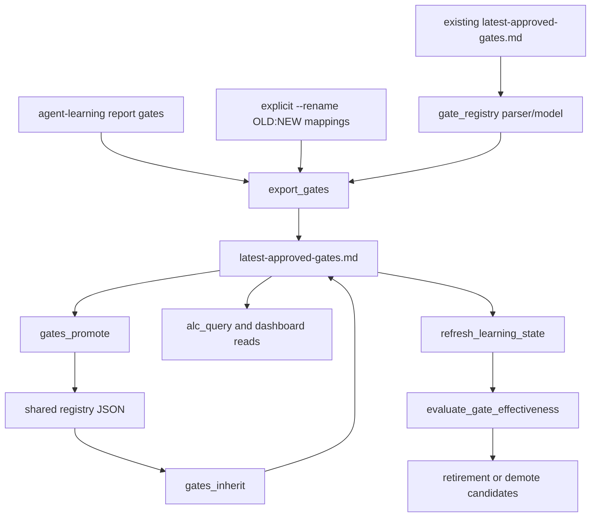
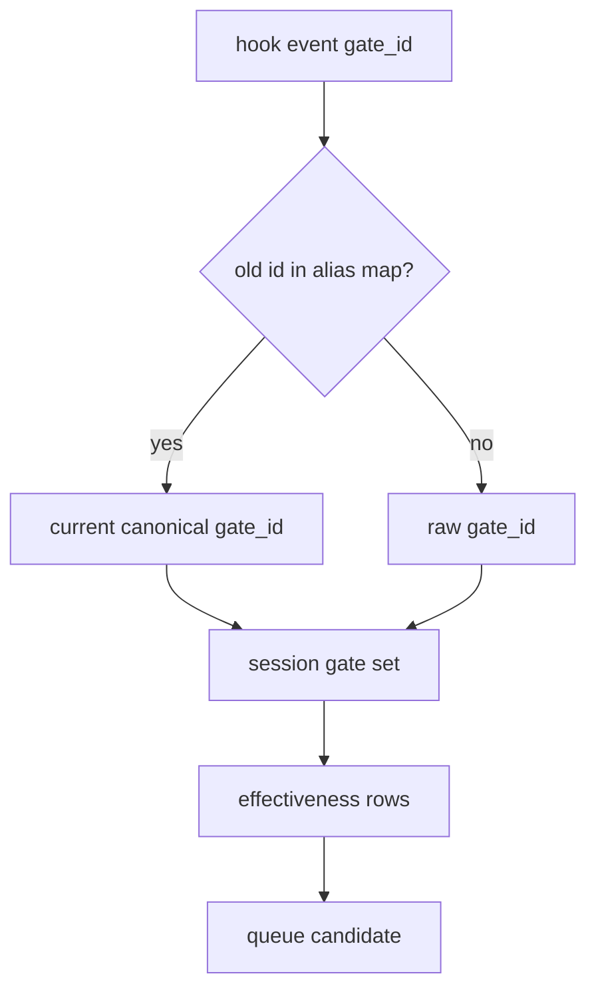

# fix: Add explicit gate ID alias chain

## Summary

Close the next open gate-system audit slice by making gate text edits an explicit identity migration instead of a silent new `gate_id`. The current hash recipe stays frozen; this plan adds rename/alias metadata and teaches export, federation, read, and scoring surfaces to preserve continuity from old gate IDs to the current canonical gate.

---

## Problem Frame

`docs/dev/architecture-review-campaign-2026-05-28.md` says the six shallow-seam recommendations from the source architecture review are complete and the next plan must come from fresh review evidence. The strongest current evidence is `docs/dev/gate-system-review-2026-05.md`, whose earlier mechanical fixes are already reflected in the tree: inherited blocks survive `export_gates`, gate records are hash-verified on inherit, appenders use exclusive locks, critical JSONL reads are resilient, and frozen `_gate_id` / `causal_probe.decide` tests now exist.

The first remaining item in the audit's recommended order is C3: editing gate text silently changes `gate_id` with no alias chain. Because `_gate_id(domain, category, gate_text)` intentionally binds the instruction text into the ID, even a wording cleanup creates a new 12-hex ID. Existing probes, effectiveness cohorts, shared registry records, inherited copies, and operator queue rows continue to reference the old ID. Without a visible alias chain, a gate can appear to lose all history overnight, or a sibling repo can keep running an old inherited instruction with no connection to the updated canonical gate.

This plan fixes the migration contract without changing the hash recipe. Hash-format changes and Unicode normalization concerns from M6 are deliberately left out because they would require a broader federation migration.

---

## Requirements

### Gate Identity Migration

- R1. `export_gates` must not silently treat an apparent local gate text edit as an unrelated gate when a prior block with the same logical slot exists.
- R2. Gate ID changes must require an explicit operator-supplied rename mapping, expressed as `old_gate_id -> new_gate_id`, before an alias chain is written.
- R3. Rendered gate blocks must preserve a transitive alias chain so old IDs remain visible after repeated edits.
- R4. The current `gate_id` remains the canonical ID for new output, while previous IDs are metadata only.

### Federation and Read Compatibility

- R5. `gates_promote` must carry alias metadata into shared registry records so future inheritors receive the full identity chain.
- R6. `gates_inherit` must render alias metadata from shared records without weakening existing record validation or content-hash checks.
- R7. `alc_query.get_gates` and dashboard/MCP readers must surface alias metadata without returning aliases as duplicate gates.
- R8. Existing gate files without alias metadata must continue to parse exactly as they do today.

### Scoring and Queue Continuity

- R9. Gate effectiveness and refresh retirement/demote logic must be able to normalize historical event IDs to the current canonical gate ID when an alias chain is available.
- R10. Queue rows created from aliased evidence must point at the canonical `gate_id` while preserving which previous IDs contributed evidence.
- R11. Alias handling must not mutate historical hook-event logs or rewrite shared registry records in place.

### Scope Control

- R12. This slice must not change the `_gate_id` hash recipe, separator, Unicode normalization behavior, 12-hex length, or existing frozen-value tests.
- R13. This slice must not solve the separate adversarial causal-probe salt design from H3, nor the hash-collision / normalization migration from M6.
- R14. Documentation must mark C3 as addressed only after export, federation, read, scoring, and queue tests prove the alias chain works.

---

## Key Technical Decisions

- KTD1. Use explicit rename input, not automatic text-diff inference. Matching by domain/category is useful for detecting suspicious drift, but it is not strong enough to decide identity automatically. A repeated `--rename OLD:NEW` export option keeps the operator in control and makes identity migration auditable.
- KTD2. Preserve aliases as metadata on the canonical block. The rendered markdown should keep one block per current gate and include a `previous_gate_ids` field for old IDs, ordered newest-to-oldest. This avoids duplicate gates while keeping old IDs discoverable by parsers, operators, and future migration tools.
- KTD3. Add a narrow gate-registry parser instead of extending every ad hoc parser separately. Alias chains affect `export_gates`, `gates_promote`, `gates_inherit`, `alc_query`, and `refresh_learning_state`; a small shared parser reduces the chance that one consumer silently ignores the new metadata.
- KTD4. Normalize aliases at read/scoring boundaries, not by rewriting historical telemetry. Hook events are evidence; their old `gate_id` values should stay immutable. Consumers that need continuity should map old IDs to canonical IDs in memory.
- KTD5. Keep hash-recipe migration out of this slice. M6 may eventually require a new ID recipe, but changing the hash recipe at the same time as adding aliases would make it harder to separate contract migration bugs from alias-chain bugs.

---

## High-Level Technical Design

### Alias Ownership Flow

The canonical gate block owns identity continuity. Export writes it, federation preserves it, read surfaces expose it, and scoring consumers use it to normalize historical evidence.

### Scoring Normalization

Old event rows remain unchanged. The evaluator receives an optional alias map and folds previous IDs into the current gate's cohorts before labels and queue rows are computed.

---

## Scope Boundaries

### In Scope For This Build Session

- A shared gate block parser/model for current gate ID, previous IDs, provenance, level, and existing fields.
- Explicit `export_gates --rename OLD:NEW` support and fail-closed drift detection for apparent local gate text edits.
- Alias metadata preservation through export, promote, inherit, query, dashboard/MCP reads, and refresh scoring.
- Regression coverage for repeated rename chains, inherited aliases, old-event scoring, and existing alias-free compatibility.
- Documentation updates to the gate-system review and durable architecture notes after implementation evidence exists.

### Deferred to Follow-Up Work

- M6 hash recipe redesign, separator changes, and Unicode normalization migration.
- H3 server-side secret salt or server-assigned causal probe decisions.
- Bulk migration of old shared registry records that have already been promoted without alias metadata.
- UI affordances for showing alias chains beyond exposing them in read payloads.

### Out of Scope

- Changing public MCP tool names, MCP IDs, or `report_outcome` argument aliases.
- Changing gate effectiveness thresholds, causal signal semantics, or retirement/demote eligibility rules beyond ID normalization.
- Changing the existing `derived_from` provenance format.
- Rewriting historical `hook-events.jsonl`, `events.jsonl`, `events.sqlite`, or shared registry files in place.

---

## Implementation Units

### U1. Characterize Gate ID Drift and Alias Requirements

- **Goal:** Add failing coverage that proves text edits currently orphan old IDs and defines the intended explicit rename behavior.
- **Requirements:** R1, R2, R3, R4, R8, R12.
- **Dependencies:** None.
- **Files:** `agent-learning-compounder/bin/export_gates`, `agent-learning-compounder/fixtures/tests/test_export_gates_id.py`, `agent-learning-compounder/fixtures/tests/test_export_gates_federation.py`.
- **Approach:** Extend export-gate tests around the existing frozen hash contract. Keep the current "ID changes when gate text changes" assertion, but add a higher-level export behavior expectation: when an existing output has a logically matching block and the report now produces a different ID, export refuses unless the operator supplies an explicit rename mapping. Define the rendered alias field and transitive preservation in tests before implementation.
- **Execution note:** Test-first. This unit should describe the migration contract before parser or CLI changes land.
- **Patterns to follow:** Frozen `_gate_id` contract in `agent-learning-compounder/fixtures/tests/test_export_gates_federation.py`; C1 preservation tests in the same file; CLI fixture style in `agent-learning-compounder/fixtures/tests/test_export_gates_id.py`.
- **Test scenarios:**
  - Given an existing gates file and a report where the same domain/category gate text changed, running `export_gates` without a rename mapping exits non-zero and leaves the file unchanged.
  - Given `--rename OLD:NEW` matching the old block and new computed ID, export succeeds and renders the current gate with `previous_gate_ids: OLD`.
  - Given a second later rename, export preserves the transitive chain as `previous_gate_ids: NEWER_OLD, OLDER_OLD` or another deterministic order documented by the parser contract.
  - Given a rename whose new ID does not match any freshly rendered report gate, export fails with an actionable message.
  - Given the unchanged canonical fixture, the frozen `2aed10be9612` assertion still passes.
- **Verification:** The intended behavior is captured in tests, and the tests fail against the pre-alias implementation for the right reason.

### U2. Add a Shared Gate Registry Parser and Export Rename Contract

- **Goal:** Make gate block parsing, alias chains, and export-time identity migration one coherent contract.
- **Requirements:** R1, R2, R3, R4, R8, R12.
- **Dependencies:** U1.
- **Files:** `agent-learning-compounder/bin/gate_registry.py`, `agent-learning-compounder/bin/export_gates`, `agent-learning-compounder/fixtures/tests/test_gate_registry.py`, `agent-learning-compounder/fixtures/tests/test_export_gates_id.py`, `agent-learning-compounder/fixtures/tests/test_export_gates_federation.py`.
- **Approach:** Introduce a small parser/model for approved-gate blocks that handles LF/CRLF, no-leading-newline files, inherited fields, `level`, probe metadata, and `previous_gate_ids`. Update `export_gates` to parse existing output through this module, accept repeated explicit rename mappings, validate those mappings against newly rendered IDs, preserve alias chains under the canonical block, and keep existing inherited-block preservation behavior.
- **Patterns to follow:** CRLF-tolerant block splitting in `gates_inherit`; sidecar-lock read/commit pattern in `state_handle.atomic_rewrite`; current `preserved_inherited_blocks` dedupe behavior in `export_gates`.
- **Test scenarios:**
  - Given alias-free gate markdown, the parser returns the same fields current consumers expect.
  - Given markdown with `previous_gate_ids`, the parser returns a normalized ordered list of 12-hex IDs and rejects malformed aliases.
  - Given CRLF markdown or a file that starts directly with `- domain:`, aliases and current IDs parse correctly.
  - Given an inherited block with `derived_from` and aliases, export preserves it when no local report gate supersedes it.
  - Given a local report gate superseding an inherited old ID by explicit rename, the local canonical block wins and no duplicate ID block is emitted.
- **Verification:** Export owns the alias-chain write path, and parser tests give downstream units a stable contract to consume.

### U3. Preserve Alias Metadata Through Federation and Read APIs

- **Goal:** Carry alias chains through promotion, inheritance, and read surfaces without duplicating gates.
- **Requirements:** R5, R6, R7, R8, R11.
- **Dependencies:** U2.
- **Files:** `agent-learning-compounder/bin/gates_promote`, `agent-learning-compounder/bin/gates_inherit`, `agent-learning-compounder/bin/alc_query.py`, `agent-learning-compounder/fixtures/tests/test_gates_promote.py`, `agent-learning-compounder/fixtures/tests/test_gates_inherit.py`, `agent-learning-compounder/tests/test_alc_query.py`, `agent-learning-compounder/tests/test_dashboard_read_model.py`, `agent-learning-compounder/alc_mcp/tests/test_server.py`.
- **Approach:** Have `gates_promote` parse gate blocks through the shared registry parser and write alias metadata into shared JSON records as a structured list. Have `gates_inherit` validate alias IDs and render them back into markdown. Update `alc_query.get_gates` to expose `previous_gate_ids` as a list while preserving current dedupe by canonical `gate_id`; user/project `scope="both"` treats a project gate's aliases as project-owned identities, so a user-scope gate whose canonical ID appears in a project alias chain is suppressed and the project row wins.
- **Patterns to follow:** Existing promote/inherit level round-trip tests; `gates_inherit.validate_record` field validation; `alc_query` scope dedupe behavior where project rows win over user rows on canonical ID conflict.
- **Test scenarios:**
  - Given a promoted gate with aliases, the shared registry JSON contains `previous_gate_ids` as a deterministic list.
  - Given a shared registry record with aliases, inherit appends one markdown block containing current `gate_id`, `previous_gate_ids`, and `derived_from`.
  - Given a malformed alias in a shared record, inherit rejects the record before writing.
  - Given `get_gates(scope="project")` over alias markdown, the returned row includes `previous_gate_ids` and the canonical `gate_id`.
  - Given project and user gates where a user gate's canonical ID appears only as a project alias, `get_gates(scope="both")` returns the project row and suppresses the user row so aliases do not reintroduce duplicate logical gates.
- **Verification:** A gate can be exported, promoted, inherited, and read back with its alias chain intact.

### U4. Normalize Historical Gate IDs During Effectiveness Scoring

- **Goal:** Keep effectiveness cohorts and retirement/demote queue rows continuous when events still reference previous gate IDs.
- **Requirements:** R9, R10, R11, R13.
- **Dependencies:** U2, U3.
- **Files:** `agent-learning-compounder/bin/evaluate_gate_effectiveness`, `agent-learning-compounder/bin/refresh_learning_state`, `agent-learning-compounder/fixtures/tests/test_evaluate_gate_effectiveness.py`, `agent-learning-compounder/fixtures/tests/test_evaluate_gate_effectiveness_resilience.py`, `agent-learning-compounder/fixtures/tests/test_gate_alias_effectiveness.py`.
- **Approach:** Add an optional alias-map input to scoring. `refresh_learning_state` should parse `latest-approved-gates.md`, build `old_id -> canonical_id`, and pass that map into evaluation before queueing retirement or inherited-demote candidates. The standalone evaluator can expose an optional `--gates` argument for the same behavior while defaulting to current alias-free semantics. Queue rows should use the canonical ID and include a small evidence field listing contributing previous IDs when aliases were used.
- **Patterns to follow:** Existing inherited-demote fixture coverage in `agent-learning-compounder/fixtures/tests/test_evaluate_gate_effectiveness.py`; rotated-log resilience in `agent-learning-compounder/fixtures/tests/test_evaluate_gate_effectiveness_resilience.py`; queue row evidence structure in `_queue_retirement_candidates`.
- **Test scenarios:**
  - Given historical hook events with only an old gate ID and gates markdown mapping old to current, evaluation emits one row for the current canonical ID.
  - Given events containing both old and current IDs for the same logical gate, cohorts are merged without double-counting a session.
  - Given an inherited gate whose old ID reaches retirement criteria, refresh queues `inherited_gate_demote_candidate` for the current canonical ID, not `gate_retirement_candidate` for the old ID.
  - Given no alias map, the evaluator output remains byte-shape-compatible with existing tests.
  - Given an alias cycle or two current gates claiming the same old ID, refresh fails closed instead of guessing.
- **Verification:** Historical gate IDs continue contributing to the same logical gate's effectiveness signal after a rename.

### U5. Document C3 Closeout and Keep Follow-Up Boundaries Visible

- **Goal:** Record the alias-chain contract and keep remaining gate-system risks separate from this fix.
- **Requirements:** R12, R13, R14.
- **Dependencies:** U1, U2, U3, U4.
- **Files:** `docs/dev/gate-system-review-2026-05.md`, `docs/dev/architecture-review-campaign-2026-05-28.md`, `ARCHITECTURE.md`, `STRATEGY.md`, `CONTEXT.md`, `agent-learning-compounder/AGENTS.md`.
- **Approach:** Update docs only after implementation evidence exists. Mark C3 addressed with the actual file/test evidence. Add a short architecture note that gate identity is current-ID plus `previous_gate_ids`, and that historical telemetry is normalized at read/scoring time. Keep M6 hash-recipe migration and H3 causal-probe hardening explicitly deferred so future agents do not mistake this slice for full gate-system closeout.
- **Patterns to follow:** Completed-slice evidence style in `docs/dev/architecture-review-campaign-2026-05-28.md`; named-contract language in `ARCHITECTURE.md`; concise future-agent rules in `agent-learning-compounder/AGENTS.md`.
- **Test scenarios:** Test expectation: none -- documentation-only unit; correctness is verified by U1-U4 tests and by ensuring docs cite those concrete files.
- **Verification:** The next architecture/gate-system pass can tell that C3 is closed, while M6 and H3 remain visible as separate follow-up candidates.

---

## System-Wide Impact

This change affects a federation contract, not just a local exporter. Operators may have old gate IDs in hook telemetry, shared registry records, inherited markdown, probes, and queue rows. The plan deliberately keeps historical evidence immutable and adds normalization where readers need continuity. Public command names and MCP tool IDs stay stable, but payloads from `get_gates` will gain alias metadata when present.

---

## Risks & Dependencies

- **Risk: Automatic drift detection is too eager.** Domain/category matching can produce false positives if a report legitimately drops one gate and adds another in the same slot. Mitigation: fail closed with a clear `--rename OLD:NEW` instruction rather than writing a guessed alias.
- **Risk: Alias cycles or duplicate old IDs corrupt scoring.** Mitigation: centralize alias-map construction in the gate registry parser and reject ambiguous maps before evaluation.
- **Risk: Shared registry records without aliases remain stale.** Mitigation: preserve compatibility and document bulk migration as follow-up; this slice prevents future silent drift and handles aliases when present.
- **Risk: Read payload change surprises consumers.** Mitigation: add `previous_gate_ids` only when present and keep existing `gate_id`, `category`, and `gate` fields unchanged.

---

## Sources & Research

- `docs/dev/architecture-review-campaign-2026-05-28.md`: closed the six prior architecture-review slices and directed the next plan to fresh review evidence.
- `docs/dev/gate-system-review-2026-05.md`: C3 finding and recommended fix order; M6 and H3 deferred boundaries.
- `agent-learning-compounder/bin/export_gates`: current owner of `_gate_id`, gate parsing, inherited-block preservation, and rendered gate markdown.
- `agent-learning-compounder/bin/gates_promote` and `agent-learning-compounder/bin/gates_inherit`: federation record and inherited markdown adapters.
- `agent-learning-compounder/bin/refresh_learning_state` and `agent-learning-compounder/bin/evaluate_gate_effectiveness`: scoring and retirement/demote consumers that must normalize aliases.
- `agent-learning-compounder/bin/alc_query.py`: read API that surfaces gates to MCP and dashboards.
