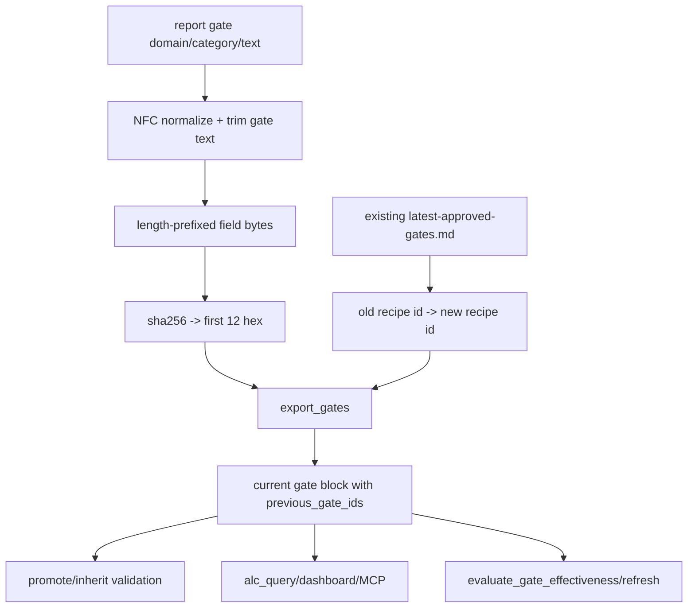
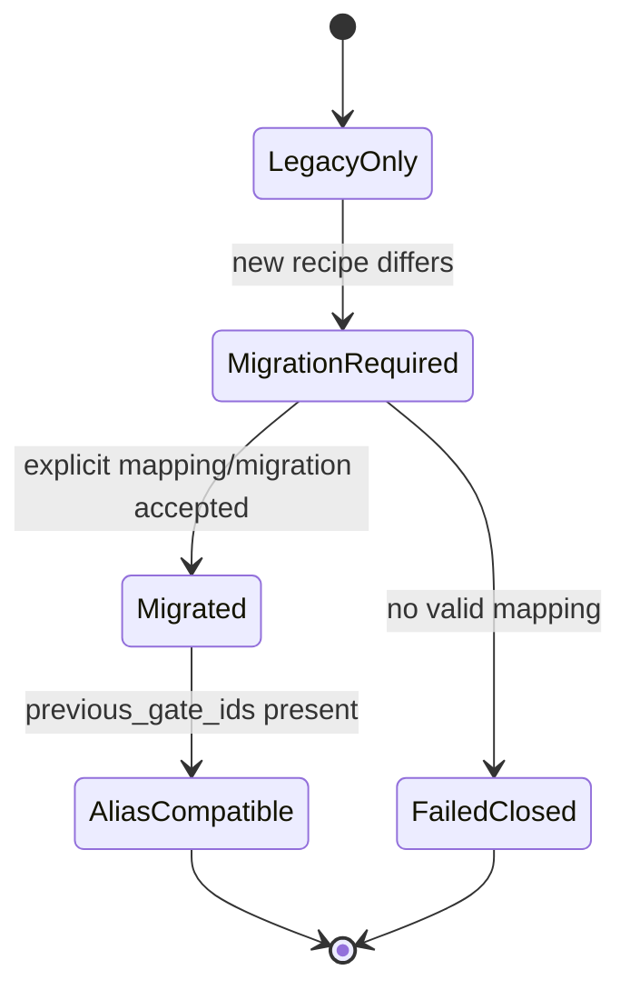

# fix: Migrate gate ID hash recipe

## Summary

Close the M6 gate-system follow-up by replacing the ambiguous `domain|category|gate` hash input with a canonical, Unicode-normalized recipe and by migrating existing gates through the C3 alias-chain contract instead of silently invalidating federation history.

---

## Problem Frame

`docs/dev/architecture-review-campaign-2026-05-28.md` says the six shallow-seam recommendations and gate-system C3 are complete, and that the next plan should come from fresh review evidence. `docs/dev/gate-system-review-2026-05.md` leaves M6 as a separate candidate after C3: current `gate_id` derivation hashes `f"{domain}|{category}|{gate_text.strip()}"`, so fields containing `|` can collide and canonically identical Unicode text can split into different IDs.

C3 intentionally kept the old hash recipe frozen while adding `previous_gate_ids` and explicit `export_gates --rename OLD:NEW`. That makes M6 tractable now: the recipe can change only if old IDs are preserved as aliases, federation validates the new recipe consistently, and scoring/read surfaces continue to normalize historical telemetry. This plan is about the recipe migration and its compatibility envelope, not causal-probe adversarial hardening.

---

## Requirements

### Canonical Hash Recipe

- R1. Gate ID derivation must use an unambiguous canonical input that cannot collide by moving separator characters between `domain`, `gate_category`, and `gate`.
- R2. Gate ID derivation must normalize `domain`, `gate_category`, and `gate` to Unicode NFC before hashing, while preserving current trimming semantics for gate text.
- R3. The resulting `gate_id` must remain a 12-character lowercase hex string unless a separate federation-wide ID-length migration is explicitly planned.
- R4. The new recipe must be covered by frozen-value tests that make recipe changes deliberate and review-visible.

### Migration and Federation Compatibility

- R5. Existing gates produced by the old recipe must migrate through `previous_gate_ids`, not duplicate as unrelated gates.
- R6. `export_gates` must fail closed when a recipe migration is needed but no explicit recipe-migration mode has been provided.
- R7. `gates_promote` and `gates_inherit` must validate shared records with the same canonical recipe as export, while still accepting legacy records whose old IDs are carried as aliases.
- R8. `gate_registry.alias_map` must continue rejecting alias cycles, duplicate old-ID claims, and current IDs that appear as previous IDs.

### Read and Scoring Continuity

- R9. `alc_query`, dashboard/MCP gate reads, and dashboard read models must surface the current recipe's ID as canonical and old recipe IDs only as `previous_gate_ids`.
- R10. Effectiveness scoring and refresh retirement/demote queueing must keep folding historical event rows with old recipe IDs into the current canonical gate.
- R11. The migration must not rewrite historical `hook-events.jsonl`, `events.jsonl`, `events.sqlite`, shared registry files, or existing reports in place.

### Scope Control

- R12. This slice must not redesign `gate_id` length, public gate markdown field names, MCP tool names, or causal probe assignment.
- R13. This slice must not solve H3 server-side secret salt, H1 cohort smearing, or H2 causal retirement gating.
- R14. Documentation must leave H3 visible as a separate design-level follow-up and mark M6 complete only after export, federation, read, scoring, and docs evidence exists.

---

## Key Technical Decisions

- **KTD1. Introduce one named recipe helper instead of editing `_gate_id` inline.** `export_gates._gate_id` is already imported by federation code, but the recipe now deserves an explicit helper in the gate identity/parser area so export, promote, inherit, tests, and future migration tools share the exact same canonicalization.
- **KTD2. Use length-prefixed canonical fields.** A length-prefixed UTF-8 byte encoding is more explicit than a new separator and avoids needing escape rules for delimiter characters in any field.
- **KTD3. Normalize Unicode before encoding and keep gate-text strip behavior.** NFC closes the visually-identical split called out in M6. Keeping `.strip()` on the gate text avoids a second behavior migration unrelated to the review finding.
- **KTD4. Treat recipe migration as an explicit identity migration.** Because every existing ID changes under the new recipe, export should require a named recipe-migration mode for exact same-gate old-recipe transitions and keep `--rename OLD:NEW` for operator-reviewed text edits. The migration mode should write old IDs into `previous_gate_ids`; it should not silently re-key the whole registry during a normal export.
- **KTD5. Preserve old IDs as read/scoring aliases, not historical rewrites.** Hook telemetry is evidence. Continuity belongs in parser-built alias maps and scoring/read normalization, matching the C3 contract.

---

## High-Level Technical Design

### Recipe Migration Flow

Export is the only place that writes the migration into markdown. Federation, reads, and scoring consume the resulting current-ID-plus-alias contract.

### Compatibility State Machine

The implementation should make "legacy only" and "migrated with aliases" valid states. "New recipe differs but no alias path exists" must be a visible failure.

---

## Scope Boundaries

### In Scope For This Build Session

- A shared gate ID recipe helper that canonicalizes and hashes gate identity fields.
- Frozen tests for ambiguous separator collisions and Unicode NFC equivalence.
- Export-time migration behavior that carries old recipe IDs into `previous_gate_ids`.
- Federation validation updates so promote/inherit agree on the new canonical recipe and alias compatibility.
- Read/scoring continuity checks proving historical old IDs still contribute to the current canonical gate.
- Documentation updates after implementation evidence exists.

### Deferred to Follow-Up Work

- H3 causal-probe gameability: server-side secret salt or server-assigned immutable decisions.
- H1/H2 causal scoring and retirement design changes.
- Changing gate ID length beyond 12 lowercase hex characters.
- Bulk rewriting old telemetry or already-published shared registry files.

### Out of Scope

- Public MCP catalog changes, command renames, or dashboard UI redesign.
- Changing `derived_from` provenance format.
- Changing gate effectiveness thresholds, labels, or retirement eligibility beyond old-ID normalization.
- Replacing the C3 explicit alias-chain model with automatic identity inference.

---

## Implementation Units

### U1. Characterize the M6 Recipe Hazards

- **Goal:** Add failing coverage for separator ambiguity and Unicode normalization drift under the current recipe.
- **Requirements:** R1, R2, R3, R4.
- **Dependencies:** None.
- **Files:** `agent-learning-compounder/bin/export_gates`, `agent-learning-compounder/bin/gate_registry.py`, `agent-learning-compounder/fixtures/tests/test_export_gates_federation.py`, `agent-learning-compounder/fixtures/tests/test_gate_registry_parser.py`.
- **Approach:** Keep the existing old-recipe frozen test as migration evidence, then add tests that show the new recipe's expected properties: field-boundary ambiguity does not collide, NFC and NFD renderings of the same gate text derive the same ID, and one canonical fixture has a known new 12-hex value.
- **Execution note:** Test-first. The first tests should fail against the current `domain|category|gate` recipe for the hazards named in M6.
- **Patterns to follow:** Existing frozen `_gate_id` contract in `agent-learning-compounder/fixtures/tests/test_export_gates_federation.py`; parser-level validation style in `agent-learning-compounder/fixtures/tests/test_gate_registry_parser.py`.
- **Test scenarios:**
  - Given two logical gates whose old concatenated string is identical because `|` moved between fields, the new recipe emits two different `gate_id` values.
  - Given the same gate text in NFC and NFD form, the new recipe emits the same `gate_id`.
  - Given the canonical Cloudflare docs-check fixture, the new recipe emits one pinned 12-hex value and the old `2aed10be9612` value remains documented as the legacy recipe ID.
  - Given non-ASCII domain or category values that are canonically equivalent under NFC, the recipe normalizes them before hashing.
- **Verification:** The tests prove the current recipe's weaknesses and pin the intended new recipe without changing export behavior yet.

### U2. Centralize Gate ID Recipe and Migration Helpers

- **Goal:** Put gate identity canonicalization, hash derivation, and old-to-new alias map validation behind one shared module boundary.
- **Requirements:** R1, R2, R3, R4, R8.
- **Dependencies:** U1.
- **Files:** `agent-learning-compounder/bin/gate_registry.py`, `agent-learning-compounder/bin/export_gates`, `agent-learning-compounder/fixtures/tests/test_gate_registry_parser.py`, `agent-learning-compounder/fixtures/tests/test_export_gates_federation.py`.
- **Approach:** Move recipe logic into `gate_registry` or a closely adjacent gate identity helper while preserving `export_gates._gate_id` as a thin compatibility wrapper if existing imports still need it. The helper should return only the canonical current ID; separate helper(s) can compare legacy IDs or build suggested migration mappings for export. Alias validation stays in `gate_registry.alias_map`.
- **Patterns to follow:** Existing `gate_registry.validate_gate_id`, `parse_previous_gate_ids`, and `alias_map`; source-first import patterns in `gates_promote` and `gates_inherit`.
- **Test scenarios:**
  - Calling the shared recipe helper from export and inherit paths yields the same current ID for the same fields.
  - The compatibility `_gate_id` wrapper returns the new recipe value and carries no independent hashing logic.
  - Legacy ID calculation is available only for migration detection/tests and is named so callers cannot mistake it for the current recipe.
  - Alias-map validation still rejects a previous ID claimed by two current gate blocks after the helper move.
- **Verification:** There is one current recipe implementation, and tests would fail if export or federation reintroduced a parallel hash recipe.

### U3. Migrate Exported Gates Through Explicit Aliases

- **Goal:** Teach `export_gates` to move existing old-recipe gate IDs to `previous_gate_ids` under the new canonical ID without silent whole-registry churn.
- **Requirements:** R5, R6, R8, R11.
- **Dependencies:** U2.
- **Files:** `agent-learning-compounder/bin/export_gates`, `agent-learning-compounder/fixtures/tests/test_export_gates_id.py`, `agent-learning-compounder/fixtures/tests/test_export_gates_federation.py`.
- **Approach:** Extend the C3 alias writer with a deliberately named recipe-migration mode for exact same-gate old-recipe transitions. When an existing block's logical slot and gate text map to the old recipe but the new recipe produces a different ID, normal export fails closed and tells the operator to rerun with the migration mode. The output should render one current block with the old ID prepended to `previous_gate_ids`, preserve any existing alias chain, and avoid duplicate local/inherited blocks. Continue using `--rename OLD:NEW` only for text edits where the gate instruction itself changed.
- **Patterns to follow:** Current `--rename OLD:NEW` validation in `export_gates`; inherited block preservation tests in `agent-learning-compounder/fixtures/tests/test_export_gates_federation.py`.
- **Test scenarios:**
  - Given an old-recipe gates file and the same report, export without migration intent fails closed with stderr naming the old and new IDs and the recipe-migration mode.
  - Given the recipe-migration mode for an old-recipe gates file and the same report, export writes the new `gate_id` and includes the old ID in `previous_gate_ids`.
  - Given an existing block that already has aliases, migration preserves the transitive chain with deterministic ordering.
  - Given an inherited block whose old ID migrates to a local current ID, export emits only the local current block and carries the inherited old ID as an alias.
  - Given a malformed or cross-slot mapping, export fails without modifying the destination file.
- **Verification:** Recipe migration produces one canonical block per logical gate and never silently rewrites identity without alias metadata.

### U4. Align Federation Validation With the New Recipe

- **Goal:** Keep shared registry promotion and inheritance consistent with the new recipe while remaining compatible with legacy IDs represented as aliases.
- **Requirements:** R7, R8, R11.
- **Dependencies:** U2, U3.
- **Files:** `agent-learning-compounder/bin/gates_promote`, `agent-learning-compounder/bin/gates_inherit`, `agent-learning-compounder/fixtures/tests/test_gates_promote.py`, `agent-learning-compounder/fixtures/tests/test_gates_inherit.py`, `agent-learning-compounder/fixtures/tests/test_gates_inherit_tamper.py`, `agent-learning-compounder/fixtures/tests/test_federation_lock_races.py`.
- **Approach:** Update promote/inherit content-hash checks to use the current recipe helper. Records whose `gate_id` is current should validate directly. Legacy IDs should be accepted only when the record also carries a current ID context through the promoted block/alias chain, not as standalone current records. Keep path traversal, lock, conflict, level, and `previous_gate_ids` validation unchanged.
- **Patterns to follow:** C2 content-hash tamper tests in `agent-learning-compounder/fixtures/tests/test_gates_inherit_tamper.py`; alias preservation tests in `agent-learning-compounder/fixtures/tests/test_gates_promote.py`; sidecar-lock tests in `agent-learning-compounder/fixtures/tests/test_federation_lock_races.py`.
- **Test scenarios:**
  - Promoting a migrated gate writes the new `gate_id` and includes the legacy ID in `previous_gate_ids`.
  - Inheriting a migrated shared record validates the record against the new current recipe and renders aliases unchanged.
  - A shared record whose current `gate_id` does not match the new recipe is rejected even if the old recipe would have matched.
  - A shared record that places the current ID inside `previous_gate_ids` is rejected as an alias cycle.
  - Existing lock-race and conflict tests still pass with migrated records.
- **Verification:** Federation cannot reintroduce the old recipe as the current identity contract, and migrated gates still round-trip across repos.

### U5. Prove Read and Scoring Continuity Across Recipe Migration

- **Goal:** Ensure dashboards, MCP reads, and effectiveness scoring treat old-recipe IDs as aliases of the current gate.
- **Requirements:** R9, R10, R11.
- **Dependencies:** U3, U4.
- **Files:** `agent-learning-compounder/bin/alc_query.py`, `agent-learning-compounder/bin/evaluate_gate_effectiveness`, `agent-learning-compounder/bin/refresh_learning_state`, `agent-learning-compounder/tests/test_alc_query.py`, `agent-learning-compounder/tests/test_dashboard_read_model.py`, `agent-learning-compounder/alc_mcp/tests/test_server.py`, `agent-learning-compounder/fixtures/tests/test_gate_alias_effectiveness.py`, `agent-learning-compounder/fixtures/tests/test_evaluate_gate_effectiveness.py`.
- **Approach:** Reuse the C3 alias-map path for migrated IDs. The implementation should not need a special "old recipe" branch in read/scoring consumers; once export has written `previous_gate_ids`, readers and scoring should normalize through `gate_registry.alias_map`. Add tests with old-recipe hook events and current-recipe gate markdown to prove the pipeline does not regress.
- **Patterns to follow:** Existing alias effectiveness coverage in `agent-learning-compounder/fixtures/tests/test_gate_alias_effectiveness.py`; `alc_query.get_gates` alias exposure tests; dashboard read model gate payload tests.
- **Test scenarios:**
  - Given gate markdown with a current ID and old-recipe previous ID, `get_gates` returns the current ID and exposes the old ID only in `previous_gate_ids`.
  - Given MCP `get_gates` over migrated markdown, the structured content includes alias metadata but no duplicate gate row.
  - Given hook events that contain only the old-recipe ID, effectiveness scoring emits one row for the current ID.
  - Given events containing both old and current IDs in one session, scoring avoids double-counting that session for the logical gate.
  - Given refresh queueing for an inherited migrated gate, the queued candidate uses the current ID and carries evidence that old IDs contributed.
- **Verification:** Old recipe telemetry remains useful without rewriting historical event files or creating duplicate read rows.

### U6. Document M6 Closeout and Leave H3 Separate

- **Goal:** Update durable docs only after implementation evidence proves the migration contract.
- **Requirements:** R12, R13, R14.
- **Dependencies:** U1, U2, U3, U4, U5.
- **Files:** `docs/dev/gate-system-review-2026-05.md`, `docs/dev/architecture-review-campaign-2026-05-28.md`, `ARCHITECTURE.md`, `STRATEGY.md`, `CONTEXT.md`, `agent-learning-compounder/AGENTS.md`.
- **Approach:** Mark M6 addressed with the concrete recipe helper, export/federation/read/scoring evidence, and test paths. Update architecture text so gate identity is explicitly "current recipe ID plus aliases"; preserve the note that historical telemetry is immutable. Keep H3 as a separate design-level causal-probe hardening candidate.
- **Patterns to follow:** C3 closeout wording in `docs/dev/gate-system-review-2026-05.md`; completed-slice evidence style in `docs/dev/architecture-review-campaign-2026-05-28.md`; gate identity section in `ARCHITECTURE.md`.
- **Test scenarios:** Test expectation: none -- documentation-only unit; correctness depends on U1-U5 tests and explicit evidence links in the docs.
- **Verification:** A future architecture review can tell M6 is closed, understand the current recipe contract, and still see H3 as the next separate candidate.

---

## System-Wide Impact

This is a federation-contract migration. `gate_id` appears in approved-gate markdown, shared registry JSON, MCP/dashboard read payloads, hook telemetry, effectiveness scoring, and improvement-queue rows. The plan keeps public field names stable and uses alias metadata for compatibility, but any consumer that assumes a gate's current ID is always the old recipe output must be updated or guarded by tests.

---

## Risks & Dependencies

- **Risk: Recipe migration rekeys every gate at once.** Mitigation: require explicit migration intent and preserve old IDs in `previous_gate_ids`.
- **Risk: Legacy records become impossible to inherit.** Mitigation: keep compatibility through aliases, but reject standalone old-recipe IDs as current IDs once the migration contract is active.
- **Risk: Alias ordering creates noisy diffs.** Mitigation: define deterministic ordering when export prepends the old current ID to an existing alias chain.
- **Risk: Scoring double-counts sessions that contain old and current IDs.** Mitigation: normalize per session after alias mapping and test mixed-ID events.
- **Dependency: C3 alias chain must remain intact.** This plan assumes `gate_registry.parse_gate_blocks`, `previous_gate_ids`, `export_gates --rename`, read exposure, and scoring alias normalization are already present.

---

## Sources & Research

- `docs/dev/architecture-review-campaign-2026-05-28.md`: states prior shallow-seam slices and C3 are complete; identifies M6 and H3 as remaining separate candidates.
- `docs/dev/gate-system-review-2026-05.md`: M6 finding, recommended sequencing, and H3 design-level boundary.
- `docs/plans/2026-05-28-006-fix-gate-id-alias-chain-plan.md`: C3 alias-chain contract that this recipe migration depends on.
- `agent-learning-compounder/bin/export_gates`: current `_gate_id`, export rendering, explicit rename, inherited-block preservation, and alias-chain write path.
- `agent-learning-compounder/bin/gate_registry.py`: approved-gate parser, alias validation, and current location for gate identity helpers.
- `agent-learning-compounder/bin/gates_promote` and `agent-learning-compounder/bin/gates_inherit`: federation adapters that validate gate records across repos.
- `agent-learning-compounder/bin/evaluate_gate_effectiveness`, `agent-learning-compounder/bin/refresh_learning_state`, and `agent-learning-compounder/bin/alc_query.py`: scoring and read consumers that must preserve continuity through aliases.
