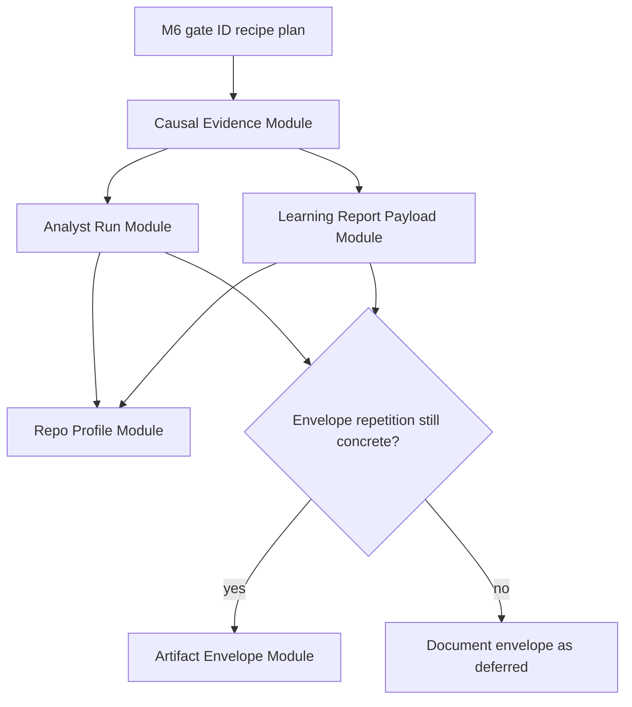

# refactor: Plan post-M6 architecture campaign

## Summary

Sequence the five findings from `.runtime/reports/architecture-review-20260528-030819.md` into a post-M6 architecture campaign. The campaign keeps M6 gate-ID recipe migration separate, tackles the causal evidence seam first, and treats the speculative artifact-envelope seam as a decision gate rather than guaranteed implementation.

---

## Problem Frame

The 2026-05-28 architecture review closes the prior shallow-seam campaign and gate-system C3, excludes the active M6 gate-ID recipe plan, and identifies the next places where policy still leaks across adapters. The strongest remaining signal is the causal evidence path: probe assignment, hook telemetry, cohort construction, alias normalization, and retirement queueing still require callers to know each other's rules.

The broader campaign also covers repeated analyst execution behavior, duplicated report payload semantics, repo-profile vocabulary hidden inside first-run setup, and a speculative artifact envelope seam. These are cross-adapter refactors, so each slice should deepen a domain module while leaving CLIs, dashboards, MCP tools, report renderers, and hook adapters shallow.

---

## Requirements

### Campaign Sequencing

- R1. The campaign must preserve the active M6 gate-ID recipe migration as a dependency, not absorb it into post-M6 architecture work.
- R2. The causal evidence module must be the first implementation slice because it is the top recommendation and carries H1/H2/H3 causal-risk evidence.
- R3. Analyst Run, Learning Report Payload, and Repo Profile slices must remain independently landable after the causal slice.
- R4. The Artifact Envelope slice must run only after analyst/report payload work proves repeated envelope rules across producers, or it must be explicitly documented as deferred.

### Module Boundaries

- R5. Each slice must deepen one module that owns policy and keep existing command, dashboard, MCP, hook, and renderer entrypoints as adapters.
- R6. Each module must provide a focused interface test surface so behavior can be proven without spawning unrelated command adapters.
- R7. Existing public command names, MCP tool names, dashboard payload contracts, and report output locations must remain stable unless a later plan explicitly scopes a public contract migration.

### Causal Evidence

- R8. Probe assignment semantics, cohort normalization, causal readiness, and retirement eligibility must be owned by one causal evidence module.
- R9. Hook collection may accept bounded telemetry, but it must not be the owner of causal assignment or readiness policy.
- R10. Gate retirement and inherited demotion queueing must require causal eligibility from the shared module instead of interpreting correlational labels inline.

### Analyst and Report Surfaces

- R11. Analyst selection, state loading, fallback behavior, artifact writing, and progress reporting must be owned by an Analyst Run module.
- R12. Markdown and HTML learning reports must consume one domain payload for shared report meaning, leaving renderer-specific presentation in renderer adapters.
- R13. Existing artifact writer destination, serialization, and max-size enforcement must stay separate from any payload-envelope rules.

### Repo Profile

- R14. Repo profile detection, documentation contract rows, and CE usage inputs must move behind an explicit Repo Profile module.
- R15. `alc_init`, `ce_playbook`, and session-context rendering must consume the shared profile vocabulary rather than carrying independent profile shape assumptions.

---

## Key Technical Decisions

- **KTD1. Campaign, not mega-refactor:** Each finding becomes a separate landable module slice. That keeps review blast radius small and lets the speculative envelope finding be validated after stronger seams land.
- **KTD2. Causal evidence owns readiness before queueing:** Retirement is the most behaviorally disruptive path in the review. It should depend on a causal evidence interface rather than letting `refresh_learning_state` combine labels and thresholds inline.
- **KTD3. Analyst execution is an orchestration module:** The analyst scripts already own query logic. The new module should own selection, state resolution, fallback envelopes, write dispatch, and progress reporting, not absorb every query implementation.
- **KTD4. Report payload precedes renderer cleanup:** Shared report meaning belongs in a payload module before renderer tests are simplified. Markdown and HTML adapters should prove presentation over the same payload, not encode parallel semantics.
- **KTD5. Repo profile is first-run domain logic, not setup glue:** Profiling and doc-contract vocabulary are durable ALC domain behavior. `alc_init` should orchestrate it, not own it.
- **KTD6. Envelope module has an evidence threshold:** Artifact envelopes are visible in analyst and dashboard payloads, but the review marks the seam speculative. Implement it only if at least three producers repeat the same envelope fields after Analyst Run and Learning Report Payload are planned or implemented.

---

## High-Level Technical Design

The dependency on M6 is a campaign guard, not a code dependency for every file. It prevents causal-retirement work from landing while gate identity migration is still active, because both paths interpret gate IDs, aliases, and retirement evidence.

---

## Campaign Queue

| Order | Finding | Strength | Campaign action | Primary module |
|---|---|---|---|---|
| 1 | Causal Evidence Module | Strong | Complete; module and adapter compatibility verified on 2026-05-28 | `agent-learning-compounder/bin/causal_evidence.py` |
| 2 | Analyst Run Module | Worth exploring | Complete; analyst-suite orchestration and fallback/write behavior centralized on 2026-05-28 | `agent-learning-compounder/bin/analyst_run.py` |
| 3 | Learning Report Payload Module | Worth exploring | Complete; markdown and HTML report semantics consume one payload on 2026-05-28 | `agent-learning-compounder/bin/learning_report_payload.py` |
| 4 | Repo Profile and Doc Contract Module | Worth exploring | Complete; first-run setup consumes shared repo-profile helpers on 2026-05-28 | `agent-learning-compounder/bin/repo_profile.py` |
| 5 | Artifact Envelope Module | Speculative | Complete; repeated analyst envelope fields centralized on 2026-05-28 | `agent-learning-compounder/bin/artifact_envelope.py` |

---

## Scope Boundaries

### In Scope

- New domain modules and focused tests for the five review findings.
- Thin adapter changes in existing CLIs, renderers, dashboard readers, MCP reads, hook collection, and first-run setup where needed to consume those modules.
- Campaign documentation that keeps the queue and rationale traceable to the source review.

### Deferred to Follow-Up Work

- Public command renames, MCP catalog changes, dashboard redesign, or report destination changes.
- Causal-probe server-side secret salt, if the causal evidence module proves that assignment gameability needs a separate public/runtime design.
- Cross-repo team federation or cloud-sync behavior.
- Any artifact-envelope implementation that does not meet the repetition threshold in KTD6.

### Out of Scope

- Reopening the completed 2026-05-28 shallow-seam campaign.
- Implementing or editing the active M6 gate-ID recipe plan.
- Rewriting historical hook events, reports, metrics, or analyzer artifacts.

---

## Implementation Units

### U1. Causal Evidence Module

- **Goal:** Centralize probe assignment, cohort normalization, causal readiness, alias-aware evidence, and retirement eligibility behind one causal evidence interface.
- **Requirements:** R2, R5, R6, R8, R9, R10.
- **Dependencies:** Completion of `docs/plans/2026-05-28-007-fix-gate-id-hash-recipe-plan.md`.
- **Files:** `agent-learning-compounder/bin/causal_evidence.py`, `agent-learning-compounder/bin/causal_probe`, `agent-learning-compounder/bin/evaluate_gate_effectiveness`, `agent-learning-compounder/bin/refresh_learning_state`, `agent-learning-compounder/bin/collect_hook_event`, `agent-learning-compounder/bin/gate_registry.py`, `agent-learning-compounder/fixtures/tests/test_causal_probe.py`, `agent-learning-compounder/fixtures/tests/test_probe_wiring.py`, `agent-learning-compounder/fixtures/tests/test_evaluate_gate_effectiveness.py`, `agent-learning-compounder/fixtures/tests/test_gate_alias_effectiveness.py`, `agent-learning-compounder/fixtures/tests/test_refresh_retirement_filter.py`, `agent-learning-compounder/fixtures/tests/test_causal_evidence.py`.
- **Approach:** Extract pure causal decisions into a module that can accept probe config, session evidence, alias maps, and scoring thresholds. Keep `causal_probe` as the register/decide CLI, `collect_hook_event` as the bounded telemetry adapter, `evaluate_gate_effectiveness` as the scoring output adapter, and `refresh_learning_state` as the queue-writing adapter.
- **Execution note:** Characterization-first. Lock current H1/H2/H3 behavior and alias normalization before moving logic.
- **Patterns to follow:** `gate_registry.alias_map` for alias validation; `evaluate_gate_effectiveness._normalize_sessions` for current alias folding; `refresh_learning_state._queue_retirement_candidates` for queue-row shape and idempotent row IDs.
- **Test scenarios:**
  - Given a registered probe and stable session ID, the module returns the same load/skip decision currently emitted by `causal_probe`.
  - Given old and current gate IDs connected by `previous_gate_ids`, cohort construction counts them as one logical gate and records contributing aliases.
  - Given correlational failure without causal probe readiness, the module marks the gate ineligible for retirement.
  - Given causal failure with enough loaded and skipped probe cohorts, the module marks the gate eligible for retirement or inherited demotion according to inherited-gate metadata.
  - Given malformed probe telemetry, the hook adapter drops invalid rows while the causal module receives only normalized decisions.
  - Given both load and skip decisions for an alias-collapsed gate in one session, load wins consistently with current scoring behavior.
- **Verification:** Queueing behavior remains byte-shape compatible for existing consumers, while tests can prove causal readiness and retirement eligibility through the module without shelling four adapters together.

### U2. Analyst Run Module

- **Goal:** Centralize analyst selection, state loading, fallback behavior, artifact writing, and progress reporting for the analyst suite.
- **Requirements:** R3, R5, R6, R11, R13.
- **Dependencies:** U1.
- **Files:** `agent-learning-compounder/bin/analyst_run.py`, `agent-learning-compounder/scripts/render_unified_report.py`, `agent-learning-compounder/bin/analyst_score`, `agent-learning-compounder/bin/analyst_anomalies`, `agent-learning-compounder/bin/analyst_correlations`, `agent-learning-compounder/bin/analyst_patterns`, `agent-learning-compounder/bin/artifact_writer.py`, `agent-learning-compounder/tests/test_analyst_run.py`, `agent-learning-compounder/tests/test_artifact_writer.py`.
- **Approach:** Introduce a registry of analyst adapters where each adapter contributes query execution and payload rows. The run module owns state handle resolution, fallback invocation, common envelope fields already shared by analysts, artifact write dispatch, and the set/order of analysts executed by the unified report path.
- **Execution note:** Characterize current CLI fallback payloads before routing them through the run module.
- **Patterns to follow:** `artifact_writer.write_artifact` for destination and serialization policy; `scripts/render_unified_report.py::_pipeline_commands` for current orchestration; individual analyst `run(state_handle, limit=...)` functions for adapter boundaries.
- **Test scenarios:**
  - Given events SQLite is present, the run module executes the configured analyst adapters in deterministic order and writes each registered artifact once.
  - Given events SQLite is missing, each analyst fallback payload preserves `fallback_mode`, `fallback_samples_count`, and empty-result behavior.
  - Given one analyst raises a known fallback-triggering error, the run module records that analyst's fallback without skipping unrelated analysts.
  - Given `render_unified_report.py` runs the pipeline, it delegates the analyst suite to `analyst_run` instead of shelling only `analyst_score`.
  - Given an artifact ID is not registered, the run module surfaces the existing artifact-writer error without swallowing it as fallback.
- **Verification:** The report pipeline and direct analyst CLIs share one run contract, and tests prove analyzer fallback/write behavior without invoking the whole dashboard launcher.

### U3. Learning Report Payload Module

- **Goal:** Build the report domain payload once so markdown and HTML reports share section semantics, evidence levels, muted-domain filtering, chart inputs, and report-history context.
- **Requirements:** R3, R5, R6, R12.
- **Dependencies:** U1; U2 may run first but is not a hard code dependency.
- **Files:** `agent-learning-compounder/bin/learning_report_payload.py`, `agent-learning-compounder/bin/distill_learning`, `agent-learning-compounder/bin/render_html_report`, `agent-learning-compounder/bin/render_dashboard`, `agent-learning-compounder/bin/dashboard_read_model.py`, `agent-learning-compounder/tests/test_render_html_report.py`, `agent-learning-compounder/fixtures/tests/test_agent_learning_compounder.py`, `agent-learning-compounder/tests/test_learning_report_payload.py`.
- **Approach:** Move shared report derivation out of renderer implementations into a pure payload builder. `distill_learning.render_report` becomes a markdown adapter over the payload. `render_html_report.build_report_payload` either moves to the new module or becomes a compatibility wrapper. Dashboard/static history readers stay focused on dashboard payloads unless they consume shared report-history fields.
- **Execution note:** Test-first around parity between current markdown and HTML payload semantics.
- **Patterns to follow:** Current `render_html_report.build_report_payload`; `distill_learning.render_report`; `dashboard_read_model.build_static_payload` for static dashboard payload shaping.
- **Test scenarios:**
  - Given the same corpus, baseline, domain rules, skill map, skill usage, and skill impact inputs, markdown and HTML adapters consume the same payload totals and memory-derived rows.
  - Given muted domains in the personal actions file, the payload excludes those domains before both markdown and HTML rendering.
  - Given prior report history exists, level-change context is represented once in the payload and is available to both adapters.
  - Given no reusable evidence exists, the payload carries the current fallback messaging without renderer-specific divergence.
  - Given skill impact rows contain candidate adjustments, chart and section inputs are derived from the payload rather than recomputed in the HTML renderer.
- **Verification:** Renderer tests focus on presentation, while payload tests prove report meaning once across markdown and HTML.

### U4. Repo Profile and Doc Contract Module

- **Goal:** Extract repo profiling, documentation contract rows, and CE usage inputs from first-run setup into an explicit module consumed by `alc_init`, `ce_playbook`, and session-context rendering.
- **Requirements:** R3, R5, R6, R14, R15.
- **Dependencies:** U1.
- **Files:** `agent-learning-compounder/bin/repo_profile.py`, `agent-learning-compounder/bin/alc_init`, `agent-learning-compounder/bin/ce_playbook.py`, `agent-learning-compounder/bin/session_context_render.py`, `agent-learning-compounder/tests/test_repo_profile.py`, `agent-learning-compounder/tests/test_alc_init.py`, `agent-learning-compounder/tests/test_ce_playbook.py`, `agent-learning-compounder/tests/test_session_context_render.py`.
- **Approach:** Move `detect_repo`, `DOC_CONTRACT`, `check_doc_contract`, and CE skill usage input shaping into a domain module. Keep `alc_init` responsible for CLI parsing, MCP smoke, state handle construction, and writing the rendered session context. Keep `ce_playbook` and `session_context_render` as consumers of profile/doc-contract data.
- **Execution note:** Characterize `alc_init` JSON summary output before extraction.
- **Patterns to follow:** Existing `alc_init.detect_repo` bounded traversal; `alc_init.check_doc_contract`; current `ce_playbook.render(profile, ce_installed, usage_counts=...)` inputs.
- **Test scenarios:**
  - Given a repo with package metadata and tests, `repo_profile.detect` returns the same languages, frameworks, package managers, frontend, monorepo, and test flags as current `alc_init`.
  - Given doc-contract files are present or missing, `repo_profile.doc_contract_rows` returns the same labels, paths checked, found path, generator, and tier.
  - Given CE usage rows from `alc_query`, the module produces the same usage-count input currently passed to `ce_playbook`.
  - Given `alc_init` runs with `--skip-mcp-smoke`, its JSON summary remains compatible while profile fields now originate from `repo_profile`.
  - Given `ce_playbook` receives an empty profile, its existing none/empty behavior remains unchanged.
- **Verification:** First-run behavior remains externally compatible, and profile/doc-contract tests no longer need to invoke `alc_init` as the owner of that vocabulary.

### U5. Artifact Envelope Decision and Optional Module

- **Goal:** Decide whether common artifact payload envelope rules deserve a module after U2 and U3, then either implement the module or record the seam as deferred.
- **Requirements:** R4, R5, R6, R13.
- **Dependencies:** U2, U3.
- **Files:** `agent-learning-compounder/bin/artifact_envelope.py`, `agent-learning-compounder/bin/artifact_writer.py`, `agent-learning-compounder/bin/analyst_score`, `agent-learning-compounder/bin/analyst_anomalies`, `agent-learning-compounder/bin/analyst_correlations`, `agent-learning-compounder/bin/analyst_patterns`, `agent-learning-compounder/bin/dashboard_read_model.py`, `agent-learning-compounder/bin/alc_query.py`, `agent-learning-compounder/data-contracts/base.json`, `agent-learning-compounder/data-contracts/manifests/u8-analyst.json`, `agent-learning-compounder/tests/test_artifact_envelope.py`, `agent-learning-compounder/tests/test_dashboard_read_model.py`, `agent-learning-compounder/tests/test_alc_query.py`.
- **Approach:** Start with an evidence pass over post-U2/U3 producer payloads. If at least three producers still repeat `generated_at`, fallback metadata, evidence IDs, lifecycle state, or similar envelope rules, add `artifact_envelope.py` to own envelope construction and validation. If repetition collapses into Analyst Run or Learning Report Payload, do not add the module; update this plan or campaign notes to mark the finding deferred.
- **Execution note:** Decision-first. Do not create the module just to satisfy the review if the stronger modules already remove the repetition.
- **Patterns to follow:** `artifact_writer` remains the destination/format/size contract owner; data-contract manifests remain registry metadata; analyst payloads and dashboard read models are the evidence surface for envelope repetition.
- **Test scenarios:**
  - Given the evidence threshold is not met, no new module is introduced and the campaign records Artifact Envelope as deferred.
  - Given the threshold is met, envelope construction adds common fields consistently for at least three producers.
  - Given a producer supplies evidence IDs, the envelope preserves them without changing producer-specific payload rows.
  - Given `artifact_writer.write_artifact` receives an enveloped payload, destination, serialization, and max-size enforcement remain unchanged.
  - Given dashboard or query consumers read enveloped artifacts, public read shapes stay compatible or gain only explicitly planned additive metadata.
- **Verification:** The speculative finding is either converted into a justified module with tests or intentionally left out with documented rationale.

---

## System-Wide Impact

This campaign touches the core evidence loop described in `STRATEGY.md`: bootstrap, ingest, score, report, and refresh. The main impact is positive locality: future changes to causal guarantees, analyst execution, report meaning, and repo-profile vocabulary should land in domain modules instead of being patched across adapters.

The campaign also affects review behavior. Each slice should leave command-level compatibility tests in place, but the strongest regression checks should move closer to the new module interfaces.

## Campaign Progress

- U1 Causal Evidence Module is complete. `bin/causal_evidence.py` now owns
  probe assignment, probe-decision vocabulary, alias-aware evidence rows,
  causal signal thresholds, and retirement/demotion eligibility. The adapters
  remain stable: `causal_probe` keeps probes-file CLI behavior,
  `collect_hook_event` keeps hook safety policy, `evaluate_gate_effectiveness`
  keeps event loading and JSON output, and `refresh_learning_state` keeps queue
  locking and row serialization.
- U2 Analyst Run Module is complete. `bin/analyst_run.py` owns analyst adapter
  selection, state resolution, fallback payload handling, artifact writes, and
  pipeline progress while individual analyst modules keep query logic.
- U3 Learning Report Payload Module is complete. `bin/learning_report_payload.py`
  owns shared report totals, memory-derived rows, skill sections, muted-domain
  filtering, and report-history context for markdown and HTML adapters.
- U4 Repo Profile and Doc Contract Module is complete. `bin/repo_profile.py`
  owns repository detection, documentation contract rows, and CE usage-count
  shaping while `alc_init`, `ce_playbook`, and session-context rendering consume
  the shared vocabulary.
- U5 Artifact Envelope Module is complete. `bin/artifact_envelope.py` owns the
  repeated analyst artifact envelope fields; `artifact_writer` remains the
  destination, serialization, and max-size adapter.
- Verification: focused suites for causal evidence, analyst run, report payload,
  repo profile, and artifact envelope passed during the 2026-05-28 campaign.
  The post-M6 architecture campaign is complete; future architecture plans
  should start from fresh review evidence rather than treating U2 as next.

---

## Risks & Dependencies

- **Active M6 overlap:** Gate identity and causal evidence both interpret gate IDs and aliases. Mitigation: do not start U1 until the active M6 plan is completed or explicitly superseded.
- **Over-deepening adapters:** There is a risk of moving CLI/report presentation details into domain modules. Mitigation: modules own policy and normalized payloads; adapters keep parsing, rendering, and user-facing text.
- **Speculative envelope churn:** Adding an envelope module too early could create an abstraction without enough leverage. Mitigation: U5 has a concrete repetition threshold and a valid defer outcome.
- **Test fragility during extraction:** Existing tests may assert adapter internals. Mitigation: add characterization tests first, then move shared assertions to module tests and keep adapter compatibility coverage focused on public behavior.

---

## Sources / Research

- `.runtime/reports/architecture-review-20260528-030819.md` - source findings and recommendation strength.
- `docs/dev/architecture-review-campaign-2026-05-28.md` - prior campaign queue and completion status.
- `docs/plans/2026-05-28-007-fix-gate-id-hash-recipe-plan.md` - active M6 scope to keep separate.
- `docs/dev/gate-system-review-2026-05.md` - H1/H2/H3/M6 context referenced by the source review.
- `STRATEGY.md` - current ALC target problem, evidence loop, and active tracks.
- `agent-learning-compounder/bin/causal_probe`, `agent-learning-compounder/bin/evaluate_gate_effectiveness`, `agent-learning-compounder/bin/refresh_learning_state`, `agent-learning-compounder/bin/collect_hook_event`, `agent-learning-compounder/bin/gate_registry.py` - causal evidence surface.
- `agent-learning-compounder/scripts/render_unified_report.py`, `agent-learning-compounder/bin/analyst_score`, `agent-learning-compounder/bin/analyst_anomalies`, `agent-learning-compounder/bin/analyst_correlations`, `agent-learning-compounder/bin/analyst_patterns`, `agent-learning-compounder/bin/artifact_writer.py` - analyst run and artifact surface.
- `agent-learning-compounder/bin/distill_learning`, `agent-learning-compounder/bin/render_html_report`, `agent-learning-compounder/bin/render_dashboard`, `agent-learning-compounder/bin/dashboard_read_model.py` - report payload surface.
- `agent-learning-compounder/bin/alc_init`, `agent-learning-compounder/bin/ce_playbook.py`, `agent-learning-compounder/bin/session_context_render.py` - repo profile and session-context surface.
