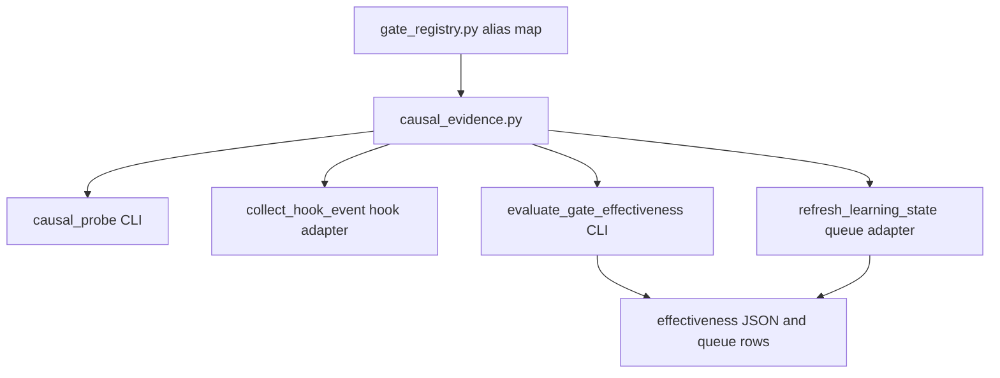
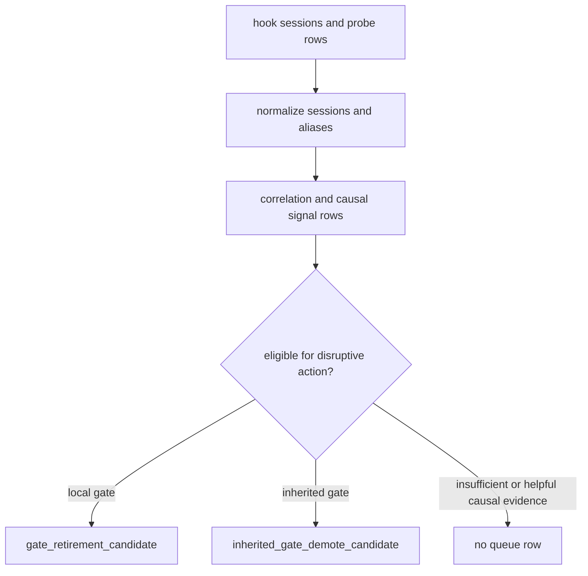

# refactor: Add causal evidence module

## Summary

Create `agent-learning-compounder/bin/causal_evidence.py` as the owner of probe assignment semantics, probe telemetry normalization, alias-aware cohort evaluation, causal readiness, and retirement eligibility. Existing CLIs, hook collection, scoring output, and refresh queueing remain stable adapters over that module.

---

## Problem Frame

The post-M6 architecture campaign identifies Causal Evidence as the first post-M6 slice because causal policy is still spread across `causal_probe`, `collect_hook_event`, `evaluate_gate_effectiveness`, `refresh_learning_state`, and `gate_registry.py`. Recent gate-system fixes already hardened several behaviors inline: probe-rate validation, resilient event loading, alias normalization, causal gating before retirement, stable retirement row IDs, and inherited demotion routing.

The next risk is not another isolated bug fix. It is ownership drift: future changes to probe assignment, cohort construction, and retirement readiness still require maintainers to know which adapter owns which part of the causal contract. This plan consolidates the working behavior behind a module interface while keeping public command names, queue row shapes, hook-event fields, and report output stable.

---

## Requirements

### Module Ownership

- R1. `causal_evidence.py` must own probe-decision recipe semantics, probe-rate validation, accepted probe decision values, alias-aware evidence normalization, causal signal thresholds, and retirement eligibility decisions.
- R2. `causal_probe`, `collect_hook_event`, `evaluate_gate_effectiveness`, and `refresh_learning_state` must remain adapters; they may parse inputs, enforce hook telemetry size bounds, write files, and render existing CLI output, but must not duplicate causal policy.
- R3. Existing public command names, CLI arguments, hook-event field names, effectiveness JSON keys, queue row kinds, and queue row evidence fields must remain compatible.
- R4. The module must provide a focused test surface so causal behavior can be proven without running the whole refresh pipeline.

### Causal Evidence Behavior

- R5. Probe assignment must preserve the current frozen decision recipe unless a future plan explicitly scopes a recipe migration.
- R6. Probe telemetry normalization must keep the current bounded `load` / `skip` decision contract and reject malformed decision entries without crashing hook collection.
- R7. Alias normalization must continue folding `previous_gate_ids` into the canonical current gate ID for loaded gates and probe decisions.
- R8. When both old and current IDs contribute to a canonical gate, output evidence must preserve contributing previous IDs.
- R9. Causal signal labeling must preserve current thresholds and `PROBE_COHORT_MIN_N` behavior.
- R10. Retirement or inherited-demotion eligibility must require both correlational evidence and allowed causal evidence, not correlation alone.

### Adapter Compatibility

- R11. `evaluate_gate_effectiveness` must keep loading resilient event sessions and writing the same JSON output shape.
- R12. `refresh_learning_state` must keep queue append, locking, dedup, and row serialization behavior while delegating candidate eligibility and row evidence decisions.
- R13. `collect_hook_event` must keep its allowlist, size caps, secret scrubbing, schema version, and log-write behavior while delegating causal decision vocabulary where practical.
- R14. Durable docs must make Causal Evidence the campaign's completed module boundary after implementation evidence exists and leave Analyst Run as the next queued slice.

---

## Key Technical Decisions

- **KTD1. Extract policy, not storage:** The module should return normalized evidence rows, probe decisions, and retirement eligibility descriptions. It should not write hook logs, effectiveness files, probes files, or improvement queues; adapters already own those storage contracts.
- **KTD2. Preserve frozen recipes during extraction:** The current `causal_probe.decide` recipe and threshold labels are compatibility contracts. Moving them into a module must start with characterization tests and keep the existing frozen-value tests meaningful.
- **KTD3. Treat correlation and causality as one evidence model:** `evaluate_gate_effectiveness` currently computes both correlational labels and causal probe labels. The module should return one row model containing both, so `refresh_learning_state` cannot accidentally queue a disruptive action from correlation alone.
- **KTD4. Keep hook safety in the hook adapter:** `collect_hook_event` should still own telemetry allowlisting, size caps, scrubbing, schema versioning, rotation, and file locking. The causal module can own the accepted probe-decision vocabulary and entry normalization, but not general hook-event policy.
- **KTD5. Keep alias parsing in `gate_registry.py`:** The registry parser remains the source of approved-gate block semantics. Causal Evidence consumes an alias map or parsed registry data; it does not become a second gate registry parser.

---

## High-Level Technical Design

The first diagram is the ownership target: all causal policy arrows point through `causal_evidence.py`, while adapters keep their public surfaces. The second diagram is the behavioral target: retirement queueing is a consumer of normalized evidence, not a separate interpretation of scorer labels.

---

## Scope Boundaries

### In Scope

- New `causal_evidence.py` module and focused unit tests.
- Adapter refactors in `causal_probe`, `collect_hook_event`, `evaluate_gate_effectiveness`, and `refresh_learning_state` where needed to consume the module.
- Compatibility coverage for current CLI output, hook telemetry, effectiveness rows, and queue rows.
- Durable documentation updates after implementation evidence exists.

### Deferred to Follow-Up Work

- Server-side secret salt or server-assigned probe decisions for adversarial probe hardening.
- Reweighting co-loaded gate cohorts or changing the statistical model for H1.
- Changing the frozen probe assignment recipe, gate-ID recipe, or Unicode/hash migration behavior.
- Analyst Run, Learning Report Payload, Repo Profile, or Artifact Envelope modules from the broader campaign.

### Out of Scope

- Public command renames or MCP catalog changes.
- Rewriting historical hook events, probes, effectiveness artifacts, reports, or queue rows.
- Moving general hook-event security, telemetry allowlisting, or file rotation into the causal module.

---

## Implementation Units

### U1. Extract Probe Decision Contract

- **Goal:** Move probe-rate validation, frozen probe decision recipe, and accepted probe decision vocabulary into `causal_evidence.py`, leaving `causal_probe` as the file-backed CLI adapter.
- **Requirements:** R1, R2, R3, R4, R5, R6.
- **Dependencies:** None.
- **Files:** `agent-learning-compounder/bin/causal_evidence.py`, `agent-learning-compounder/bin/causal_probe`, `agent-learning-compounder/fixtures/tests/test_causal_probe.py`, `agent-learning-compounder/fixtures/tests/test_causal_probe_boundaries.py`, `agent-learning-compounder/fixtures/tests/test_causal_evidence.py`.
- **Approach:** Start by adding a pure probe contract in the new module. `causal_probe.decide` becomes a thin wrapper or import from that module. Keep `_locked_probes`, CLI parsing, file IO, and stderr messages in `causal_probe`. The module should expose enough vocabulary for later hook and scorer units to reuse the same decision validation.
- **Execution note:** Characterization-first. Preserve the current frozen-value tests before moving the recipe.
- **Patterns to follow:** Frozen recipe cases in `fixtures/tests/test_causal_probe_boundaries.py`; existing rate validation and boundary-warning behavior in `bin/causal_probe`.
- **Test scenarios:**
  - Given each frozen `(session_id, gate_id, rate)` case, the module returns the same `load` or `skip` verdict as the current CLI.
  - Given `rate` is `2.0`, `-0.5`, or non-numeric, the module rejects it and the CLI still reports the existing invalid-probe-entry error.
  - Given `rate` is `0.0` or `1.0`, registration still succeeds and the adapter warning behavior remains unchanged.
  - Given an unregistered gate, `causal_probe decide` still prints `load`.
- **Verification:** Probe decision behavior can be tested directly through `causal_evidence.py`, and the existing `causal_probe` CLI tests continue to pass unchanged or with only import-path expectations updated.

### U2. Centralize Probe Telemetry Normalization

- **Goal:** Let the causal module own the valid probe decision entry shape while `collect_hook_event` retains telemetry bounds, allowlisting, scrubbing, and log writes.
- **Requirements:** R1, R2, R3, R4, R6, R13.
- **Dependencies:** U1.
- **Files:** `agent-learning-compounder/bin/causal_evidence.py`, `agent-learning-compounder/bin/collect_hook_event`, `agent-learning-compounder/fixtures/tests/test_probe_wiring.py`, `agent-learning-compounder/fixtures/tests/test_collect_hook_event_schema_v2.py`, `agent-learning-compounder/fixtures/tests/test_causal_evidence.py`.
- **Approach:** Extract the repeated `probe_decisions` entry validation into a small pure helper that accepts raw entries plus caller-supplied limits. `collect_hook_event` should still decide when the field is allowed, how many entries are retained, how long gate IDs may be, and whether the final event survives scrubbing. The helper should only normalize valid `{gate_id, decision}` entries against the shared decision vocabulary.
- **Patterns to follow:** Existing `probe_decisions` handling in `collect_hook_event.normalize_event`; bounded-list policy used for `gate_loaded_ids`.
- **Test scenarios:**
  - Given valid `probe_decisions`, `collect_hook_event` emits the same list of normalized `load` and `skip` entries.
  - Given invalid decision strings, missing `gate_id`, non-dict members, or non-list payloads, malformed entries are dropped without failing the whole event.
  - Given more than the maximum number of valid entries, the adapter keeps the current capped count and order.
  - Given overlong gate IDs or secret-shaped values, the adapter still drops or redacts according to the current hook-event policy.
- **Verification:** Hook telemetry tests prove output compatibility, while module tests prove decision-entry normalization without invoking the hook writer.

### U3. Move Alias-Aware Evidence Evaluation

- **Goal:** Move session normalization, alias folding, causal cohort scoring, and evidence row construction from `evaluate_gate_effectiveness` into `causal_evidence.py`.
- **Requirements:** R1, R2, R3, R4, R7, R8, R9, R11.
- **Dependencies:** U1, U2.
- **Files:** `agent-learning-compounder/bin/causal_evidence.py`, `agent-learning-compounder/bin/evaluate_gate_effectiveness`, `agent-learning-compounder/bin/gate_registry.py`, `agent-learning-compounder/fixtures/tests/test_evaluate_gate_effectiveness.py`, `agent-learning-compounder/fixtures/tests/test_evaluate_gate_effectiveness_resilience.py`, `agent-learning-compounder/fixtures/tests/test_gate_alias_effectiveness.py`, `agent-learning-compounder/fixtures/tests/test_causal_evidence.py`.
- **Approach:** Keep `evaluate_gate_effectiveness.load_sessions` as the resilient event-log reader unless implementation shows a clean pure-reader boundary. Move `_normalize_sessions`, `PROBE_COHORT_MIN_N`, label thresholding, causal-signal thresholding, and row assembly into the module. Keep `evaluate_gate_effectiveness` responsible for CLI parsing, event-file checks, alias-map loading through `gate_registry.py`, and JSON file output.
- **Execution note:** Characterize current output rows before extraction, especially alias-contribution fields and `causal_signal` labels.
- **Patterns to follow:** Current `evaluate_gate_effectiveness.evaluate`; alias tests in `fixtures/tests/test_gate_alias_effectiveness.py`; resilience tests that pin malformed JSON, rotated backups, and v1 row skipping.
- **Test scenarios:**
  - Given current gate-effectiveness fixtures, the CLI still emits one row per seen logical gate with the same labels, deltas, counts, and causal signals.
  - Given old and current gate IDs connected by `previous_gate_ids`, loaded gates and probe decisions fold to the canonical ID.
  - Given aliases contribute to a canonical gate, the row carries `contributing_previous_gate_ids`.
  - Given malformed JSON lines, rotated backup files, or v1 rows, session loading behavior remains unchanged.
  - Given probe cohorts below `PROBE_COHORT_MIN_N`, the row keeps `causal_signal: needs_review`.
- **Verification:** `evaluate_gate_effectiveness` becomes a thin adapter over module evidence rows, and causal evidence can be proven without spawning the CLI.

### U4. Move Retirement Eligibility Policy

- **Goal:** Move disruptive-action eligibility from `refresh_learning_state` into the causal module while leaving queue locking and serialization in the refresh adapter.
- **Requirements:** R1, R2, R3, R4, R8, R10, R12.
- **Dependencies:** U3.
- **Files:** `agent-learning-compounder/bin/causal_evidence.py`, `agent-learning-compounder/bin/refresh_learning_state`, `agent-learning-compounder/fixtures/tests/test_refresh_retirement_filter.py`, `agent-learning-compounder/fixtures/tests/test_evaluate_gate_effectiveness.py`, `agent-learning-compounder/fixtures/tests/test_gate_alias_effectiveness.py`, `agent-learning-compounder/fixtures/tests/test_causal_evidence.py`.
- **Approach:** Introduce a pure eligibility helper that accepts evidence rows, inherited-gate map, minimum retirement cohort size, and allowed causal signals. It should return typed candidate descriptions with gate ID, candidate kind, derived origin when applicable, evidence payload, and stable row ID input. `refresh_learning_state` should keep file locking, existing-row membership checks, timestamp formatting, JSONL append behavior, and queue summary counts.
- **Execution note:** Characterization-first around queue rows. The adapter output is user-facing operator workflow state.
- **Patterns to follow:** `_queue_retirement_candidates`, `_RETIRE_CAUSAL_OK`, `_retirement_row_id`, and fail-closed inherited demotion behavior in `refresh_learning_state`.
- **Test scenarios:**
  - Given a correlationally failing gate with no causal probe data, no retirement candidate is returned.
  - Given a correlationally failing gate with `causal_correlated_with_success`, no retirement candidate is returned.
  - Given a correlationally failing local gate with allowed causal evidence and both cohorts at `min_n_retire`, the helper returns a `gate_retirement_candidate`.
  - Given the same evidence for an inherited gate, the helper returns an `inherited_gate_demote_candidate` and carries `derived_from`.
  - Given alias-contributed evidence, the returned candidate evidence preserves `contributing_previous_gate_ids`.
  - Given repeated refresh calls over the same candidate, queue rows remain idempotent through the existing stable ID contract.
- **Verification:** Retirement and demotion decisions are testable as pure policy, and refresh tests still prove queue file compatibility under the adapter.

### U5. Update Architecture and Campaign Documentation

- **Goal:** Record Causal Evidence ownership after implementation evidence exists and keep the post-M6 campaign queue current.
- **Requirements:** R14.
- **Dependencies:** U1, U2, U3, U4.
- **Files:** `ARCHITECTURE.md`, `CONTEXT.md`, `STRATEGY.md`, `agent-learning-compounder/AGENTS.md`, `docs/dev/architecture-review-campaign-2026-05-28.md`, `docs/plans/2026-05-28-008-refactor-post-m6-architecture-campaign-plan.md`, `docs/plans/2026-05-28-009-refactor-causal-evidence-module-plan.md`.
- **Approach:** Update docs only after module and adapter tests prove the boundary. Architecture docs should describe Causal Evidence as the owner of probe assignment semantics, normalized evidence rows, and retirement eligibility. `AGENTS.md` should direct future causal/probe/retirement work through the module first. The campaign queue should mark Causal Evidence complete and identify Analyst Run as the next post-M6 slice.
- **Patterns to follow:** Completed-slice evidence language in `docs/dev/architecture-review-campaign-2026-05-28.md`; module ownership bullets in `agent-learning-compounder/AGENTS.md`; current architecture wording for gate identity and read/propose seams.
- **Test scenarios:**
  - Test expectation: none -- documentation-only unit.
- **Verification:** Future agents can identify Causal Evidence as completed, know the module path and test evidence, and see the next queued post-M6 slice without rereading the whole review.

---

## System-Wide Impact

This refactor touches the evidence loop that decides whether durable gates should stay active, be retired locally, or be demoted when inherited. That makes the module boundary more important than the amount of code moved: disruptive queueing should depend on one evidence contract, and all adapters should use that contract consistently.

The change also strengthens the repo's named-seam discipline from `STRATEGY.md` and `AGENTS.md`. Future causal or probe changes should land in `causal_evidence.py` first, with command, hook, scorer, and refresh adapters consuming the module.

---

## Risks & Dependencies

- **Risk: recipe drift during extraction.** Moving `causal_probe.decide` can accidentally change cohort assignment. Mitigation: keep frozen-value tests active and extract under characterization coverage.
- **Risk: queue row shape drift.** Retirement and demotion rows are operator-facing workflow state. Mitigation: keep serialization in `refresh_learning_state` and assert row fields in adapter tests.
- **Risk: hook safety boundary blurs.** The causal module should not own general telemetry security. Mitigation: only move probe-decision vocabulary and entry normalization; leave allowlists, caps, scrubbing, rotation, and writes in `collect_hook_event`.
- **Risk: module overreach into gate registry parsing.** Alias-map construction already belongs to `gate_registry.py`. Mitigation: pass alias maps or parsed blocks into the module instead of reparsing approved-gate markdown there.

---

## Sources / Research

- `.runtime/reports/architecture-review-20260528-030819.md` - source recommendation naming Causal Evidence as the top post-M6 module.
- `docs/plans/2026-05-28-008-refactor-post-m6-architecture-campaign-plan.md` - campaign sequencing and scope boundary for the first post-M6 slice.
- `docs/dev/gate-system-review-2026-05.md` - H1/H2/H3 causal-risk context and remaining adversarial hardening boundaries.
- `docs/dev/architecture-review-campaign-2026-05-28.md` - completed shallow-seam campaign evidence and next-planning rule.
- `STRATEGY.md` - evidence loop, read/propose seam discipline, and gate-effectiveness metrics.
- `agent-learning-compounder/AGENTS.md` - local seam ownership guidance for future agents.
- `agent-learning-compounder/bin/causal_probe` - current probe recipe, rate validation, and probes-file adapter.
- `agent-learning-compounder/bin/collect_hook_event` - hook telemetry allowlist, bounded probe-decision passthrough, and log-write policy.
- `agent-learning-compounder/bin/evaluate_gate_effectiveness` - current resilient session loading, alias normalization, correlation scoring, and causal signal row output.
- `agent-learning-compounder/bin/refresh_learning_state` - current retirement/demotion queue adapter and disruptive-action eligibility checks.
- `agent-learning-compounder/bin/gate_registry.py` - approved-gate parser and alias-map ownership.
- `agent-learning-compounder/fixtures/tests/test_causal_probe_boundaries.py`, `agent-learning-compounder/fixtures/tests/test_probe_wiring.py`, `agent-learning-compounder/fixtures/tests/test_evaluate_gate_effectiveness.py`, `agent-learning-compounder/fixtures/tests/test_gate_alias_effectiveness.py`, `agent-learning-compounder/fixtures/tests/test_refresh_retirement_filter.py` - current characterization and compatibility coverage to preserve.
