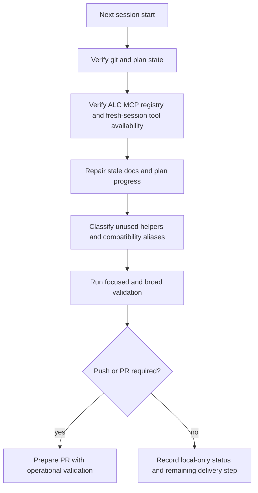

# fix: Operational closeout checklist for post-M6 campaign

## Summary

Close the gap between "tests pass" and "operationally done" for the post-M6 architecture campaign. The next session should verify the live tool surface, repair stale docs, decide the dead-code/compatibility surface, resolve repository hygiene, and leave the branch in an explicitly deliverable state.

## Problem Frame

The post-M6 refactor branch has broad local validation, but it is not operationally complete by the stricter bar:

- The ALC MCP is registered and smokes through JSON-RPC, but current-session `mcp__alc__...` tools have not been exercised through Codex's live tool surface.
- Several docs still describe pre-refactor ownership or stale campaign progress.
- Some now-unused helpers and compatibility aliases have not been either removed, archived, deprecated, or documented as intentional compatibility.
- The branch is ahead of origin and still has at least one untracked plan artifact.

This plan is a checklist for the next session to convert validated local code into an honest operational closeout.

## Requirements

### Operational Truth

- R1. The closeout must distinguish validated code, pushed/PR state, installed runtime state, and current-session tool availability.
- R2. The ALC MCP must be verified from the source-backed registration and either exercised through a fresh Codex tool surface or documented with the exact current-session limitation.
- R3. The final answer must state whether the work is local-only, pushed, in PR, or released.

### Docs Freshness

- R4. Any doc that names old module ownership or stale campaign progress must be updated or explicitly marked as historical.
- R5. The completed post-M6 campaign plan must not claim U2 is still next after U2-U5 have shipped.
- R6. Architecture and bootstrap docs must reflect that shared helpers now own the extracted behavior.

### Dead Code And Compatibility

- R7. Unused helpers and compatibility aliases must be classified as remove, deprecate, or keep-with-contract.
- R8. Kept compatibility APIs must have tests or docs that make their status explicit.
- R9. Removed internal code must leave no import references and must preserve broad test pass.

### Repository Hygiene

- R10. Untracked M6 plan artifacts must be resolved as tracked, ignored, archived, or intentionally left untracked with a reason.
- R11. Final branch status must be reported, including ahead/behind state and remaining dirty files.
- R12. Validation must include focused checks for touched surfaces plus broad regression gates.

## Key Technical Decisions

- KTD1. Audit before mutation: start by inventorying current git state, MCP registration, current tool catalog, stale docs, and unused symbols.
- KTD2. Treat docs drift as blocking operational completion, not as optional polish.
- KTD3. Treat current-session MCP availability separately from source registration and JSON-RPC smoke success.
- KTD4. Do not call compatibility aliases dead code until their public import risk has been checked.
- KTD5. Keep release/archive verification out of scope unless the session is explicitly turned into a publish or release task.

## High-Level Technical Design

## Scope Boundaries

### In Scope

- `docs/plans/2026-05-28-008-refactor-post-m6-architecture-campaign-plan.md`
- `docs/plans/2026-05-28-007-fix-gate-id-hash-recipe-plan.md`
- `docs/dev/bootstrap-wiring-audit-2026-05-27.md`
- `docs/dev/architecture-review-campaign-2026-05-28.md`
- `agent-learning-compounder/bin/distill_learning`
- `agent-learning-compounder/bin/alc_init`
- `agent-learning-compounder/bin/repo_profile.py`
- `agent-learning-compounder/bin/learning_report_payload.py`
- ALC MCP registration, JSON-RPC smoke, and fresh-session Codex tool visibility
- Final validation and delivery-state report

### Out Of Scope

- Redesigning the post-M6 architecture campaign.
- Adding new MCP tools or changing the MCP catalog contract unless verification exposes a defect.
- Rebuilding release archives or publishing a package unless the user explicitly asks for release work.
- Broad security review beyond checking that MCP/tool exposure matches the intended source-backed runtime.

## Implementation Units

### U1. Establish Live Operational Inventory

**Goal:** Make the starting state explicit before changing files.

**Files To Inspect:**

- `docs/plans/2026-05-28-008-refactor-post-m6-architecture-campaign-plan.md`
- `docs/plans/2026-05-28-007-fix-gate-id-hash-recipe-plan.md`
- `.agent-learning.json`
- ALC MCP source registration and server entrypoint

**Checklist:**

- Record branch name, ahead/behind state, dirty files, and untracked artifacts.
- Confirm whether the ALC MCP registration points at the active source checkout.
- Confirm whether the current Codex session exposes `mcp__alc__...` tools.
- If the current session cannot hot-load the MCP, plan a fresh-session verification or document the limitation precisely.

**Verification:**

- Operational inventory is captured in the session closeout.
- No files are mutated during this unit except the active plan if the session tracks checklist progress.

### U2. Repair Post-M6 Campaign Docs

**Goal:** Remove stale campaign-progress claims.

**Files To Modify:**

- `docs/plans/2026-05-28-008-refactor-post-m6-architecture-campaign-plan.md`
- `docs/dev/architecture-review-campaign-2026-05-28.md`

**Checklist:**

- Update the completed plan so Campaign Progress reflects U1-U5 completion.
- Remove or rewrite any statement that says U2 is still the next campaign slice.
- Update the architecture campaign doc so Analyst Run, Report Payload, Repo Profile, Artifact Envelopes, and Plan Tracker ownership match the refactored code.
- Mark any intentionally retained historical notes as historical.

**Verification:**

- Stale phrases about U2 being next no longer appear in active status sections.
- Docs distinguish active architecture from historical campaign notes.

### U3. Repair Bootstrap And Repo-Profile Docs Drift

**Goal:** Align bootstrap docs with extracted ownership.

**Files To Modify:**

- `docs/dev/bootstrap-wiring-audit-2026-05-27.md`
- `agent-learning-compounder/bin/repo_profile.py`
- `agent-learning-compounder/bin/alc_init`

**Checklist:**

- Update docs that still imply `alc_init` owns repository detection or doc-contract checks directly.
- State that shared repo-profile helpers own detection and contract evaluation, while `alc_init` orchestrates the CLI/bootstrap path.
- Preserve historical context only where clearly labeled.

**Verification:**

- Docs no longer mislead a reader toward editing the wrong module.
- Any code references in docs resolve to current files and ownership.

### U4. Decide Dead Code And Compatibility Surface

**Goal:** Remove internal dead code or make retained compatibility explicit.

**Files To Inspect Or Modify:**

- `agent-learning-compounder/bin/distill_learning`
- `agent-learning-compounder/bin/alc_init`
- Relevant tests under `agent-learning-compounder/tests/`

**Checklist:**

- Confirm whether `distill_learning.render_skill_sections(...)` is unused after the learning-payload extraction.
- If internal-only, remove it and any tests that only preserve dead behavior.
- If retained, document why and add or keep coverage that makes its contract explicit.
- Check `alc_init.detect_repo` and `alc_init.check_doc_contract` import risk.
- Either remove aliases, deprecate them, or add compatibility coverage/docs.

**Verification:**

- No removed symbol is still imported.
- Kept compatibility symbols are intentionally covered or documented.
- Focused tests cover any changed compatibility decision.

### U5. Prove MCP And Tool Leverage Boundary

**Goal:** Make the ALC MCP status operationally honest.

**Files To Inspect Or Modify:**

- `agent-learning-compounder/alc_mcp/server.py`
- `agent-learning-compounder/alc_mcp/catalog.py`
- `docs/dev/architecture-review-campaign-2026-05-28.md` if documentation needs an MCP-status note

**Checklist:**

- Verify the `alc` MCP registration points at the source checkout.
- Verify JSON-RPC `tools/list` returns the expected ALC tool catalog.
- In a fresh Codex session, verify whether `mcp__alc__...` tools are visible and usable.
- If tool use is unavailable, record the exact boundary: registration, server smoke, and current-session/fresh-session visibility.

**Verification:**

- The closeout says either "ALC MCP tool used through Codex" or "ALC MCP registered and smoked, but live Codex tool use was unavailable because ...".
- No ambiguous claim remains that "all tools were leveraged" unless they actually were.

### U6. Final Delivery Hygiene

**Goal:** Leave the branch ready for the next human or PR step.

**Files To Modify:**

- Any docs or tests touched by U2-U5.
- This plan file, if the session marks it complete.

**Checklist:**

- Resolve `docs/plans/2026-05-28-007-fix-gate-id-hash-recipe-plan.md` as tracked, intentionally untracked, archived, or out-of-scope.
- Run focused tests for any touched modules.
- Run broad regression gates used by the post-M6 refactor campaign.
- Check whitespace/diff hygiene.
- State whether commits were created, whether the branch was pushed, and whether a PR exists or is needed.

**Verification:**

- Final validation gates pass or failures are documented with exact failing surface.
- Final git status is reported.
- Remaining work, if any, is explicit and bounded.

## System-Wide Impact

This closeout reduces the risk that future sessions read stale architecture docs, edit the wrong module, or overstate MCP/tool readiness. It also protects the repo's core operational promise: `latest-approved-gates.md`, `latest-skill-context.md`, and `latest-session-context.md` should be backed by honest runtime and documentation state.

## Risks And Mitigations

- **Risk:** Removing a compatibility alias breaks external import users.
  **Mitigation:** Search import usage first and keep/deprecate with explicit coverage if public risk exists.

- **Risk:** Docs are over-normalized and lose useful campaign history.
  **Mitigation:** Label historical notes rather than deleting all prior context.

- **Risk:** MCP fresh-session verification is not possible inside the current session.
  **Mitigation:** Record the exact verified layers and the missing layer instead of claiming full operational completion.

- **Risk:** Release/archive work expands the session beyond the user's requested closeout list.
  **Mitigation:** Keep packaging verification deferred unless the user explicitly asks for release or publish.

## Open Questions

- Should the next session push/PR the post-M6 branch, or keep the closeout local until the user reviews it?
- Should compatibility aliases be treated as public API for installed users, or can they be removed after internal reference checks?
- Should the untracked M6 plan be preserved as part of the historical plan set?

## Sources

- `STRATEGY.md`
- `docs/plans/2026-05-28-008-refactor-post-m6-architecture-campaign-plan.md`
- `docs/dev/bootstrap-wiring-audit-2026-05-27.md`
- `docs/dev/architecture-review-campaign-2026-05-28.md`
- `agent-learning-compounder/bin/distill_learning`
- `agent-learning-compounder/bin/alc_init`
- `agent-learning-compounder/bin/repo_profile.py`
- `agent-learning-compounder/bin/learning_report_payload.py`
