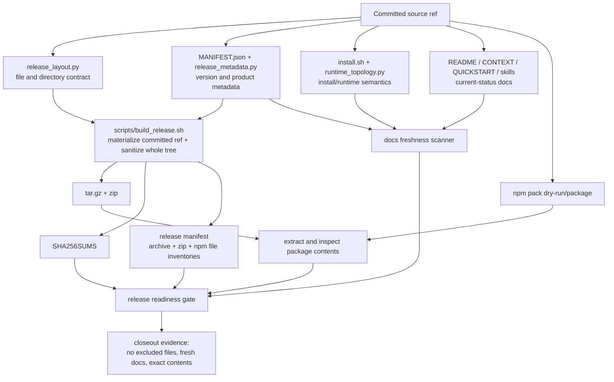

# fix: Release install control and package freshness

## Summary

Make the install, package, and release-control story truthful and mechanically verified. The current repo already has strong release metadata and layout contracts, but the operational surface still has gaps:

- install docs blur two different "auto" behaviors: zero-argument `install.sh` filesystem detection vs. `--bootstrap-repo --runtime auto` repo/env resolution.
- release artifacts can include excluded files from top-level shipped directories, proven by the existing `dist/...plus2.3.tar.gz` containing `scripts/__pycache__/merge_dev_hooks.cpython-314.pyc`.
- docs contain current-status claims that have drifted from source truth, including version, MCP tool count, and test counts.
- there is no full content manifest for all shipped package targets, only layout rules and archive-level checksums.

This plan fixes the control system, not just today's visible strings. It adds package extraction checks, npm package checks, docs freshness tests, a multi-target release manifest, and explicit install-mode wording so future releases fail before stale docs or dirty package contents ship.

## Requirements

### Install and Runtime Truth

- **R1:** Document the one-command install paths precisely. Superseded by the later install flip: `./install.sh` with no args now performs a project-local install in the current repo, while user/global installs require explicit target flags.
- **R2:** Preserve explicit runtime install commands for Codex, Claude, and both runtimes; do not imply a single mode gives every runtime 100% live behavior without flags and prerequisites.
- **R3:** Document the dry-run/apply boundary for runtime hooks: bootstrap plans hooks by default and writes hooks only with `--apply-runtime-hooks`.
- **R4:** Document optional dependency and host-load boundaries: `alc_init` can smoke `alc_mcp` but optional MCP deps need `--install-deps`; dashboard React bundling is best-effort and continues with fallback HTML when `pnpm` is missing or build fails; `--plugin` Claude discovery happens on the next Claude Code launch; Codex MCP registration is not performed by bootstrap and must not be implied.
- **R5:** Keep install behavior stable unless a test-backed change is deliberately made; this plan's primary install changes are docs/help/test corrections.

### Source Package and Release Correctness

- **R6:** Release archives must exclude generated/cache files across every shipped top-level path, including `scripts/`, `docs/`, and `agent-learning-compounder/`, not only the inner skill tree.
- **R7:** Release validation must inspect extracted `.tar.gz`, `.zip`, and `npm pack` outputs for required entrypoints, excluded files, generated/cache leakage, and expected archive/package differences.
- **R8:** Publishable release builds must materialize packages from committed `HEAD` by default, using `git archive HEAD` or equivalent committed-ref materialization; dirty/ignored working-tree packaging is allowed only through an explicit non-publishable local experiment mode.
- **R9:** Archive and npm package contents may differ, but those differences must be intentional, documented, and test-covered.
- **R10:** `MANIFEST.json`, `release_layout.py`, and release scripts must agree on version, required files, package roots, and generated artifact names.

### Manifest and Freshness Control

- **R11:** Add a generated multi-target release manifest for archive, zip, and npm contents with per-file paths and hashes where available, so the project can answer "what exactly is in every shipped package target?"
- **R12:** Add source-scope freshness guards for README/CONTEXT/current docs: release version, MCP tool count, and test-count wording must match source truth or be clearly marked historical.
- **R13:** Add release-scope stale-phrase scanning over every shipped markdown file so old operational promises such as stale self-test wording, stale test counts, stale MCP counts, and misleading "auto-detect" claims cannot enter release artifacts.
- **R14:** Mark superseded `docs/dev/*audit*.md` as historical and prune internal `docs/plans`, `docs/history`, and `docs/decisions` from shipped packages unless a file is explicitly promoted to public release-facing documentation.

### Validation and Closeout

- **R15:** Focused tests must cover each new release-control behavior, and broad validation must include archive extraction, npm pack inspection, docs freshness, and existing artifact validation.
- **R16:** The final closeout must rebuild package artifacts from the corrected source and prove the previous `scripts/__pycache__` leak is gone.
- **R17:** No release/publish action is in scope unless a later user request explicitly asks to publish.

## Context and Research

### Repo Evidence

- `install.sh` already has two distinct install pathways:
  - zero-argument install detects `~/.claude` and `~/.agents`, prompts if both exist, defaults to Codex when neither exists, and turns on verification.
  - zero-argument install copies the skill to the selected global runtime root, builds dashboard assets best-effort, runs verification, and prints repo-init commands; it does not initialize the current repo or apply repo runtime hooks.
  - `--bootstrap-repo --runtime auto` resolves through `AGENT_LEARNING_RUNTIME`, repo hints in `AGENTS.md`/`CLAUDE.md`/`GEMINI.md`, then defaults to Codex.
- `install.sh` currently makes runtime hook writes explicit through `--apply-runtime-hooks`; otherwise it reports the hook install command as a dry run.
- `alc_init` installs optional MCP dependencies only when invoked with `--install-deps`; bootstrap calls it best-effort without that flag.
- `scripts/build_release.sh` stages source and sanitizes `stage_root/agent-learning-compounder`, but does not currently sanitize every shipped top-level directory.
- `agent-learning-compounder/bin/release_layout.py` is the canonical layout contract for top-level release files and directories.
- Existing release artifact `dist/agent-learning-compounder-2026.05.27+review7-plus2.3.tar.gz` contains `scripts/__pycache__/merge_dev_hooks.cpython-314.pyc`, proving archive extraction checks are required.
- Existing tests verify release metadata and layout policy, but not extracted archive/package contents.
- README/CONTEXT current-status text has drifted from source truth for version, MCP tool count, and test counts.

### Second-Opinion Findings Already Folded In

Three read-only second-opinion investigations shaped this plan:

- Install/runtime review: confirmed the correct command matrix and the misleading docs around "auto-detects Codex vs Claude".
- Package/source review: confirmed `build_release.sh`, `release_layout.py`, npm packaging behavior, generated artifact names, and the top-level `scripts/__pycache__` archive leak.
- Stale refs/control review: identified stale README/CONTEXT values and the missing guardrails tying docs to metadata, MCP catalog, and test collection.

## Key Technical Decisions

1. **Use source code and tests as release truth, not prose.**  
   Current operational docs should be generated from, or checked against, `release_metadata.py`, `MANIFEST.json`, `release_layout.py`, MCP catalog data, and unittest collection. Hand-edited docs remain allowed, but tests must reject stale current-status claims.

2. **Keep the two "auto" install semantics distinct.**  
   The no-arg installer is allowed to filesystem-detect host runtimes because it is a local machine convenience path. Repo bootstrap auto-resolution should remain deterministic from env/repo hints and default Codex behavior unless a future implementation deliberately changes it.

3. **Verify built artifacts, not just builder intent.**  
   Policy tests around `release_layout.py` are necessary but insufficient. The closeout gate must extract the actual tarball/zip and inspect `npm pack` output, because the known `scripts/__pycache__` leak bypassed policy-level checks.

4. **Sanitize the whole staged release tree.**  
   The release builder should apply exclusion rules to every shipped directory after staging. This is the smallest reliable fix for generated files in top-level `scripts/`, `docs/`, or any future shipped root.

5. **Add a release file manifest instead of pretending `MANIFEST.json` is complete.**  
   `MANIFEST.json` is product metadata. A package content manifest should be generated during release validation and include `archive.files[]`, `zip.files[]`, and `npm.files[]` with paths, sizes, content hashes, and archive-only/npm-only category reasons. Npm hashes must come from an actual locally packed `.tgz`, not dry-run metadata.

6. **Build publishable packages from tracked source by default.**  
   Publishable release artifacts should come from committed `HEAD`. Dirty working-tree packaging is allowed only behind an explicit local experiment override and must be labeled non-publishable. Final artifact rebuild in U7 happens after the implementation is committed or the tree is otherwise clean at the selected committed source ref.

7. **Treat old audit docs as historical evidence, not live status.**  
   `docs/dev` can keep useful investigation history, but shipped or source-visible audit files must be clearly marked historical/superseded when they describe fixed gaps.

8. **Scope freshness checks separately for source and release.**  
   Source-scope scanning protects repo-visible truth such as `CONTEXT.md` and `docs/dev`. Release-scope scanning protects extracted package docs. Both scopes are required because not every source-visible control file is shipped.

9. **Keep validation helper ownership narrow.**  
   `release_layout.py` owns file-selection policy, `validate_artifacts` remains the metadata/artifact consistency checker, `docs_freshness.py` owns text freshness, `release_manifest.py` owns generated package inventories, and `validate_release_ready.py` only orchestrates existing validators plus extraction/npm checks.

## High-Level Technical Design

This is a control loop around install truth, package contents, and docs freshness. The diagram is intentionally non-prescriptive about exact function names; implementation should follow existing `bin/` script and unittest patterns.

## Implementation Units

### U1 - Normalize Install and Runtime Wording

**Goal:** Make user-facing install docs and help text match actual runtime behavior.

**Files:**

- `README.md`
- `docs/QUICKSTART.md`
- `docs/llm-install-prompt.md`
- `install.sh`
- `agent-learning-compounder/skills/alc-core/SKILL.md`
- `agent-learning-compounder/tests/test_install_targets.py`

**Approach:**

- Replace broad "auto-detects Codex vs Claude" wording with a command matrix:
  - no-arg local install: `./install.sh`
  - Codex repo bootstrap: `./install.sh --bootstrap-repo "$PWD" --runtime codex --verify`
  - Claude repo bootstrap: `./install.sh --bootstrap-repo "$PWD" --runtime claude --verify`
  - both runtimes: `./install.sh --bootstrap-repo "$PWD" --runtime all --verify`
  - hook writes: add `--apply-runtime-hooks`
- State explicitly that the no-arg `./install.sh` path is project-local by default. It initializes the current repo and applies repo-local hooks; user/global runtime installs require explicit flags.
- Clarify that `--runtime auto` is deterministic repo/env resolution, not filesystem detection.
- Update prompt/docs that mention exact final stdout lines or "self-test passed" text to assertions that tests can verify without depending on stale phrasing.
- Clarify optional dependency and host reload boundaries: `alc_init` optional deps, Claude plugin next-launch discovery, no automatic Codex MCP registration, and best-effort dashboard bundling with fallback HTML.

**Test Scenarios:**

- Installer help/docs test asserts `--bootstrap-repo --runtime auto` is not described as filesystem detection.
- Installer help/docs test asserts no-arg install is not described as repo bootstrap or hook application.
- Quickstart/doc fixture test asserts runtime hook writes mention `--apply-runtime-hooks`.
- Skill docs test asserts `alc_init` dependency wording mentions `--install-deps` or best-effort optional deps.
- Quickstart/doc fixture test asserts Codex MCP registration is not implied by bootstrap.

**Verification:**

- From `agent-learning-compounder/`: `python3 -m unittest tests.test_install_targets`
- Docs freshness test from U4.

### U2 - Sanitize All Shipped Release Paths

**Goal:** Prevent generated/cache files from entering release archives from any shipped top-level path.

**Files:**

- `scripts/build_release.sh`
- `agent-learning-compounder/bin/release_layout.py`
- `agent-learning-compounder/tests/test_release_layout.py`
- `agent-learning-compounder/tests/test_release_archive_contents.py` (new)

**Approach:**

- Move the sanitizer boundary from `stage_root/agent-learning-compounder` to the whole staged release root, or iterate every staged top-level path from `release_layout.py`.
- Keep exclusion patterns centralized so builder behavior and tests use the same release layout contract.
- Add a test that builds or constructs a staged tree with excluded files under `scripts/`, `docs/`, and `agent-learning-compounder/`, then verifies all are removed.
- Add extracted archive list assertions for `__pycache__`, `*.pyc`, `.pytest_cache`, `node_modules`, nested `dist`, `.agent-learning`, and `.agent-learning.json`.

**Test Scenarios:**

- Synthetic top-level `scripts/__pycache__/x.pyc` is removed before archive creation.
- Synthetic `docs/.pytest_cache/` is removed before archive creation.
- Existing package extraction check fails if any excluded path remains in tar or zip contents.

**Verification:**

- From `agent-learning-compounder/`: `python3 -m unittest tests.test_release_layout tests.test_release_archive_contents`
- From repo root: `./scripts/build_release.sh --version <test-version>` followed by archive listing check.

### U3 - Add Release File Manifest and Committed-Source Gate

**Goal:** Give releases a complete file/content inventory and prevent accidental dirty-source packaging.

**Files:**

- `MANIFEST.json`
- `scripts/build_release.sh`
- `agent-learning-compounder/bin/release_layout.py`
- `agent-learning-compounder/bin/release_manifest.py` (new, if a dedicated helper is cleaner)
- `package.json`
- `agent-learning-compounder/tests/test_release_metadata.py`
- `agent-learning-compounder/tests/test_release_manifest.py` (new)

**Approach:**

- Generate `dist/agent-learning-compounder-<version>.release-manifest.json` during release build/readiness, containing package name/version, source commit, archive root, and separate `archive.files[]`, `zip.files[]`, and `npm.files[]` sections.
- Include each file path, file size, SHA-256 where content is available, and a category/reason for archive-only or npm-only files.
- Keep `MANIFEST.json` as product metadata; do not overload it with generated per-file data.
- Materialize publishable source from committed `HEAD` by default, using `git archive HEAD` or equivalent committed-ref materialization.
- Add an explicit `--source-ref <ref>` path if releases need to build from a ref other than `HEAD`; publishable mode must not read arbitrary working-tree files.
- Add a local experiment mode that can materialize the worktree or index, but labels artifacts non-publishable and requires an explicit override such as `ALC_ALLOW_DIRTY_RELEASE=1`.
- Add a clean-source preflight that fails publishable mode when tracked diffs, untracked files, or ignored files under package-included roots could affect a release path before the developer commits the implementation.
- Assert `package.json.files` and npm entrypoints agree with `release_layout.NPM_FILES` or equivalent canonical npm layout data.
- Assert normalized tar and zip file inventories match exactly, with matching per-file hashes after stripping archive roots.
- Make the manifest deterministic enough for comparison: sorted paths, normalized archive-root stripping, and stable hash calculation.

**Test Scenarios:**

- Manifest generation includes known required files such as `README.md`, `install.sh`, `bootstrap.sh`, `agent-learning-compounder/bin/alc_init.py`, and `scripts/build_release.sh`.
- Manifest generation excludes `dist/`, `node_modules/`, `.pytest_cache/`, and `__pycache__/`.
- Manifest generation includes npm package entries and fails if npm contains a file not represented in the expected npm manifest.
- Npm package hashes are generated by running `npm pack --pack-destination <tmp>`, extracting the `.tgz`, and hashing actual package files.
- Normalized tar and zip inventories and hashes match.
- Dirty package-affecting tracked diffs, untracked files, and ignored files fail publishable mode by default and pass only with the explicit non-publishable override.
- Non-package-affecting local files are either ignored by documented rules or fail with a clear message if they cannot be safely classified.

**Verification:**

- From `agent-learning-compounder/`: `python3 -m unittest tests.test_release_manifest tests.test_release_metadata`
- Inspect `dist/agent-learning-compounder-<version>.release-manifest.json` after a release build.

### U4 - Add Docs Freshness Scanner

**Goal:** Prevent stale current-status claims from surviving in source-visible and shipped docs.

**Files:**

- `agent-learning-compounder/bin/docs_freshness.py` (new)
- `agent-learning-compounder/tests/test_docs_freshness.py` (new)
- `README.md`
- `CONTEXT.md`
- `docs/QUICKSTART.md`
- `CHANGES.md`
- `agent-learning-compounder/skills/alc-core/SKILL.md`
- `agent-learning-compounder/alc_mcp/catalog.py`
- `agent-learning-compounder/bin/release_layout.py`
- `docs/dev/*audit*.md`
- `docs/plans/`
- `docs/history/`
- `docs/decisions/`

**Approach:**

- Add a small structured scanner rather than ad hoc regex in multiple tests.
- Define two explicit scanner scopes:
  - `--source-scope` covers repo-visible truth: `README.md`, `CONTEXT.md`, `docs/QUICKSTART.md`, current `CHANGES.md` sections, skill docs, and `docs/dev/*audit*.md`.
  - `--release-scope` covers extracted package markdown and every shipped `.md` returned by the release layout.
- Scanner inputs:
  - current release version from release metadata / `MANIFEST.json`
  - MCP catalog count from `alc_mcp.catalog.MCP_TOOLS`
  - unittest collection counts from live discovery under the inner package root for `tests/` and `fixtures/tests/`; exact-count enforcement belongs in `validate_release_ready.py`, not ordinary unit tests
  - release file list from `release_layout.py`
- Scanner rules:
  - README and CONTEXT current-status sections must match version and MCP count.
  - Test-count claims must either match collection or be explicitly historical.
  - Stale operational phrases in shipped docs are errors.
  - Historical changelog entries are allowed when they are clearly in dated release-note context.
  - Shields/badge URLs, URL-encoded test counts, command comments, verify-section snippets, and "current/latest" wording are scanned, not only prose paragraphs.
  - Every shipped markdown file under `docs/` is release-facing operational/historical content; internal `docs/plans`, `docs/history`, and `docs/decisions` are pruned from release artifacts by default.

**Test Scenarios:**

- README with `12 MCP tools` fails when catalog exposes a different current count.
- README release badge version and URL-encoded test-count badge fail when they disagree with source truth.
- CONTEXT with an old production version fails unless marked historical.
- `CHANGES.md` dated release history does not fail for old counts when context is historical.
- `docs/QUICKSTART.md` fails if it implies bootstrap auto filesystem detection.
- Source-scope scan covers internal `docs/plans`, `docs/history`, and `docs/decisions`, but release-scope validation fails if those directories are shipped without explicit release-facing promotion.
- Source-scope scan catches stale `CONTEXT.md` even though `CONTEXT.md` is not a release archive file.

**Verification:**

- From `agent-learning-compounder/`: `python3 -m unittest tests.test_docs_freshness`
- From `agent-learning-compounder/`: `python3 bin/docs_freshness.py --source-scope`
- From `agent-learning-compounder/`: `python3 bin/docs_freshness.py --release-scope --root <extracted-package-root>`

### U5 - Mark Historical Audits and Bound Dev Docs

**Goal:** Keep useful investigation history without letting old audit text read as current product truth.

**Files:**

- `docs/dev/bootstrap-wiring-audit-2026-05-27.md`
- `docs/dev/read-surface-audit-2026-05-27.md`
- `docs/plans/`
- `docs/history/`
- `docs/decisions/`
- `agent-learning-compounder/bin/release_layout.py`
- `agent-learning-compounder/tests/test_docs_freshness.py`

**Approach:**

- Add a consistent historical/superseded notice in the first 20 lines of stale audit docs that are still valuable.
- Require the notice to include `Superseded by: <plan/doc path>` or `Historical status: <reason>` so agents can route the stale content correctly.
- Keep `docs/dev` pruned from release artifacts unless a future release deliberately ships developer internals.
- Prune internal `docs/plans`, `docs/history`, and `docs/decisions` from release artifacts by default. If a file in those trees is intentionally public/release-facing, it must move to a release-facing docs path or carry an explicit allow-rule in `release_layout.py`.
- Add scanner behavior requiring `docs/dev/*audit*.md` with old gap claims or unmarked "currently" language to carry a historical marker.

**Test Scenarios:**

- Audit doc with old current-state wording and no historical marker fails freshness validation.
- Audit doc with the marker below the first 20 lines fails freshness validation.
- Audit doc with historical marker passes source freshness validation but remains excluded from release artifacts.
- Internal plan/history/decision markdown is excluded by release layout unless explicitly promoted to a release-facing path.

**Verification:**

- From `agent-learning-compounder/`: `python3 -m unittest tests.test_docs_freshness tests.test_release_layout`

### U6 - Add End-to-End Release Readiness Gate

**Goal:** Make closeout one command or one documented sequence that proves source, archive, npm package, docs, and manifest agree.

**Files:**

- `agent-learning-compounder/bin/validate_release_ready.py` (new)
- `agent-learning-compounder/bin/validate_artifacts`
- `scripts/build_release.sh`
- `package.json`
- `agent-learning-compounder/tests/test_release_readiness.py` (new)
- `docs/QUICKSTART.md`

**Approach:**

- Add a release readiness command that:
  - runs existing metadata/artifact validators,
  - builds release archives into `dist/`,
  - extracts tar and zip to temp,
  - runs exclusion checks against extracted file lists,
  - runs docs freshness over shipped docs with `docs_freshness.py --release-scope --root <extracted-package-root>` once for tar and once for zip,
  - runs `npm pack --dry-run --json` or equivalent inspection for fast npm file-list validation,
  - runs `npm pack --pack-destination <tmp>`, extracts the local `.tgz`, and hashes actual npm package files for the release manifest,
  - validates npm output for excluded paths such as `__pycache__`, `*.pyc`, `.pytest_cache`, `node_modules`, nested `dist`, `.agent-learning`, and `.agent-learning.json`,
  - asserts `package.json.files` agrees with the canonical npm package layout,
  - asserts normalized tar and zip file inventories match exactly,
  - verifies expected archive-vs-npm differences are documented,
  - writes or verifies `dist/agent-learning-compounder-<version>.release-manifest.json`,
  - builds into a temp or version-scoped output directory, or fails if `SHA256SUMS` contains stale artifacts outside the current release set.
- Keep network and publish operations out of this gate.
- Document the gate in release/quickstart docs as the pre-publish closeout command.

**Test Scenarios:**

- Gate fails when an extracted archive contains `*.pyc`.
- Gate fails when npm package omits a required npm entrypoint.
- Gate fails when npm package contains `agent-learning-compounder/__pycache__/x.pyc` or another excluded generated file.
- Gate fails when normalized tar and zip inventories or hashes differ.
- Gate passes when archive excludes npm-only files that are explicitly documented as npm-only.
- Gate fails when docs freshness scanner reports a current-status mismatch.
- Gate fails when `SHA256SUMS` includes an old-version tarball or zip outside the current release artifact set.

**Verification:**

- From `agent-learning-compounder/`: `python3 -m unittest tests.test_release_readiness`
- From `agent-learning-compounder/`: `python3 bin/validate_release_ready.py`

### U7 - Update Current Docs and Rebuild Evidence

**Goal:** Bring current docs and artifacts into line after guardrails exist.

**Files:**

- `README.md`
- `CONTEXT.md`
- `docs/QUICKSTART.md`
- `CHANGES.md`
- generated `dist/*` artifacts

**Approach:**

- Update current version/tool/test-count wording only after U4 can catch regressions.
- Commit or otherwise select the corrected source ref, then rebuild publishable release artifacts from committed `HEAD` or the explicit committed source ref.
- Confirm the previous archive leak is absent.
- Record closeout evidence in `CHANGES.md` or the repo's normal closeout location, without publishing.

**Test Scenarios:**

- Full focused suite from U1-U6 passes.
- Archive listing grep for excluded files returns no matches.
- npm dry-run file inspection reports no excluded paths.
- npm packed `.tgz` extraction and hash manifest generation succeeds.
- Docs freshness scanner passes against the exact shipped docs.

**Verification:**

- Focused unit tests from U1-U6.
- Existing broader closeout gate used by the repo, including `python3 -m unittest discover` from the inner package root if runtime allows.
- `tar -tzf dist/<new-release>.tar.gz | rg '__pycache__|\\.pyc|\\.pytest_cache|node_modules|/dist/'` returns no output.

## System-Wide Impact

- **Installer contract:** User-facing install promises become narrower and more accurate. The installer's behavior should remain stable unless tests expose a mismatch.
- **Release contract:** `scripts/build_release.sh` becomes a stronger gate and publishable mode builds from committed source. Local dirty-tree artifacts require an explicit non-publishable experiment path.
- **Docs contract:** README/CONTEXT/QUICKSTART become test-covered surfaces. Future copy edits that change current status numbers or install semantics may need corresponding source-truth updates.
- **Package contract:** Archive, zip, and npm package differences become explicit. This reduces ambiguity but requires tests to distinguish expected differences from omissions.
- **CI/local cost:** Docs freshness and release-readiness checks add validation work. Keep expensive archive/npm checks in release readiness or focused tests, not every tiny unit test.

## Risks and Mitigations

- **Risk:** Committed-source release builds hide useful local experiment files during developer testing.  
  **Mitigation:** Provide an explicit override with clear "not for publish" wording.

- **Risk:** Test-count freshness becomes brittle if full unittest discovery is slow or environment-sensitive.  
  **Mitigation:** Put strict count checks in release readiness and keep ordinary unit tests focused on scanner behavior; if needed, generate count metadata as part of the release gate.

- **Risk:** Stale-phrase scans over docs produce false positives for historical changelog entries.  
  **Mitigation:** Require context-aware allow rules for dated `CHANGES.md` sections and explicit historical markers.

- **Risk:** Manifest hashing produces noisy diffs if timestamps or archive roots leak into per-file data.  
  **Mitigation:** Hash file content only, sort paths, and normalize archive root out of manifest entries.

- **Risk:** npm package inspection may need package-manager behavior that differs by npm version.  
  **Mitigation:** Use `npm pack --dry-run --json` where available, and isolate parsing behind a helper with tests using fixture output.

## Out of Scope

- Publishing to npm, GitHub releases, plugin registries, or any external distribution channel.
- Redesigning runtime hook behavior beyond documenting and testing the existing dry-run/apply boundary.
- Hot-loading MCP servers into already-running Codex or Claude sessions.
- Rewriting historical changelog entries except where a current-status section is misleading.
- Dashboard UI changes or runtime feature development unrelated to release/install control.

## Validation Plan

Run validation in this order:

1. Focused install/runtime docs tests:
   - from `agent-learning-compounder/`: `python3 -m unittest tests.test_install_targets`
   - from `agent-learning-compounder/`: `python3 -m unittest tests.test_docs_freshness`
2. Focused release/package tests:
   - from `agent-learning-compounder/`: `python3 -m unittest tests.test_release_layout tests.test_release_metadata`
   - from `agent-learning-compounder/`: `python3 -m unittest tests.test_release_archive_contents tests.test_release_manifest tests.test_release_readiness`
3. Existing validators:
   - from `agent-learning-compounder/`: `python3 bin/validate_artifacts --check-manifest-merge`
   - from `agent-learning-compounder/`: `python3 bin/docs_freshness.py --source-scope`
   - from `agent-learning-compounder/`: `python3 bin/docs_freshness.py --release-scope --root <extracted-package-root>`
   - from `agent-learning-compounder/`: `python3 bin/validate_release_ready.py`
4. Package evidence:
   - `./scripts/build_release.sh --version <next-version>`
   - inspect `dist/SHA256SUMS`
   - inspect `dist/agent-learning-compounder-<version>.release-manifest.json`
   - verify tar/zip contain no excluded paths
   - inspect `npm pack --dry-run --json`
   - inspect and hash extracted `npm pack --pack-destination <tmp>` output
5. Broad gate:
   - run the repo's established broad unittest discovery from the inner package root if runtime allows.

## Open Questions

1. Should `agent-learning-compounder-<version>.release-manifest.json` be committed, only generated in `dist/`, or both?  
   Default for this plan: generate into `dist/` and test the generator; do not commit per-release generated output unless a publish workflow asks for it.

2. Should docs freshness enforce exact unittest counts in normal unit tests or only release readiness?  
   Default for this plan: exact counts in release readiness; lightweight fixture/scanner tests in normal unit tests.
