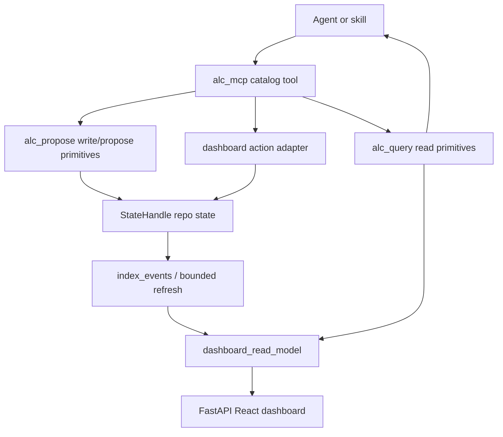
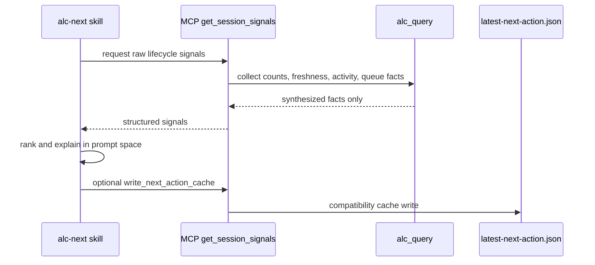
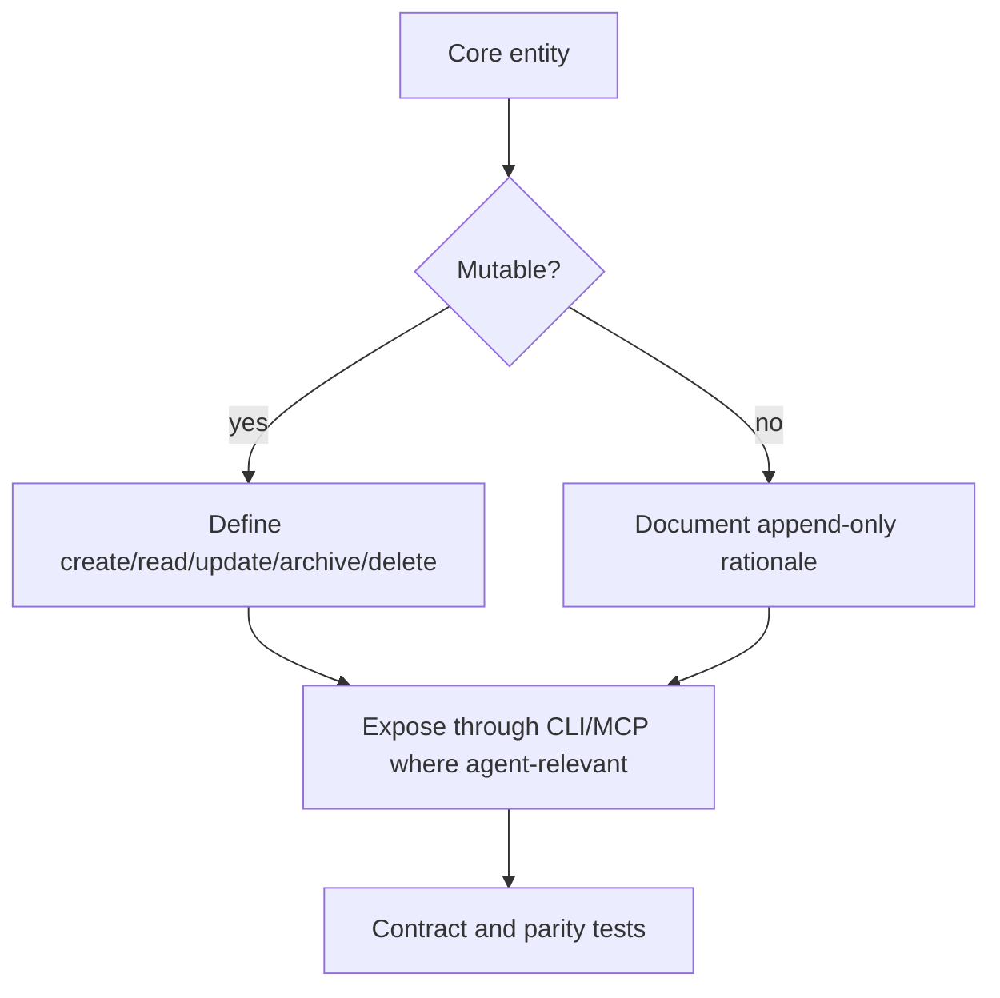

# refactor: Agent-native architecture hardening

## Summary

This plan turns the 2026-05-28 agent-native audit into a sequenced hardening program. The work improves semantic MCP parity, prompt-native decision ownership, lifecycle contracts, write visibility, capability discovery, state diagnostics, context freshness, and dashboard staleness while preserving the current read/propose seams.

The plan treats `docs/plans/2026-05-28-012-agent-native-audit-summary.md` as the contract: the system is already agent-facing, but too much operational behavior still requires shell fallback, code-owned orchestration, stale documentation, and incomplete lifecycle verbs.

---

## Problem Frame

The audit scored ALC at 55% strict agent-native maturity. The strongest current foundation is the canonical seam discipline: `bin/alc_query.py` owns reads, `bin/alc_propose.py` owns propose/write behavior, `bin/state_handle.py` owns repo-local state topology, and `alc_mcp/catalog.py` registers the MCP surface from a single catalog. The weakness is that agents still need to assemble shell commands for many dashboard and lifecycle actions, and several read surfaces do not immediately reflect writes.

The target architecture remains aligned with `STRATEGY.md`: local-first state, read-only defaults, explicit durable writes, compact synthesized context, and catalog-backed discovery. This plan does not replace those boundaries; it fills the missing primitive verbs and moves workflow policy out of opaque code paths where practical.

---

## Requirements

### MCP Parity And Primitive Tools

- R1. Agents can perform dashboard action workflows through semantic MCP tools without relying on `exec_sandbox` for the primary path.
- R2. Dashboard action state, latest report content, and action job status are readable through structured MCP responses.
- R3. `next_action` remains compatible for current callers while a new primitive signal tool lets prompt-owned skills make the ranking decision.
- R4. MCP tool metadata, human-readable catalogs, and reference docs stay generated or guarded from the live catalog.

### State, Lifecycle, And Visibility

- R5. Each core entity has an explicit lifecycle contract: mutable entities expose create/read/update/archive/delete semantics where appropriate, and append-only entities document why mutation is intentionally unsupported.
- R6. MCP writes that affect dashboard-visible state become visible in the shared dashboard read model without waiting for an unrelated hook run.
- R7. Proposal queue state is included in React/FastAPI dashboard data and remains available through `alc_query`.
- R8. Repo identity diagnostics identify canonical project state, inner-package state splits, unindexed dev event sinks, and legacy diagnostic state.

### Context, Discovery, And UI Freshness

- R9. Session-start context states its freshness and includes compact workspace facts that agents otherwise shell out for first.
- R10. Users and agents can inspect installed capabilities, hook status, SQL/index status, dashboard status, MCP tools, commands, and install/runtime status from one command and one dashboard panel.
- R11. Dashboard live URL lookup and UI data age make stale or dead state visible instead of implying health.
- R12. Code-owned workflow recipes shrink toward primitive artifact behavior plus prompt-owned policy text.

---

## Key Technical Decisions

- KTD1. Preserve `alc_query` and `alc_propose` as the read/write seams. New MCP behavior should call through those seams or small adjacent modules, not inline JSONL, SQLite, or dashboard filesystem reads in `alc_mcp/server.py`.
- KTD2. Add semantic tools incrementally and keep `exec_sandbox` as an escape hatch. The audit goal is direct parity for common user-facing actions, not removal of bounded execution.
- KTD3. Split `next_action` by adding a raw signal primitive before changing the existing `next_action` behavior. This protects current M11 callers while allowing `skills/alc-next/SKILL.md` to own ranking and prose.
- KTD4. Treat write-to-read propagation as a shared indexing/read-model concern. Individual write functions should return enough structured metadata for callers and trigger a bounded refresh/index path where needed, but they should not each grow separate dashboard-refresh logic.
- KTD5. Use generated catalogs and tests for discovery truth. Documentation that lists MCP tools, commands, or capability types should be rendered from source registries or guarded by parity tests.
- KTD6. Prefer bounded fast refresh before full live eventing. SSE or WebSocket support remains optional until MCP writes, dashboard actions, and live URL status expose data age and refresh deterministically.

---

## High-Level Technical Design

### Agent Action Flow

### Prompt-Owned Next Action Split

### Lifecycle Contract Shape

---

## Scope Boundaries

### In Scope

- Direct MCP parity for dashboard action workflows identified by the audit.
- Compatibility-preserving extraction of `next_action` signals into primitive tools.
- Lifecycle contracts and high-value lifecycle verb gaps for core entities.
- Dashboard read-model visibility for proposal queue and write propagation.
- Capability discovery command/panel backed by live catalogs.
- Repo identity and state sink diagnostics.
- Session context freshness and compact workspace facts.
- Bounded dashboard freshness and live URL health.
- Documentation freshness checks for MCP/capability surfaces.

### Deferred To Follow-Up Work

- Full replacement of the dashboard polling model with SSE or WebSocket if bounded refresh and data-age indicators satisfy the immediate staleness risk.
- Complete removal of `exec_sandbox`; it remains a bounded fallback even after direct semantic parity improves.
- Team-grade or cloud-backed capability discovery beyond the local operator model described in `STRATEGY.md`.
- Broad redesign of recommender generation. This plan only moves workflow recipes toward prompt-owned policy where practical without weakening generator artifact validation.

---

## Implementation Units

### U1. Correct Catalog And Capability Documentation

- **Goal:** Make live capability documentation truthful before adding more tools.
- **Requirements:** R4, R10.
- **Dependencies:** None.
- **Files:**
  - `agent-learning-compounder/alc_mcp/catalog.py`
  - `agent-learning-compounder/reference-lib/mcp-catalog`
  - `agent-learning-compounder/reference-lib/capability-map`
  - `agent-learning-compounder/bin/render_catalogs.py`
  - `agent-learning-compounder/tests/test_mcp_catalog_doc.py`
  - `agent-learning-compounder/tests/test_capability_map.py`
  - `agent-learning-compounder/tests/test_render_catalogs.py`
  - `README.md`
  - `agent-learning-compounder/alc_mcp/README.md`
- **Approach:** Extend the existing catalog-rendering and parity-test pattern so MCP counts, M-ID rows, tool names, backing modules, and capability categories are validated from source registries. Capability docs should distinguish semantic MCP tools, real CLI entrypoints, generated reference catalogs, and `exec_sandbox` fallback paths.
- **Patterns to follow:** `tests/test_mcp_catalog_doc.py` for reference catalog drift; `tests/test_render_catalogs.py` for registry-to-doc mirror checks; `AGENTS.md` MCP catalog guidance.
- **Test scenarios:**
  - Changing `MCP_TOOLS` without regenerating the MCP reference catalog fails with the missing or stale M-ID.
  - A capability-map row that describes a library-only backing module as a runnable CLI entrypoint fails a targeted docs freshness test.
  - Regenerating catalogs is deterministic and preserves the checked-in `reference-lib` mirrors.
- **Verification:** Human-readable MCP and capability docs agree with the live catalog and fail fast on future drift.

### U2. Add Semantic MCP Parity For Dashboard Actions

- **Goal:** Expose dashboard action workflows as structured MCP tools instead of requiring agents to assemble shell commands.
- **Requirements:** R1, R2, R4, R10.
- **Dependencies:** U1.
- **Files:**
  - `agent-learning-compounder/alc_mcp/catalog.py`
  - `agent-learning-compounder/alc_mcp/server.py`
  - `agent-learning-compounder/bin/alc_query.py`
  - `agent-learning-compounder/dashboard/actions.py`
  - `agent-learning-compounder/dashboard/__init__.py`
  - `agent-learning-compounder/tests/test_mcp_registry.py`
  - `agent-learning-compounder/tests/test_catalog_mcp_parity.py`
  - `agent-learning-compounder/tests/test_serve_dashboard.py`
  - `agent-learning-compounder/tests/test_dashboard_readonly.py`
- **Approach:** Add MCP entries for `run_distill`, `list_action_jobs`, `get_action_job`, `get_action_state`, `promote_gate_action`, `unpromote_gate_action`, `mute_domain`, `unmute_domain`, and `get_latest_report`. Keep dashboard-specific filesystem mutation in `dashboard/actions.py` or a small action service; keep readbacks in `alc_query` when they become reusable outside the dashboard. Responses should include status, stable IDs or paths, and user-visible next steps without leaking raw command output.
- **Patterns to follow:** `MCP_TOOLS` auto-registration in `alc_mcp/catalog.py`; explicit handler overrides in `alc_mcp/server.py` for argument normalization; dashboard action functions in `dashboard/actions.py`.
- **Test scenarios:**
  - Calling `promote_gate_action` twice for the same gate is idempotent and returns the current promoted state.
  - Calling `mute_domain` then `unmute_domain` updates action state and returns structured counts.
  - `get_action_state` returns promoted and muted rows without requiring the React dashboard.
  - `get_latest_report` returns a structured missing-report response when no report exists, and markdown or HTML metadata when one does.
  - `tools/list` includes every new tool with required schemas and parity tests catch missing handlers.
- **Verification:** Agents can perform the audited dashboard mutations and reads through MCP without `exec_sandbox`.

### U3. Make MCP Writes Visible In Dashboard Read Models

- **Goal:** Ensure write/propose tools update the read surfaces agents and users inspect.
- **Requirements:** R6, R7, R11.
- **Dependencies:** U2.
- **Files:**
  - `agent-learning-compounder/bin/alc_propose.py`
  - `agent-learning-compounder/bin/proposal_lifecycle.py`
  - `agent-learning-compounder/bin/alc_query.py`
  - `agent-learning-compounder/bin/dashboard_read_model.py`
  - `agent-learning-compounder/bin/index_events.py`
  - `agent-learning-compounder/tests/test_alc_propose.py`
  - `agent-learning-compounder/tests/test_alc_query.py`
  - `agent-learning-compounder/tests/test_dashboard_read_model.py`
  - `agent-learning-compounder/tests/test_index_events.py`
- **Approach:** Add a bounded post-write visibility path for `report_outcome`, `report_agent_event`, `propose_apply`, and `propose_gate`. The safest first step is an explicit helper that can refresh/index only the affected repo state and report whether visibility was updated. Include normalized proposal queue rows in `build_project_read_surface` so `/api/data` exposes pending proposals alongside patches, suggestions, and outcomes.
- **Patterns to follow:** `proposal_lifecycle.read_lifecycle_state` for normalized proposal rows; `tests/test_pr5_install_warm_loop.py` for event replay/index expectations; `_safe_read` degradation in `dashboard_read_model.py`.
- **Test scenarios:**
  - `propose_gate` appends queue and event rows, then a dashboard read-model build includes the proposal queue without waiting for unrelated hook activity.
  - `report_outcome` writes an event and the bounded refresh/index helper makes the event visible through `alc_query.get_outcomes`.
  - A malformed existing event row does not block visibility for later valid writes.
  - Dashboard read-model degradation still returns diagnostics rather than raising when SQLite is absent.
- **Verification:** MCP write calls are visible in `/api/data` and query APIs in the same bounded workflow.

### U4. Split Next-Action Signals From Prompt-Owned Decisions

- **Goal:** Move recommendation ranking and decision prose out of the MCP primitive while preserving current `next_action` behavior.
- **Requirements:** R3, R9, R12.
- **Dependencies:** U1.
- **Files:**
  - `agent-learning-compounder/bin/alc_next_action.py`
  - `agent-learning-compounder/alc_mcp/catalog.py`
  - `agent-learning-compounder/alc_mcp/server.py`
  - `agent-learning-compounder/skills/alc-next/SKILL.md`
  - `agent-learning-compounder/tests/test_alc_next_action.py`
  - `agent-learning-compounder/tests/test_mcp_registry.py`
  - `agent-learning-compounder/tests/test_catalog_mcp_parity.py`
- **Approach:** Extract the current signal collection into a public read-only primitive such as `get_session_signals`. Add an explicit cache-write primitive only if callers still need `latest-next-action.json`. Keep `next_action` as a compatibility wrapper that uses the primitive signals and existing synthesis until downstream callers migrate. Update `alc-next` so ranking, rationale, and alternatives are prompt-native.
- **Execution note:** Add characterization coverage around the current M11 output before extracting signal collection.
- **Patterns to follow:** Existing `tests/test_alc_next_action.py` schema and cache-write coverage; `AGENTS.md` synthesis discipline that avoids raw rows in agent context.
- **Test scenarios:**
  - `get_session_signals` returns raw synthesized facts without `headline`, `rationale`, `suggested`, or ranking decisions.
  - Existing `next_action` callers receive the same schema and cache file behavior after extraction.
  - `alc-next` documentation instructs prompt-owned ranking from returned signals and does not require shell inspection for normal routing.
  - Invalid or missing activity state degrades to counts and null freshness fields rather than an exception.
- **Verification:** MCP exposes primitive session facts, and current `next_action` behavior remains compatible during migration.

### U5. Define Entity Lifecycle Contracts And Close High-Value Gaps

- **Goal:** Make entity lifecycle semantics explicit and expose verbs for mutable entities that agents need to manage.
- **Requirements:** R5, R6, R10.
- **Dependencies:** U1, U3.
- **Files:**
  - `agent-learning-compounder/bin/state_handle.py`
  - `agent-learning-compounder/bin/alc_query.py`
  - `agent-learning-compounder/bin/alc_propose.py`
  - `agent-learning-compounder/bin/proposal_lifecycle.py`
  - `agent-learning-compounder/reference-lib/capability-map`
  - `agent-learning-compounder/tests/test_state_handle.py`
  - `agent-learning-compounder/tests/test_alc_query.py`
  - `agent-learning-compounder/tests/test_alc_propose.py`
  - `agent-learning-compounder/tests/test_capability_map.py`
- **Approach:** Add a lifecycle contract table for events, gates, recommendations, patch bundles, proposals, outcomes, dashboard artifacts, dashboard action records, skill context and usage, capabilities, agent definitions and invocations, reports, metrics, and suggestions. For mutable records, expose the smallest useful archive/update verbs through `alc_propose` and MCP where agent-relevant. For append-only records, document the reason and the read path.
- **Patterns to follow:** `proposal_lifecycle.py` normalized lifecycle records; `mark_patch_status` as a narrow lifecycle mutation; `StateHandle` as the owner of state locations.
- **Test scenarios:**
  - Every lifecycle contract row names create, read, update, archive, and delete support or an append-only rationale.
  - Mutable proposal or patch lifecycle updates are reflected in pending-list filters.
  - Append-only entities reject unsupported mutation attempts with explicit errors rather than silent no-ops.
  - Capability docs and MCP catalog remain consistent after lifecycle verbs are added.
- **Verification:** Agents can tell which entities are mutable, which are append-only, and which tool owns each lifecycle transition.

### U6. Add Unified Capability Discovery Command And Dashboard Panel

- **Goal:** Give users and agents one place to answer whether ALC is installed, indexed, exposed through MCP, and operational.
- **Requirements:** R4, R10, R11.
- **Dependencies:** U1, U2, U5.
- **Files:**
  - `agent-learning-compounder/commands/`
  - `agent-learning-compounder/bin/alc_query.py`
  - `agent-learning-compounder/bin/dashboard_read_model.py`
  - `agent-learning-compounder/dashboard/web/src/App.tsx`
  - `agent-learning-compounder/skills/alc-dashboard/SKILL.md`
  - `agent-learning-compounder/tests/test_dashboard_read_model.py`
  - `agent-learning-compounder/tests/test_alc_dashboard_bootstrap.py`
  - `agent-learning-compounder/tests/test_capability_parity.py`
- **Approach:** Add `/alc-help` or the repository's equivalent command surface backed by live capability metadata. Add a dashboard capabilities/status panel sourced from the same read model: hooks status, SQL/index status, dashboard URL status, MCP tool list/counts, command surfaces, and install/runtime status. Avoid hand-maintained MCP counts in prose.
- **Patterns to follow:** `list_capabilities` MCP metadata; `dashboard_read_model.build_fastapi_payload`; dashboard read-only tests that validate payload shape without requiring a running browser.
- **Test scenarios:**
  - The command returns installed hooks, SQL/index status, dashboard status, MCP tool count, and command surfaces from live sources.
  - Dashboard payload includes the same capability summary as the command.
  - React renders missing or degraded capability sections without crashing.
  - A new MCP tool added to the catalog appears in discovery output without editing a hard-coded count.
- **Verification:** A user can inspect operational capability state from either the command surface or dashboard.

### U7. Add Repo Identity And State-Sink Diagnostics

- **Goal:** Prevent agents and dashboards from reading or writing different state roots without noticing.
- **Requirements:** R8, R9, R11.
- **Dependencies:** U3.
- **Files:**
  - `agent-learning-compounder/bin/state_handle.py`
  - `agent-learning-compounder/bin/alc_live_check`
  - `agent-learning-compounder/bin/dashboard_read_model.py`
  - `agent-learning-compounder/bin/alc_init`
  - `agent-learning-compounder/tests/test_state_handle.py`
  - `agent-learning-compounder/tests/test_alc_live_check.py`
  - `agent-learning-compounder/tests/test_dashboard_read_model.py`
  - `agent-learning-compounder/tests/test_alc_init.py`
- **Approach:** Add diagnostics for canonical repo state root, inner-package state split, `.runtime/agent-learning-state/events.jsonl`, and root `.agent-learning/events.sqlite` legacy/diagnostic state. Surface the diagnostics in live check, session context, and dashboard read-model diagnostics without changing canonical path ownership.
- **Patterns to follow:** `StateHandle.for_repo` path policy; `dashboard_read_model._project_diagnostics`; `alc_live_check` existing status output.
- **Test scenarios:**
  - A temp repo with an outer `.agent-learning.json` and an inner `agent-learning-compounder/` path reports a state split warning.
  - A dev sink under `.runtime/agent-learning-state/events.jsonl` is reported as unindexed diagnostic state.
  - A root `.agent-learning/events.sqlite` that is not the active `StateHandle.events_sqlite` is labeled legacy or diagnostic.
  - Clean canonical state produces no split warning.
- **Verification:** Live check and dashboard diagnostics name the canonical state root and warn on common split-state hazards.

### U8. Make Session Context Freshness Explicit

- **Goal:** Ensure session-start context is either current or clearly marked as bootstrap-only.
- **Requirements:** R9, R10, R11.
- **Dependencies:** U4, U7.
- **Files:**
  - `agent-learning-compounder/bin/session_context_render.py`
  - `agent-learning-compounder/bin/alc_init`
  - `agent-learning-compounder/hooks/`
  - `agent-learning-compounder/tests/test_session_context_render.py`
  - `agent-learning-compounder/tests/test_alc_init.py`
  - `agent-learning-compounder/tests/test_pr5_install_warm_loop.py`
- **Approach:** Stamp `latest-session-context.md` with generation source, freshness, repo identity diagnostics, and whether it is bootstrap-only or refresh-loop-owned. Add compact current facts: latest next-action summary, latest session report summary, branch, dirty state, active plan when known, and latest validation result when available. If a regular refresh path owns this file, wire it through the existing hook refresh loop; otherwise document and render bootstrap-only semantics explicitly.
- **Patterns to follow:** `session_context_render.render_session_context` pure rendering tests; `alc_init` profile and doc-contract synthesis; `alc_next_action` cache shape.
- **Test scenarios:**
  - A freshly rendered context includes freshness/source metadata and canonical repo diagnostics.
  - A stale context is marked stale or bootstrap-only rather than silently presented as current.
  - Missing `latest-next-action.json` or latest report summary degrades to a compact absent-state message.
  - Dirty state and branch facts are bounded summaries, not raw command output dumps.
- **Verification:** Agents can understand context freshness and workspace state without running shell probes as their first step.

### U9. Move Workflow Recipes Toward Prompt-Owned Policy

- **Goal:** Reduce code-owned recommendation policy while retaining deterministic artifact generation and validation.
- **Requirements:** R3, R12.
- **Dependencies:** U1, U4, U5.
- **Files:**
  - `agent-learning-compounder/bin/recommender_generators.py`
  - `agent-learning-compounder/skills/`
  - `agent-learning-compounder/agents/alc-reviewer.md`
  - `agent-learning-compounder/reference-lib/generator-catalog`
  - `agent-learning-compounder/tests/test_recommender_generators.py`
  - `agent-learning-compounder/tests/test_recommender_render.py`
  - `agent-learning-compounder/tests/test_render_catalogs.py`
- **Approach:** Separate generator-owned artifact schemas, validation, dispatch, and target metadata from policy prose or multi-step workflow recipes. Where a generator currently emits workflow-shaped recommendation language, move that policy into skill or agent prompt text and leave the generator responsible for primitive artifact production.
- **Patterns to follow:** `GeneratorSpec` registry ownership; `agents/alc-reviewer.md` as prompt-native review persona; generator catalog mirror tests.
- **Test scenarios:**
  - Generator specs still validate output class, target type, and dispatch after recipe prose moves.
  - Prompt files own review or recommendation process language for migrated recipes.
  - Future suggestion classes route through the registry without adding policy branches to renderers.
  - Generator catalog mirrors remain deterministic after metadata changes.
- **Verification:** Code owns primitive generator mechanics; prompt files own review and recommendation policy.

### U10. Add Bounded Dashboard Freshness And Live URL Health

- **Goal:** Make dashboard staleness visible and reduce stale localhost markers.
- **Requirements:** R6, R11.
- **Dependencies:** U2, U3, U6, U7.
- **Files:**
  - `agent-learning-compounder/bin/dashboard_url_publisher.py`
  - `agent-learning-compounder/bin/dashboard_read_model.py`
  - `agent-learning-compounder/dashboard/__init__.py`
  - `agent-learning-compounder/dashboard/web/src/App.tsx`
  - `agent-learning-compounder/tests/test_dashboard_url_publisher.py`
  - `agent-learning-compounder/tests/test_dashboard_read_model.py`
  - `agent-learning-compounder/tests/test_serve_dashboard.py`
- **Approach:** Add data-age and last-refresh fields to dashboard payloads and render them in React. Extend dashboard URL marker lookup with TTL or process/loopback probing so dead localhost markers are not reported as healthy. Keep full SSE/WebSocket eventing deferred unless bounded refresh cannot satisfy the write-visibility requirements from U3.
- **Patterns to follow:** `dashboard_url_publisher.py` ownership of marker schema and loopback validation; FastAPI `/api/data` payload assembly; existing dashboard URL tests.
- **Test scenarios:**
  - A fresh dashboard payload includes generated time, data age, and refresh status.
  - A stale live URL marker beyond TTL is ignored or returned with an unhealthy status.
  - A dead loopback marker does not override a valid static fallback.
  - React renders freshness/degraded status without hiding the main read model.
- **Verification:** Dashboard users can see when data is fresh, stale, or disconnected from a live server.

---

## System-Wide Impact

This work changes the shape of ALC's agent-facing contract. MCP moves closer to direct semantic parity, dashboard state becomes part of the shared read model rather than a UI-only detail, and prompt-native skills take more responsibility for policy decisions. The main consumer impact is positive, but compatibility must be protected for existing `next_action`, catalog, dashboard, and `exec_sandbox` callers.

Operationally, write-to-read propagation and dashboard freshness diagnostics increase the number of places that observe state health. Those diagnostics should stay synthesized and bounded; they must not dump raw event rows, command output, transcript text, or secrets.

---

## Risks And Dependencies

- **Compatibility risk:** Reworking M11 behavior could break workflows that depend on `next_action` output. Mitigation: extract primitives first and keep M11 as a wrapper with characterization tests.
- **State split risk:** Adding more write paths can amplify repo identity confusion. Mitigation: ship state diagnostics before freshness/context changes depend on them.
- **Docs drift risk:** Adding many MCP tools can make docs stale faster. Mitigation: complete U1 before U2 and make generated catalogs the source for count/list claims.
- **Dashboard coupling risk:** If MCP tools call dashboard internals directly, UI concerns can leak into agent contracts. Mitigation: isolate reusable reads in `alc_query` and keep action filesystem behavior in a narrow adapter.
- **Over-expansion risk:** Full evented UI, team-grade discovery, and `exec_sandbox` removal are tempting but not needed to satisfy the audit. Mitigation: keep those items deferred unless implementation proves bounded refresh is insufficient.

---

## Documentation And Operational Notes

- Update `README.md`, `agent-learning-compounder/AGENTS.md`, `agent-learning-compounder/alc_mcp/README.md`, and `reference-lib/*` only where they describe live commands, tools, capabilities, or operational state.
- Generated reference docs should be refreshed by the relevant renderer rather than hand-edited when a source registry exists.
- New MCP tools should return compact structured status and next-step fields; avoid returning shell command recipes as the primary success path.
- Context and dashboard diagnostics must follow the existing output policy: compact synthesized facts, no raw transcripts, no secret markers, no unbounded command output.

---

## Sources And Research

- `docs/plans/2026-05-28-012-agent-native-audit-summary.md` provides the audit findings, P1-P10 plan items, suggested sequencing, and evidence pointers.
- `STRATEGY.md` anchors the local-first trust model, canonical surfaces, and active tracks.
- `agent-learning-compounder/AGENTS.md` documents the current MCP tools, read/write seams, catalog ownership, and output policy.
- `agent-learning-compounder/alc_mcp/catalog.py` and `agent-learning-compounder/alc_mcp/server.py` show the current catalog-driven MCP registration pattern.
- `agent-learning-compounder/bin/alc_query.py`, `agent-learning-compounder/bin/alc_propose.py`, and `agent-learning-compounder/bin/state_handle.py` are the current read/write/state ownership seams.
- `agent-learning-compounder/bin/dashboard_read_model.py` is the shared dashboard read-model assembly surface.
- `agent-learning-compounder/bin/alc_next_action.py` contains the current code-owned session-lifecycle ranking and cache behavior.
- `agent-learning-compounder/tests/test_mcp_catalog_doc.py`, `agent-learning-compounder/tests/test_render_catalogs.py`, and `agent-learning-compounder/tests/test_alc_next_action.py` show the existing parity and characterization test patterns this plan extends.
